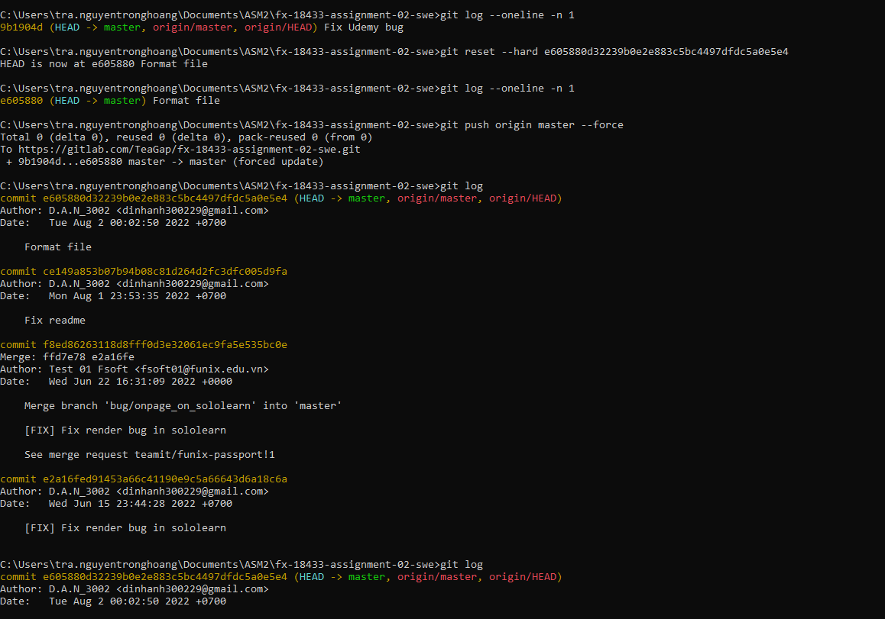
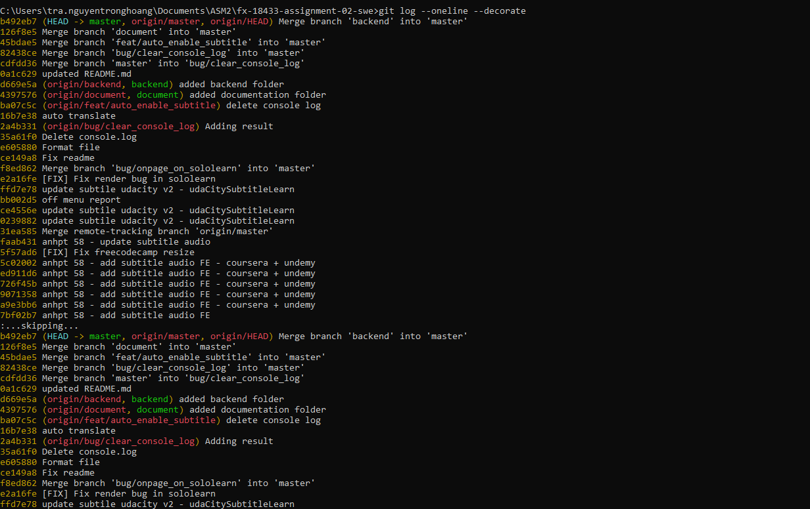
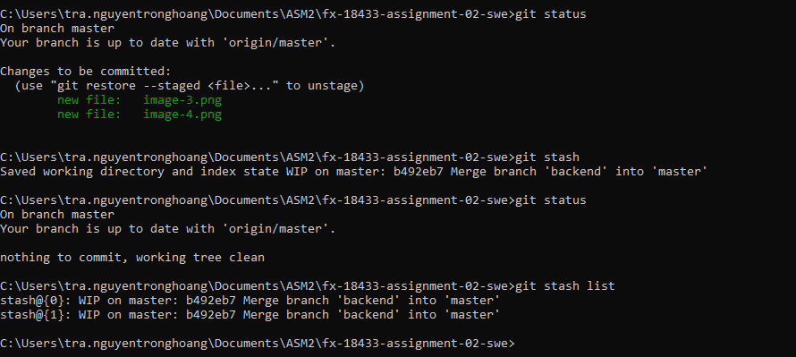
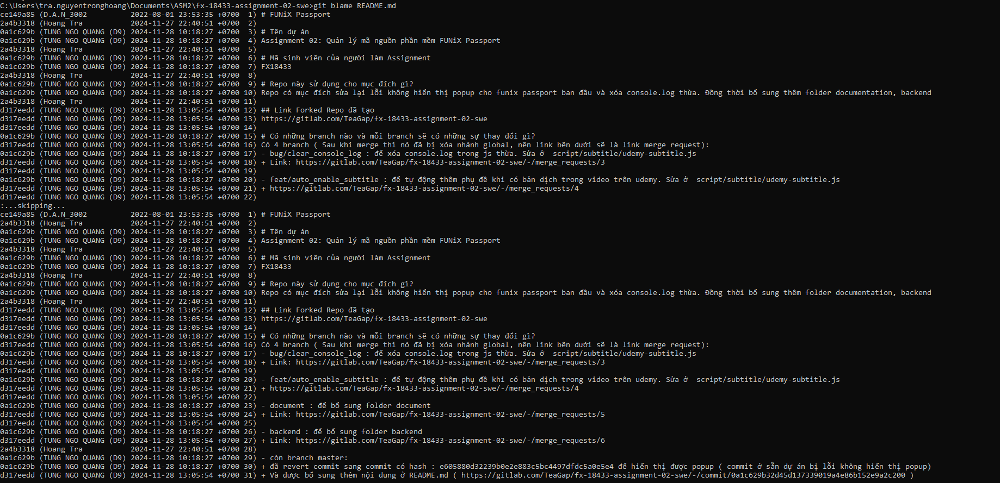
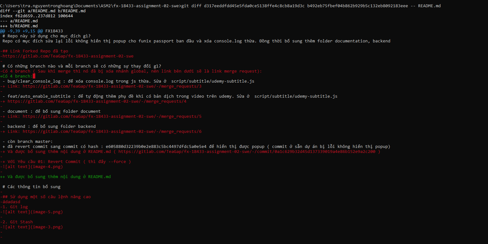
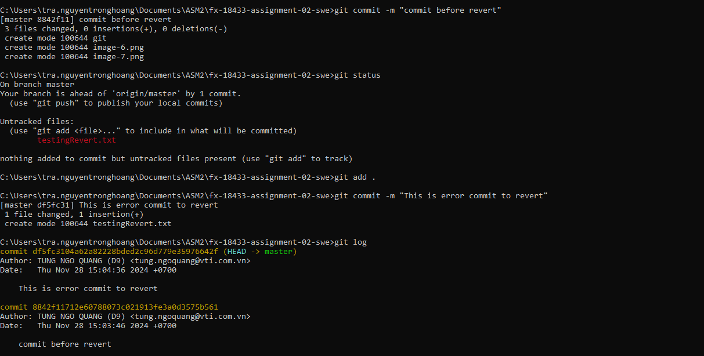
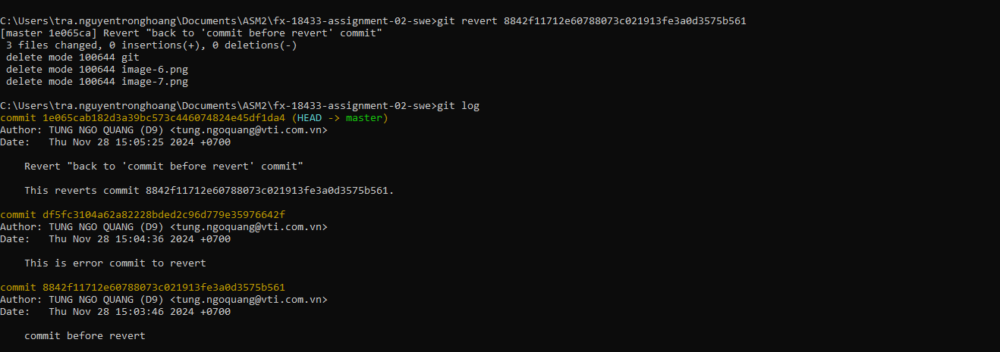

# FUNiX Passport

# Tên dự án
Assignment 02: Quản lý mã nguồn phần mềm FUNiX Passport

# Mã sinh viên của người làm Assignment
FX18433

# Repo này sử dụng cho mục đích gì?
Repo có mục đích sửa lại lỗi không hiển thị popup cho funix passport ban đầu và xóa console.log thừa. Đồng thời bổ sung thêm folder documentation, backend

## Link Forked Repo đã tạo
https://gitlab.com/TeaGap/fx-18433-assignment-02-swe

# Có những branch nào và mỗi branch sẽ có những sự thay đổi gì?
Có 4 branch ( Sau khi merge thì nó đã bị xóa nhánh global, nên link bên dưới sẽ là link merge request): 
- bug/clear_console_log : để xóa console.log trong js thừa. Sửa ở  script/subtitle/udemy-subtitle.js
++ Link: https://gitlab.com/TeaGap/fx-18433-assignment-02-swe/-/merge_requests/3

- feat/auto_enable_subtitle : để tự động thêm phụ đề khi có bản dịch trong video trên udemy. Sửa ở  script/subtitle/udemy-subtitle.js
++ Link: https://gitlab.com/TeaGap/fx-18433-assignment-02-swe/-/merge_requests/4

- document : để bổ sung folder document
++ Link: https://gitlab.com/TeaGap/fx-18433-assignment-02-swe/-/merge_requests/5

- backend : để bổ sung folder backend
++ Link: https://gitlab.com/TeaGap/fx-18433-assignment-02-swe/-/merge_requests/6

- còn branch master: 
++ đã revert commit sang commit có hash : e605880d32239b0e2e883c5bc4497dfdc5a0e5e4 để hiển thị được popup ( commit ở sẵn dự án bị lỗi không hiển thị popup)
++ Và được bổ sung thêm nội dung ở README.md ( https://gitlab.com/TeaGap/fx-18433-assignment-02-swe/-/commit/0a1c629b32d45d137339019a4e86b152e9a2c200 )

++ Với Yêu cầu 01: Revert Commit ( thì đẩy --force )

# Các thông tin bổ sung

## Sử dụng một số câu lệnh nâng cao
1. Git log

2. Git Stash

3. Git Blame

4. Git Diff

5. Git Revert

