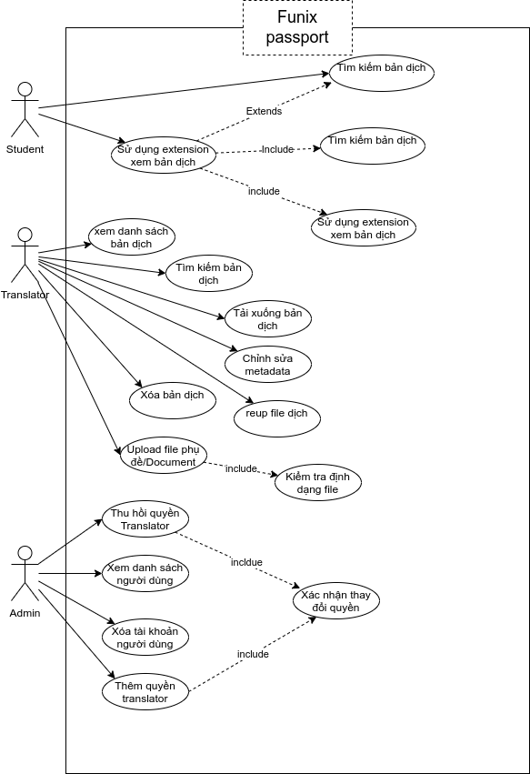
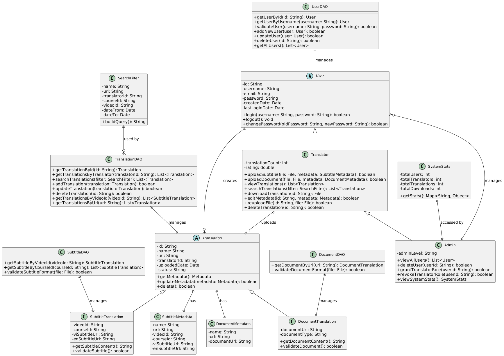
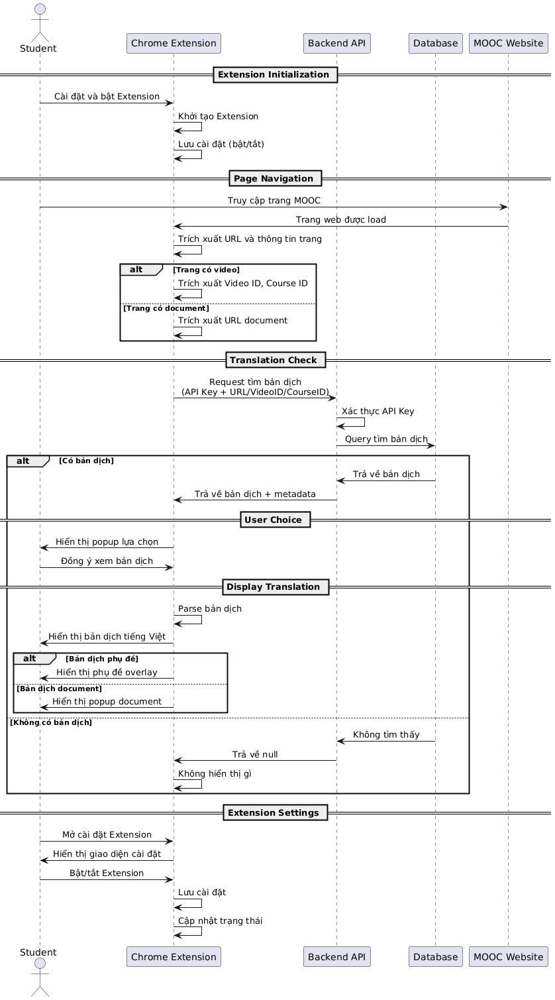
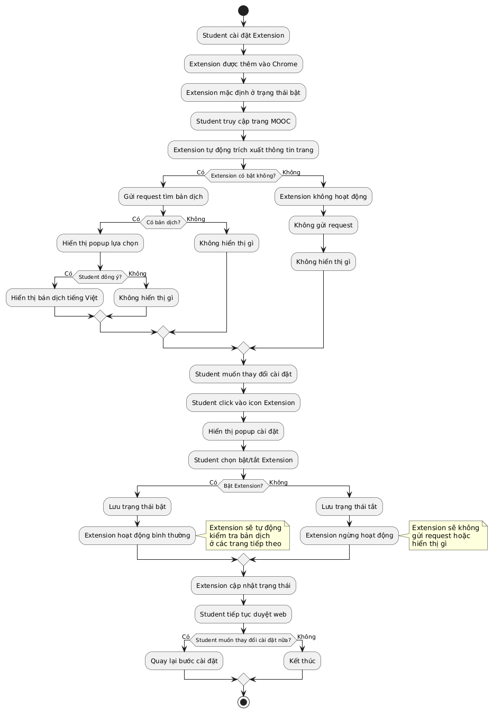

# Tài liệu đặc tả yêu cầu

***FUNiX Passport***

Nguyễn Vũ Huy - HUYNVFX61609 - SWE102

Table of Contents

**[Giới thiệu tổng quan về dự án](#giới-thiệu-tổng-quan-về-dự-án)**

> [Tóm tắt dự án](#tóm-tắt-dự-án)
>
> [Phạm vi của dự án](#phạm-vi-của-dự-án)

**[Yêu cầu và đặc tả dự án](#yêu-cầu-và-đặc-tả-dự-án)**

> [Yêu cầu chức năng](#yêu-cầu-chức-năng)
>
> [Yêu cầu phi chức năng](#yêu-cầu-phi-chức-năng)
>
> [Tính bảo mật](#tính-bảo-mật)
>
> [Tính sẵn sàng và khả năng đáp
> ứng](#tính-sẵn-sàng-và-khả-năng-đáp-ứng)
>
> [Hiệu suất](#hiệu-suất)
>
> [Đặc tả phần mềm](#đặc-tả-phần-mềm)

**[Kiến trúc và thiết kế phần mềm](#_wx6yez1weppj)**

> [Kiến trúc phần mềm](#kiến-trúc-phần-mềm)
>
> [Usecase](#usecase)
>
> [Usecase của User](#_61oj9ll8lwiu)
>
> [Usecase của Translator](#usecase-của-translator)
>
> [Usecase của Admin](#usecase-của-admin)
>
> [Usecase của Student](#usecase-của-student)
>
> [Sơ đồ use case tổng quát của hệ
> thống](#sơ-đồ-use-case-tổng-quát-của-hệ-thống)
>
> [Class Diagram](#class-diagram)
>
> [Senquence Diagram](#_s5lpyvciae7u)
>
> [Activity Diagram](#activity-diagram)

# 1. Giới thiệu tổng quan về dự án
## Tóm tắt dự án
- Hệ thống giúp cho sinh viên xem được các tài liệu nước ngoài bằng Tiếng Việt
- Hệ thống giúp sinh viên dễ dàng nắm được kiến thức từ tài liệu, mà không có bản dịch Tiếng Việt hoặc có bản dịch tự động chất lượng thấp.
-   Dự án có 2 mục tiêu:
    - Cho phép tác giả lưu trữ và đăng tải các bản dịch cho các loại tài liệu (Document, Video)
    - Cho phép sinh viên dễ dàng sử dụng bản dịch trong backend.

## Phạm vi của dự án
-   Phạm vi dịch vụ:
    -   Hệ thống hỗ trợ sinh viên xem tài liệu tiếng Việt (phụ đề video và tài liệu)
    -   Quản lý và phân phối các bản dịch thuật từ tiếng Anh sang tiếng Việt
    -   Hỗ trợ dịch thuật viên upload và quản lý các file dịch thuật
    -   Cung cấp tiện ích mở rộng trình duyệt để hiển thị bản dịch
-   Phạm vi khách hàng:
    -   Sinh viên FUNiX: Người dùng cuối sử dụng Extension để xem bản dịch
    -   Dịch thuật viên: Upload và quản lý các file dịch thuật
    -   Quản trị viên: Quản lý tài khoản người dùng và phân quyền
-   Phạm vi hệ thống:
    -   Backend: API server quản lý cơ sở dữ liệu và xử lý logic nghiệp vụ
    -   Extension: Tiện ích mở rộng Chrome hoạt động trên các trang web MOOC
    -   Database: Lưu trữ metadata và thông tin về các bản dịch thuật
# 2. Yêu cầu và đặc tả dự án
## 2.1. Yêu cầu chức năng
### 2.1.1. Chức năng cho User (Người dùng thường)
- Đăng nhập và đăng xuất khỏi ứng dụng
- Xem bản dịch thông qua Extension khi truy cập các trang web

### 2.1.2. Chức năng cho Translator (Dịch thuật viên)
- Upload file phụ đề đã dịch tiếng Việt:
    - Nhập thông tin: Tên Video, URL Video, Course ID, Video ID
    - Đính kèm file phụ đề đã dịch
    - Submit và lưu vào Database
- Upload file Document đã dịch tiếng Việt:
    - Nhập thông tin: Tên bản dịch, URL Document
    - Đính kèm file Document đã dịch
- Quản lý bản dịch:
    - Xem danh sách các file dịch thuật đã upload (Dashboard riêng cho phụ đề và Document)
    - Tải xuống file đã dịch
    - Tìm kiếm theo bộ lọc: Tên bản dịch, URL, Người dịch, Course ID, Video ID
    - Xóa file phụ đề hoặc document
    - Chỉnh sửa metadata và reup file dịch

### 2.1.3. Chức năng cho Admin (Quản trị viên)
- Xóa tài khoản người dùng
- Thêm quyền cho người dùng (chuyển User thành Translator)
- Xóa quyền cho người dùng (chuyển Translator thành User)

### 2.1.4. Chức năng Extension
- Trích xuất URL và thông tin từ trang web đang truy cập
- Gửi request lên Backend để tìm bản dịch
- Hiển thị popup cho người dùng lựa chọn xem bản dịch
- Hiển thị bản dịch khi người dùng đồng ý
- Cài đặt bật/tắt Extension

## 2.2. Yêu cầu phi chức năng
### 2.2.1 Tính bảo mật
- Hệ thống phải có tính bảo mật cao
- Dữ liệu được lưu trữ an toàn trong Database
- Sử dụng API Key hoặc Token để truy cập và chỉnh sửa dữ liệu
- Phân quyền rõ ràng giữa các vai trò (User, Translator, Admin)
- Xác thực và phân quyền người dùng

### 2.2.2 Tính sẵn sàng và khả năng đáp ứng
- Hệ thống hoạt động 24/7
- Luôn đáp ứng yêu cầu người dùng
- Dịch thuật viên và quản trị viên có thể truy cập mọi lúc
- Khả năng xử lý đồng thời nhiều yêu cầu

### 2.2.3 Hiệu suất
- Thời gian hiển thị bản dịch: ≤ 1 giây từ khi vào website
- Thời gian xử lý thao tác của Translator: ≤ 0.5 giây mỗi thao tác
- Tốc độ ổn định cho tất cả các hoạt động hệ thống
- Khả năng xử lý nhiều request đồng thời

## 2.3. Đặc tả phần mềm
### 2.3.1. Kiến trúc hệ thống
- Backend: API server với kiến trúc RESTful
- Frontend: Extension Chrome với giao diện popup
- Database: Hệ quản trị cơ sở dữ liệu quan hệ
- Authentication: Hệ thống xác thực và phân quyền

### 2.3.2. Công nghệ sử dụng
- Extension: Chrome Extension API, JavaScript/HTML/CSS
- Backend: Ngôn ngữ lập trình server (Node.js, Python, Java\...)
- Database: MySQL, PostgreSQL hoặc tương đương
- API: RESTful API với JSON format

### 2.3.3. Cấu trúc dữ liệu
- Bảng Video Subtitle: ID, Translator, UploadedDate, Name, URL, VideoID, CourseID, VISubtitleURL, EnSubtitleURL
- Bảng Document: ID, Translator, UploadedDate, Name, URL, DocumentURL
- Bảng User: Thông tin người dùng và phân quyền

### 2.3.4. Giao diện người dùng
- Extension: Popup đơn giản với tùy chọn bật/tắt
- Backend Admin: Dashboard quản lý với giao diện web
- Translator Interface: Form upload và quản lý bản dịch

# 3. Kiến trúc và thiết kế phần mềm
## 3.1. Kiến trúc được chọn: Client-Server với Microservices
Lý do lựa chọn:  
- Tính mở rộng: Dễ dàng thêm các service mới khi cần thiết
- Tính bảo trì: Mỗi service có thể được phát triển và bảo trì độc lập
- Tính linh hoạt: Có thể sử dụng công nghệ khác nhau cho từng service
- Tính ổn định: Một service gặp sự cố không ảnh hưởng toàn bộ hệ thống
- Phù hợp với yêu cầu: Hệ thống có nhiều chức năng khác nhau (quản lý user, quản lý dịch thuật, API cho Extension)

## 3.2. Các service chính
- User Service: Quản lý tài khoản và phân quyền
- Translation Service: Quản lý các bản dịch thuật
- File Service: Xử lý upload/download file
- API Gateway: Điều phối các request từ Extension

# 4. Usecase
## Usecase của Translator

| **Use Case Name** | Quản lý bản dịch thuật |
|---|---|
| **Mô tả** | Translator upload, quản lý và chỉnh sửa các file phụ đề và tài liệu đã dịch tiếng Việt |
| **Điều kiện** | Translator đã đăng nhập vào hệ thống |
| **Luồng chính** | 1. Upload file phụ đề/Document với metadata (tên, URL, Course ID, Video ID) 2. Xem danh sách bản dịch qua Dashboard riêng biệt 3. Tìm kiếm theo bộ lọc (tên, URL, người dịch, Course ID, Video ID) 4. Tải xuống, chỉnh sửa metadata hoặc reup file dịch 5. Xóa bản dịch không cần thiết |
| **Luồng phụ** | Hệ thống kiểm tra định dạng file và thông báo lỗi nếu có |

### Usecase của Admin

| **Use Case Name** | Quản lý tài khoản người dùng |
|---|---|
| **Mô tả** | Admin quản lý quyền truy cập và tài khoản của người dùng trong hệ thống |
| **Điều kiện** | Admin đã đăng nhập vào hệ thống |
| **Luồng chính** | 1. Xem danh sách tất cả người dùng 2. Xóa tài khoản người dùng 3. Thêm quyền Translator cho User 4. Thu hồi quyền Translator về User |
| **Luồng phụ** | Hệ thống xác nhận trước khi thực hiện thay đổi quyền |

### Usecase của Student

| **Use Case Name** | Sử dụng Extension xem bản dịch |
|---|---|
| **Mô tả** | Student sử dụng Extension để xem bản dịch tiếng Việt khi truy cập trang web MOOC |
| **Điều kiện** | Student đã cài đặt và bật Extension |
| **Luồng chính** | 1. Extension tự động trích xuất URL và thông tin từ trang web 2. Gửi request lên Backend tìm bản dịch 3. Hiển thị popup cho Student lựa chọn xem bản dịch 4. Hiển thị bản dịch nếu Student đồng ý 5. Cài đặt bật/tắt Extension |
| **Luồng phụ** | Extension không hoạt động nếu bị tắt hoặc không tìm thấy bản dịch |

## Sơ đồ use case tổng quát của hệ thống

{width="6.072916666666667in"
height="8.498957786526685in"}

**Hình 2 Sơ đồ use case tổng quát**

## Class Diagram

{width="8.448958880139983in"
height="5.977935258092739in"}

[]{#_s5lpyvciae7u .anchor}**Hình 3: Class Diagram**

## Sequence Diagram

{width="7.59375in"
height="10.092707786526685in"}

## Activity Diagram

{width="8.458333333333334in"
height="10.176041119860017in"}
