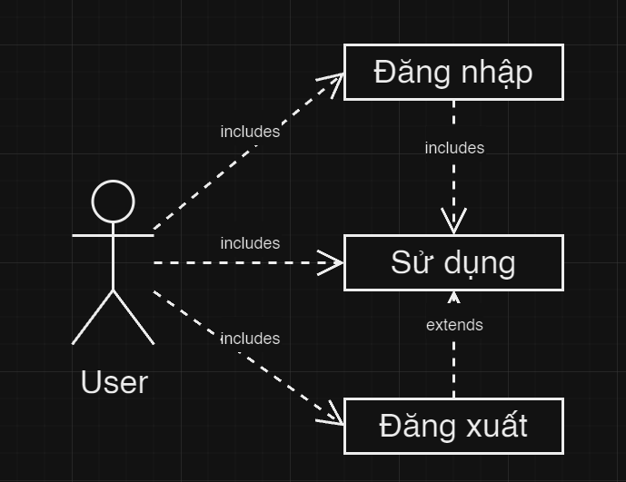
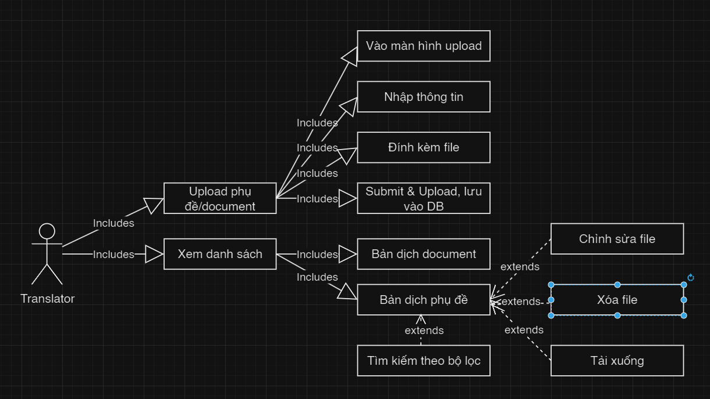
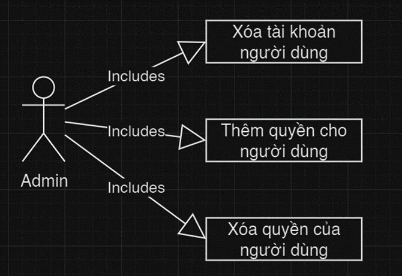
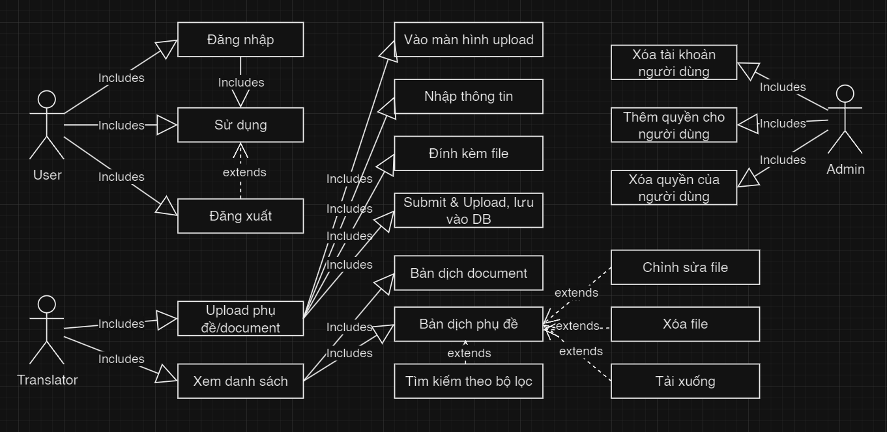
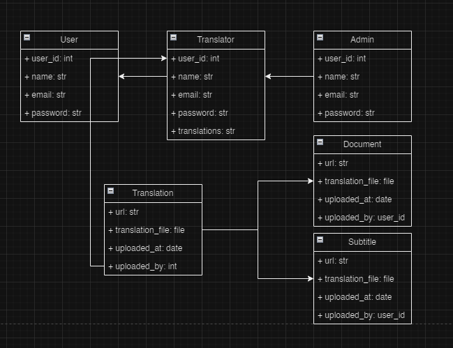

Tài liệu đặc tả yêu cầu

> ***FUNiX Passport***

Revision History

  ----------------- ------------- --------------------------- -----------------
  **Date**          **Version**   **Description**             **Author**

  \<04/13/07\>      \<1.0\>       SRS 1.0                     Group-1

  \<04/15/07\>      \<2.0\>       SRS 2.0                     Group-1

  \<04/15/07\>      \<3.0\>       SRS 3.0                     Group-1

  \<04/16/07\>      \<4.0\>       SRS 4.0                     Group-1
  ----------------- ------------- --------------------------- -----------------

Bảng thuật ngữ

Cung cấp tổng quan về bất kỳ định nghĩa nào mà người đọc nên hiểu trước
khi đọc tiếp.

  ----------- -----------------------------------------------------------
  Cấu hình    Nó có nghĩa là một sản phẩm có sẵn / Được chọn từ một danh
              mục có thể được tùy chỉnh.

  FAQ         Frequently Asked Questions

  CRM         Customer Relationship Management

  RAID 5      Redundant Array of Inexpensive Disk/Drives
  ----------- -----------------------------------------------------------

Table of Contents

**[Giới thiệu tổng quan về dự án](#giới-thiệu-tổng-quan-về-dự-án)
[4](\l)**

> [Tóm tắt dự án](#tóm-tắt-dự-án) [4](\l)
>
> [Phạm vi của dự án](#phạm-vi-của-dự-án) [4](\l)

**[Yêu cầu và đặc tả dự án](#yêu-cầu-và-đặc-tả-dự-án) [4](\l)**

> [Yêu cầu chức năng](#yêu-cầu-chức-năng) [4](\l)
>
> [Yêu cầu phi chức năng](#yêu-cầu-phi-chức-năng) [4](\l)
>
> [Tính bảo mật](#tính-bảo-mật) [5](\l)
>
> [Tính sẵn sàng và khả năng đáp
> ứng](#tính-sẵn-sàng-và-khả-năng-đáp-ứng) [5](\l)
>
> [Hiệu suất](#hiệu-suất) [5](\l)
>
> [Đặc tả phần mềm](#đặc-tả-phần-mềm) [5](\l)

**[Kiến trúc và thiết kế phần
mềm](#khi-truy-cập-vào-một-trang-web-bất-kỳ-extension-sẽ-trích-xuất-ra-url-của-trang-web-đó.-từ-đó-sẽ-lấy-ra-được-các-thông-tin-như-video_id-hay-course_id.)
[5](\l)**

> [Kiến trúc phần mềm](#kiến-trúc-phần-mềm) [5](\l)
>
> [Usecase](#usecase) [6](\l)
>
> [Usecase của User](#usecase-của-user) [7](\l)
>
> [Usecase của Translator](#usecase-của-translator) [8](\l)
>
> [Usecase của Admin](#usecase-của-admin) [8](\l)
>
> [Usecase của Student](#usecase-của-student) [8](\l)
>
> [Sơ đồ use case tổng quát của hệ
> thống](#sơ-đồ-use-case-tổng-quát-của-hệ-thống) [8](\l)
>
> [Class Diagram](#class-diagram) [9](\l)
>
> [Senquence Diagram](#_heading=h.s5lpyvciae7u) [10](\l)
>
> [Activity Diagram](#_heading=h.hkolpgas5tc8)
> [10](#_heading=h.hkolpgas5tc8)

Tài liệu đặc tả

1.  # Giới thiệu tổng quan về dự án

    1.  ## Tóm tắt dự án

Hệ thống FUNIX Passport:

-   Hệ thống xây dựng giúp sinh viên xem được các tài liệu học tập bằng
    tiếng Việt.

-   Hệ thống giúp giải quyết cho bài toán học sinh phải xem video, học
    liệu bằng tiếng Anh

    1.  ## Phạm vi của dự án

Phạm vi của dự án bao gồm:

-   Dịch vụ sẽ công khia trên Web store của Chrome

-   Khách hàng, đối tượng sẽ là các học sinh Funix

-   Nền tảng là các trình duyệt hỗ trợ tải các tiện ích mở rộng như
    Google, Opera,..

2.  # Yêu cầu và đặc tả dự án

    1.  ## Yêu cầu chức năng

Đây sẽ là một tiện ích mở rộng (Extension) với chức năng là giao tiếp
với Backend, từ đó lấy được dữ liệu các bản dịch và hiển thị bản dịch đó
ra cho sinh viên sử dụng.

**Backend**

\- Backend sẽ thực hiện các thao tác với cơ sở dữ liệu với nhiệm vụ là
quản lý về các file dịch thuật. Ngoài ra, Backend phải được thiết kế để
các dịch thuật viên có thể upload lên các file phụ đề tương ứng cho từng
video trên các trang MOOC hoặc upload các tài liệu đã được dịch. Giúp
các dịch thuật viên và quản trị viên có thể quản lý được các dữ liệu về
dịch thuật, phụ đề. Đồng thời cũng có cơ sở dữ liệu chứa danh sách các
môn, link video, sô lượng truy cập từng video, ...

## Yêu cầu phi chức năng

Sẽ có 3 vai trò chính như sau:

**User:** Người dùng bình thường, chỉ có thể đăng nhập và đăng xuất khỏi
ứng dụng.

**Translator:** Các dịch thuật viên, có thể thực hiện các thao tác sau
trên ứng dụng:

\- Upload file phụ đề đã dịch tiếng Việt:

\+ Translator sẽ vào màn hình upload, sau đó cần nhập các thông tin cần
thiết như: Tên Video, URL Video, Course ID, Video ID.

\+ Sau đó Translator sẽ đính kèm thêm file phụ đề đã được dịch

\+ Nhấn submit và ứng dụng thực hiện công đoạn upload, lưu dữ liệu vào
Database.

\- Upload file Document đã dịch tiếng Việt:

\+ Tương tự với upload phụ đề, nhưng Translator sẽ cần nhập Tên bản dịch
và URL của Document.

\+ Translator sẽ đính kèm file Document đã dịch.

\- Xem danh sách các file dịch thuật đã được upload: sẽ có hai
Dashboard, 01 Dashboard hiển thị các bản dịch phụ đề và Dashboard còn
lại sẽ hiển thị bản dịch Document.

\- Tải xuống file đã dịch: khi click vào link trên Dashboard thì có thể
tải xuống dữ liệu của bản dịch (File phụ đề hoặc file Document).

\- Tìm kiếm các bản dịch theo bộ lọc:

\+ Translator có thể tìm kiếm các bản dịch theo những bộ lọc tính sau:
Tên bản dịch, Url, Người dịch, Course ID, Video ID.

\- Xóa các file phụ đề hoặc document:

\+ Sau khi tìm kiếm bản dịch, Translator có thể lựa chọn để xóa bản dịch
đó đi.

\- Chỉnh sửa thông tin:

\+ Sau khi tìm kiếm bản dịch, Translator có thể lựa chọn để chỉnh sửa
lại thông tin của bản dịch đó. Sẽ có 2 loại chỉnh sửa như sau: Chỉnh sửa
các metadata của file dịch và Reup file dịch khác lên thay thế.

**Admin:** Các quản trị viên, nhiệm vụ chính là quản lý tài khoản người
dùng. Admin có thể thực hiện các thao tác như sau:

\- Xóa tài khoản một người dùng.

\- Thêm quyền cho một người dùng (chuyển User thành Translator).

\- Xóa quyền cho một người dùng (chuyển Translator thành User).

-   Backend có một Database và cần lưu trữ các Metadata sau cho mỗi bản
    dịch thuật (Phụ đề hoặc Document). Các Metadata này sẽ gồm cả dữ
    liệu mà Translator nhập vào lẫn các dữ liệu do Backend tự tạo.

    1.  ### Tính bảo mật

-   Phải có tính bảo mật cao, dữ liệu được lưu trữ ở Database an toàn.
    Đồng thời bạn cũng cần các API Key hay Token mới có thể truy cập và
    chỉnh sửa dữ liệu ở Database.

    1.  ### Tính sẵn sàng và khả năng đáp ứng

-   Extension được xây dựng để sử dụng chủ yếu trên trình duyệt Chrome.

-   Giao diện của hệ thống được xây dựng dễ hiểu, người dùng không cần
    biết quá nhiều về công nghệ cũng có thể sử dụng hệ thống.

### 2.2.3 Hiệu suất {#hiệu-suất .list-paragraph}

-   Có tốc độ ổn định, thời gian để hiển thị bản dịch tính từ khi học
    viên vào Website không được quá 1s.

-   Thời gian để submit và thực hiện các thao tác của Translator cũng
    cần phải có tốc độ xử lý nhanh, trung bình mỗi thao tác không được
    quá 0.5s.

    1.  ## Đặc tả phần mềm

-   # Khi truy cập vào một trang web bất kỳ, Extension sẽ trích xuất ra url của trang web đó. Từ đó sẽ lấy ra được các thông tin như video_id hay course_id.

-   # Extension gửi request lên Backend với các dữ liệu tương ứng đã trích xuất được: 

-   # Nếu đó là trang web thuộc các nguồn MOOC: gửi lên course_id và video_id để tìm phụ đề. 

-   # Còn lại sẽ là tìm dịch Document: gửi lên toàn bộ url để tìm bản dịch do Document đó. 

-   # Backend sẽ trả về bản dịch với thông tin tương ứng (nếu có). 

-   # Sau khi nhận dữ liệu trả về từ Backend, nêu như có bản dịch thì Extension sẽ hiển thị popup cho người dùng để lựa chọn xem có muốn dịch không.

-   # Nếu người dùng đồng ý dịch thì sẽ hiển thị bản dịch đó cho người dùng

3.  # Kiến trúc và thiết kế phần mềm

    1.  ## Kiến trúc phần mềm

Kiến trúc phần mềm phù hợp nhất: client-server, do extension sẽ chỉ
request các bản dịch từ máy chủ.

2.  ## Usecase

    1.  ### Usecase của User

{width="2.9858213035870516in"
height="2.301006124234471in"}

+--------------+-----------------+-----------------+-----------------+
| **Use Case   | Đăng nhập       | Sử dụng         | Đăng xuất       |
| Name**       |                 |                 |                 |
+--------------+-----------------+-----------------+-----------------+
| **Mô tả**    | đăng nhập tài   | Sử dụng các     | Đăng xuất ra    |
|              | khoản vào hệ    | chức năng của   | khỏi tài khoản  |
|              | thống           | hệ thống        |                 |
+--------------+-----------------+-----------------+-----------------+
| **Điều       | chưa đăng nhập  | Đã đăng nhập    | Hiện đang đăng  |
| kiện**       | vào hệ thống    | vào hệ thống    | nhập vào hệ     |
|              |                 |                 | thống           |
+--------------+-----------------+-----------------+-----------------+
| **Luồng      | 1\. User truy   | 1.Khi đã đăng   | 1\. Chọn Menu   |
| chính**      | cập vào trang   | nhập, nhấn vào  |                 |
|              | web quản lý.    | các chức năng   | 2\. Chọn Log    |
|              | Nhấn vào mục    | cần sử dụng     | out             |
|              | "Login\"        |                 |                 |
|              |                 |                 |                 |
|              | 2\. Hệ thống    |                 |                 |
|              | hiển thị Form   |                 |                 |
|              | Login.          |                 |                 |
|              |                 |                 |                 |
|              | 3\. User nhập   |                 |                 |
|              | vào các thông   |                 |                 |
|              | tin đăng nhập.  |                 |                 |
|              |                 |                 |                 |
|              | 4\. Nếu thông   |                 |                 |
|              | tin đăng nhập   |                 |                 |
|              | đúng, cập nhật  |                 |                 |
|              | thông tin vào   |                 |                 |
|              | hệ thống.       |                 |                 |
+--------------+-----------------+-----------------+-----------------+
| **Luồng      | Ở bước 4, nếu   | Nếu không có    |                 |
| phụ**        | thông tin đăng  | quyền sử dụng   |                 |
|              | nhập sai sẽ     | chức năng sẽ    |                 |
|              | hiển thị thông  | báo lỗi         |                 |
|              | báo cho người   |                 |                 |
|              | dùng.           |                 |                 |
+--------------+-----------------+-----------------+-----------------+

### Usecase của Translator

{width="6.727777777777778in"
height="3.79375in"}

+--------------+-----------------+-----------------+-----------------+
| **Use Case   | Upload bài dịch | Xem danh sách   | Tìm kiếm, chỉnh |
| Name**       |                 |                 | sửa, tải, xóa   |
|              |                 |                 | file            |
+--------------+-----------------+-----------------+-----------------+
| **Mô tả**    | Upload file phụ | Truy vấn các    | Tìm kiếm, chỉnh |
|              | đề, document đã | bản dịch bao    | sửa, tải, xóa   |
|              | được dịch       | gồm document và | các bản dịch    |
|              |                 | phụ đề video    | document, phụ   |
|              |                 |                 | đề              |
+--------------+-----------------+-----------------+-----------------+
| **Điều       | Đã đăng nhập    | Đã đăng nhập    | Đã đăng nhập    |
| kiện**       | vào hệ thống    | vào hệ thống    | vào hệ thống    |
+--------------+-----------------+-----------------+-----------------+
| **Luồng      | 1.  Đăng nhập   | 1.Đăng nhập     | 1\. Đăng nhập   |
| chính**      |                 |                 |                 |
|              | 2.  Vào màn     | 2\. Vào màn     | 2\. Vào màn     |
|              |     hình upload | hình xem danh   | hình xem danh   |
|              |                 | sách            | sách            |
|              | 3.  Nhập thông  |                 |                 |
|              |     tin file    | 3\. truy vấn dữ | 3\. chọn các    |
|              |     upload      | liệu cần tìm    | tác vụ chỉnh    |
|              |                 |                 | sửa, tìm kiếm,  |
|              | 4.  Đính kèm    |                 | tải, xóa file   |
|              |     file        |                 |                 |
|              |                 |                 |                 |
|              | 5.  Submit&     |                 |                 |
|              |     upload      |                 |                 |
|              |     file, lưu   |                 |                 |
|              |     vào CSDL    |                 |                 |
+--------------+-----------------+-----------------+-----------------+
| **Luồng      | Ở bất kỳ bước   | Ở bất kỳ bước   | Ở bất kỳ bước   |
| phụ**        | nào nếu gặp lỗi | nào nếu gặp lỗi | nào nếu gặp lỗi |
|              | hoặc định dạng  | hoặc định dạng  | hoặc định dạng  |
|              | không được chấp | không được chấp | không được chấp |
|              | nhận, sẽ báo    | nhận, sẽ báo    | nhận, sẽ báo    |
|              | lỗi             | lỗi             | lỗi             |
+--------------+-----------------+-----------------+-----------------+

### Usecase của Admin

{width="4.467361111111111in"
height="3.073611111111111in"}

+--------------+-----------------+-----------------+-----------------+
| **Use Case   | Xóa tài khoản   | Thêm quyền cho  | Xóa quyền của   |
| Name**       | người dùng      | người dùng      | người dùng      |
+--------------+-----------------+-----------------+-----------------+
| **Mô tả**    | Xóa một tài     | Thêm quyền cho  | Xóa quyền của   |
|              | khoản user hiện | người dùng, vd: | người dùng, vd: |
|              | có              | từ user bình    | từ translator   |
|              |                 | thường thành    | thành user      |
|              |                 | translator      | thường          |
+--------------+-----------------+-----------------+-----------------+
| **Điều       | Đã đăng nhập    | Đã đăng nhập    | Đã đăng nhập    |
| kiện**       | vào hệ thống,   | vào hệ thống,   | vào hệ thống    |
|              | là admin        | là admin        |                 |
+--------------+-----------------+-----------------+-----------------+
| **Luồng      | 1.  Đăng nhập   | 1.Đăng nhập     | 1.Đăng nhập     |
| chính**      |                 |                 |                 |
|              | 2.  Vào màn     | 2\. Vào màn     | 2\. Vào màn     |
|              |     hình quản   | hình quản lý    | hình quản lý    |
|              |     lý tài      | tài khoản       | tài khoản       |
|              |     khoản       |                 |                 |
|              |                 | 3\. Chọn tài    | 3\. Chọn tài    |
|              | 3.  Chọn tài    | khoản muốn cho  | khoản muốn xóa  |
|              |     khoản muốn  | thêm quyền      | quyền           |
|              |     xóa         |                 |                 |
|              |                 | 4\. Thực hiện   | 4\. Thực hiện   |
|              | 4.  Thực hiện   | thêm quyền      | xóa quyền       |
|              |     xóa         |                 |                 |
+--------------+-----------------+-----------------+-----------------+
| **Luồng      | Ở bất kỳ bước   | Ở bất kỳ bước   | Ở bất kỳ bước   |
| phụ**        | nào nếu gặp lỗi | nào nếu gặp lỗi | nào nếu gặp lỗi |
|              | hoặc định dạng  | hoặc định dạng  | hoặc định dạng  |
|              | không được chấp | không được chấp | không được chấp |
|              | nhận, sẽ báo    | nhận, sẽ báo    | nhận, sẽ báo    |
|              | lỗi             | lỗi             | lỗi             |
+--------------+-----------------+-----------------+-----------------+

### Usecase của Student

Em nghĩ là không cần bảng student, lặp với user (?)

## Sơ đồ use case tổng quát của hệ thống

{width="6.727777777777778in"
height="3.282638888888889in"}

## Class Diagram

{width="6.727777777777778in"
height="5.172916666666667in"}
