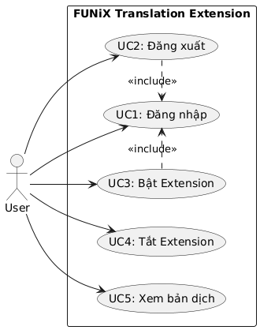
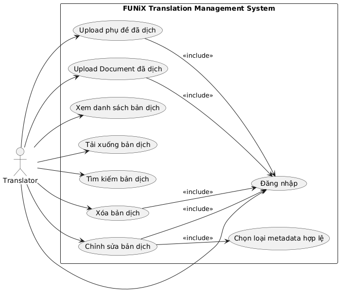
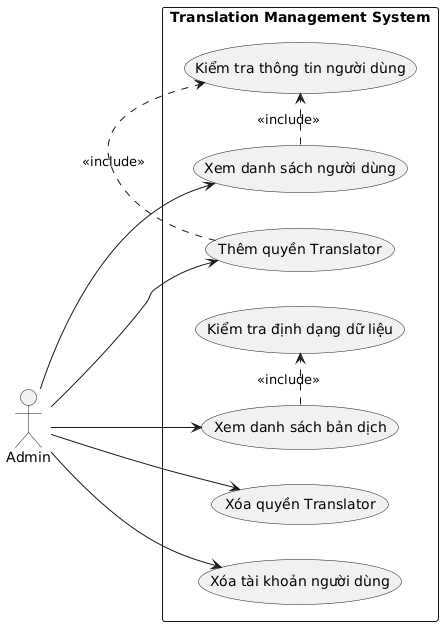
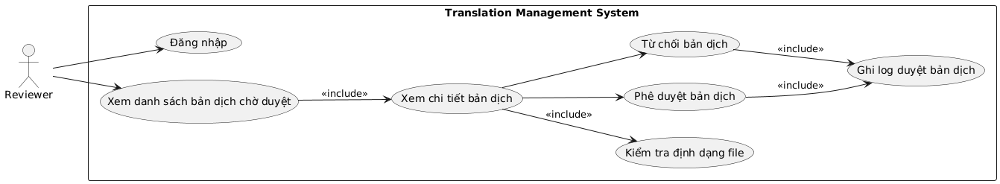
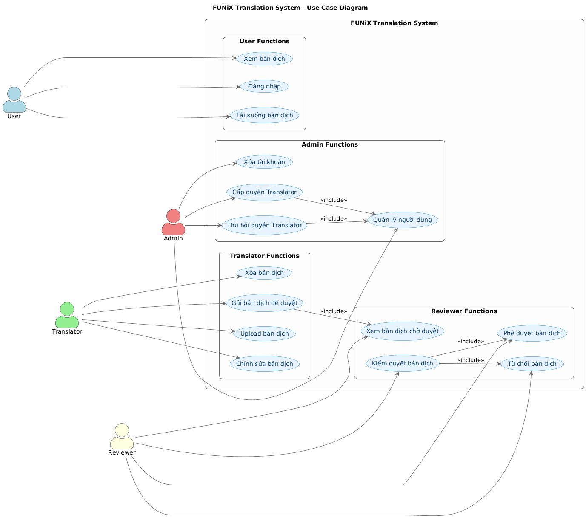
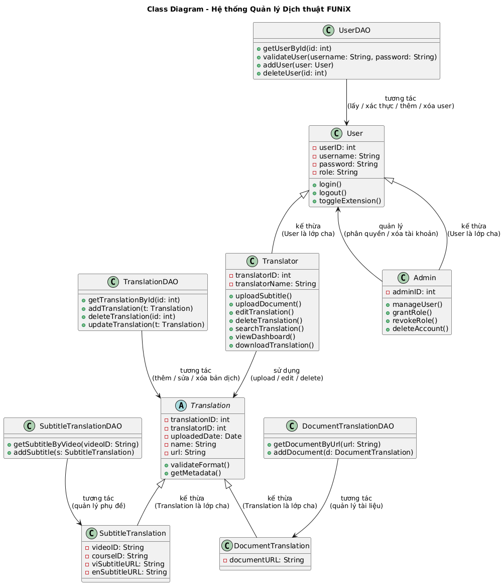
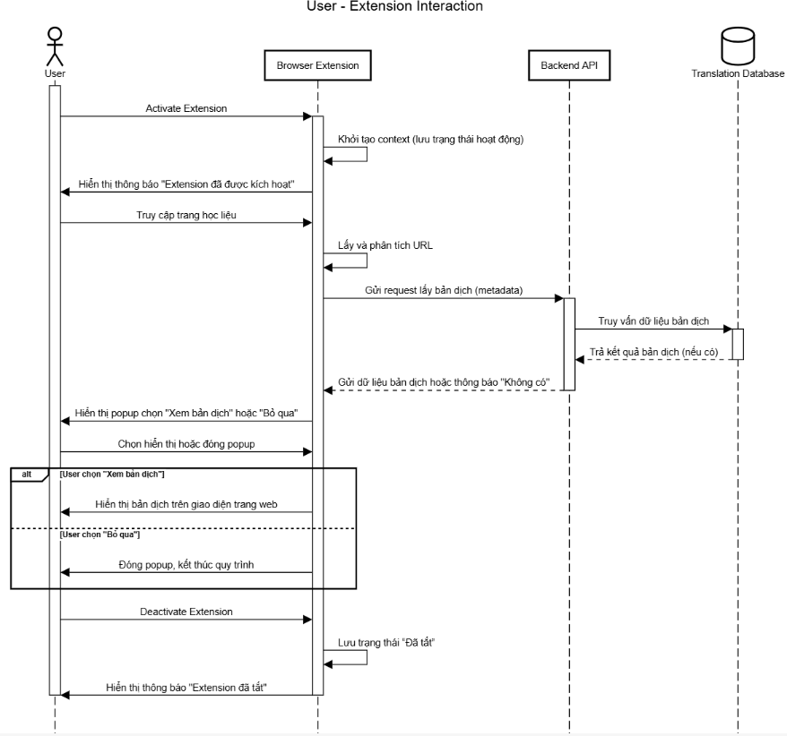

Tài liệu đặc tả yêu cầu

> ***FUNiX Passport***

Revision History

  -----------------------------------------------------------------------------
  **Date**          **Version**   **Description**             **Author**
  ----------------- ------------- --------------------------- -----------------
  \<04/13/07\>      \<1.0\>       SRS 1.0                     Group-1

  \<04/15/07\>      \<2.0\>       SRS 2.0                     Group-1

  \<04/15/07\>      \<3.0\>       SRS 3.0                     Group-1

  \<04/16/07\>      \<4.0\>       SRS 4.0                     Group-1
  -----------------------------------------------------------------------------

Bảng thuật ngữ

Cung cấp tổng quan về bất kỳ định nghĩa nào mà người đọc nên hiểu trước
khi đọc tiếp.

  -----------------------------------------------------------------------
  Cấu hình    Nó có nghĩa là một sản phẩm có sẵn / Được chọn từ một danh
              mục có thể được tùy chỉnh.
  ----------- -----------------------------------------------------------
  FAQ         Frequently Asked Questions

  CRM         Customer Relationship Management

  RAID 5      Redundant Array of Inexpensive Disk/Drives
  -----------------------------------------------------------------------

Table of Contents

**[Giới thiệu tổng quan về dự án](#giới-thiệu-tổng-quan-về-dự-án) 4**

> [Tóm tắt dự án](#tóm-tắt-dự-án) 4
>
> [Phạm vi của dự án](#phạm-vi-của-dự-án) 4

**[Yêu cầu và đặc tả dự án](#yêu-cầu-và-đặc-tả-dự-án) 4**

> [Yêu cầu chức năng](#yêu-cầu-chức-năng) 4
>
> [Yêu cầu phi chức năng](#yêu-cầu-phi-chức-năng) 4
>
> [Tính bảo mật](#tính-bảo-mật) 5
>
> [Tính sẵn sàng và khả năng đáp
> ứng](#tính-sẵn-sàng-và-khả-năng-đáp-ứng) 5
>
> [Hiệu suất](#hiệu-suất) 5
>
> [Đặc tả phần mềm](#đặc-tả-phần-mềm) 5

**[Kiến trúc và thiết kế phần mềm](#_heading=h.wx6yez1weppj) 5**

> [Kiến trúc phần mềm](#kiến-trúc-phần-mềm) 5
>
> [Usecase](#usecase) 6
>
> [Usecase của User](#usecase-của-user) 7
>
> [Usecase của Translator](#usecase-của-translator) 8
>
> [Usecase của Admin](#usecase-của-admin) 8
>
> [Usecase của Student](#usecase-của-reviewers) 8
>
> [Sơ đồ use case tổng quát của hệ
> thống](#sơ-đồ-use-case-tổng-quát-của-hệ-thống) 8
>
> [Class Diagram](#class-diagram) 9
>
> [Senquence Diagram](#_heading=h.s5lpyvciae7u) 10
>
> [Activity Diagram](#activity-diagram) 10

Tài liệu đặc tả

1.  # Giới thiệu tổng quan về dự án

    1.  ## Tóm tắt dự án

Hiện tại FUNiX cần xây dựng một hệ thống giúp cho sinh viên xem được các
tài liệu ở Tiếng Việt (có thể là phụ đề cho video hoặc một trang tài
liệu). Hệ thống được thiết kế giúp cho học viên dễ dàng nắm được các
kiến thức từ video hơn thay vì phải xem phụ đề Tiếng Anh có sẵn.

## Phạm vi của dự án

Hệ thống tập trung chủ yếu vào vùng sinh viên và học sinh trong hệ thống
đào tạo FUNIX, tập trung chủ yếu vào quá trình sinh viên tham khảo các
tài liệu học tập tiếng anh được ban đào tạo đưa ra. Không những trong
phạm vi sinh viên FUNIX mà sản phẩm còn có định hướng nhắm tới người
dùng thông thường trong tương lai.

2.  # Yêu cầu và đặc tả dự án

    1.  ## Yêu cầu chức năng

Các role trong chương trình:

-   User: Người dùng bình thường(Sinh viên, mentor,\....), chỉ có thể
    > đăng nhập và đăng xuất khỏi ứng dụng.

-   Translator: các dịch thuật viên, đóng vai trò quan trọng cho một số
    > chức năng

-   Admin: Các quản trị viên, nhiệm vụ chính là quản lý tài khoản người
    > dùng, có thể thực hiện các thao xóa, thêm quyền và sửa.

-   Reviewer: Đóng vai trò trung gian, kiểm tra các sản phẩm dịch thuật
    > của Translator.

1.  ***Backend***

-   *Có khả năng thao tác với cơ sở dữ liệu với nhiệm vụ quản lí các
    > file dịch thuật*

-   *Dịch thuật viên có thể upload lên các file phụ đề tương ứng cho
    > từng video trên các trang MOOC*

-   *Đồng thời cũng có cơ sở dữ liệu chứa danh sách các môn, link video,
    > sô lượng truy cập từng video*

-   *Giúp các dịch thuật viên và quản trị viên có thể quản lý được các
    > dữ liệu về dịch thuật, phụ đề.*

2.  ***Upload file phụ đề đã dịch tiếng việt (Translator)***

-   *Translator sẽ vào màn hình upload, sau đó cần nhập các thông tin
    > cần thiết như: Tên Video, URL Video, Course ID, Video ID.*

-   *Sau đó Translator sẽ đính kèm thêm file phụ đề đã được dịch.*

-   *Nhấn submit và ứng dụng thực hiện công đoạn upload, lưu dữ liệu vào
    > Database.*

3.  ***Upload file Document đã dịch ra Tiếng Việt:(Translator)***

-   *Tương tự với upload phụ đề, nhưng Translator sẽ cần nhập Tên bản
    > dịch và URL của Document.*

-   *Translator sẽ đính kèm file Document đã dịch.*

4.  ***Xem danh sách các file dịch thuật đã được upload:(Translator)***

-   *Sẽ có hai Dashboard, 01 Dashboard hiển thị các bản dịch phụ đề và
    > Dashboard còn lại sẽ hiển thị bản dịch Document.*

5.  ***Tải xuống file đã dịch: (Translator)***

-   *khi click vào link trên Dashboard thì có thể tải xuống dữ liệu của
    > bản dịch (File phụ đề hoặc file Document).*

6.  ***Tìm kiếm các bản dịch theo bộ lọc:(Translator)***

-   *Translator có thể tìm kiếm các bản dịch theo những bộ lọc tính sau:
    > Tên bản dịch, Url, Người dịch, Course ID, Video ID.*

7.  ***Xóa các file phụ đề hoặc document:(Translator)***

-   *Sau khi tìm kiếm bản dịch, Translator có thể lựa chọn để xóa bản
    > dịch đó đi.*

8.  ***Chỉnh sửa thông tin:(Translator)***

-   *Sau khi tìm kiếm bản dịch, Translator có thể lựa chọn để chỉnh sửa
    > lại thông tin của bản dịch đó. Sẽ có 2 loại chỉnh sửa như sau:
    > C**hỉnh sửa các metadata của file dịch** và **Reup file dịch khác
    > lên thay thế.***

9.  ***Xóa tài khoản một người dùng:(Admin)***

10. ***Thêm quyền cho người dùng (Chuyển User thành Translator):
    > (Admin)***

11. ***Xóa quyền cho một người dùng(chuyển Translator cho User):
    > (Admin)***

12. ***Extension***

> *Đây sẽ là một tiện ích mở rộng (Extension) với chức năng là giao tiếp
> với Backend, từ đó lấy được dữ liệu các bản dịch và hiển thị bản dịch
> đó ra cho sinh viên sử dụng.*
>
> *Cơ chế hoạt động:*

-   *Khi truy cập vào một trang web bất kỳ, Extension sẽ trích xuất ra
    > url của trang web đó. Từ đó sẽ lấy ra được các thông tin như
    > video_id hay course_id.*

-   *Extension gửi request lên Backend với các dữ liệu tương ứng đã
    > trích xuất được:*

-   *Nếu đó là trang web thuộc các nguồn MOOC: gửi lên course_id và
    > video_id để tìm phụ đề.*

-   *Còn lại sẽ là tìm dịch Document: gửi lên toàn bộ url để tìm bản
    > dịch do Document đó.*

-   *Backend sẽ trả về bản dịch với thông tin tương ứng (nếu có).*

-   *Sau khi nhận dữ liệu trả về từ Backend, nếu như có bản dịch thì
    > Extension sẽ hiển thị popup cho người dùng để lựa chọn xem có muốn
    > dịch không.*

13. ***Duyệt bản dịch:***

-   *Sau khi translator đăng lên, các reviewers có thể lựa chọn và thông
    > qua sản phẩm dịch thuật*

    1.  ## Yêu cầu phi chức năng

        -   ### 2.2.1 Tính bảo mật

```{=html}
<!-- -->
```
-   Phải có tính bảo mật cao, dữ liệu được lưu trữ ở Database an toàn.
    > Đồng thời bạn cũng cần các API Key hay Token mới có thể truy cập
    > và chỉnh sửa dữ liệu ở Database.

    -   ### 2.2.2 Tính sẵn sàng và khả năng đáp ứng

```{=html}
<!-- -->
```
-   Extension được xây dựng để sử dụng chủ yếu trên trình duyệt Chrome

-   .Giao diện của hệ thống được xây dựng dễ hiểu, người dùng không cần
    > biết quá nhiều về công nghệ cũng có thể sử dụng hệ thống.

    -   ### 2.2.3 Hiệu suất

```{=html}
<!-- -->
```
-   Có tốc độ ổn định, thời gian để hiển thị bản dịch tính từ khi học
    > viên vào Website không được quá **1s**.

-   Thời gian để submit và thực hiện các thao tác của Translator cũng
    > cần phải có tốc độ xử lý nhanh, trung bình mỗi thao tác không được
    > quá 0.5s.

    1.  ## Đặc tả phần mềm

A.  **Frontend(Extension):**

-   Xây dựng bằng HTML, CSS, JavaScript. Sử dụng Chrome API để lấy URL,
    > gửi request và hiển thị popup.

B.  **Backend API:**

-   RESTful API, triển khai bằng Node.js / Python (Flask hoặc Express).

C.  **Database:**

-   Sử dụng MySQL hoặc MongoDB để lưu trữ metadata và thông tin người
    > dùng.

D.  **Authentication:**

-   Sử dụng JWT (JSON Web Token) để xác thực người dùng.

E.  **Hosting**

-   Triển khai Backend trên dịch vụ Cloud (AWS, GCP, hoặc Azure).

F.  **API communication:**

-   Qua HTTPS, sử dụng JSON để gửi request and response.

3.  # Kiến trúc và thiết kế phần mềm

    1.  ## Kiến trúc phần mềm

-   **Kiến trúc được chọn: Client-Server + với Layer System.**

**Presentation Layer (Frontend / Extension):\
**

-   Là Chrome Extension được cài trên trình duyệt của người dùng.

-   Giao tiếp với Backend thông qua REST API (HTTP Request/Response).

-   Hiển thị phụ đề hoặc bản dịch tài liệu cho sinh viên.

-   Cung cấp giao diện bật/tắt, cấu hình, và popup hiển thị bản dịch.

**Application Layer (Backend / API Server):\
**

-   Xử lý logic nghiệp vụ: xác thực người dùng, quản lý bản dịch, phân
    > quyền Admin -- Translator -- User.

-   Thực hiện upload/download file, tìm kiếm bản dịch, xử lý yêu cầu
    > chỉnh sửa/xóa.

**Data Layer (Database & Storage):\
**

-   Lưu trữ thông tin người dùng, metadata của bản dịch, danh sách khóa
    > học, video.

-   Database quan hệ (MySQL / PostgreSQL)

    1.  ## Usecase

Tổng quan có 5 use case chính ứng với mỗi role trong system bao gồm:

-   User usecase

-   Translator usecase

-   Admin usecase

-   Reviewer usecase

-   System use case

  -----------------------------------------------------------------------
  **Actor**                           **Mô tả**
  ----------------------------------- -----------------------------------
  User                                Sinh viên FUNiX sử dụng Extension
                                      để xem phụ đề hoặc tài liệu dịch.
                                      Có thể bật/tắt Extension.

  Translator                          Người dịch phụ đề/tài liệu, có
                                      quyền upload, chỉnh sửa, xóa, tìm
                                      kiếm bản dịch.

  Admin                               Quản trị viên, quản lý tài khoản và
                                      quyền người dùng.

  Reviewer                            Kiểm tra và phê duyệt bản dịch
                                      trước khi công khai.
  -----------------------------------------------------------------------

### Usecase của User

{width="3.4375in"
height="4.354166666666667in"}

+--------------+-------------------------------------------------------+
| **Use Case   | UserInteraction                                       |
| Name**       |                                                       |
+==============+=======================================================+
| **Mô tả**    | User có thể đăng nhập tài khoản FUNiX vào hệ thống    |
|              | tiện ích mở rộng để sử dụng các chức năng dịch và tùy |
|              | chỉnh trong đó.                                       |
+--------------+-------------------------------------------------------+
| **Điều       | User chưa đăng nhập vào hệ thống                      |
| kiện**       |                                                       |
+--------------+-------------------------------------------------------+
| **Luồng      | 1, User mở tiện ích mở rộng (Extension).              |
| chính**      |                                                       |
|              | 2\. Hệ thống hiển thị giao diện đăng nhập.            |
|              |                                                       |
|              | 3\. User nhập email và mật khẩu tài khoản FUNiX.      |
|              |                                                       |
|              | 4\. Hệ thống kiểm tra thông tin đăng nhập.            |
|              |                                                       |
|              | 5\. Nếu thông tin hợp lệ, hệ thống xác thực thành     |
|              | công và chuyển sang giao diện chính.                  |
+--------------+-------------------------------------------------------+
| **Luồng      | Ở bước 4, nếu thông tin đăng nhập sai, hệ thống hiển  |
| phụ**        | thị thông báo lỗi "Sai tài khoản hoặc mật khẩu".      |
|              |                                                       |
|              | Nếu server không phản hồi, hiển thị thông báo "Không  |
|              | thể kết nối đến hệ thống, vui lòng thử lại sau".      |
+--------------+-------------------------------------------------------+

### Usecase của Translator

{width="6.640470253718285in"
height="6.003149606299212in"}

+--------------+-------------------------------------------------------+
| **Use Case   | TranslatorInteraction                                 |
| Name**       |                                                       |
+==============+=======================================================+
| **Mô tả**    | Use Case này mô tả toàn bộ các thao tác mà            |
|              | **Translator** có thể thực hiện trong hệ thống FUNiX  |
|              | Translation Management System.                        |
|              |                                                       |
|              | Translator có thể đăng nhập, tải lên các file phụ đề  |
|              | hoặc tài liệu đã dịch sang tiếng Việt, xem và tìm     |
|              | kiếm các bản dịch, tải xuống, chỉnh sửa thông tin     |
|              | hoặc xóa bản dịch khi cần thiết.                      |
+--------------+-------------------------------------------------------+
| **Điều       | Translator có tài khoản hợp lệ và đã được gán quyền   |
| kiện**       | "Translator".                                         |
|              |                                                       |
|              | Hệ thống hoạt động ổn định và có kết nối với cơ sở dữ |
|              | liệu.                                                 |
+--------------+-------------------------------------------------------+
| **Luồng      | 1.  **Translator đăng nhập** vào hệ thống bằng tài    |
| chính**      |     > khoản của mình.                                 |
|              |                                                       |
|              | 2.  Sau khi đăng nhập thành công, Translator truy cập |
|              |     > trang Dashboard.                                |
|              |                                                       |
|              | 3.  Translator có thể chọn các chức năng sau:         |
|              |                                                       |
|              |     -   **Upload phụ đề đã dịch:** nhập metadata (tên |
|              |         > video, URL, course ID, video ID), chọn file |
|              |         > phụ đề, nhấn *Submit* → hệ thống lưu vào    |
|              |         > CSDL.                                       |
|              |                                                       |
|              |     -   **Upload Document đã dịch:** nhập metadata    |
|              |         > (tên tài liệu, URL), chọn file Document →   |
|              |         > lưu vào CSDL.                               |
|              |                                                       |
|              |     -   **Xem danh sách bản dịch:** hiển thị          |
|              |         > Dashboard gồm các bản dịch đã upload.       |
|              |                                                       |
|              |     -   **Tải xuống bản dịch:** chọn link download để |
|              |         > tải file về máy.                            |
|              |                                                       |
|              |     -   **Tìm kiếm bản dịch:** lọc theo tên, URL,     |
|              |         > người dịch, Course ID, Video ID.            |
|              |                                                       |
|              |     -   **Chỉnh sửa bản dịch:** chọn bản dịch → cập   |
|              |         > nhật metadata hoặc reup file → hệ thống ghi |
|              |         > nhận thay đổi.                              |
|              |                                                       |
|              |     -   **Xóa bản dịch:** chọn bản dịch → xác nhận    |
|              |         > xóa → hệ thống xóa bản ghi khỏi CSDL.       |
|              |                                                       |
|              | 4.  Hệ thống hiển thị thông báo kết quả cho mỗi thao  |
|              |     > tác (thành công hoặc lỗi).                      |
|              |                                                       |
|              | 5.  Translator có thể đăng xuất khi hoàn tất công     |
|              |     > việc.                                           |
+--------------+-------------------------------------------------------+
| **Luồng      | -   Đăng nhập thất bại do sai thông tin → hiển thị    |
| phụ**        |     > lỗi và yêu cầu nhập lại.                        |
|              |                                                       |
|              | -   Upload thất bại do file sai định dạng hoặc dung   |
|              |     > lượng vượt giới hạn → hệ thống hiển thị cảnh    |
|              |     > báo.                                            |
|              |                                                       |
|              | -   Không tìm thấy bản dịch theo điều kiện tìm kiếm → |
|              |     > hiển thị thông báo "Không có dữ liệu phù hợp".  |
|              |                                                       |
|              | -   Khi chỉnh sửa hoặc xóa, nếu bản dịch không tồn    |
|              |     > tại hoặc bị khóa → hiển thị thông báo lỗi tương |
|              |     > ứng.                                            |
|              |                                                       |
|              | -   Mất kết nối với cơ sở dữ liệu → hệ thống hiển thị |
|              |     > thông báo và yêu cầu thử lại sau.               |
+--------------+-------------------------------------------------------+

### Usecase của Admin

### {width="4.614583333333333in" height="6.520833333333333in"} 

+--------------+-------------------------------------------------------+
| **Use Case   | AdminInteraction                                      |
| Name**       |                                                       |
+==============+=======================================================+
| **Mô tả**    | Admin có quyền quản lý toàn bộ hệ thống dịch thuật,   |
|              | bao gồm người dùng, quyền Translator và các bản dịch  |
|              | (phụ đề, tài liệu). Admin có thể xem, cấp quyền, xóa  |
|              | quyền, xóa tài khoản, và kiểm tra dữ liệu bản dịch.   |
+--------------+-------------------------------------------------------+
| **Điều       | Admin đã đăng nhập vào hệ thống thành công.           |
| kiện**       |                                                       |
|              | Hệ thống hoạt động ổn định và có kết nối với cơ sở dữ |
|              | liệu.                                                 |
+--------------+-------------------------------------------------------+
| **Luồng      | 1.  Admin truy cập trang quản trị hệ thống.           |
| chính**      |                                                       |
|              | 2.  Hệ thống hiển thị các chức năng quản lý.          |
|              |                                                       |
|              | 3.  Admin có thể thực hiện các thao tác sau:          |
|              |                                                       |
|              |     a.  **Xem danh sách người dùng:** hệ thống kiểm   |
|              |         > tra thông tin người dùng trước khi hiển     |
|              |         > thị.                                        |
|              |                                                       |
|              |     b.  **Thêm quyền Translator:** chọn người dùng →  |
|              |         > hệ thống kiểm tra thông tin → cấp quyền →   |
|              |         > lưu thay đổi.                               |
|              |                                                       |
|              |     c.  **Xóa quyền Translator:** chọn người dùng →   |
|              |         > hệ thống kiểm tra quyền → gỡ quyền          |
|              |         > Translator.                                 |
|              |                                                       |
|              |     d.  **Xóa tài khoản người dùng:** chọn tài khoản  |
|              |         > → hệ thống kiểm tra thông tin → yêu cầu xác |
|              |         > nhận → xóa khỏi cơ sở dữ liệu.              |
|              |                                                       |
|              |     e.  **Xem danh sách bản dịch:** hệ thống kiểm tra |
|              |         > định dạng dữ liệu trước khi hiển thị.       |
|              |                                                       |
|              | 4.  Sau khi thao tác hoàn tất, hệ thống cập nhật cơ   |
|              |     > sở dữ liệu và thông báo kết quả cho Admin.      |
+--------------+-------------------------------------------------------+
| **Luồng      | -   Nếu dữ liệu người dùng hoặc bản dịch bị lỗi →     |
| phụ**        |     > hiển thị thông báo lỗi tương ứng.               |
|              |                                                       |
|              | -   Nếu người dùng không tồn tại → hệ thống báo       |
|              |     > "Không tìm thấy người dùng".                    |
|              |                                                       |
|              | -   Nếu Admin hủy thao tác (xóa hoặc chỉnh sửa) → hệ  |
|              |     > thống dừng tiến trình.                          |
|              |                                                       |
|              | -   Nếu không có dữ liệu để hiển thị → hệ thống thông |
|              |     > báo "Chưa có dữ liệu".                          |
+--------------+-------------------------------------------------------+

### Usecase của Reviewers

{width="6.727777777777778in"
height="1.2361111111111112in"}

+--------------+-------------------------------------------------------+
| **Use Case   | ReviewerInteraction                                   |
| Name**       |                                                       |
+==============+=======================================================+
| **Mô tả**    | Reviewer có nhiệm vụ kiểm tra, đánh giá và thông qua  |
|              | các bản dịch (phụ đề hoặc tài liệu) mà Translator đã  |
|              | upload lên hệ thống. Reviewer đảm bảo rằng bản dịch   |
|              | đạt chất lượng trước khi được hiển thị cho người dùng |
|              | cuối (sinh viên).                                     |
+--------------+-------------------------------------------------------+
| **Điều       | Reviewer đã đăng nhập hợp lệ vào hệ thống.            |
| kiện**       |                                                       |
+--------------+-------------------------------------------------------+
| **Luồng      | 1.  Reviewer truy cập vào Dashboard quản lý bản dịch. |
| chính**      |                                                       |
|              | 2.  Hệ thống hiển thị danh sách các bản dịch "Chờ     |
|              |     > duyệt" (bao gồm thông tin: Tên bản dịch, Người  |
|              |     > dịch, Ngày upload, Loại file, Link tải, Trạng   |
|              |     > thái hiện tại).                                 |
|              |                                                       |
|              | 3.  Reviewer chọn một bản dịch để xem chi tiết.       |
|              |                                                       |
|              | 4.  Hệ thống hiển thị nội dung hoặc metadata của bản  |
|              |     > dịch.                                           |
|              |                                                       |
|              | 5.  Reviewer kiểm tra tính chính xác, định dạng và    |
|              |     > chất lượng bản dịch.                            |
|              |                                                       |
|              | 6.  Reviewer thực hiện một trong hai hành động:       |
|              |                                                       |
|              | -   **Phê duyệt bản dịch:** hệ thống cập nhật trạng   |
|              |     > thái bản dịch thành "Đã duyệt" và cho phép hiển |
|              |     > thị cho sinh viên.                              |
|              |                                                       |
|              | -   **Từ chối bản dịch:** hệ thống cập nhật trạng     |
|              |     > thái thành "Bị từ chối" và yêu cầu Translator   |
|              |     > chỉnh sửa.                                      |
|              |                                                       |
|              | 7.  Hệ thống lưu lại log duyệt và hiển thị thông báo  |
|              |     > xác nhận cho Reviewer.                          |
+--------------+-------------------------------------------------------+
| **Luồng      | -   Nếu Reviewer chọn bản dịch không tồn tại → hệ     |
| phụ**        |     > thống báo lỗi "Không tìm thấy bản dịch".        |
|              |                                                       |
|              | -   Nếu file bị lỗi định dạng → hệ thống hiển thị     |
|              |     > cảnh báo "File không hợp lệ".                   |
|              |                                                       |
|              | -   Nếu Reviewer thoát trước khi xác nhận → thao tác  |
|              |     > bị hủy, không có thay đổi nào được lưu.         |
|              |                                                       |
|              | -   Nếu Reviewer muốn xem lại bản dịch đã duyệt → có  |
|              |     > thể lọc theo trạng thái "Đã duyệt".             |
+--------------+-------------------------------------------------------+

## Sơ đồ use case tổng quát của hệ thống

Sau khi đặc tả được yêu cầu với sự mô tả chi tiết của các chức năng với
kịch bản của nó, xây dựng sơ đồ usecase (use case diagram).

**Usecase tổng quát mẫu:**

{width="6.459767060367454in"
height="5.769792213473316in"}

+--------------+-------------------------------------------------------+
| **Use Case   | SystemProduction                                      |
| Name**       |                                                       |
+==============+=======================================================+
| **Mô tả**    | Hệ thống dịch thuật FUNiX (FUNiX Translation System)  |
|              | là nền tảng hỗ trợ **quản lý, xử lý và hiển thị bản   |
|              | dịch video/tài liệu** giữa các vai trò chính:         |
|              |                                                       |
|              | -   **Translator:** người thực hiện upload và chỉnh   |
|              |     > sửa bản dịch.                                   |
|              |                                                       |
|              | -   **Reviewer:** người kiểm duyệt và phê duyệt bản   |
|              |     > dịch.                                           |
|              |                                                       |
|              | -   **Admin:** người quản lý tài khoản, quyền truy    |
|              |     > cập, và giám sát toàn hệ thống.                 |
|              |                                                       |
|              | -   **User (Student):** người dùng cuối xem bản dịch  |
|              |     > đã được phê duyệt.                              |
|              |                                                       |
|              | Hệ thống đảm bảo quy trình **dịch -- duyệt -- xuất    |
|              | bản -- hiển thị** diễn ra đồng bộ, bảo mật, và có     |
|              | kiểm soát.                                            |
+--------------+-------------------------------------------------------+
| **Điều       | -   Các actor đã **đăng nhập hợp lệ** (qua xác thực   |
| kiện**       |     > tài khoản).                                     |
|              |                                                       |
|              | -   Hệ thống **có kết nối cơ sở dữ liệu hoạt động     |
|              |     > bình thường**.                                  |
|              |                                                       |
|              | -   Các chức năng con (upload, duyệt, xem bản dịch,   |
|              |     > quản lý người dùng) được kích hoạt.             |
+--------------+-------------------------------------------------------+
| **Luồng      | 1.  **Translator** đăng nhập vào hệ thống.            |
| chính**      |                                                       |
|              | 2.  Translator **upload bản dịch mới** (video hoặc    |
|              |     > tài liệu).                                      |
|              |                                                       |
|              | 3.  **Hệ thống** lưu bản dịch vào cơ sở dữ liệu với   |
|              |     > trạng thái **"Chờ duyệt"**.                     |
|              |                                                       |
|              | 4.  **Reviewer** đăng nhập và truy cập vào            |
|              |     > **Dashboard duyệt bản dịch**.                   |
|              |                                                       |
|              | 5.  Hệ thống hiển thị **danh sách các bản dịch chờ    |
|              |     > duyệt**, kèm thông tin:                         |
|              |                                                       |
|              | -   Tên bản dịch                                      |
|              |                                                       |
|              | -   Người dịch                                        |
|              |                                                       |
|              | -   Ngày upload                                       |
|              |                                                       |
|              | -   Loại file                                         |
|              |                                                       |
|              | -   Trạng thái hiện tại                               |
|              |                                                       |
|              | 6.  **Reviewer** chọn một bản dịch để xem chi tiết.   |
|              |                                                       |
|              | 7.  Hệ thống hiển thị **nội dung và metadata của bản  |
|              |     > dịch**.                                         |
|              |                                                       |
|              | 8.  Reviewer kiểm tra chất lượng, định dạng, và tính  |
|              |     > chính xác của bản dịch.                         |
|              |                                                       |
|              | 9.  Reviewer chọn một trong hai hành động:            |
|              |                                                       |
|              | -   **Phê duyệt bản dịch:** hệ thống cập nhật trạng   |
|              |     > thái thành **"Đã duyệt"**.                      |
|              |                                                       |
|              | -   **Từ chối bản dịch:** hệ thống cập nhật trạng     |
|              |     > thái thành **"Bị từ chối"** và thông báo cho    |
|              |     > Translator.                                     |
|              |                                                       |
|              | 10. **Hệ thống lưu lại log duyệt**, bao gồm thời      |
|              |     > gian, Reviewer thực hiện, và kết quả duyệt.     |
|              |                                                       |
|              | 11. Nếu bản dịch được phê duyệt, **User (Student)**   |
|              |     > có thể truy cập qua **Extension** để xem bản    |
|              |     > dịch tương ứng.                                 |
|              |                                                       |
|              | 12. **Admin** có thể giám sát toàn bộ quy trình, quản |
|              |     > lý người dùng, và cấp hoặc thu hồi quyền        |
|              |     > Translator/Reviewer khi cần thiết.              |
+--------------+-------------------------------------------------------+
| **Luồng      | -   Nếu Translator upload file sai định dạng hoặc     |
| phụ**        |     > kích thước vượt giới hạn → hệ thống hiển thị    |
|              |     > thông báo **"File không hợp lệ."\               |
|              |     > **                                              |
|              |                                                       |
|              | -   Nếu Reviewer duyệt trong khi hệ thống mất kết nối |
|              |     > → hành động không được ghi nhận, hệ thống hiển  |
|              |     > thị thông báo **"Không thể cập nhật trạng       |
|              |     > thái."\                                         |
|              |     > **                                              |
|              |                                                       |
|              | -   Nếu User cố truy cập bản dịch chưa được phê duyệt |
|              |     > → hệ thống hiển thị **"Bản dịch chưa được công  |
|              |     > bố."\                                           |
|              |     > **                                              |
|              |                                                       |
|              | -   Khi Admin thu hồi quyền của Translator →          |
|              |     > Translator **không thể upload, chỉnh sửa hoặc   |
|              |     > xóa** bản dịch nữa.                             |
|              |                                                       |
|              | -   Nếu hệ thống không kết nối được với cơ sở dữ liệu |
|              |     > → tất cả thao tác ghi, duyệt hoặc tải bị tạm    |
|              |     > dừng, hiển thị cảnh báo **"Lỗi kết nối cơ sở dữ |
|              |     > liệu."**                                        |
+--------------+-------------------------------------------------------+

## Class Diagram

{width="6.727777777777778in"
height="7.791666666666667in"}

## Sequence Diagram

{width="6.727777777777778in"
height="6.305555555555555in"}

## Activity Diagram

Tiếp theo, bạn sẽ cần vẽ Activity Diagram cho thao tác bật mở Extension
của học viên. Dựa vào các bước đã nêu ở phần \"Yêu cầu dự án\", hãy hoàn
thành Diagram đó và đưa vào tài liệu
