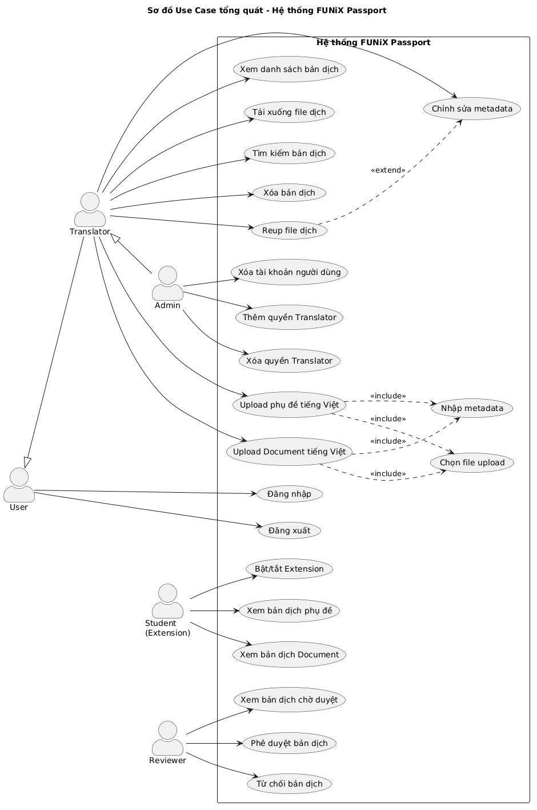
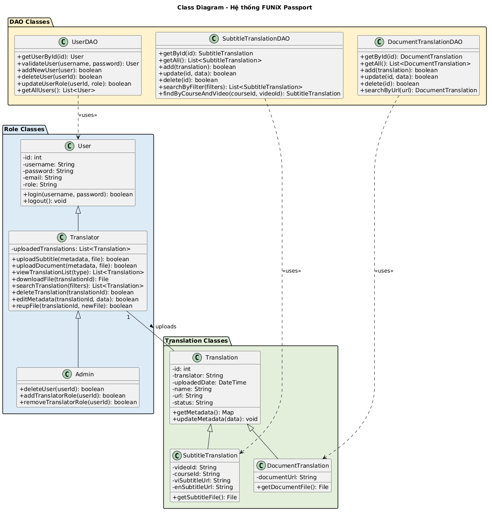
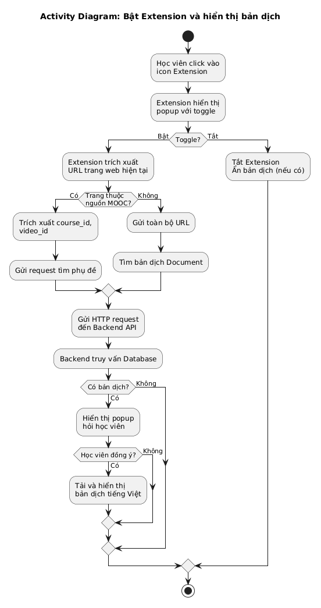

**FUNiX**

**Tài liệu đặc tả yêu cầu**

***FUNiX Passport***

Sinh viên: Nguyễn Nam Anh

Mã sinh viên: anhnnfx06447@funix.edu.vn

# Revision History

| **Date** | **Version** | **Description** | **Author** |
|----|----|----|----|
| 01/04/2026 | 1.0 | SRS 1.0 – Khởi tạo tài liệu đặc tả yêu cầu | Nguyễn Nam Anh |

# Bảng thuật ngữ

*Cung cấp tổng quan về bất kỳ định nghĩa nào mà người đọc nên hiểu trước khi đọc tiếp.*

| **Thuật ngữ** | **Định nghĩa** |
|----|----|
| SRS | Software Requirements Specification – Tài liệu đặc tả yêu cầu phần mềm |
| MOOC | Massive Open Online Course – Khóa học trực tuyến mở đại chúng |
| API | Application Programming Interface – Giao diện lập trình ứng dụng |
| DAO | Data Access Object – Đối tượng truy cập dữ liệu |
| CRUD | Create, Read, Update, Delete – Các thao tác cơ bản với dữ liệu |
| Extension | Tiện ích mở rộng trình duyệt (Chrome Extension) |
| Backend | Phần xử lý phía máy chủ của hệ thống |
| Metadata | Dữ liệu mô tả thông tin về bản dịch (tên, URL, người dịch, v.v.) |
| Token | Mã xác thực dùng để truy cập API một cách an toàn |
| UML | Unified Modeling Language – Ngôn ngữ mô hình hóa thống nhất |

# Table of Contents

*(Mục lục sẽ được tự động cập nhật trong Microsoft Word: References → Table of Contents → Update Table)*

**Tài liệu đặc tả**

# 1. Giới thiệu tổng quan về dự án

## 1.1 Tóm tắt dự án

FUNiX Passport là hệ thống hỗ trợ học viên FUNiX xem các tài liệu học tập bằng Tiếng Việt, bao gồm phụ đề video và tài liệu đã được dịch. Hệ thống giúp học viên dễ dàng tiếp thu kiến thức từ các khóa học trên nền tảng MOOC mà không cần phải đọc nội dung Tiếng Anh gốc.

Hệ thống được xây dựng nhằm giải quyết bài toán: học viên FUNiX gặp khó khăn khi tiếp cận các khóa học quốc tế trên nền tảng MOOC do rào cản ngôn ngữ. Phụ đề có sẵn chỉ bằng Tiếng Anh, khiến việc tiếp thu kiến thức bị hạn chế.

Hệ thống bao gồm hai thành phần chính:

- **Backend:** Máy chủ quản lý cơ sở dữ liệu các file dịch thuật (phụ đề và tài liệu). Hỗ trợ dịch thuật viên (Translator) upload, quản lý các bản dịch. Hỗ trợ quản trị viên (Admin) quản lý tài khoản người dùng.

- **Chrome Extension:** Tiện ích mở rộng trên trình duyệt Chrome, giao tiếp với Backend để lấy và hiển thị bản dịch phù hợp cho học viên khi họ truy cập các trang MOOC hoặc tài liệu.

Mục tiêu của dự án là tạo ra một hệ thống hoàn chỉnh, dễ sử dụng, có hiệu năng cao và bảo mật tốt, giúp nâng cao trải nghiệm học tập của học viên FUNiX.

## 1.2 Phạm vi của dự án

- **Phạm vi về dịch vụ:**

<!-- -->

- Hệ thống cung cấp dịch vụ quản lý và phân phối bản dịch tiếng Việt cho các tài liệu học tập trên nền tảng MOOC. Bao gồm: quản lý phụ đề video, quản lý tài liệu đã dịch, hiển thị bản dịch tự động cho học viên thông qua Chrome Extension.

<!-- -->

- **Phạm vi về khách hàng:**

<!-- -->

- Đối tượng sử dụng bao gồm: Học viên FUNiX (Student/User), Dịch thuật viên (Translator), Quản trị viên (Admin). Hệ thống phục vụ chủ yếu cho cộng đồng học viên và đội ngũ dịch thuật của FUNiX.

<!-- -->

- **Phạm vi về nền tảng hệ thống:**

<!-- -->

- Backend: Máy chủ web với cơ sở dữ liệu, cung cấp RESTful API. Client: Chrome Extension hoạt động trên trình duyệt Google Chrome. Hệ thống được thiết kế để tương thích với các trang MOOC phổ biến (Coursera, Udemy, edX, v.v.).

# 2. Yêu cầu và đặc tả dự án

## 2.1 Yêu cầu chức năng

Dựa vào yêu cầu dự án, hệ thống FUNiX Passport cần đáp ứng các yêu cầu chức năng sau, được phân loại theo từng vai trò người dùng:

### Vai trò User (Người dùng)

| **Mã** | **Tên chức năng** | **Mô tả** |
|----|----|----|
| FR-U01 | Đăng nhập | User có thể đăng nhập vào hệ thống bằng tài khoản đã đăng ký. Hệ thống xác thực thông tin và cấp quyền truy cập tương ứng. |
| FR-U02 | Đăng xuất | User có thể đăng xuất khỏi hệ thống, kết thúc phiên làm việc hiện tại. |

### Vai trò Translator (Dịch thuật viên)

| **Mã** | **Tên chức năng** | **Mô tả** |
|----|----|----|
| FR-T01 | Upload file phụ đề tiếng Việt | Translator vào màn hình upload, nhập các thông tin: Tên Video, URL Video, Course ID, Video ID. Đính kèm file phụ đề đã dịch. Nhấn Submit để hệ thống upload và lưu vào Database. |
| FR-T02 | Upload file Document tiếng Việt | Tương tự upload phụ đề, Translator nhập Tên bản dịch và URL của Document, đính kèm file Document đã dịch và submit. |
| FR-T03 | Xem danh sách bản dịch | Translator có thể xem 2 Dashboard: một hiển thị các bản dịch phụ đề và một hiển thị các bản dịch Document. |
| FR-T04 | Tải xuống file đã dịch | Khi click vào link trên Dashboard, Translator có thể tải xuống dữ liệu bản dịch (file phụ đề hoặc file Document). |
| FR-T05 | Tìm kiếm bản dịch | Translator có thể tìm kiếm bản dịch theo các bộ lọc: Tên bản dịch, URL, Người dịch, Course ID, Video ID. |
| FR-T06 | Xóa bản dịch | Sau khi tìm kiếm, Translator có thể lựa chọn xóa bản dịch phụ đề hoặc Document. |
| FR-T07 | Chỉnh sửa metadata bản dịch | Sau khi tìm kiếm, Translator có thể chỉnh sửa các metadata của file dịch (tên, URL, Course ID, v.v.). |
| FR-T08 | Reup file dịch | Translator có thể upload file dịch mới để thay thế file dịch cũ của bản dịch đã có. |

### Vai trò Admin (Quản trị viên)

| **Mã** | **Tên chức năng** | **Mô tả** |
|----|----|----|
| FR-A01 | Xóa tài khoản người dùng | Admin có thể xóa tài khoản của một người dùng bất kỳ khỏi hệ thống. |
| FR-A02 | Thêm quyền Translator | Admin có thể nâng cấp một tài khoản User thành Translator, cho phép họ thực hiện các thao tác dịch thuật. |
| FR-A03 | Xóa quyền Translator | Admin có thể hạ cấp một tài khoản Translator về User, thu hồi quyền thực hiện các thao tác dịch thuật. |

### Chrome Extension (Học viên)

| **Mã** | **Tên chức năng** | **Mô tả** |
|----|----|----|
| FR-E01 | Bật/tắt Extension | Học viên có thể bật hoặc tắt Extension thông qua popup giao diện của Extension trên Chrome. |
| FR-E02 | Tự động kiểm tra bản dịch | Khi truy cập một trang web, Extension tự động trích xuất URL và gửi request lên Backend để kiểm tra xem có bản dịch tương ứng hay không. |
| FR-E03 | Hiển thị bản dịch phụ đề | Nếu Backend trả về bản dịch phụ đề cho video, Extension hiển thị popup cho học viên lựa chọn xem bản dịch. Nếu đồng ý, phụ đề tiếng Việt được hiển thị. |
| FR-E04 | Hiển thị bản dịch Document | Nếu Backend trả về bản dịch cho Document, Extension hiển thị popup cho học viên lựa chọn xem bản dịch tiếng Việt. |

## 2.2 Yêu cầu phi chức năng

### 2.2.1 Tính bảo mật

Hệ thống phải đảm bảo tính bảo mật cao cho dữ liệu người dùng và các file dịch thuật:

- Dữ liệu được lưu trữ trong Database phải được bảo vệ an toàn, tránh truy cập trái phép từ bên ngoài.

- Tất cả các API endpoint phải yêu cầu xác thực bằng API Key hoặc Token (ví dụ: JWT Token) trước khi cho phép truy cập hoặc chỉnh sửa dữ liệu.

- Mật khẩu người dùng phải được mã hóa (hash) trước khi lưu vào Database.

- Phân quyền rõ ràng giữa các vai trò (User, Translator, Admin) để đảm bảo mỗi vai trò chỉ có thể thực hiện các thao tác được phép.

### 2.2.2 Tính sẵn sàng và khả năng đáp ứng

Hệ thống cần đảm bảo tính sẵn sàng và khả năng đáp ứng liên tục:

- Backend phải hoạt động ổn định 24/7, đảm bảo Extension luôn có thể gửi request và nhận phản hồi.

- Extension phải luôn sẵn sàng kiểm tra bản dịch mỗi khi học viên truy cập một trang web mới.

- Hệ thống phải có khả năng phục hồi nhanh chóng sau sự cố, giảm thiểu thời gian downtime.

### 2.2.3 Hiệu suất

Hệ thống cần đáp ứng các yêu cầu về hiệu suất cụ thể:

- Thời gian hiển thị bản dịch tính từ khi học viên vào website không được quá 1 giây.

- Thời gian xử lý các thao tác của Translator (upload, chỉnh sửa, xóa, tìm kiếm) không được quá 0.5 giây mỗi thao tác.

- Database phải được tối ưu hóa truy vấn (indexing) để đảm bảo tốc độ tìm kiếm bản dịch nhanh chóng.

## 2.3 Đặc tả phần mềm

Dựa trên các yêu cầu đã xác định, hệ thống FUNiX Passport có các đặc tả kỹ thuật như sau:

| **Hạng mục** | **Đặc tả chi tiết** |
|----|----|
| Ngôn ngữ hỗ trợ | Tiếng Việt (bản dịch), Tiếng Anh (gốc) |
| Nền tảng Backend | Web Server với RESTful API, kết nối Database quan hệ (MySQL/PostgreSQL) |
| Nền tảng Client | Chrome Extension (Manifest V3), tương thích Google Chrome phiên bản mới nhất |
| Giao thức truyền thông | HTTPS giữa Extension và Backend; RESTful API (JSON format) |
| Xác thực | JWT Token cho Backend API; OAuth 2.0 cho đăng nhập người dùng |
| Lưu trữ file | File phụ đề (.srt, .vtt) và Document được lưu trên Server hoặc Cloud Storage |
| Cơ sở dữ liệu | Bảng User (thông tin người dùng, vai trò), Bảng SubtitleTranslation (metadata phụ đề), Bảng DocumentTranslation (metadata tài liệu) |
| Giao diện người dùng | Giao diện Backend: trang web quản lý dành cho Translator và Admin. Giao diện Extension: popup bật/tắt và hiển thị bản dịch. |
| Tương thích MOOC | Hỗ trợ các nền tảng: Coursera, Udemy, edX và các trang tài liệu khác |
| Khả năng mở rộng | Thiết kế module hóa, cho phép thêm nguồn MOOC mới và loại file dịch mới trong tương lai |

# 3. Kiến trúc và thiết kế phần mềm

## 3.1 Kiến trúc phần mềm

Kiến trúc được lựa chọn cho hệ thống FUNiX Passport là kiến trúc Client-Server kết hợp với kiến trúc Layered (phân tầng) cho phần Backend.

### Lý do lựa chọn kiến trúc Client-Server:

Bản chất hệ thống bao gồm hai thành phần tách biệt: Chrome Extension (Client) và Backend (Server). Kiến trúc Client-Server là lựa chọn tự nhiên và phù hợp nhất vì:

- Phân tách rõ ràng: Extension chỉ chịu trách nhiệm hiển thị giao diện và gửi request; Backend chịu trách nhiệm xử lý logic nghiệp vụ và quản lý dữ liệu. Điều này tuân thủ nguyên tắc Separation of Concerns.

- Quản lý dữ liệu tập trung: Tất cả dữ liệu bản dịch được lưu trữ và quản lý tại Backend, đảm bảo tính nhất quán và dễ bảo trì.

- Hỗ trợ nhiều client: Một Backend có thể phục vụ nhiều Extension cùng lúc, cũng như giao diện web quản lý cho Translator và Admin.

- Dễ dàng cập nhật: Backend có thể được cập nhật, triển khai lại mà không ảnh hưởng đến Extension đang cài trên máy người dùng và ngược lại.

### Lý do không chọn các kiến trúc khác:

- Pipe-and-Filter: Không phù hợp vì hệ thống không xử lý dữ liệu theo chuỗi biến đổi tuần tự. Các thao tác (upload, tìm kiếm, hiển thị) là độc lập và tương tác hai chiều.

- Event-Based: Quá phức tạp cho quy mô dự án hiện tại. Hệ thống chủ yếu hoạt động theo mô hình request-response, không cần cơ chế event bus.

- Blackboard: Không phù hợp vì hệ thống không có nhiều knowledge source cần truy cập chung một kho dữ liệu để giải quyết vấn đề phức tạp.

### Kiến trúc Layered cho Backend:

Phần Backend được thiết kế theo kiến trúc phân tầng (Layered Architecture) gồm 3 tầng:

- Presentation Layer (Tầng trình bày): Giao diện web cho Translator và Admin; API endpoints cho Extension.

- Business Logic Layer (Tầng xử lý nghiệp vụ): Xử lý logic upload, tìm kiếm, quản lý quyền, xác thực Token.

- Data Access Layer (Tầng truy cập dữ liệu): Các class DAO tương tác trực tiếp với Database (UserDAO, TranslationDAO).

## 3.2 Usecase

Trong phần này, chúng ta sẽ xác định các Actor trong hệ thống, mô tả chi tiết các Use Case cho từng Actor và vẽ sơ đồ Use Case tổng quát.

### 3.2.1 Usecase của User

User là người dùng cơ bản của hệ thống, chỉ có thể đăng nhập và đăng xuất.

<table>
<colgroup>
<col style="width: 50%" />
<col style="width: 50%" />
</colgroup>
<thead>
<tr>
<th><strong>Use Case Name</strong></th>
<th>Đăng nhập</th>
</tr>
</thead>
<tbody>
<tr>
<td><strong>Mô tả</strong></td>
<td>User có thể đăng nhập tài khoản vào hệ thống và sử dụng các chức năng trong đó.</td>
</tr>
<tr>
<td><strong>Điều kiện</strong></td>
<td>User chưa đăng nhập vào hệ thống.</td>
</tr>
<tr>
<td><strong>Luồng chính</strong></td>
<td>
1. User truy cập vào trang web quản lý. Hệ thống hiển thị Form Login.

2. User nhập vào các thông tin đăng nhập (username, password).

3. User nhấn nút "Đăng nhập".

4. Hệ thống xác thực thông tin. Nếu thông tin đăng nhập đúng, cập nhật trạng thái đăng nhập và chuyển đến trang chính.
</td>
</tr>
<tr>
<td><strong>Luồng phụ</strong></td>
<td>Ở bước 4, nếu thông tin đăng nhập sai, hệ thống hiển thị thông báo lỗi cho người dùng và yêu cầu nhập lại.</td>
</tr>
</tbody>
</table>

<table>
<colgroup>
<col style="width: 50%" />
<col style="width: 50%" />
</colgroup>
<thead>
<tr>
<th><strong>Use Case Name</strong></th>
<th>Đăng xuất</th>
</tr>
</thead>
<tbody>
<tr>
<td><strong>Mô tả</strong></td>
<td>User có thể đăng xuất khỏi hệ thống, kết thúc phiên làm việc hiện tại.</td>
</tr>
<tr>
<td><strong>Điều kiện</strong></td>
<td>User đã đăng nhập vào hệ thống.</td>
</tr>
<tr>
<td><strong>Luồng chính</strong></td>
<td>
1. User nhấn nút "Đăng xuất" trên giao diện.

2. Hệ thống xóa phiên làm việc (session/token) của User.

3. Hệ thống chuyển hướng User về trang đăng nhập.
</td>
</tr>
<tr>
<td><strong>Luồng phụ</strong></td>
<td>Không có luồng phụ.</td>
</tr>
</tbody>
</table>

### 3.2.2 Usecase của Translator

Translator kế thừa các Use Case của User (đăng nhập, đăng xuất) và có thêm các chức năng quản lý bản dịch.

<table>
<colgroup>
<col style="width: 50%" />
<col style="width: 50%" />
</colgroup>
<thead>
<tr>
<th><strong>Use Case Name</strong></th>
<th>Upload file phụ đề tiếng Việt</th>
</tr>
</thead>
<tbody>
<tr>
<td><strong>Mô tả</strong></td>
<td>Translator upload file phụ đề đã dịch tiếng Việt cho một video cụ thể lên hệ thống.</td>
</tr>
<tr>
<td><strong>Điều kiện</strong></td>
<td>Translator đã đăng nhập vào hệ thống.</td>
</tr>
<tr>
<td><strong>Luồng chính</strong></td>
<td>
1. Translator chọn chức năng "Upload phụ đề" trên Dashboard.

2. Hệ thống hiển thị form upload với các trường: Tên Video, URL Video, Course ID, Video ID.

3. Translator nhập các thông tin cần thiết.

4. Translator đính kèm file phụ đề đã dịch (.srt hoặc .vtt).

5. Translator nhấn nút "Submit".

6. Hệ thống validate dữ liệu, upload file và lưu metadata vào Database.

7. Hệ thống hiển thị thông báo upload thành công.
</td>
</tr>
<tr>
<td><strong>Luồng phụ</strong></td>
<td>Ở bước 6, nếu dữ liệu không hợp lệ (thiếu trường bắt buộc, file không đúng định dạng), hệ thống hiển thị thông báo lỗi và yêu cầu chỉnh sửa.</td>
</tr>
</tbody>
</table>

<table>
<colgroup>
<col style="width: 50%" />
<col style="width: 50%" />
</colgroup>
<thead>
<tr>
<th><strong>Use Case Name</strong></th>
<th>Upload file Document tiếng Việt</th>
</tr>
</thead>
<tbody>
<tr>
<td><strong>Mô tả</strong></td>
<td>Translator upload file tài liệu đã dịch tiếng Việt lên hệ thống.</td>
</tr>
<tr>
<td><strong>Điều kiện</strong></td>
<td>Translator đã đăng nhập vào hệ thống.</td>
</tr>
<tr>
<td><strong>Luồng chính</strong></td>
<td>
1. Translator chọn chức năng "Upload Document" trên Dashboard.

2. Hệ thống hiển thị form upload với các trường: Tên bản dịch, URL Document.

3. Translator nhập các thông tin cần thiết.

4. Translator đính kèm file Document đã dịch.

5. Translator nhấn nút "Submit".

6. Hệ thống validate dữ liệu, upload file và lưu metadata vào Database.

7. Hệ thống hiển thị thông báo upload thành công.
</td>
</tr>
<tr>
<td><strong>Luồng phụ</strong></td>
<td>Ở bước 6, nếu dữ liệu không hợp lệ, hệ thống hiển thị thông báo lỗi.</td>
</tr>
</tbody>
</table>

<table>
<colgroup>
<col style="width: 50%" />
<col style="width: 50%" />
</colgroup>
<thead>
<tr>
<th><strong>Use Case Name</strong></th>
<th>Xem danh sách bản dịch</th>
</tr>
</thead>
<tbody>
<tr>
<td><strong>Mô tả</strong></td>
<td>Translator xem danh sách tất cả các bản dịch đã upload trên hệ thống.</td>
</tr>
<tr>
<td><strong>Điều kiện</strong></td>
<td>Translator đã đăng nhập vào hệ thống.</td>
</tr>
<tr>
<td><strong>Luồng chính</strong></td>
<td>
1. Translator chọn mục "Dashboard" trên menu.

2. Hệ thống hiển thị hai tab: "Phụ đề" và "Document".

3. Translator chọn tab tương ứng để xem danh sách bản dịch.

4. Hệ thống truy vấn Database và hiển thị danh sách bản dịch với các metadata.
</td>
</tr>
<tr>
<td><strong>Luồng phụ</strong></td>
<td>Nếu không có bản dịch nào, hệ thống hiển thị thông báo "Chưa có bản dịch nào".</td>
</tr>
</tbody>
</table>

<table>
<colgroup>
<col style="width: 50%" />
<col style="width: 50%" />
</colgroup>
<thead>
<tr>
<th><strong>Use Case Name</strong></th>
<th>Tải xuống file đã dịch</th>
</tr>
</thead>
<tbody>
<tr>
<td><strong>Mô tả</strong></td>
<td>Translator tải xuống file dịch từ Dashboard.</td>
</tr>
<tr>
<td><strong>Điều kiện</strong></td>
<td>Translator đã đăng nhập và đang xem Dashboard.</td>
</tr>
<tr>
<td><strong>Luồng chính</strong></td>
<td>
1. Translator click vào link tải xuống của bản dịch trên Dashboard.

2. Hệ thống xác thực quyền truy cập.

3. Hệ thống trả về file dịch cho Translator tải về.
</td>
</tr>
<tr>
<td><strong>Luồng phụ</strong></td>
<td>Nếu file không tồn tại trên server, hệ thống hiển thị thông báo lỗi "File không tìm thấy".</td>
</tr>
</tbody>
</table>

<table>
<colgroup>
<col style="width: 50%" />
<col style="width: 50%" />
</colgroup>
<thead>
<tr>
<th><strong>Use Case Name</strong></th>
<th>Tìm kiếm bản dịch</th>
</tr>
</thead>
<tbody>
<tr>
<td><strong>Mô tả</strong></td>
<td>Translator tìm kiếm bản dịch theo các bộ lọc.</td>
</tr>
<tr>
<td><strong>Điều kiện</strong></td>
<td>Translator đã đăng nhập vào hệ thống.</td>
</tr>
<tr>
<td><strong>Luồng chính</strong></td>
<td>
1. Translator chọn chức năng "Tìm kiếm" trên Dashboard.

2. Hệ thống hiển thị form tìm kiếm với các bộ lọc: Tên bản dịch, URL, Người dịch, Course ID, Video ID.

3. Translator nhập từ khóa tìm kiếm vào một hoặc nhiều bộ lọc.

4. Translator nhấn nút "Tìm kiếm".

5. Hệ thống truy vấn Database và hiển thị kết quả phù hợp.
</td>
</tr>
<tr>
<td><strong>Luồng phụ</strong></td>
<td>Nếu không tìm thấy kết quả, hệ thống hiển thị thông báo "Không tìm thấy bản dịch phù hợp".</td>
</tr>
</tbody>
</table>

<table>
<colgroup>
<col style="width: 50%" />
<col style="width: 50%" />
</colgroup>
<thead>
<tr>
<th><strong>Use Case Name</strong></th>
<th>Xóa bản dịch</th>
</tr>
</thead>
<tbody>
<tr>
<td><strong>Mô tả</strong></td>
<td>Translator xóa một bản dịch phụ đề hoặc Document khỏi hệ thống.</td>
</tr>
<tr>
<td><strong>Điều kiện</strong></td>
<td>Translator đã đăng nhập và đã tìm kiếm được bản dịch cần xóa.</td>
</tr>
<tr>
<td><strong>Luồng chính</strong></td>
<td>
1. Translator chọn bản dịch cần xóa từ kết quả tìm kiếm hoặc Dashboard.

2. Translator nhấn nút "Xóa".

3. Hệ thống hiển thị popup xác nhận: "Bạn có chắc chắn muốn xóa bản dịch này?".

4. Translator xác nhận xóa.

5. Hệ thống xóa metadata khỏi Database và xóa file dịch khỏi server.

6. Hệ thống hiển thị thông báo xóa thành công.
</td>
</tr>
<tr>
<td><strong>Luồng phụ</strong></td>
<td>Ở bước 4, nếu Translator chọn "Hủy", hệ thống quay lại màn hình trước đó mà không xóa.</td>
</tr>
</tbody>
</table>

<table>
<colgroup>
<col style="width: 50%" />
<col style="width: 50%" />
</colgroup>
<thead>
<tr>
<th><strong>Use Case Name</strong></th>
<th>Chỉnh sửa metadata bản dịch</th>
</tr>
</thead>
<tbody>
<tr>
<td><strong>Mô tả</strong></td>
<td>Translator chỉnh sửa các thông tin metadata của một bản dịch đã upload.</td>
</tr>
<tr>
<td><strong>Điều kiện</strong></td>
<td>Translator đã đăng nhập và đã tìm kiếm được bản dịch cần chỉnh sửa.</td>
</tr>
<tr>
<td><strong>Luồng chính</strong></td>
<td>
1. Translator chọn bản dịch cần chỉnh sửa từ kết quả tìm kiếm hoặc Dashboard.

2. Translator nhấn nút "Chỉnh sửa".

3. Hệ thống hiển thị form chỉnh sửa với các metadata hiện tại.

4. Translator chỉnh sửa các trường cần thay đổi (Tên, URL, Course ID, Video ID, v.v.).

5. Translator nhấn nút "Lưu".

6. Hệ thống validate dữ liệu và cập nhật metadata trong Database.

7. Hệ thống hiển thị thông báo cập nhật thành công.
</td>
</tr>
<tr>
<td><strong>Luồng phụ</strong></td>
<td>Ở bước 6, nếu dữ liệu không hợp lệ, hệ thống hiển thị thông báo lỗi.</td>
</tr>
</tbody>
</table>

<table>
<colgroup>
<col style="width: 50%" />
<col style="width: 50%" />
</colgroup>
<thead>
<tr>
<th><strong>Use Case Name</strong></th>
<th>Reup file dịch</th>
</tr>
</thead>
<tbody>
<tr>
<td><strong>Mô tả</strong></td>
<td>Translator upload file dịch mới để thay thế file dịch cũ của một bản dịch.</td>
</tr>
<tr>
<td><strong>Điều kiện</strong></td>
<td>Translator đã đăng nhập và đã tìm kiếm được bản dịch cần reup.</td>
</tr>
<tr>
<td><strong>Luồng chính</strong></td>
<td>
1. Translator chọn bản dịch cần reup từ kết quả tìm kiếm hoặc Dashboard.

2. Translator nhấn nút "Reup file".

3. Hệ thống hiển thị form upload file mới.

4. Translator đính kèm file dịch mới.

5. Translator nhấn nút "Submit".

6. Hệ thống xóa file cũ, upload file mới và cập nhật đường dẫn trong Database.

7. Hệ thống hiển thị thông báo reup thành công.
</td>
</tr>
<tr>
<td><strong>Luồng phụ</strong></td>
<td>Ở bước 6, nếu file không đúng định dạng, hệ thống hiển thị thông báo lỗi.</td>
</tr>
</tbody>
</table>

### 3.2.3 Usecase của Admin

Admin kế thừa tất cả Use Case của Translator và có thêm các chức năng quản lý người dùng.

<table>
<colgroup>
<col style="width: 50%" />
<col style="width: 50%" />
</colgroup>
<thead>
<tr>
<th><strong>Use Case Name</strong></th>
<th>Xóa tài khoản người dùng</th>
</tr>
</thead>
<tbody>
<tr>
<td><strong>Mô tả</strong></td>
<td>Admin xóa tài khoản của một người dùng khỏi hệ thống.</td>
</tr>
<tr>
<td><strong>Điều kiện</strong></td>
<td>Admin đã đăng nhập vào hệ thống.</td>
</tr>
<tr>
<td><strong>Luồng chính</strong></td>
<td>
1. Admin truy cập trang quản lý người dùng.

2. Hệ thống hiển thị danh sách tất cả người dùng.

3. Admin chọn tài khoản cần xóa.

4. Admin nhấn nút "Xóa tài khoản".

5. Hệ thống hiển thị popup xác nhận.

6. Admin xác nhận xóa.

7. Hệ thống xóa tài khoản khỏi Database.

8. Hệ thống hiển thị thông báo xóa thành công.
</td>
</tr>
<tr>
<td><strong>Luồng phụ</strong></td>
<td>Ở bước 6, nếu Admin chọn "Hủy", hệ thống quay lại danh sách người dùng.</td>
</tr>
</tbody>
</table>

<table>
<colgroup>
<col style="width: 50%" />
<col style="width: 50%" />
</colgroup>
<thead>
<tr>
<th><strong>Use Case Name</strong></th>
<th>Thêm quyền Translator</th>
</tr>
</thead>
<tbody>
<tr>
<td><strong>Mô tả</strong></td>
<td>Admin nâng cấp tài khoản User thành Translator.</td>
</tr>
<tr>
<td><strong>Điều kiện</strong></td>
<td>Admin đã đăng nhập. Tài khoản mục tiêu hiện tại có vai trò User.</td>
</tr>
<tr>
<td><strong>Luồng chính</strong></td>
<td>
1. Admin truy cập trang quản lý người dùng.

2. Admin tìm kiếm tài khoản User cần nâng cấp.

3. Admin nhấn nút "Thêm quyền Translator".

4. Hệ thống cập nhật vai trò của tài khoản từ User thành Translator trong Database.

5. Hệ thống hiển thị thông báo thành công.
</td>
</tr>
<tr>
<td><strong>Luồng phụ</strong></td>
<td>Nếu tài khoản đã là Translator hoặc Admin, hệ thống hiển thị thông báo "Tài khoản đã có quyền Translator".</td>
</tr>
</tbody>
</table>

<table>
<colgroup>
<col style="width: 50%" />
<col style="width: 50%" />
</colgroup>
<thead>
<tr>
<th><strong>Use Case Name</strong></th>
<th>Xóa quyền Translator</th>
</tr>
</thead>
<tbody>
<tr>
<td><strong>Mô tả</strong></td>
<td>Admin hạ cấp tài khoản Translator về User.</td>
</tr>
<tr>
<td><strong>Điều kiện</strong></td>
<td>Admin đã đăng nhập. Tài khoản mục tiêu hiện tại có vai trò Translator.</td>
</tr>
<tr>
<td><strong>Luồng chính</strong></td>
<td>
1. Admin truy cập trang quản lý người dùng.

2. Admin tìm kiếm tài khoản Translator cần hạ cấp.

3. Admin nhấn nút "Xóa quyền Translator".

4. Hệ thống cập nhật vai trò của tài khoản từ Translator thành User trong Database.

5. Hệ thống hiển thị thông báo thành công.
</td>
</tr>
<tr>
<td><strong>Luồng phụ</strong></td>
<td>Nếu tài khoản không phải Translator, hệ thống hiển thị thông báo "Tài khoản không có quyền Translator".</td>
</tr>
</tbody>
</table>

### 3.2.4 Usecase của Student (Extension User)

Student sử dụng Chrome Extension để xem bản dịch tiếng Việt khi học tập trên các trang MOOC.

<table>
<colgroup>
<col style="width: 50%" />
<col style="width: 50%" />
</colgroup>
<thead>
<tr>
<th><strong>Use Case Name</strong></th>
<th>Bật/tắt Extension</th>
</tr>
</thead>
<tbody>
<tr>
<td><strong>Mô tả</strong></td>
<td>Học viên bật hoặc tắt chức năng dịch của Extension.</td>
</tr>
<tr>
<td><strong>Điều kiện</strong></td>
<td>Extension đã được cài đặt trên trình duyệt Chrome.</td>
</tr>
<tr>
<td><strong>Luồng chính</strong></td>
<td>
1. Học viên click vào icon Extension trên thanh công cụ Chrome.

2. Extension hiển thị popup với toggle bật/tắt.

3. Học viên click vào toggle để thay đổi trạng thái (bật → tắt hoặc tắt → bật).

4. Extension cập nhật trạng thái và lưu vào local storage.

5. Nếu bật: Extension bắt đầu kiểm tra bản dịch cho trang hiện tại.

6. Nếu tắt: Extension ngừng kiểm tra và ẩn bản dịch (nếu đang hiển thị).
</td>
</tr>
<tr>
<td><strong>Luồng phụ</strong></td>
<td>Không có luồng phụ.</td>
</tr>
</tbody>
</table>

<table>
<colgroup>
<col style="width: 50%" />
<col style="width: 50%" />
</colgroup>
<thead>
<tr>
<th><strong>Use Case Name</strong></th>
<th>Xem bản dịch phụ đề</th>
</tr>
</thead>
<tbody>
<tr>
<td><strong>Mô tả</strong></td>
<td>Học viên xem phụ đề tiếng Việt cho video trên trang MOOC.</td>
</tr>
<tr>
<td><strong>Điều kiện</strong></td>
<td>Extension đang bật. Học viên đang truy cập trang MOOC có video.</td>
</tr>
<tr>
<td><strong>Luồng chính</strong></td>
<td>
1. Extension tự động trích xuất URL trang web và xác định course_id, video_id.

2. Extension gửi request lên Backend với course_id và video_id.

3. Backend tìm kiếm bản dịch phụ đề tương ứng trong Database.

4. Backend trả về thông tin bản dịch (nếu có).

5. Extension hiển thị popup hỏi học viên: "Có bản dịch tiếng Việt. Bạn có muốn hiển thị?".

6. Học viên chọn "Đồng ý".

7. Extension tải file phụ đề và hiển thị phụ đề tiếng Việt trên video.
</td>
</tr>
<tr>
<td><strong>Luồng phụ</strong></td>
<td>Ở bước 4, nếu Backend không tìm thấy bản dịch, Extension không hiển thị popup. Ở bước 6, nếu học viên chọn "Từ chối", Extension không hiển thị phụ đề.</td>
</tr>
</tbody>
</table>

<table>
<colgroup>
<col style="width: 50%" />
<col style="width: 50%" />
</colgroup>
<thead>
<tr>
<th><strong>Use Case Name</strong></th>
<th>Xem bản dịch Document</th>
</tr>
</thead>
<tbody>
<tr>
<td><strong>Mô tả</strong></td>
<td>Học viên xem bản dịch tiếng Việt cho tài liệu trên trang web.</td>
</tr>
<tr>
<td><strong>Điều kiện</strong></td>
<td>Extension đang bật. Học viên đang truy cập trang web có tài liệu.</td>
</tr>
<tr>
<td><strong>Luồng chính</strong></td>
<td>
1. Extension tự động trích xuất toàn bộ URL trang web.

2. Extension gửi request lên Backend với URL để tìm bản dịch Document.

3. Backend tìm kiếm bản dịch Document tương ứng trong Database.

4. Backend trả về thông tin bản dịch (nếu có).

5. Extension hiển thị popup hỏi học viên: "Có bản dịch tiếng Việt. Bạn có muốn xem?".

6. Học viên chọn "Đồng ý".

7. Extension hiển thị bản dịch Document tiếng Việt.
</td>
</tr>
<tr>
<td><strong>Luồng phụ</strong></td>
<td>Ở bước 4, nếu Backend không tìm thấy bản dịch, Extension không hiển thị popup. Ở bước 6, nếu học viên chọn "Từ chối", Extension không hiển thị bản dịch.</td>
</tr>
</tbody>
</table>

## 3.3 Sơ đồ use case tổng quát của hệ thống

Sơ đồ Use Case tổng quát thể hiện tất cả các Actor, Use Case và mối quan hệ giữa chúng (bao gồm \<\<include\>\> và \<\<extend\>\>).

*Hình 1: Sơ đồ Use Case tổng quát của hệ thống FUNiX Passport*

## 3.4 Class Diagram

Class Diagram thể hiện các lớp trong hệ thống, thuộc tính, phương thức và mối quan hệ kế thừa giữa chúng.

### Các nhóm Class:

- Nhóm Role (Vai trò người dùng):

<!-- -->

- User: Lớp cơ sở chứa các thuộc tính chung (id, username, password, email, role) và phương thức đăng nhập/đăng xuất.

- Translator (kế thừa User): Bổ sung các phương thức upload, tìm kiếm, xóa, chỉnh sửa bản dịch.

- Admin (kế thừa Translator): Bổ sung các phương thức quản lý người dùng (xóa tài khoản, thêm/xóa quyền).

<!-- -->

- Nhóm Translation (Bản dịch):

<!-- -->

- Translation: Lớp cơ sở chứa các thuộc tính chung của mọi bản dịch (id, translator, uploadedDate, name, url).

- SubtitleTranslation (kế thừa Translation): Bổ sung các thuộc tính riêng (videoId, courseId, viSubtitleUrl, enSubtitleUrl).

- DocumentTranslation (kế thừa Translation): Bổ sung thuộc tính documentUrl.

<!-- -->

- Nhóm DAO (Data Access Object):

<!-- -->

- UserDAO: Cung cấp các phương thức truy cập dữ liệu người dùng (getUserById, validateUser, addNewUser, deleteUser, updateUserRole).

- SubtitleTranslationDAO: Cung cấp các phương thức CRUD cho bản dịch phụ đề (getById, getAll, add, update, delete, searchByFilter).

- DocumentTranslationDAO: Cung cấp các phương thức CRUD cho bản dịch tài liệu (getById, getAll, add, update, delete, searchByUrl).

*Hình 2: Class Diagram của hệ thống FUNiX Passport*

## 3.5 Sequence Diagram

Sequence Diagram dưới đây mô tả cơ chế hoạt động kiểm tra và hiển thị bản dịch của Chrome Extension khi học viên truy cập một trang web:

1.  1\. Học viên truy cập một trang web trên trình duyệt Chrome.

2.  2\. Extension trích xuất URL của trang web, xác định course_id và video_id (nếu là trang MOOC).

3.  3\. Extension gửi HTTP request đến Backend API với các thông tin đã trích xuất.

4.  4\. Backend nhận request, sử dụng TranslationDAO để truy vấn Database.

5.  5\. Database trả về kết quả (bản dịch nếu tìm thấy, hoặc rỗng).

6.  6\. Backend gửi response về cho Extension.

7.  7\. Nếu có bản dịch: Extension hiển thị popup hỏi học viên.

8.  8\. Học viên chọn "Đồng ý": Extension tải và hiển thị bản dịch.

*Hình 3: Sequence Diagram - Kiểm tra và hiển thị bản dịch của Extension*

## 3.6 Activity Diagram

Activity Diagram dưới đây mô tả thao tác bật/mở Extension của học viên và quá trình kiểm tra, hiển thị bản dịch:

9.  1\. Học viên click vào icon Extension.

10. 2\. Extension hiển thị popup với toggle.

11. 3\. Học viên bật toggle → Extension kích hoạt.

12. 4\. Extension trích xuất URL trang web hiện tại.

13. 5\. Quyết định: Trang thuộc nguồn MOOC?

14. \- Có: Trích xuất course_id, video_id → Gửi request tìm phụ đề.

15. \- Không: Gửi toàn bộ URL → Tìm bản dịch Document.

16. 6\. Backend xử lý và trả về kết quả.

17. 7\. Quyết định: Có bản dịch?

18. \- Có: Hiển thị popup → Học viên chọn đồng ý → Hiển thị bản dịch.

19. \- Không: Kết thúc (không hiển thị gì).

*Hình 4: Activity Diagram - Bật Extension và hiển thị bản dịch*

# 4. (Nâng cao) Actor bổ sung: Reviewer

Hệ thống bổ sung thêm vai trò Reviewer (Người kiểm duyệt) nhằm đảm bảo chất lượng các bản dịch trước khi chúng được hiển thị cho học viên.

## 4.1 Mô tả vai trò Reviewer

Reviewer là người có chuyên môn ngôn ngữ, chịu trách nhiệm kiểm tra chất lượng các bản dịch mà Translator đã upload. Bản dịch chỉ được hiển thị cho học viên sau khi Reviewer phê duyệt.

## 4.2 Use Case của Reviewer

<table>
<colgroup>
<col style="width: 50%" />
<col style="width: 50%" />
</colgroup>
<thead>
<tr>
<th><strong>Use Case Name</strong></th>
<th>Xem danh sách bản dịch chờ duyệt</th>
</tr>
</thead>
<tbody>
<tr>
<td><strong>Mô tả</strong></td>
<td>Reviewer xem danh sách các bản dịch mới upload chưa được phê duyệt.</td>
</tr>
<tr>
<td><strong>Điều kiện</strong></td>
<td>Reviewer đã đăng nhập vào hệ thống.</td>
</tr>
<tr>
<td><strong>Luồng chính</strong></td>
<td>
1. Reviewer truy cập trang "Bản dịch chờ duyệt".

2. Hệ thống truy vấn Database lấy các bản dịch có trạng thái "pending".

3. Hệ thống hiển thị danh sách bản dịch chờ duyệt với metadata.
</td>
</tr>
<tr>
<td><strong>Luồng phụ</strong></td>
<td>Nếu không có bản dịch chờ duyệt, hệ thống hiển thị thông báo "Không có bản dịch cần duyệt".</td>
</tr>
</tbody>
</table>

<table>
<colgroup>
<col style="width: 50%" />
<col style="width: 50%" />
</colgroup>
<thead>
<tr>
<th><strong>Use Case Name</strong></th>
<th>Phê duyệt bản dịch</th>
</tr>
</thead>
<tbody>
<tr>
<td><strong>Mô tả</strong></td>
<td>Reviewer phê duyệt một bản dịch, cho phép hiển thị cho học viên.</td>
</tr>
<tr>
<td><strong>Điều kiện</strong></td>
<td>Reviewer đã đăng nhập. Bản dịch đang ở trạng thái "pending".</td>
</tr>
<tr>
<td><strong>Luồng chính</strong></td>
<td>
1. Reviewer chọn bản dịch cần duyệt từ danh sách chờ duyệt.

2. Hệ thống hiển thị nội dung bản dịch để Reviewer xem xét.

3. Reviewer kiểm tra chất lượng bản dịch.

4. Reviewer nhấn nút "Phê duyệt".

5. Hệ thống cập nhật trạng thái bản dịch thành "approved" trong Database.

6. Bản dịch có thể hiển thị cho học viên qua Extension.
</td>
</tr>
<tr>
<td><strong>Luồng phụ</strong></td>
<td>Không có luồng phụ.</td>
</tr>
</tbody>
</table>

<table>
<colgroup>
<col style="width: 50%" />
<col style="width: 50%" />
</colgroup>
<thead>
<tr>
<th><strong>Use Case Name</strong></th>
<th>Từ chối bản dịch</th>
</tr>
</thead>
<tbody>
<tr>
<td><strong>Mô tả</strong></td>
<td>Reviewer từ chối một bản dịch không đạt chất lượng.</td>
</tr>
<tr>
<td><strong>Điều kiện</strong></td>
<td>Reviewer đã đăng nhập. Bản dịch đang ở trạng thái "pending".</td>
</tr>
<tr>
<td><strong>Luồng chính</strong></td>
<td>
1. Reviewer chọn bản dịch cần duyệt từ danh sách chờ duyệt.

2. Hệ thống hiển thị nội dung bản dịch để Reviewer xem xét.

3. Reviewer phát hiện bản dịch không đạt chất lượng.

4. Reviewer nhấn nút "Từ chối" và nhập lý do từ chối.

5. Hệ thống cập nhật trạng thái bản dịch thành "rejected" trong Database.

6. Hệ thống gửi thông báo cho Translator kèm lý do từ chối.
</td>
</tr>
<tr>
<td><strong>Luồng phụ</strong></td>
<td>Không có luồng phụ.</td>
</tr>
</tbody>
</table>

## 4.3 Cập nhật SRS cho Reviewer

Bổ sung yêu cầu chức năng cho vai trò Reviewer:

| **Mã** | **Tên chức năng** | **Mô tả** |
|----|----|----|
| FR-R01 | Xem danh sách bản dịch chờ duyệt | Reviewer có thể xem danh sách tất cả các bản dịch có trạng thái "pending" (chờ duyệt). |
| FR-R02 | Phê duyệt bản dịch | Reviewer có thể phê duyệt một bản dịch, chuyển trạng thái thành "approved", cho phép hiển thị cho học viên. |
| FR-R03 | Từ chối bản dịch | Reviewer có thể từ chối bản dịch không đạt chất lượng, nhập lý do và gửi thông báo cho Translator. |

Cập nhật đặc tả: Bảng Translation trong Database cần bổ sung trường "status" (pending/approved/rejected) và trường "reviewNote" (ghi chú của Reviewer). Extension chỉ hiển thị bản dịch có status = "approved".
