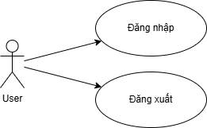
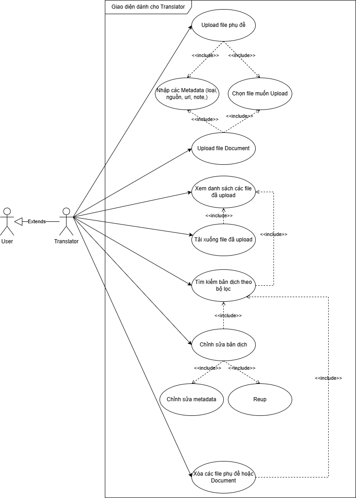
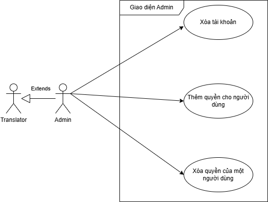
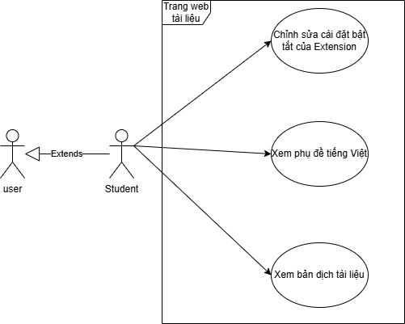
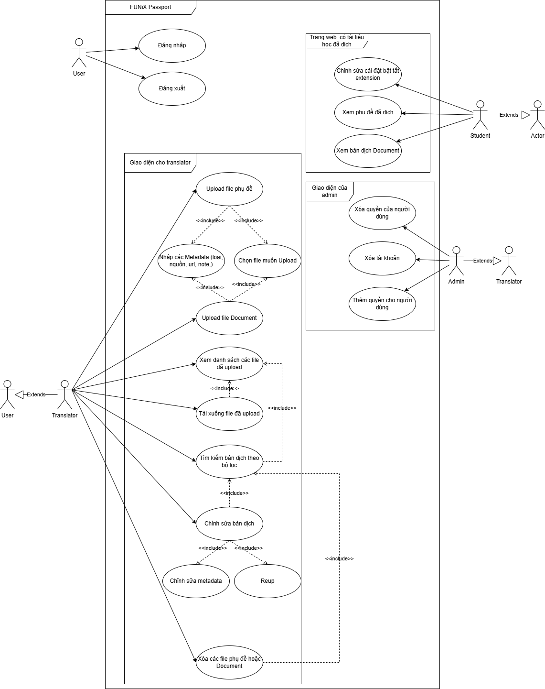
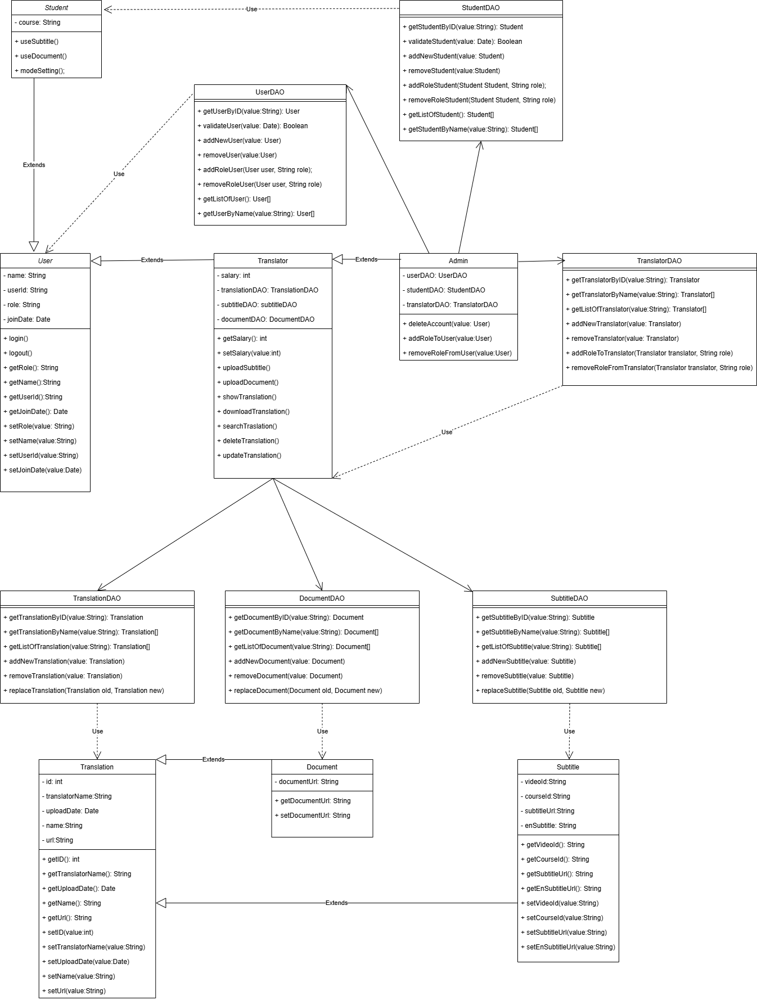
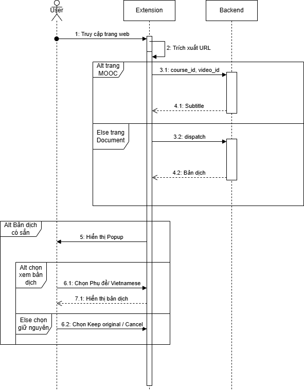
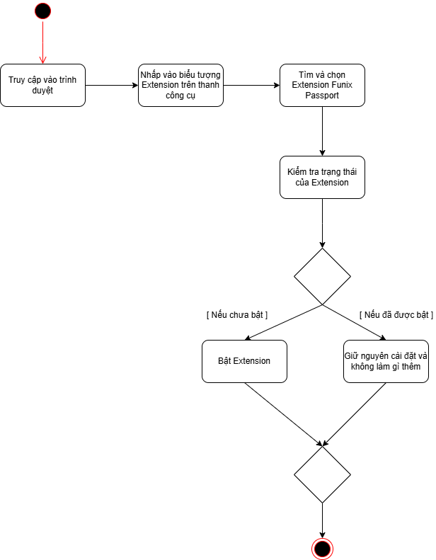

Tài liệu đặc tả yêu cầu

> ***FUNiX Passport***

Revision History

  ----------------- ------------- --------------------------- -----------------
  **Date**          **Version**   **Description**             **Author**

  \<04/13/07\>      \<1.0\>       SRS 1.0                     Group-1

  \<04/15/07\>      \<2.0\>       SRS 2.0                     Group-1

  \<04/15/07\>      \<3.0\>       SRS 3.0                     Group-1

  \<04/16/07\>      \<4.0\>       SRS 4.0                     Group-1
  ----------------- ------------- --------------------------- -----------------

Bảng thuật ngữ

Cung cấp tổng quan về bất kỳ định nghĩa nào mà người đọc nên hiểu trước
khi đọc tiếp.

  ----------- -----------------------------------------------------------
  Cấu hình    Nó có nghĩa là một sản phẩm có sẵn / Được chọn từ một danh
              mục có thể được tùy chỉnh.

  FAQ         Frequently Asked Questions

  CRM         Customer Relationship Management

  RAID 5      Redundant Array of Inexpensive Disk/Drives
  ----------- -----------------------------------------------------------

Table of Contents

**[Giới thiệu tổng quan về dự án](\l) [4](\l)**

> [Tóm tắt dự án](\l) [4](\l)
>
> [Phạm vi của dự án](\l) [4](\l)

**[Yêu cầu và đặc tả dự án](\l) [4](\l)**

> [Yêu cầu chức năng](\l) [4](\l)
>
> [Yêu cầu phi chức năng](\l) [4](\l)
>
> [Tính bảo mật](\l) [5](\l)
>
> [Tính sẵn sàng và khả năng đáp ứng](\l) [5](\l)
>
> [Hiệu suất](\l) [5](\l)
>
> [Đặc tả phần mềm](\l) [5](\l)

**[Kiến trúc và thiết kế phần mềm](\l) [5](\l)**

> [Kiến trúc phần mềm](\l) [5](\l)
>
> [Usecase](\l) [6](\l)
>
> [Usecase của User](\l) [7](\l)
>
> [Usecase của Translator](\l) [8](\l)
>
> [Usecase của Admin](\l) [8](\l)
>
> [Usecase của Student](\l) [8](\l)
>
> [Sơ đồ use case tổng quát của hệ thống](\l) [8](\l)
>
> [Class Diagram](\l) [9](\l)
>
> [Senquence Diagram](\l) [10](\l)
>
> [Activity Diagram](\l)
> [10](#activity-diagram-cho-thao-tác-bật-mở-extension-của-học-viên)

Tài liệu đặc tả

1.  # Giới thiệu tổng quan về dự án

    1.  ## **Tóm tắt dự án**

Tóm tắt lại các thông tin cơ bản về dự án:

-   Hệ thống sẽ xây dựng là gì?

    Hệ thống cần xây dựng là Hệ thống FUNiX Passport

-   Mục đích xây dựng hệ thống là gì? Hệ thống giúp giải quyết cho bài
    > toán gì?

    Mục đích của hệ thống là giúp cho sinh viên xem được các tài liệu ở
    Tiếng Việt (có thể là phụ đề cho video hoặc một trang tài liệu). Hệ
    thống được thiết kế giúp cho học viên dễ dàng nắm được các kiến thức
    từ video hơn thay vì phải xem phụ đề Tiếng Anh có sẵn.

    Hệ thống giải quyết bài toán đưa ra là phần lớn học viên không sử
    dụng tiếng Anh đủ tốt để học và tham khảo các tài liệu bằng tiếng
    Anh do chương trình cung cấp trong khi đó phần lớn tài liệu học (bao
    gồm tài liệu đọc và video bài giảng) được trình bày bằng tiếng Anh.

-   Các mục tiêu để xây dựng dự án là gì?

> Các mục tiêu:
>
> \- Xây dựng một Extension trên trình duyệt Chrome giúp chuyển đổi tài
> liệu tiếng Anh thành văn bản tiếng việt và chuyển đổi subtitle tự động
> thành subtitle chính xác hơn
>
> \- Giao diện thân thiện với học viên và các dịch thuật viên thực hiện
> dịch
>
> \- Quản lý dễ dàng các bản dịch
>
> \- Hiệu năng chuyển đổi các bản dịch tốt có thể phản hồi kết quả nhanh

## **Phạm vi của dự án**

Giải thích phạm vi của dự án:

-   Phạm vi về dịch vụ

    Cung cấp các bản dịch tiếng Anh sang tiếng Việt cho các tài liệu học
    và subtitle cho các video bài học

-   Phạm vi về khách hàng

    Hệ thống cung cấp dịch vụ cho học viên và các dịch thuật viên sử
    dụng

-   Phạm vi về nền tảng/hệ thống

    Nền tảng chạy trên trình duyệt Chrome của Google

2.  # Yêu cầu và đặc tả dự án

    1.  ## **Yêu cầu chức năng**

```{=html}
<!-- -->
```
1)  Hệ thống sẽ giúp học viên xem được các tài liệu đã được dịch chính
    xác từ tiếng Anh sang tiếng Việt

2)  Hệ thống giúp học viên xem được phụ đề tiếng Việt đã được dịch chính
    xác hơn so với loại phụ đề tự động hoặc trường hợp không có phụ đề.

3)  Hệ thống cho phép học viên thực hiện thay đổi cài đặt bật tắt của
    Extension

4)  Hệ thống phải cho phép dịch thuật viên đăng tải bản dịch của mình
    lên hệ thống và bản dịch sẽ phải được hệ thống lưu trữ vào database
    để dễ dàng quản lý

5)  Hệ thống cho phép dịch thuật viên tìm kiếm bản dịch và lựa chọn bản
    dịch để xóa hoặc chỉnh sửa. Có thể chỉnh sửa các metadata của file
    dịch hoặc reup file dịch khác lên thay thế.

6)  Hệ thống cho phép dịch thuật viên tải xuống file đã dịch.

7)  Hệ thống cho phép quản trị viên có thể xóa, thêm các tài khoản người
    dùng (kể cả tài khoản của học viên và dịch thuật viên)

8)  Hệ thông cho phép quản trị viên thay đổi các quyền hiện tại của
    người dùng.

    1.  ## Yêu cầu phi chức năng

### 2.2.1 Tính bảo mật

\- Phải có tính bảo mật cao, dữ liệu được lưu trữ ở Database an toàn.
Đồng thời bạn cũng cần các API Key hay Token mới có thể truy cập và
chỉnh sửa dữ liệu ở Database.

\- Hệ thống không thu thập thông tin nhạy cảm của người dùng khi chưa
được sự đồng ý.

> \- Tài khoản chỉ có thể thực hiện các thao tác được admin cấp quyền.

### 2.2.2 Tính sẵn sàng và khả năng đáp ứng

\- Giao diện của hệ thống được xây dựng dễ hiểu, người dùng không cần
biết quá nhiều về công nghệ cũng có thể sử dụng hệ thống.

\- Extension được xây dựng để sử dụng chủ yếu trên trình duyệt Chrome.

\- Hệ thống luôn sẳn sàng đáp ứng với người dùng truy cập là tài khoản
có đủ quyền và có kết nối internet 24/7

\- Tác giả có thể xem và cập nhật bài ở các thời gian khác nhau.

### 2.2.3 Hiệu suất

\- Có tốc độ ổn định, thời gian để hiển thị bản dịch tính từ khi học
viên vào Website không được quá 1s.

\- Thời gian để submit và thực hiện các thao tác của Translator cũng cần
phải có tốc độ xử lý nhanh, trung bình mỗi thao tác không được quá 0.5s.

## Đặc tả phần mềm

# - Extension được xây dựng để hoạt động chủ yếu trên Google Chrome. {#extension-được-xây-dựng-để-hoạt-động-chủ-yếu-trên-google-chrome. .list-paragraph}

\- Phải có tính bảo mật cao, dữ liệu được lưu trữ ở Database an toàn.
Đồng thời cũng cần các API Key hay Token mới có thể truy cập và chỉnh
sửa dữ liệu ở Database.

\- Hệ thông không thu thập thông tin người dùng khi chưa được sự đồng ý,
xin phép sử dụng cookie khi cần.

\- Hệ thống luôn được mở 24/7

\- Hệ thống hoạt động ổn định, thời gian để hiển thị bản dịch tính từ
khi học viên vào Website không quá 1s, thời gian submit và thực hiện
thao tác của Translater phải có tốc độ xử lý nhanh không vượt quá 0.5s

\- Hệ thống tạo được 3 vai trò chính với các phân quyền khác nhau là
user (người dùng bình thường), translater (dịch thuật viên) và admin
(quản trị viên)

\- Hệ thống cho phép người dùng có thể đăng nhập và sử dụng Hệ thống như
một Extension trên Chrome để xem các bản dịch đã có chứ không cung cấp
cho người dùng quyền để truy cập các bản dịch đã được upload cũng như
chỉnh sửa chúng

\- Hệ thống khi hiển thị với User dưới dạng popup bật tự động khi trình
duyệt truy cập vào đường dẫn chứa nội dung.

\- Khi truy cập vào một trang web bất kỳ, Extension sẽ trích xuất ra url
của trang web đó. Từ đó sẽ lấy ra được các thông tin như video_id hay
course_id. 

\-  Extension gửi request lên Backend với các dữ liệu tương ứng đã trích
xuất được:

\- Nếu đó là trang web thuộc các nguồn MOOC: gửi
lên course_id và video_id để tìm phụ đề.

\- Còn lại sẽ là tìm dịch Document: gửi lên toàn bộ url để tìm bản dịch
do Document đó.

\- .Backend sẽ trả về bản dịch với thông tin tương ứng (nếu có).

\- Sau khi nhận dữ liệu trả về từ Backend, nêu như có bản dịch thì
Extension sẽ hiển thị popup cho người dùng để lựa chọn xem có muốn dịch
không.

\- Popup cho người dùng sẽ đơn giản có 2 nút là phụ đề (để xem phụ đề
hoặc dịch) và keep original để xem văn bản góc bằng tiếng anh, nếu người
dùng đống ý dịch thì sẽ hiển thị bản dịch đó cho người dùng

\- User có thể cài đặt lại để bật tắt Extension tự động khi có bản dịch.

\- Hệ thống sẽ hiển thị một màn hình riêng cho Translator thực hiện thao
tác Upload file phụ đề và document đã dịch

\- Hệ thống sẽ hiển thị các file dịch thuật đã được upload khi người
dùng có tài khoản Translator truy cập

\- Hệ thống hỗ trợ chức năng tìm kiếm file dịch thuật đã upload cho
translator với khả năng tìm kiếm theo Tên bản dịch, Url, Tên người dịch,
Course ID, Video ID.

\- Hệ thống cấp phép cho translator khả năng xóa file phụ đề hoặc
document đã chọn. Để tránh nhầm lẫn trước khi xóa sẽ thực hiện xác nhận
với Translator.

\- Hệ thống cấp phép cho translator khả năng thực hiện những thay đổi
đối với bản dịch đã Upload theo hai cách : Chỉnh sửa các metadata của
file dịch hoặc Reup file dịch khác lên thay thế.

\- Hệ thống cho phép quản trị viên có thể quản lý tài khoản người dùng
kể cả tải khoản của User và tài khoản của Translator với các quyền như
xóa tài khoản người dùng, thêm hoặc xóa bớt quyền của người dùng

\- Hệ thống sẽ có một Database để lưu trữ các Metadata của mỗi bản dịch
thuật phụ đề và document. Dữ liệu của Database này sẽ bao gồm dữ liệu do
các translator cung cấp và dữ liệu do admin và Backend tự tạo.

\- Database hệ thống sẽ lưu trữ đầy đủ thông tin của bản dịch như tên
người dịch, tên bản dịch, thời gian upload, url của tài liệu, url của
file document đã được dịch, Url của bản subtitle,... để dễ dàng tìm kiếm
và quản lý

3.  # Kiến trúc và thiết kế phần mềm

    1.  ## Kiến trúc phần mềm

Dựa vào yêu cầu của dự án thì Mô hình Client_Server là thích hợp nhất.
Trong đó thì Phần mềm gồm 2 phần: Client ( được xây dựng để giao tiếp
với server và thực hiện các server call thích hợp khi cần thiết) và
Server ( Cài đặt trên server để nhận, xử lý các request từ client,
server là nơi lưu trữ và cập nhật dữ liệu)

Đây là một kiến trúc tuyệt vời cho việc truy cập và cập nhật một kho
thông tin đơn lẻ, và hỗ trợ truy cập đa luồn tốt, giúp theo dõi các tài
khoản và điều chỉnh những dữ liệu được cung cấp một cách tự động. Phân
tách một cách rõ ràng giữa giao diện và xử lý nghiệp vụ, có khả năng mở
rộng tốt, dễ dàng bảo trì, cập nhật, bảo mật tập trung, tối ưu hiệu
xuất, khả năng xử lý nhiều yêu cầu đồng thời,... do phần logic và các
chức năng của phần mềm được tập trung thực hiện bởi ở server có tài
nguyên mạnh mẽ.

2.  ## Usecase

    1.  ### Usecase của User

**Use Case User:**

{width="2.71875in"
height="1.6770833333333333in"}

+--------------+---------------------------+---------------------------+
| **Use Case   | Đăng nhập                 | Đăng xuất                 |
| Name**       |                           |                           |
+--------------+---------------------------+---------------------------+
| **Mô tả**    | User có thể đăng nhập tài | User có khả năng đăng     |
|              | khoản vào hệ thống và sử  | xuất tài khoản ra khỏi hệ |
|              | dụng các chức năng trong  | thống.                    |
|              | đó.                       |                           |
+--------------+---------------------------+---------------------------+
| **Điều       | User chưa đăng nhập vào   | User đã đăng nhập vào hệ  |
| kiện**       | hệ thống                  | thống                     |
+--------------+---------------------------+---------------------------+
| **Luồng      | 1\. User truy cập vào     | 1.  User nhấn vào tên tài |
| chính**      | trang web quản lý. Nhấn   |     khoản hoặc hình đại   |
|              | vào mục "Login\"          |     diện                  |
|              |                           |                           |
|              | 2\. Hệ thống hiển thị     | 2.  Có bảng các chức năng |
|              | Form Login.               |     thả xuống và chọn     |
|              |                           |     "Logout"              |
|              | 3\. User nhập vào các     |                           |
|              | thông tin đăng nhập.      | 3.  Hệ thống thoát tài    |
|              |                           |     khoản và trở lại giao |
|              | 4\. Nếu thông tin đăng    |     diện như khi chưa     |
|              | nhập đúng, cập nhật thông |     đăng nhập.            |
|              | tin vào hệ thống.         |                           |
+--------------+---------------------------+---------------------------+
| **Luồng      | Ở bước 4, nếu thông tin   |                           |
| phụ**        | đăng nhập sai sẽ hiển thị |                           |
|              | thông báo cho người dùng. |                           |
+--------------+---------------------------+---------------------------+

### Usecase của Translator

**Use Case Translator:**

{width="6.378472222222222in"
height="7.758333333333334in"}

+-----+-------+--------+--------+--------+-------+----------+-------+
| **  | U     | Upload | Xem    | Tải    | Tìm   | Chỉnh    | Xóa   |
| Use | pload | file   | danh   | xuống  | kiếm  | sửa bản  | các   |
| C   | file  | Do     | sách   | file   | bản   | dịch     | file  |
| ase | phụ   | cument | các    | đã     | dịch  |          | phụ   |
| Nam | đề    | đã     | file   | dịch   | theo  |          | đề    |
| e** |       | dịch   | đã     |        | bộ    |          | hoặc  |
|     |       |        | upload |        | lọc   |          | doc   |
|     |       |        |        |        |       |          | ument |
+-----+-------+--------+--------+--------+-------+----------+-------+
| *   | Trans | Tran   | Tran   | Tran   | Trans | Sau khi  |  Sau  |
| *Mô | later | slater | slater | slater | later | tìm kiếm | khi   |
| t   | có    | có thể | có thể | có thể | có    | bản      | tìm   |
| ả** | thể   | Upload | xem    | tải    | thể   | dịch,    | kiếm  |
|     | u     | file   | các    | xuống  | tìm   | Tr       | bản   |
|     | pload | Do     | bản    | file   | kiếm  | anslator | dịch, |
|     | file  | cument | dịch   | dịch   | các   | có thể   | Trans |
|     | phụ   | đã     | thuật  | thuật  | bản   | lựa chọn | lator |
|     | đề đã | dịch   | đã     | đã     | dịch  | để chỉnh | có    |
|     | dịch  | lên hệ | upload | upload | thuật | sửa lại  | thể   |
|     | lên   | thống  | lên hệ | lên hệ | đã    | thông    | lựa   |
|     | hệ    |        | thống. | thống  | u     | tin của  | chọn  |
|     | thống |        |        | về máy | pload | bản dịch | để    |
|     |       |        |        | tính   | lên   | đó. Sẽ   | xóa   |
|     |       |        |        | cá     | hệ    | có 2     | bản   |
|     |       |        |        | nhân   | thống | loại     | dịch  |
|     |       |        |        | của    | bằng  | chỉnh    | đó    |
|     |       |        |        | mình.  | các   | sửa như  | đi.   |
|     |       |        |        |        | bộ    | sa       |       |
|     |       |        |        |        | lọc   | u: Chỉnh |       |
|     |       |        |        |        | như   | sửa các  |       |
|     |       |        |        |        | tên   | metadata |       |
|     |       |        |        |        | bản   | của file |       |
|     |       |        |        |        | dịch, | dịch     |       |
|     |       |        |        |        | Url,  |  và Reup |       |
|     |       |        |        |        | người | file     |       |
|     |       |        |        |        | dịch, | dịch     |       |
|     |       |        |        |        | video | khác lên |       |
|     |       |        |        |        | I     | thay     |       |
|     |       |        |        |        | d,... | thế.     |       |
+-----+-------+--------+--------+--------+-------+----------+-------+
| **Đ | Trans | Tran   | Tran   | Tran   | Trans | Tr       | Trans |
| iều | lator | slator | slator | slator | lator | anslator | lator |
| kiệ | đăng  | đăng   | đăng   | đăng   | đăng  | đăng     | đăng  |
| n** | nhập  | nhập   | nhập   | nhập   | nhập  | nhập     | nhập  |
|     | bằng  | bằng   | bằng   | bằng   | bằng  | bằng tài | bằng  |
|     | tài   | tài    | tài    | tài    | tài   | khoản    | tài   |
|     | khoản | khoản  | khoản  | khoản  | khoản | của      | khoản |
|     | của   | của    | của    | của    | của   | Tr       | của   |
|     | Trans | Tran   | Tran   | Tran   | Trans | anslater | Trans |
|     | later | slater | slater | slater | later | được     | later |
|     | được  | được   | được   | được   | được  | admin    | được  |
|     | admin | admin  | admin  | admin  | admin | cấp phép | admin |
|     | cấp   | cấp    | cấp    | cấp    | cấp   | thực     | cấp   |
|     | phép  | phép   | phép   | phép   | phép  | hiện     | phép  |
|     | thực  | thực   | thực   | thực   | thực  |          | thực  |
|     | hiện  | hiện   | hiện   | hiện.  | hiện  | Tr       | hiện  |
|     |       |        |        |        |       | anslator |       |
|     |       |        |        | Tran   | Trans | đã tìm   | Trans |
|     |       |        |        | slator | lator | được bản | lator |
|     |       |        |        | đang   | đang  | dịch cần | đã    |
|     |       |        |        | trong  | trong | thực     | tìm   |
|     |       |        |        | chế độ | chế   | hiện     | được  |
|     |       |        |        | xem    | độ    | chỉnh    | bản   |
|     |       |        |        | các    | xem   | sửa.     | dịch  |
|     |       |        |        | bản    | các   |          | cần   |
|     |       |        |        | dịch   | bản   |          | thực  |
|     |       |        |        |        | dịch  |          | hiện  |
|     |       |        |        |        |       |          | Xóa.  |
+-----+-------+--------+--------+--------+-------+----------+-------+
| *   | 1\.   | 1\.    | 1\.    | 1.     | 1.    | 1.  Tr   | 1.    |
| *Lu | Trans | Tran   |        |   Tran | Trans | anslator | Trans |
| ồng | lator | slator | Tran   | slator | lator |     nhấp | lator |
| c   | vào   | vào    | slator |        |       |     vào  |       |
| hín | màn   | màn    | nhấp   |   nhấp |  nhấp |     bản  |  nhấp |
| h** | hình  | hình   | vào    |        |       |     dịch |       |
|     | u     | upload | mục    |    vào |   vào |     để   |   vào |
|     | pload |        | xem    |        |     ô |     xem  |       |
|     |       | 2\.    | bảng   |   liên |       |     chi  |   nút |
|     | 2\.   | Nhập   | dịch   |        |   tìm |     tiết |       |
|     | Nhập  | các    |        |    kết |       |          |   xóa |
|     | các   | thông  | 2.     |        |  kiếm | 2.  Nhấp |       |
|     | thông | tin    |   Giao |   trên |       |     vào  |  trên |
|     | tin   | cần    |        |        |    để |     nút  |       |
|     | cần   | thiết  |   diện |    Das |       |     Edit |   bản |
|     | thiết |        |        | hboard |  nhập |     trên |       |
|     |       | 3\.    |    thể |        |       |          |   ghi |
|     | 3\.   | Đính   |        |    chổ |   vào |    thanh |       |
|     | Đính  | kèm    |   hiện |        |       |     công |   của |
|     | kèm   | file   |        |  tương |    từ |     cụ   |       |
|     | file  | Do     |    một |        |       |     để   |  file |
|     | phụ   | cument |        |    ứng |  khóa |          |       |
|     | đề đã | đã     |   danh |        |       |   chuyển |  muốn |
|     | dịch  | dịch   |        |    với | 2.    |     sang |       |
|     |       |        |   sách |        |  Nhấn |     chế  |   xóa |
|     | 4\.   | 4\.    |        |    bản |       |     độ   |       |
|     | Nhấn  | Nhấn   |    thả |        | enter |          | 2     |
|     | S     | Submit |        |   dịch |       |    chỉnh | .  Hệ |
|     | ubmit | và ứng |    hai |        |  hoặc |     sửa  |       |
|     | và    | dụng   |        |    cần |       |          | thống |
|     | ứng   | thực   |    lựa |        |  nhấp | 3.  Thực |       |
|     | dụng  | hiện   |        |    tải |       |     hiện |   bất |
|     | thực  | công   |  chọn: |        |   vào |          |       |
|     | hiện  | đoạn   |     1  | 2.  Hệ |       |    chỉnh | popup |
|     | công  | u      |     là |        |   nút |     sửa  |       |
|     | đoạn  | pload, |        |  thống |       |          |   xác |
|     | up    | lưu dữ |    Das |        |   tìm | 4.  Lưu  |       |
|     | load, | liệu   | hboard |   thực |       |     bản  |  nhận |
|     | lưu   | vào    |        |        |  kiếm |          |       |
|     | dữ    | Da     |   hiển |   hiện |       | metadata |  thao |
|     | liệu  | tabase |        |        | 3     |     của  |       |
|     | vào   |        |    thị |    tải | .  Hệ |     file |   tác |
|     | Dat   |        |        |        |       |     dịch |       |
|     | abase |        |    bản |  xuống | thống |          |  xóa. |
|     |       |        |        |        |       |          |       |
|     |       |        |   dịch |    bản |   lọc |          | 3.    |
|     |       |        |        |        |       |          |   Khi |
|     |       |        |    phụ |   dịch |    ra |          |       |
|     |       |        |     đề |     từ |       |          | Trans |
|     |       |        |     và |     cơ | những |          | lator |
|     |       |        |     2  |     sở |       |          |       |
|     |       |        |     là |     dữ |  file |          |  nhấp |
|     |       |        |        |        |       |          |       |
|     |       |        |    Das |   liệu |   phụ |          |   xác |
|     |       |        | hboard |     về |       |          |       |
|     |       |        |        |        |    đề |          |  nhận |
|     |       |        |    thể |    máy |       |          |       |
|     |       |        |        |        |  hoặc |          |    và |
|     |       |        |   hiện |    cho |       |          |       |
|     |       |        |        |        |   doc |          |  nhập |
|     |       |        |    bản |   Tran | ument |          |       |
|     |       |        |        | slator |       |          |   vào |
|     |       |        |    dịc |        |    có |          |       |
|     |       |        |     Do |        |       |          |    lý |
|     |       |        | cument |        |   chứ |          |       |
|     |       |        |        |        |       |          |    do |
|     |       |        | 3.     |        |    từ |          |       |
|     |       |        |  Người |        |       |          |  muốn |
|     |       |        |        |        |  khóa |          |       |
|     |       |        |   dùng |        |       |          |   xóa |
|     |       |        |        |        |  được |          |       |
|     |       |        |   chọn |        |       |          |   thì |
|     |       |        |        |        |   tìm |          |       |
|     |       |        |   loại |        |       |          |    hệ |
|     |       |        |        |        |  kiếm |          |       |
|     |       |        |    Das |        |       |          | thống |
|     |       |        | hboard |        |  hoặc |          |       |
|     |       |        |        |        |       |          |  thực |
|     |       |        |   muốn |        |   các |          |       |
|     |       |        |        |        |       |          |  hiện |
|     |       |        |    xem |        |   kết |          |       |
|     |       |        |        |        |       |          |   xóa |
|     |       |        | 4.  Hệ |        |   quả |          |       |
|     |       |        |        |        |       |          | thông |
|     |       |        |  thống |        |   gợi |          |       |
|     |       |        |        |        |     ý |          |   tin |
|     |       |        |   truy |        |       |          |       |
|     |       |        |        |        |   gần |          |  file |
|     |       |        |   xuất |        |       |          |       |
|     |       |        |        |        |   với |          |  dịch |
|     |       |        |  thông |        |       |          |       |
|     |       |        |        |        |    từ |          |  trên |
|     |       |        |    tin |        |       |          |       |
|     |       |        |     từ |        |  khóa |          |  data |
|     |       |        |     cơ |        |       |          | base. |
|     |       |        |     sở |        |       |          |       |
|     |       |        |     dữ |        |       |          |       |
|     |       |        |        |        |       |          |       |
|     |       |        |   liệu |        |       |          |       |
|     |       |        |     và |        |       |          |       |
|     |       |        |        |        |       |          |       |
|     |       |        |   hiển |        |       |          |       |
|     |       |        |        |        |       |          |       |
|     |       |        |    thị |        |       |          |       |
|     |       |        |        |        |       |          |       |
|     |       |        |    cho |        |       |          |       |
|     |       |        |        |        |       |          |       |
|     |       |        |  người |        |       |          |       |
|     |       |        |        |        |       |          |       |
|     |       |        |   dùng |        |       |          |       |
|     |       |        |     dữ |        |       |          |       |
|     |       |        |        |        |       |          |       |
|     |       |        |   liệu |        |       |          |       |
|     |       |        |     về |        |       |          |       |
|     |       |        |        |        |       |          |       |
|     |       |        |    các |        |       |          |       |
|     |       |        |        |        |       |          |       |
|     |       |        |    bản |        |       |          |       |
|     |       |        |        |        |       |          |       |
|     |       |        |  dịch. |        |       |          |       |
+-----+-------+--------+--------+--------+-------+----------+-------+
| *   | Nếu   | Nếu    |        | Quá    | Có    | Nếu      |       |
| *Lu | thao  | thao   |        | trình  | thể   | Tr       |       |
| ồng | tác   | tác    |        | tải bị | thêm  | anslator |       |
| ph  | nhập  | nhập   |        | lỗi    | các   | muốn     |       |
| ụ** | có    | có     |        | hoặc   | bộ    | Reup     |       |
|     | thông | thông  |        | diễn   | lọc   |          |       |
|     | tin   | tin    |        | ra quá | như   | 1.  nhấp |       |
|     | sai   | sai    |        | lâu sẽ | Tên   |     vào  |       |
|     | hoặc  | hoặc   |        | hủy bỏ | bản   |     nút  |       |
|     | phát  | phát   |        | và     | dịch, |     reup |       |
|     | hiện  | hiện   |        | thực   | Url,  |     bên  |       |
|     | file  | file   |        | hiện   | người |     phải |       |
|     | bị    | bị lỗi |        | thông  | dịch  |     bản  |       |
|     | lỗi   | sẽ     |        | báo.   | C     |     dịch |       |
|     | sẽ    | thực   |        |        | ourse |     và   |       |
|     | thực  | hiện   |        |        | Id,   |     thực |       |
|     | hiện  | thông  |        |        | Video |     hiện |       |
|     | thông | báo    |        |        | Id.   |     thao |       |
|     | báo   | với    |        |        | Để    |     tác  |       |
|     | với   | Tran   |        |        | tiếp  |          |       |
|     | Trans | slater |        |        | tục   |   upload |       |
|     | later | và hủy |        |        | lọc   |     file |       |
|     | và    | thao   |        |        | bớt   |     mới  |       |
|     | hủy   | tác    |        |        | các   |     như  |       |
|     | thao  | nhập   |        |        | kết   |     bình |       |
|     | tác   | tránh  |        |        | quả   |          |       |
|     | nhập  | lưu    |        |        | trùng |   thường |       |
|     | tránh | trữ dữ |        |        | lặp   |          |       |
|     | lưu   | liệu   |        |        |       | 2.  Hệ   |       |
|     | trữ   | sai    |        |        |       |          |       |
|     | dữ    |        |        |        |       |    thống |       |
|     | liệu  |        |        |        |       |     tiến |       |
|     | sai   |        |        |        |       |     hành |       |
|     |       |        |        |        |       |     xóa  |       |
|     |       |        |        |        |       |     dữ   |       |
|     |       |        |        |        |       |     liệu |       |
|     |       |        |        |        |       |     file |       |
|     |       |        |        |        |       |     củ   |       |
|     |       |        |        |        |       |     và   |       |
|     |       |        |        |        |       |     thay |       |
|     |       |        |        |        |       |     thế  |       |
|     |       |        |        |        |       |     bằng |       |
|     |       |        |        |        |       |          |       |
|     |       |        |        |        |       |    thông |       |
|     |       |        |        |        |       |     tin  |       |
|     |       |        |        |        |       |     và   |       |
|     |       |        |        |        |       |     file |       |
|     |       |        |        |        |       |     mới  |       |
|     |       |        |        |        |       |     tạo  |       |
+-----+-------+--------+--------+--------+-------+----------+-------+

### Usecase của Admin

**Use Case Admin:**

{width="5.65625in"
height="3.4229166666666666in"}

+---------+-------------------+-------------------+-------------------+
| **Use   | Xóa tài khoản     | Thêm quyền cho    | Xóa quyền cho một |
| Case    |                   | một người dùng    | người dùng        |
| Name**  |                   |                   |                   |
+---------+-------------------+-------------------+-------------------+
| **Mô    | Admin có thể thực | Admin có thể thêm | Admin có thể xóa  |
| tả**    | hiện xóa một tài  | quyền cho một     | quyền của một     |
|         | khoản chỉ định    | người dùng để     | người dùng (      |
|         |                   | chuyển user thành | chuyển Translator |
|         |                   | translator        | thành user)       |
+---------+-------------------+-------------------+-------------------+
| **Điều  | Tài khoản đăng    | Tài khoản đăng    | Tài khoản đăng    |
| kiện**  | nhập là tài khoản | nhập là tài khoản | nhập là tài khoản |
|         | của admin (quản   | của admin (quản   | của admin (quản   |
|         | lý)               | lý)               | lý)               |
+---------+-------------------+-------------------+-------------------+
| **Luồng | 1.  Admin chọn    | 1.  Admin chọn    | 1.  Admin chọn    |
| chính** |     tài khoản cần |     vào tài khoản |     tài khoản cần |
|         |     xóa           |     cần thêm      |     xóa quyền     |
|         |                   |     quyền         |     trong         |
|         | 2.  Nhấp vào nút  |                   |                   |
|         |     xóa tài khoản | 2.  Admin chọn    | 2.  Admin chọn    |
|         |                   |     mục Quản lý   |     mục quản lý   |
|         | 3.  Xác nhận việc |     quyền từ      |     quyền từ      |
|         |     xóa tài khoản |     Dashboard     |     Dashboard     |
|         |     trên hộp      |                   |                   |
|         |     thoại hiện    | 3.  Trong danh    | 3.  Trong danh    |
|         |     lên           |     sách quyền,   |     sách quyền    |
|         |                   |     admin chọn    |     admin chọn    |
|         | 4.  Hệ thống tiến |     "thêm quyền"  |     "xóa quyền"   |
|         |     hành xóa      |                   |                   |
|         |     thông tin tài | 4.  Hệ thống hiển | 4.  Hệ thống hiển |
|         |     khoản chỉ     |     thị form nhâp |     thị form nhập |
|         |     định          |     thông tin với |     thông tin với |
|         |                   |     các trường    |     các trường    |
|         |                   |     cần thiết     |     cần thiết:    |
|         |                   |                   |     tên quyền,    |
|         |                   | 5.  Admin điền    |     nhóm          |
|         |                   |     đầy đủ thông  |     quyền,... cần |
|         |                   |     tin cần thiết |     xóa của tài   |
|         |                   |                   |     khoản, mô tả  |
|         |                   | 6.  Admin nhấn    |                   |
|         |                   |     nút " đồng ý" | 5.  Admin điền    |
|         |                   |                   |     đầy đủ thông  |
|         |                   | 7.  Hệ thống thực |     tin cần thiết |
|         |                   |     hiện kiểm tra |                   |
|         |                   |     dữ liệu được  | 6.  Admin nhấn    |
|         |                   |     nhập vào      |     nút "đồng ý"  |
|         |                   |                   |                   |
|         |                   | 8.  Nếu dữ liệu   | 7.  Hệ thống thực |
|         |                   |     hợp lệ, hệ    |     hiện kiểm tra |
|         |                   |     thống thêm    |     dữ liệu được  |
|         |                   |     quyền mới vào |     nhập vào      |
|         |                   |     cơ sở dữ liệu |                   |
|         |                   |     và hiển thị   | 8.  Nếu dữ liệu   |
|         |                   |     thông báo     |     hợp lệ, hệ    |
|         |                   |     thành công    |     thống cập     |
|         |                   |                   |     nhật lại danh |
|         |                   |                   |     sách quyền    |
|         |                   |                   |     của tài khoản |
|         |                   |                   |     và hiển thị   |
|         |                   |                   |     thông báo     |
|         |                   |                   |     thao tác      |
|         |                   |                   |     thành công.   |
+---------+-------------------+-------------------+-------------------+
| **Luồng | Ở bước 4, nếu     | Ở bước 6, nếu     | Ở bước 6, nếu     |
| phụ**   | thông tin đăng    | Admin nhập sai    | Admin nhập sai    |
|         | nhập sai sẽ hiển  | thông tin hoặc    | thông tin: Quyền  |
|         | thị thông báo cho | nhập sai định     | không tồn tại,    |
|         | người dùng.       | dạng, không đủ    | sai định dạng,    |
|         |                   | thông tin, hệ     | không đủ thông    |
|         |                   | thống kiểm tra và | tin,..            |
|         |                   | thông báo các lỗi |                   |
|         |                   | cho Admin sửa và  | Thì hệ thống sẽ   |
|         |                   | xác nhận lại      | kiểm tra và thông |
|         |                   |                   | báo các lỗi cho   |
|         |                   |                   | Admin sửa và xác  |
|         |                   |                   | nhận l            |
+---------+-------------------+-------------------+-------------------+

### Usecase của Student

**Use Case Student:**

{width="6.618055555555555in"
height="4.177083333333333in"}

+--------------+-----------------+-----------------+-----------------+
| **Use Case   | Xem bản dịch    | Xem phần phụ đề | Chỉnh sửa cài   |
| Name**       | của Tài liệu    | đã được dịch    | đặt bật tắt của |
|              | Document        |                 | Extension       |
+--------------+-----------------+-----------------+-----------------+
| **Mô tả**    | Học sinh khi    | Học sinh khi    | Học sinh có thể |
|              | truy cập vào    | truy cập vào    | chọn việc tự    |
|              | đường link tài  | đường link chứa | động bật khi    |
|              | liệu bài giảng  | video bài giảng | subtitle được   |
|              | sẽ được xem bản | sẽ được hệ      | hỗ trợ hoặc     |
|              | dịch Document   | thống hỗ trợ    | không bật kể cả |
|              | tương ứng với   | xem phần phụ đề | khi subtitle    |
|              | bài giảng trên  | đã được dịch và | được hỗ trợ     |
|              | hệ thống.       | lưu trên hệ     |                 |
|              |                 | thống.          |                 |
+--------------+-----------------+-----------------+-----------------+
| **Điều       | Tài khoản đăng  | Tài khoản đăng  | Tài khoản đăng  |
| kiện**       | nhập của học    | nhập là tài     | nhập là tài     |
|              | sinh hợp lệ vào | khoản của học   | khoản đăng nhập |
|              | được hệ thống   | sinh hợp lệ     | của học sinh    |
|              |                 |                 | hợp lệ          |
+--------------+-----------------+-----------------+-----------------+
| **Luồng      | 1.  Học sinh    | 1.Học sinh truy | 1\. Học sinh    |
| chính**      |     truy cập    | cập vào đường   | nhấp vào biểu   |
|              |     vào đường   | dẫn chứa tài    | tượng của       |
|              |     dẫn chứa    | liệu            | Extension trên  |
|              |     tài liệu    |                 | thanh công cụ   |
|              |                 | 2.Extension     | Google Chrome   |
|              | 2.  Extension   | trích xuất url  |                 |
|              |     trích xuất  | của trang web   | 2\. Trên popup  |
|              |     url của     | và lấy thông    | hiện ra chọn    |
|              |     trang web   | các thông tin   | vào khung       |
|              |     và lấy      | cần thiết như   | Select          |
|              |     thông các   | url, course_id, | Translation     |
|              |     thông tin   | video_id.       | Mode để hiển    |
|              |     cần thiết.  |                 | thị danh sách   |
|              |                 | 3.Extension gửi | thả xuống gồm   |
|              | 3.  Extension   | request lên     | hai lựa chọn là |
|              |     gửi request | backend với các | Enable if       |
|              |     lên backend | dữ liệu trích   | subtitle        |
|              |     với các dữ  | xuất về         | supported và Do |
|              |     liệu trích  | course_id và    | not Enable if   |
|              |     xuất được   | video_id để     | subtitle        |
|              |     để backend  | backend thực    | suppored        |
|              |     thực hiện   | hiện tìm phụ đề |                 |
|              |     tìm bản     | phù hợp.        | 3\. Học sinh    |
|              |     dịch tương  |                 | thực hiện thay  |
|              |     ứng bằng    | 4\. Backend gửi | đổi bằng cách   |
|              |     url trích   | trả lại bản     | chọn vào mode   |
|              |     xuất được   | dich phụ đề với | phù hợp         |
|              |                 | thông tin tương |                 |
|              | 4.  Backend gửi | ứng             | 4\. Hệ thống    |
|              |     trả lại bản |                 | thực hiện thay  |
|              |     dịch với    | 5\. Sau khi     | đổi cài đặt và  |
|              |     thông tin   | nhận dữ liệu    | thể hiện bằng   |
|              |     tương ứng   | trả về,         | việc hiển thị   |
|              |                 | Extension sẽ    | Mode hiện tại   |
|              | 5.  Sau khi     | hiển thị popup  | trong khung     |
|              |     nhận dữ     | cho người dùng  | Select          |
|              |     liệu trả    | xem có muốn xem | Translation     |
|              |     về,         | phụ đề không.   | Mode            |
|              |     Extension   |                 |                 |
|              |     sẽ hiển thị | 6\. Khi học     |                 |
|              |     popup cho   | sinh xác nhận   |                 |
|              |     người dùng  | xem phụ đề thì  |                 |
|              |     xem có muốn | sẽ hiển thị     |                 |
|              |     dịch không  | phần phụ đề     |                 |
|              |                 | trên video cho  |                 |
|              | 6.  Khi học     | học sinh xem.   |                 |
|              |     sinh xác    |                 |                 |
|              |     nhận xem    |                 |                 |
|              |     bản dịch    |                 |                 |
|              |     thì sẽ hiển |                 |                 |
|              |     thị bản     |                 |                 |
|              |     dịch lên    |                 |                 |
|              |     trang web   |                 |                 |
+--------------+-----------------+-----------------+-----------------+
| **Luồng      | Ở bước 4, nếu   | Ở bước 4, nếu   |                 |
| phụ**        | không tìm được  | không tìm được  |                 |
|              | bản dịch phù    | bản dịch phù    |                 |
|              | hợp thì hệ      | hợp thì hệ      |                 |
|              | thống sẽ gửi    | thống sẽ gửi    |                 |
|              | tín hiệu về cho | tín hiệu về cho |                 |
|              | Extension để    | Extension để    |                 |
|              | Extension không | Extension không |                 |
|              | thực hiện các   | thực hiện các   |                 |
|              | bước tiếp theo. | bước tiếp theo. |                 |
+--------------+-----------------+-----------------+-----------------+

## Sơ đồ use case tổng quát của hệ thống

**Usecase tổng quát:**

{width="6.727083333333334in"
height="8.495833333333334in"}

**Hình 2 Sơ đồ use case tổng quát**

## Class Diagram

-   4 class tương ứng với 4 Role là User, Translator, Admin, Student.
    > Các class này sẽ kế thừa lần nhau (User \> Translator \> Admin;
    > User \> Student) .

1.  Tên class: User

    Thuộc tính:

    \- name : String

    \- userId : String

    \- role : String

    \- joinDate : Date

    Hàm chức năng:

    \+ login()

    \+ logout()

    \+ getRole() : String

    \+ getName() : String

    \+ getUserId() : String

    \+ getJoinDate() : Date

    \+ setRole(value : String)

    \+ setName(value : String)

    \+ setUserId(value : String)

    \+ setJoinDate(value : Date)

    \-\-\-\-\-\-\-\-\-\-\-\-\-\-\-\-\-\-\-\-\-\-\-\-\-\-\-\-\-\-\-\-\-\-\-\-\-\-\-\-\-\-\-\-\-\-\-\-\-\-\-\-\-\-\-\-\-\-\--

2.  Tên class: Translator

    Thuộc tính:

    \- salary : int

    \- translationDAO : TranslationDAO

    \- subtitleDAO : subtitleDAO

    \- documentDAO : DocumentDAO

    Hàm chức năng:

    \+ getSalary() : int

    \+ setSalary(value : int)

    \+ uploadSubtitle()

    \+ uploadDocument()

    \+ showTranslation()

    \+ downloadTranslation()

    \+ searchTranslation()

    \+ deleteTranslation()

    \+ updateTranslation()

    \-\-\-\-\-\-\-\-\-\-\-\-\-\-\-\-\-\-\-\-\-\-\-\-\-\-\-\-\-\-\-\-\-\-\-\-\-\-\-\-\-\-\-\-\-\-\-\-\-\-\-\-\-\-\-\-\-\-\--

3.  Tên class: Admin

    Thuộc tính:

    \- userDAO : UserDAO

    \- studentDAO : StudentDAO

    \- translatorDAO : TranslatorDAO

    Hàm chức năng:

    \+ deleteAccount(value : User)

    \+ addRoleToUser(value : User)

    \+ removeRoleFromUser(value : User)

    \-\-\-\-\-\-\-\-\-\-\-\-\-\-\-\-\-\-\-\-\-\-\-\-\-\-\-\-\-\-\-\-\-\-\-\-\-\-\-\-\-\-\-\-\-\-\-\-\-\-\-\-\-\-\-\-\-\-\--

4.  Tên class: Student

    Thuộc tính:

    \- course : String

    Hàm chức năng:

    \+ useSubtitle()

    \+ useDocument()

    \+ modeSetting()

-   Tạo 2 Class tương đương với bản dịch phụ đề hay bản dịch Document.
    > Đồng thời tạo một Class tổng để hai class đó kế thừa .

5.  Tên class: Translation

    Thuộc tính:

    \- id : int

    \- translatorName : String

    \- uploadDate : Date

    \- name : String

    \- url : String

    Hàm chức năng:

    \+ getID() : int

    \+ getTranslatorName() : String

    \+ getUploadDate() : Date

    \+ getName() : String

    \+ getUrl() : String

    \+ setID(value : int)

    \+ setTranslatorName(value : String)

    \+ setUploadDate(value : Date)

    \+ setName(value : String)

    \+ setUrl(value : String)

    \-\-\-\-\-\-\-\-\-\-\-\-\-\-\-\-\-\-\-\-\-\-\-\-\-\-\-\-\-\-\-\-\-\-\-\-\-\-\-\-\-\-\-\-\-\-\-\-\-\-\-\-\-\-\-\-\-\-\--

6.  Tên class: Document

    Thuộc tính:

    \- documentUrl : String

    Hàm chức năng:

    \+ getDocumentUrl() : String

    \+ setDocumentUrl(documentUrl : String) : void

    \-\-\-\-\-\-\-\-\-\-\-\-\-\-\-\-\-\-\-\-\-\-\-\-\-\-\-\-\-\-\-\-\-\-\-\-\-\-\-\-\-\-\-\-\-\-\-\-\-\-\-\-\-\-\-\-\-\-\--

7.  Tên class: Subtitle

    Thuộc tính:

    \- videoId : String

    \- courseId : String

    \- subtitleUrl : String

    \- enSubtitle : String

    Hàm chức năng:

    \+ getVideoId() : String

    \+ getCourseId() : String

    \+ getSubtitleUrl() : String

    \+ getEnSubtitleUrl() : String

    \+ setVideoId(value : String)

    \+ setCourseId(value : String)

    \+ setSubtitleUrl(value : String)

    \+ setEnSubtitleUrl(value : String)

    \-\-\-\-\-\-\-\-\-\-\-\-\-\-\-\-\-\-\-\-\-\-\-\-\-\-\-\-\-\-\-\-\-\-\-\-\-\-\-\-\-\-\-\-\-\-\-\-\-\-\-\-\-\-\-\-\-\-\--

-   Các Class DAO (Data Access Object) để có thể tương tác với Database
    > và lấy ra dữ liệu. Vì vậy ở mỗi Database Table bạn sẽ cần tạo một
    > Class DAO tương ứng và Class này cũng sẽ có các hàm để tương tác
    > với Database. Ví dụ: Bảng User sẽ chứa các dữ liệu về người dùng,
    > bạn sẽ tạo Class UserDAO gồm các hàm như getUserById(),
    > validateUser(), addNewUser(), ...

8.  Tên class: TranslationDAO

    Hàm chức năng:

    \+ getTranslationByID(value : String) : Translation

    \+ getTranslationByName(value : String) : Translation\[\]

    \+ getListOfTranslation(value : String) : Translation\[\]

    \+ addNewTranslation(value : Translation)

    \+ removeTranslation(value : Translation)

    \+ replaceTranslation(old : Translation, new : Translation)

    \-\-\-\-\-\-\-\-\-\-\-\-\-\-\-\-\-\-\-\-\-\-\-\-\-\-\-\-\-\-\-\-\-\-\-\-\-\-\-\-\-\-\-\-\-\-\-\-\-\-\-\-\-\-\-\-\-\-\--

9.  Tên class: DocumentDAO

    Hàm chức năng:

    \+ getDocumentByID(value : String) : Document

    \+ getDocumentByName(value : String) : Document\[\]

    \+ getListOfDocument(value : String) : Document\[\]

    \+ addNewDocument(value : Document)

    \+ removeDocument(value : Document)

    \+ replaceDocument(old : Document, new : Document)

    \-\-\-\-\-\-\-\-\-\-\-\-\-\-\-\-\-\-\-\-\-\-\-\-\-\-\-\-\-\-\-\-\-\-\-\-\-\-\-\-\-\-\-\-\-\-\-\-\-\-\-\-\-\-\-\-\-\-\--

10. Tên class: SubtitleDAO

    Hàm chức năng:

    \+ getSubtitleByID(value : String) : Subtitle

    \+ getSubtitleByName(value : String) : Subtitle\[\]

    \+ getListOfSubtitle(value : String) : Subtitle\[\]

    \+ addNewSubtitle(value : Subtitle)

    \+ removeSubtitle(value : Subtitle)

    \+ replaceSubtitle(old : Subtitle, new : Subtitle)

    \-\-\-\-\-\-\-\-\-\-\-\-\-\-\-\-\-\-\-\-\-\-\-\-\-\-\-\-\-\-\-\-\-\-\-\-\-\-\-\-\-\-\-\-\-\-\-\-\-\-\-\-\-\-\-\-\-\-\--

11. Tên class: UserDAO

    Hàm chức năng:

    \+ getUserByID(value : String) : User

    \+ validateUser(value : Date) : Boolean

    \+ addNewUser(value : User)

    \+ removeUser(value : User)

    \+ addRoleUser(user : User, role : String)

    \+ removeRoleUser(user : User, role : String)

    \+ getListOfUser() : User\[\]

    \+ getUserByName(value : String) : User\[\]

    \-\-\-\-\-\-\-\-\-\-\-\-\-\-\-\-\-\-\-\-\-\-\-\-\-\-\-\-\-\-\-\-\-\-\-\-\-\-\-\-\-\-\-\-\-\-\-\-\-\-\-\-\-\-\-\-\-\-\--

12. Tên class: StudentDAO

    Hàm chức năng:

    \+ getStudentByID(value : String) : Student

    \+ validateStudent(value : Date) : Boolean

    \+ addNewStudent(value : Student)

    \+ removeStudent(value : Student)

    \+ addRoleStudent(Student : Student, role : String)

    \+ removeRoleStudent(Student : Student, role : String)

    \+ getListOfStudent() : Student\[\]

    \+ getStudentByName(value : String) : Student\[\]

    \-\-\-\-\-\-\-\-\-\-\-\-\-\-\-\-\-\-\-\-\-\-\-\-\-\-\-\-\-\-\-\-\-\-\-\-\-\-\-\-\-\-\-\-\-\-\-\-\-\-\-\-\-\-\-\-\-\-\--

13. Tên class: TranslatorDAO

    Hàm chức năng:

    \+ getTranslatorByID(value : String) : Translator

    \+ getTranslatorByName(value : String) : Translator\[\]

    \+ getListOfTranslator(value : String) : Translator\[\]

    \+ addNewTranslator(value : Translator)

    \+ removeTranslator(value : Translator)

    \+ addRoleToTranslator(translator : Translator, role : String)

    \+ removeRoleFromTranslator(translator : Translator, role : String)

    \-\-\-\-\-\-\-\-\-\-\-\-\-\-\-\-\-\-\-\-\-\-\-\-\-\-\-\-\-\-\-\-\-\-\-\-\-\-\-\-\-\-\-\-\-\-\-\-\-\-\-\-\-\-\-\-\-\-\--

**Class diagram:**

{width="6.715972222222222in"
height="8.588194444444444in"}

**Hình 3: Class Diagram**

## Sequence Diagram cho hoạt động kiểm tra và hiển thị bản dịch của Extension

{width="6.15625in"
height="7.927083333333333in"}

## Activity Diagram cho thao tác bật mở Extension của học viên

{width="6.416666666666667in"
height="8.239583333333334in"}
