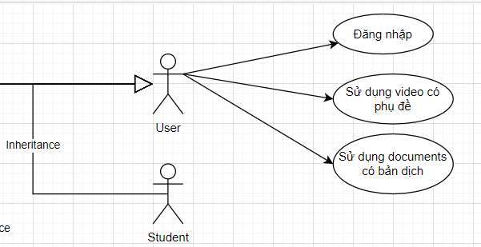
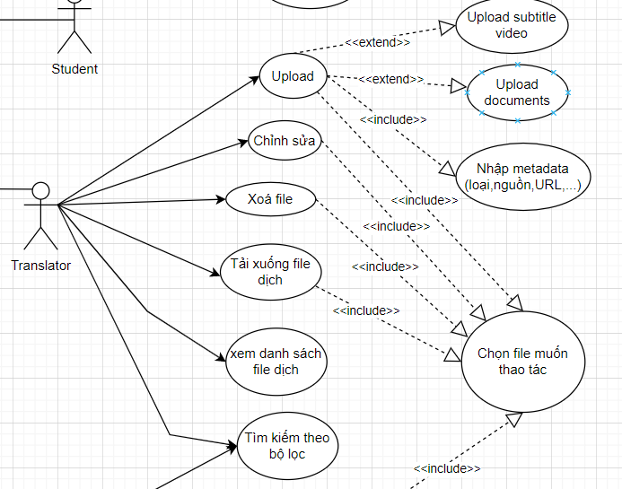
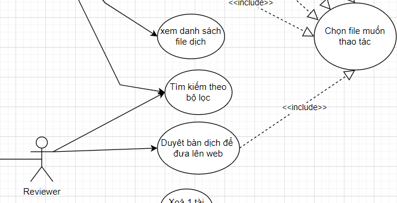
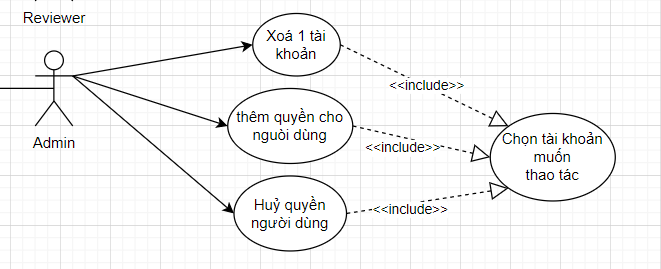
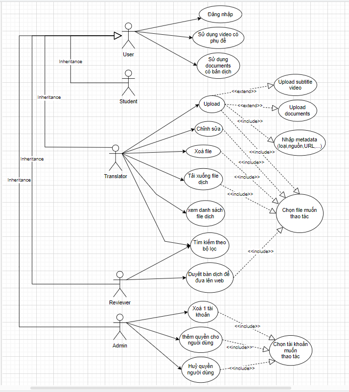
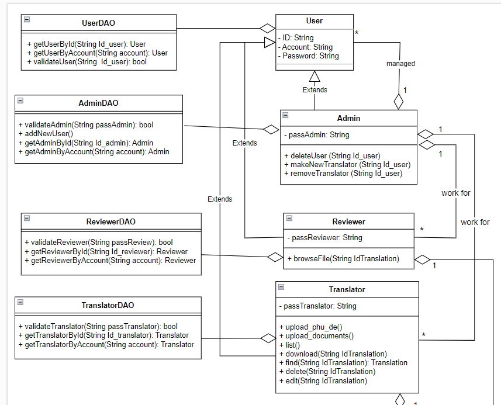
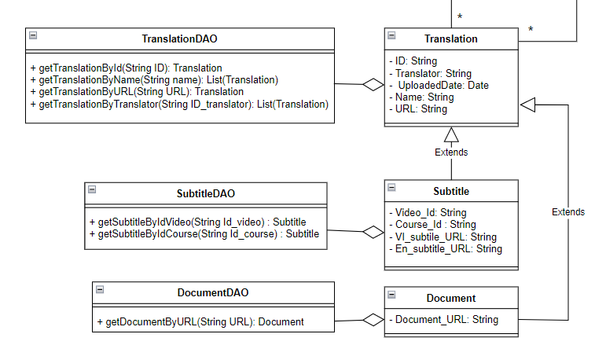
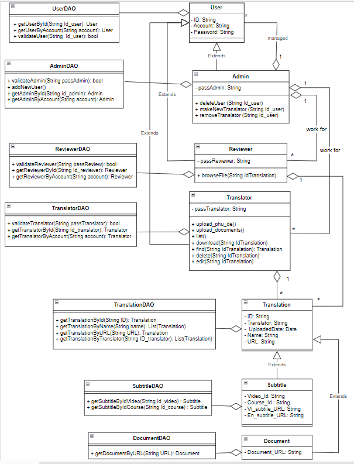
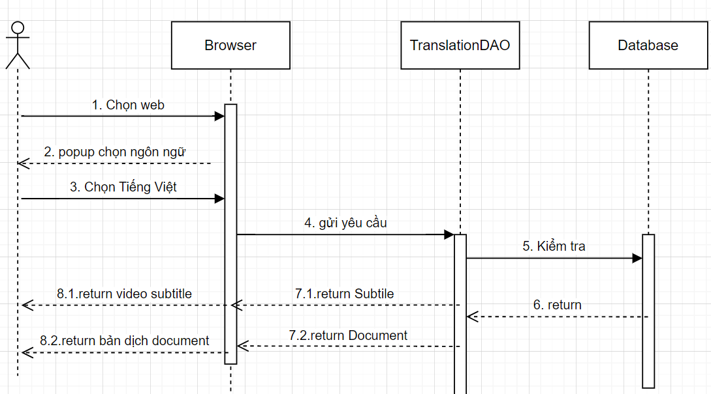
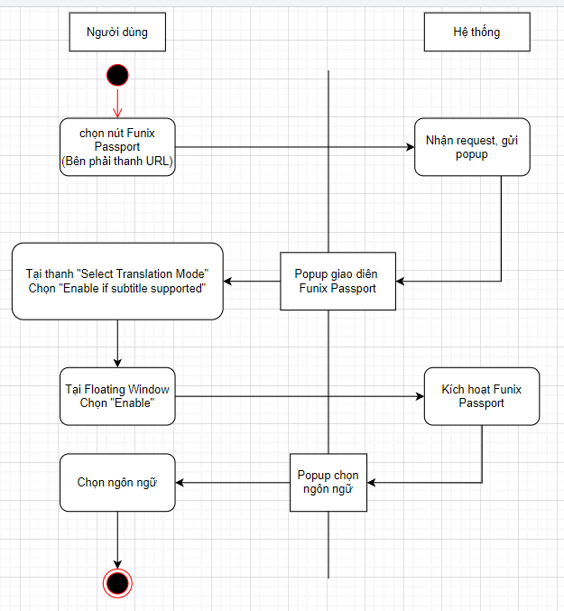

Tài liệu đặc tả yêu cầu

**_FUNiX Passport_**

Revision History

**Date** **Version** **Description** **Author**

\<04/20/23\> \<1.0\> SRS 1.0 Thuan

---

Bảng thuật ngữ

Cấu hình | Nó có nghĩa là một sản phẩm có sẵn / Được chọn từ một danh mục có thể được tùy chỉnh.

+--------+-------------------------------------------------------------------------------------+

    MOOC | Massive Open Online Courses

---

Table of Contents

**[Giới thiệu tổng quan về dự án](#giới-thiệu-tổng-quan-về-dự-án)
[4](#giới-thiệu-tổng-quan-về-dự-án)**

> [Tóm tắt dự án](#tóm-tắt-dự-án) 4
>
> [Phạm vi của dự án](#phạm-vi-của-dự-án) 5

**[Yêu cầu và đặc tả dự án](#yêu-cầu-và-đặc-tả-dự-án)** 6

> [Yêu cầu chức năng](#yêu-cầu-chức-năng) 6
>
> [Yêu cầu phi chức năng](#yêu-cầu-phi-chức-năng) 7
>
> [Đặc tả phần mềm](#đặc-tả-phần-mềm) 7

**[Kiến trúc và thiết kế phần mềm](#giới-thiệu)** 8

> [Kiến trúc phần mềm](#kiến-trúc-phần-mềm) 8
>
> [Usecase](#usecase) 9
>
> [Usecase của User](#usecase-của-user) 9
>
> [Usecase của Translator](#usecase-của-translator) 10
>
> [Usecase của Reviewer](#usecase-của-admin) 12
>
> [Usecase của Admin](#_heading=h.zz4c0rx7pwn) 13
>
> [Sơ đồ use case tổng quát của hệ thống](#_heading=h.gl7qt5j5mfcw) 14
>
> [Class Diagram](#class-diagram) 18
>
> [Senquence Diagram](#_heading=h.s5lpyvciae7u) 19
>
> [Activity Diagram](#activity-diagram) [20](#activity-diagram)

Tài liệu đặc tả

1.  # Giới thiệu tổng quan về dự án

## Tóm tắt dự án

Tóm tắt lại các thông tin cơ bản về dự án:

- Hệ thống sẽ xây dựng là gì?

> Hệ thống là một phần mềm dịch thuật để tạo subtitle tiếng Việt cho các
> video nước ngoài và dịch các văn bản, tài liệu nước ngoài thành tiếng
> việt.

- Mục đích xây dựng hệ thống là gì? Hệ thống giúp giải quyết cho bài
  toán gì?

Hệ thống giúp cho học viên có thể xem và hiểu các video và tài liệu băng
nước ngoài, giúp việc học tập trở nên dễ dàng hơn.

Hệ thống giúp cho những người kém hoặc không có khả năng hiểu các ngôn
ngữ khác có thể xem tài liệu nhanh chóng hơn, tránh được việc phải sao
chép và dán lại các trang web dịch thuật để xem bản dịch.

- Các mục tiêu để xây dựng dự án là gì?

> +) Phải có tính bảo mật cao, dữ liệu được lưu trữ ở Database an toàn.
> Đồng thời bạn cũng cần các API Key hay Token mới có thể truy cập và
> chỉnh sửa dữ liệu ở Database.
>
> +) Giao diện của hệ thống được xây dựng dễ hiểu, người dùng không cần
> biết quá nhiều về công nghệ cũng có thể sử dụng hệ thống.
>
> \+ ) Extension được xây dựng để sử dụng chủ yếu trên trình duyệt
> Chrome.

## Phạm vi của dự án

Giải thích phạm vi của dự án:

- Phạm vi về dịch vụ

Dịch vụ cung cấp subtitle cho các video giảng dạy thuộc các khoá học của
Funix, các tài liệu của Funix sẽ có bản dịch thay cho tài liệu nước
ngoài.

Ngoài ra các trang web thuộc MOOC cũng có thể có bản dịch.

- Phạm vi về khách hàng

Khách hàng sử dụng được phần mềm này là student, mentor, hannah, ...
những người học và làm việc tại Funix. Khách hàng sẽ được chia làm 4
nhóm chính:

    - Nhóm student

    - Nhóm translator

    - Nhóm reviewer

    - Nhóm admin

- Phạm vi về nền tảng/hệ thống

Hệ thống được xây dựng để sử dụng chủ yếu trên trình duyệt Chrome.

### Tính bảo mật

- Sử dụng mã hoá HTTPS để bảo mật tất cả quá trình học và làm việc của
  các nhóm người dùng

- Các file dịch được lưu trữ và mã hoá ở Databases

- Chỉ những người học và làm việc ở các bộ phận của Funix, có tài
  khoản chính thức mới có thể sử dụng phần mềm này.

- Nhóm student chỉ có thể lựa chọn xem có sử dụng bản dịch hay không,
  không được truy cập vào nguồn của bản dịch.

- Nhóm translator được phép truy cập, chỉnh sửa bản dịch gốc ở
  Databases.

- Nhóm reviewer được phép truy cập, đọc và duyệt các bản dịch của
  translator để chính thức đưa file lên các web đó.

- Nhóm admin có quyền xoá, phân quyền các nhóm người dùng còn lại.

### Tính sẵn sàng và khả năng đáp ứng

- Hệ thống luôn sẵn sàng đưa ra popup cho người dùng lựa chọn bản dịch
  nếu web đó được hỗ trợ dịch.

- Hệ thống làm việc 24/7, sẵn sàng đáp ứng khi người dùng cần xem bản
  dịch

- Hệ thống sẵn sàng cho các nhóm người làm việc xử lí ở bất kì thời
  điểm nào

### Hiệu suất

- Hệ thống sẵn sàng tiếp nhận 100000 người hoạt động cùng một lúc

- Thời gian hiển thị bản dịch từ khi student vào website không quá 1s.

- Thời gian để submit và thực hiện các thao tác của Translator cũng
  cần phải có tốc độ xử lý nhanh, trung bình mỗi thao tác không được
  quá** 0.5s**.

2.  # Yêu cầu và đặc tả dự án

    1.  ## Yêu cầu chức năng

- Người dùng đăng nhập vào hệ thống.

- Đối với student, nhóm người dùng này lựa chọn có kích hoạt phần mềm
  hay không.Chọn bằng cách nhấn biểu tượng cạnh thanh URL. Nếu có thì
  sẽ hiện ra popup ở mỗi trang web hay video được hỗ trợ và chọn ngôn
  ngữ muốn sử dụng. Còn nếu không thì sẽ để file gốc.

- Đối với translator, nhóm người dùng này sẽ có thêm các chức năng:
  upload file dịch, xem danh sách file dịch, tải xuống file dịch, tìm
  kiếm, xoá file, chỉnh sửa file

- Đối với admin, nhóm người dùng này có thể xoá tài khoản của người
  dùng bất kì, phân quyền cho những người dùng khác.

- Đối với reviewer, nhóm người dùng này có thể xem bản dịch, duyệt và
  hiển thị bản dịch lên web chính.

  2.  ## Yêu cầu phi chức năng

- Thời gian hiển thị bản dịch từ khi student vào website không quá 1s.

- Thời gian để submit và thực hiện các thao tác của Translator cũng
  cần phải có tốc độ xử lý nhanh, trung bình mỗi thao tác không được
  quá** 0.5s**.

- Hệ thống làm việc 24/7, sẵn sàng đáp ứng khi người dùng cần xem bản
  dịch

- Hệ thống sẵn sàng cho các nhóm người làm việc xử lí ở bất kì thời
  điểm nào

- Hệ thống sẵn sàng tiếp nhận 100000 người hoạt động cùng một lúc

3.  # Đặc tả phần mềm

**Giới thiệu**

> Mục đích của phần mềm này là tạo ra các tài liệu và video có thể xem
> và hiểu bằng ngôn ngữ Việt. Đối tượng của phần mềm này là những người
> dùng học và làm việc tại Funix và các bên liên quan.

**Tổng quan về sản phẩm**

- Phần mềm cho phép nhóm student sử dụng để dịch thuật các trang web
  được phần mềm hỗ trợ dịch.

- Phần mềm cho phép nhóm translator, reviewer quản lí các file dịch

- Phần mềm cho phép nhóm Admin quản lí người dùng.

**Yêu cầu chức năng**

- **Quản lý người dùng**: Phần mềm cung cấp tính năng đăng kí và đăng
  nhập cho người dùng. Nhóm admin được phép xoá và phân quyền cho các
  nhóm người dùng còn lại.

- **Quản lý bản dịch**: Các bản dịch được xử lí bởi nhóm translator và
  nhóm reviewer

- **Sử dụng phần mềm**: Tất cả nhóm người dùng được lựa chọn xem có sử
  dụng phần mềm hay không. Sau đó sẽ có bản dịch tương ứng cho mỗi
  trang web

**Yêu cầu phi chức năng**

- **Hiệu suất**: Load các bản dịch không quá 1s, thao tác của Backend
  không quá 0,5s

- **Bảo mật**: Sử dụng mã hóa HTTPS để bảo mật tất cả quá trình truyền
  dữ liệu giữa người dùng và máy chủ, xác thực tài khoản,những người có
  quyền cụ thể mới được phép truy cập bản dịch gốc.

- **Khả năng mở rộng**: Có thể đáp ứng được 100000 người sử dụng cùng
  một lúc

**Giả định và ràng buộc**

- **Trình duyệt hoạt động**: Phần mềm được xây dựng và chạy trên trình
  duyệt Chrome.

- **Ngân sách**: Không vượt quá 200.000.000 VNĐ

- **Thời gian**: Phát triển trong vòng 6 tháng

**Tiêu chí chấp nhận**

- Người dùng có thể đăng kí và đăng nhập.

- Tất cả các nhóm người dùng có thể xem bản dịch.

- Nhóm translator có thể điều chỉnh bản dịch

- Nhóm reviewer có thể đăng bản dịch

- Nhóm admin có thể điều chỉnh quyền cho các nhóm còn lại.

4.  # Kiến trúc và thiết kế phần mềm

    1.  ## Kiến trúc phần mềm

Đối với phần mềm này, dựa và cách hoạt động thì kiến trúc hợp lí nhất là
server- client

Lí do :

- Khi người dùng chọn sử dụng phần mềm, phần mở rộng sẽ trích xuất url
  để lấy thông tin của web, gửi request đến Server.

- Tại đây Server sẽ tìm subtitle hoặc bản dịch tương ứng, sau đó gửi
  lại web

  2.  ## Usecase

  ### Usecase của User

                                            +--------------+-------------------------------------------------------+
                                            | Use Case     | UC1: Đăng nhập                                        |
                                            | Name         |                                                       |
                                            +--------------+-------------------------------------------------------+
                                            |   Mô tả      | - User có thể đăng nhập tài khoản vào hê thống và sử  |
                                            |              | dụng các chức năng chung là xem video có subtitle     |
                                            |              | hoặc xem các documents có bản dịch.                   |
                                            |              |                                                       |
                                            |              | - Các nhóm người dùng đều là phần mở rộng của user.   |
                                            |              |                                                       |
                                            |              | - Student là 1 User.                                  |
                                            +--------------+-------------------------------------------------------+
                                            | Điều kiện    | User chưa đăng nhập vào hệ thống                      |
                                            |              |                                                       |
                                            +--------------+-------------------------------------------------------+
                                            | Luồng chính  | 1\. User truy cập vào trang web quản lý. Nhấn vào mục |
                                            |              | "Login\"                                              |
                                            |              |                                                       |
                                            |              | 2\. Hệ thống hiển thị Form Login.                     |
                                            |              |                                                       |
                                            |              | 3\. User nhập vào các thông tin đăng nhập.            |
                                            |              |                                                       |
                                            |              | 4\. Nếu thông tin đăng nhập đúng, cập nhật thông tin  |
                                            |              | vào hệ thống.                                         |
                                            +--------------+-------------------------------------------------------+
                                            |   Luồng phụ  | Ở bước 4, nếu thông tin đăng nhập sai sẽ hiển thị     |
                                            |              | thông báo cho người dùng.                             |
                                            +--------------+-------------------------------------------------------+

### Usecase của Translator

                                            +--------------+-------------------------------------------------------+
                                            | Use Case     | UC2: Các chức năng của Translator                     |
                                            | Name         |                                                       |
                                            +--------------+-------------------------------------------------------+
                                            | Mô tả        | Sau khi đăng nhập, Tranlator có thể thực hiện một vài |
                                            |              | chức năng để tạo ra các subtitle hoặc bản dịch        |
                                            +--------------+-------------------------------------------------------+
                                            | Điều         | User đăng nhập hệ thống và chưa xác thực tài khoản    |
                                            | kiện         | Translator                                            |
                                            +--------------+-------------------------------------------------------+
                                            | Luồng        | 1\. User đăng nhập và xác nhận là Translator          |
                                            | chính        |                                                       |
                                            |              | 2\. Hệ thống hiển thị các chức năng của translator để |
                                            |              | tuỳ chọn                                              |
                                            |              |                                                       |
                                            |              | \- Chức năng upload subtitle                          |
                                            |              |                                                       |
                                            |              | \- Chức năng upload documents có file dịch            |
                                            |              |                                                       |
                                            |              | \- Chức năng xem danh sách file dịch thuật            |
                                            |              |                                                       |
                                            |              | \- Chức năng tải xuống file đã dịch                   |
                                            |              |                                                       |
                                            |              | \- Chức năng tìm kiếm theo bộ lọc                     |
                                            |              |                                                       |
                                            |              | \- Chức năng xoá file dịch                            |
                                            |              |                                                       |
                                            |              | \- Chức năng chỉnh sửa thông tin file                 |
                                            |              |                                                       |
                                            |              | 3\. User chọn một trong các chức năng trên để thao    |
                                            |              | tác với file gốc                                      |
                                            +--------------+-------------------------------------------------------+
                                            | Luồng        | Sẽ có thông báo không tìm thấy vide hoặc tài liệu khi |
                                            | phụ          | tìm các file tương ở bước 2                           |
                                            +--------------+-------------------------------------------------------+

### Usecase của Reviewer

                                            +--------------+-------------------------------------------------------+
                                            | Use Case     | UC3: Chức năng của Reviewer                           |
                                            | Name         |                                                       |
                                            +--------------+-------------------------------------------------------+
                                            |   Mô tả      | Sau khi đăng nhập, reviewer có thể tìm và xem các     |
                                            |              | video có subtitle hoặc các documents có bản dịch để   |
                                            |              | xem.                                                  |
                                            |              |                                                       |
                                            |              | Reviewer có thể chọn các bài thoả mãn, duyệt các bài  |
                                            |              | đó để hiện lên web chính.                             |
                                            +--------------+-------------------------------------------------------+
                                            | Điều         | User đăng nhập hệ thống và chưa xác thực tài khoản    |
                                            | kiện         | Reviewer.                                             |
                                            +--------------+-------------------------------------------------------+
                                            | Luồng        | 1\. User đăng nhập và xác nhận là Reviewer            |
                                            | chính        |                                                       |
                                            |              | 2\. Tìm kiếm bài dịch ( chức năng tìm kiếm giống như  |
                                            |              | Translator )                                          |
                                            |              |                                                       |
                                            |              | 3\. Đọc và duyệt các bài dịch để có thể hiện lên web  |
                                            |              | chính                                                 |
                                            +--------------+-------------------------------------------------------+
                                            | Luồng phụ    | Ở bước 2, nếu không có file dịch thì sẽ hiện thông    |
                                            |              | báo không tồn tại file dịch.                          |
                                            +--------------+-------------------------------------------------------+

### Usecase của Admin

                                            +--------------+-------------------------------------------------------+
                                            | Use Case     | UC4: Chức năng của admin                              |
                                            | Name         |                                                       |
                                            +--------------+-------------------------------------------------------+
                                            | Mô tả        | Sau khu đăng nhập, admin có quyền điều chỉnh các nhóm |
                                            |              | người còn lại.                                        |
                                            +--------------+-------------------------------------------------------+
                                            | Điều         | User đăng nhập hệ thống và chưa xác thực tài khoản    |
                                            | kiện         | Admin                                                 |
                                            +--------------+-------------------------------------------------------+
                                            | Luồng        | 1. User đăng nhập và xác nhận là Admin                |
                                            | chính        |                                                       |
                                            |              | 2. Lựa chọn xoá hoặc điều chỉnh quyền cho người dùng  |
                                            +--------------+-------------------------------------------------------+
                                            | Luồng        | Ở bước 2, nếu không tìm thấy người dùng sẽ có thông   |
                                            | phụ          | báo                                                   |
                                            +--------------+-------------------------------------------------------+

## 4. Sơ đồ tổng quát của hệ thống

## 4.1 Sơ đồ use case tổng quát của hệ thống

**Hình 2 Sơ đồ use case tổng quát**

## Class Diagram

Class User, Admin, Translator, Reviewer và các DAO tương ứng:

Class Translation, Subtitle, Document và các DAO tướng ứng

Class Diagram:

## Senquence Diagram

Bạn vẽ Senquence Diagram cho hoạt động kiểm tra và hiển thị bản dịch của
Extension.

## Activity Diagram

Tiếp theo, bạn sẽ cần vẽ Activity Diagram cho thao tác bật mở Extension
của học viên.

