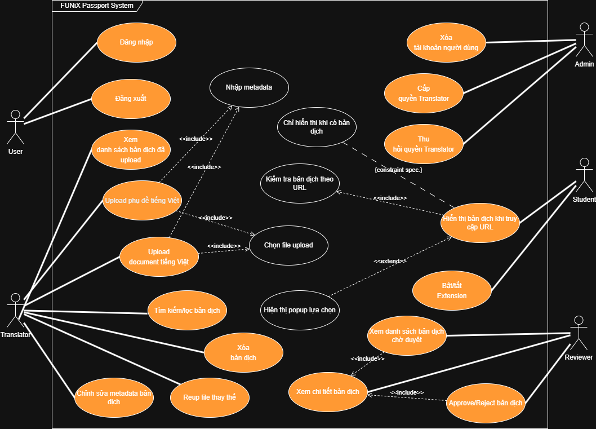
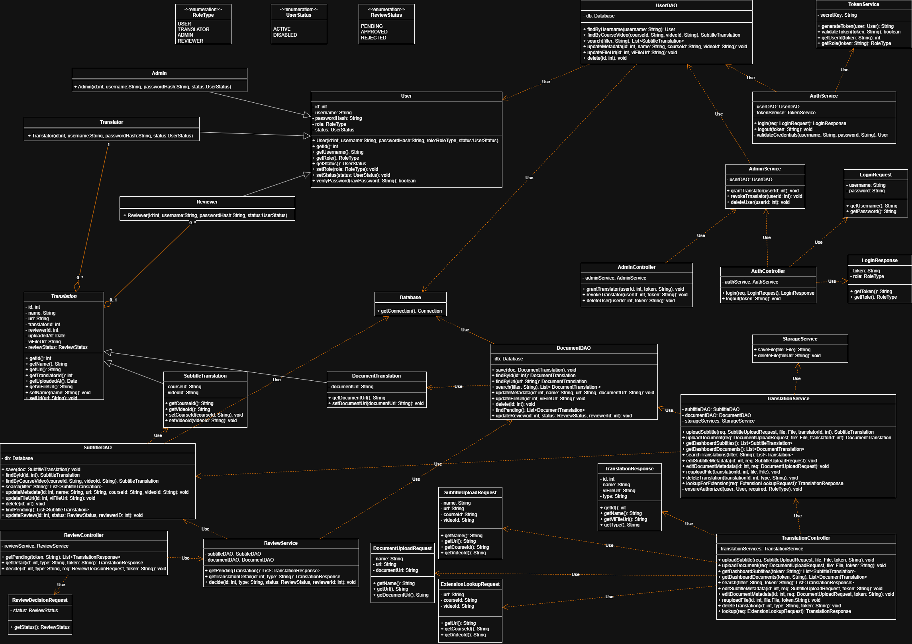
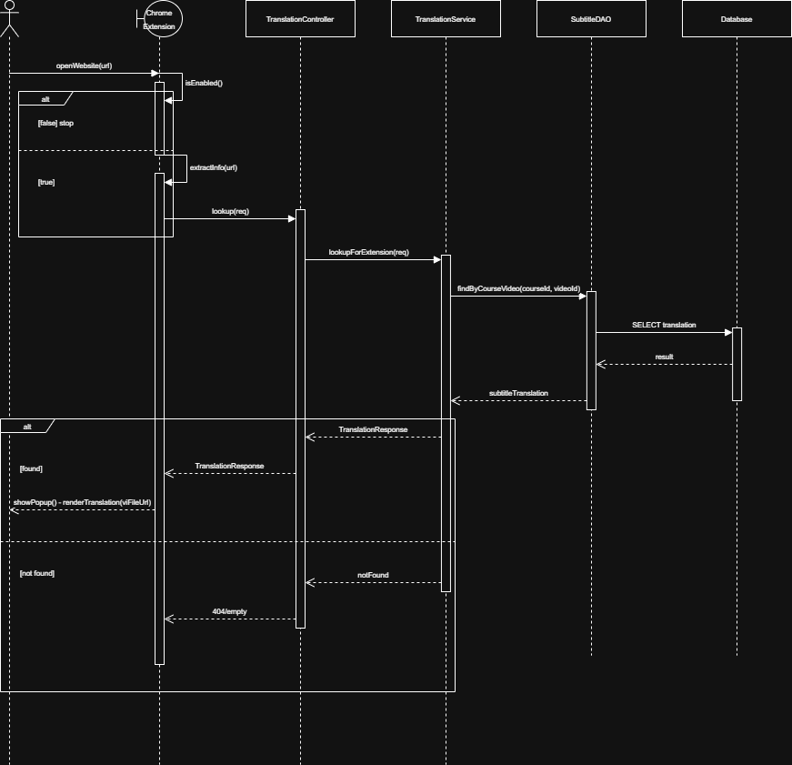
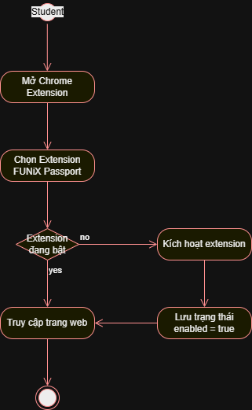

# Tài liệu đặc tả yêu cầu

***FUNiX Passport***

## Revision History

| Date | Version | Description | Author |
|------|---------|-------------|--------|
| 01/17/26 | 1.0 | SRS 1.0 | Luan Nguyen |

## Bảng thuật ngữ

Cung cấp tổng quan về bất kỳ định nghĩa nào mà người đọc nên hiểu trước khi đọc tiếp.

| Thuật ngữ | Định nghĩa |
|-----------|------------|
| Cấu hình | Nó có nghĩa là một sản phẩm có sẵn / Được chọn từ một danh mục có thể được tùy chỉnh. |
| FAQ | Frequently Asked Questions |
| CRM | Customer Relationship Management |
| RAID 5 | Redundant Array of Inexpensive Disk/Drives |

## Table of Contents

- [Giới thiệu tổng quan về dự án](#1-giới-thiệu-tổng-quan-về-dự-án)
  - [Tóm tắt dự án](#11-tóm-tắt-dự-án)
  - [Phạm vi của dự án](#12-phạm-vi-của-dự-án)
- [Yêu cầu và đặc tả dự án](#2-yêu-cầu-và-đặc-tả-dự-án)
  - [Yêu cầu chức năng](#21-yêu-cầu-chức-năng)
  - [Yêu cầu phi chức năng](#22-yêu-cầu-phi-chức-năng)
  - [Đặc tả phần mềm](#23-đặc-tả-phần-mềm)
- [Kiến trúc và thiết kế phần mềm](#3-kiến-trúc-và-thiết-kế-phần-mềm)
  - [Kiến trúc phần mềm](#31-kiến-trúc-phần-mềm)
  - [Usecase](#32-usecase)
  - [Sơ đồ use case tổng quát của hệ thống](#33-sơ-đồ-use-case-tổng-quát-của-hệ-thống)
  - [Class Diagram](#34-class-diagram)
  - [Sequence Diagram](#35-sequence-diagram)
  - [Activity Diagram](#36-activity-diagram)

---

# Tài liệu đặc tả

## 1. Giới thiệu tổng quan về dự án

### 1.1. Tóm tắt dự án

FUNiX Passport là một hệ thống gồm 2 thành phần:

- **Backend** để quản lý dữ liệu bản dịch và hỗ trợ dịch thuật viên upload/phân quyền;
- **Chrome Extension** để giao tiếp với Backend, lấy bản dịch (phụ đề/tài liệu) và hiển thị cho học viên khi truy cập website.

Hệ thống được xây dựng nhằm giúp học viên xem được nội dung tiếng Việt (phụ đề video MOOC hoặc tài liệu), từ đó dễ nắm bắt kiến thức hơn so với việc chỉ xem phụ đề tiếng Anh sẵn có. Đồng thời, hệ thống tạo một nơi tập trung để dịch thuật viên và quản trị viên quản lý dữ liệu dịch thuật (upload, tìm kiếm, chỉnh sửa, xóa, tải xuống).

**Các mục tiêu để xây dựng dự án gồm:**

a. **Bảo mật cao**: dữ liệu lưu an toàn trong Database; truy cập/chỉnh sửa DB cần API Key/Token theo quyền.

b. **Hiệu năng ổn định**: thời gian hiển thị bản dịch từ lúc học viên vào website <= 1s.

c. **Tốc độ thao tác Translator nhanh**: submit và các thao tác quản lý bản dịch trung bình <= 0.5s/thao tác.

d. **Dễ sử dụng**: giao diện đơn giản, người dùng không cần biết nhiều về công nghệ vẫn dùng được.

e. **Tập trung nền tảng Chrome**: Extension được xây dựng để dùng chủ yếu trên trình duyệt Chrome.

### 1.2. Phạm vi của dự án

#### I. Phạm vi dịch vụ

a. **Cung cấp chức năng quản lý bản dịch và người dùng**

- **User**: đăng nhập, đăng xuất.
- **Translator**: upload phụ đề tiếng Việt cho video MOOC, upload document tiếng Việt, xem dashboard (phụ đề và document), tải xuống, tìm kiếm theo bộ lọc, xóa, chỉnh sửa metadata và reup file thay thế.
- **Admin**: xóa tài khoản, cấp quyền Translator, thu hồi quyền Translator.
- **Reviewer**: đánh giá, phê duyệt bản dịch từ phía Translator

b. **Chrome Extension**

- Khi vào web, trích xuất URL, nếu là MOOC thì lấy course_id và video_id để tìm phụ đề; còn lại dùng URL để tìm document, gửi request lên Backend, nếu có bản dịch thì hiển thị và cho phép bật/tắt extension.

#### II. Phạm vi khách hàng

a. **Học viên (Student)**: người sử dụng Chrome Extension để xem bản dịch tiếng Việt khi học trên website.

b. **Dịch thuật viên (Translator)**: upload và quản lý bản dịch (phụ đề/document).

c. **Quản trị viên (Admin)**: quản lý tài khoản và phân quyền người dùng.

d. **Kiểm duyệt viên (Reviewer)**: duyệt bản dịch để gắn nhãn APPROVED.

#### III. Phạm vi nền tảng/hệ thống

a. **Frontend:** Web portal cho Translator/Admin + Chrome Extension cho Student (ưu tiên chạy trên Chrome).

b. **Backend**: Server cung cấp API, xác thực bằng token/API để thao tác với dữ liệu.

c. **Database**: Lưu trữ bản dịch và metadata (ID/Translator/URL/video_id/course_id/etc.).

---

## 2. Yêu cầu và đặc tả dự án

### 2.1. Yêu cầu chức năng

#### I. Nhóm User

- **FR-01 (User) -- Đăng nhập**: Hệ thống phải cho phép User đăng nhập vào hệ thống bằng thông tin tài khoản hợp lệ.
- **FR-02 (User) -- Đăng xuất**: Hệ thống phải cho phép User đăng xuất khỏi hệ thống.

#### II. Nhóm Translator

- **FR-03 (Translator) -- Upload phụ đề tiếng Việt cho video MOOC**: Translator có thể vào màn hình upload, nhập các thông tin (tên video, url video, course ID, video ID), đính kèm file phụ đề tiếng Việt và submit để hệ thống upload và lưu vào Database.
- **FR-04 (Translator) -- Upload document tiếng Việt**: Translator có thể upload tài liệu đã dịch, cho phép nhập tên bản dịch và URL của document, đính kèm document đã dịch và submit lên hệ thống.
- **FR-05 (Translator) -- Xem danh sách bản dịch đã upload (Dashboard)**: Hệ thống phải có 2 dashboard: 1 dashboard cho bản dịch phụ đề và 1 dashboard cho bản dịch document.
- **FR-06 (Translator) -- Tải xuống bản dịch**: Translator có thể tải file phụ đề/document bằng cách click link trên dashboard.
- **FR-07 (Translator) -- Tìm kiếm bản dịch theo bộ lọc**: Translator có thể tìm kiếm theo các bộ lọc: Tên bản dịch, URL, Người dịch, Course ID, Video ID.
- **FR-08 (Translator) -- Xóa bản dịch**: Sau khi tìm kiếm, Translator có thể chọn xóa bản dịch phụ đề hoặc document.
- **FR-09 (Translator) -- Chỉnh sửa thông tin bản dịch**: Translator có thể chỉnh sửa thông tin bản dịch theo 2 dạng: (1) chỉnh sửa metadata; (2) re-upload file dịch khác để thay thế.

#### III. Nhóm Admin

- **FR-10 (Admin) -- Xóa tài khoản người dùng**: Admin có thể xóa tài khoản của một User/Translator.
- **FR-11 (Admin) -- Cấp quyền Translator**: Admin có thể thêm quyền cho một người dùng (chuyển User thành Translator).
- **FR-12 (Admin) -- Thu hồi quyền Translator**: Admin có thể xóa quyền (chuyển Translator thành User).

#### IV. Nhóm Student/Extension

- **FR-13 (Student/Extension) -- Trích xuất thông tin trang web**: Khi Student truy cập một trang web, Extension phải trích xuất URL và suy ra các thông tin như video_id/course_id (nếu là nguồn MOOC).
- **FR-14 (Student/Extension) -- Gửi request tìm bản dịch lên Backend:**
  - Nếu là trang MOOC: gửi course_id và video_id để tìm phụ đề.
  - Nếu không: gửi toàn bộ URL để tìm bản dịch document.
- **FR-15 (Student/Extension) -- Nhận phản hồi & hiển thị bản dịch**: Backend trả về dữ liệu bản dịch (nếu có và ở trạng thái APPROVED); Extension hiển thị popup để người dùng chọn có dịch hay không; nếu đồng ý thì hiển thị bản dịch cho người dùng.
- **FR-16 (Student/Extension) -- Bật/tắt Extension**: Extension phải có tùy chọn cài đặt để bật/tắt khi sử dụng.

#### V. Nhóm Reviewer

- **UC-R01 -- Xem danh sách bản dịch chờ duyệt**: Review các bản dịch đang ở trạng thái PENDING.
- **UC-R02 -- Xem chi tiết bản dịch**: Xem metadata + xem/nội dung file bản dịch.
- **UC-R03 -- Chuyển trạng thái bản dịch Approve/Reject**: Đồng ý hiển thị bản dịch cho user hoặc từ chối.

### 2.2. Yêu cầu phi chức năng

#### 2.2.1. Tính bảo mật

- Hệ thống phải đảm bảo dữ liệu bản dịch được lưu trữ an toàn trong Database.
- Các thao tác truy cập/chỉnh sửa dữ liệu Database thông qua Backend phải yêu cầu API Key hoặc Token hợp lệ.
- Hệ thống phải kiểm soát quyền theo vai trò (User/Translator/Admin/Reviewer): User chỉ đăng nhập/đăng xuất; Translator quản lý bản dịch; Admin quản lý tài khoản & phân quyền; Reviewer xem danh sách các bản dịch và gắn nhãn sau khi review.

#### 2.2.2. Tính sẵn sàng và khả năng đáp ứng

- Backend và Extension cần hoạt động ổn định, hỗ trợ người dùng truy cập và sử dụng ở nhiều thời điểm khác nhau.
- Các chức năng xem/tải/tìm kiếm/chỉnh sửa bản dịch cần phản hồi nhất quán, không phụ thuộc thời gian truy cập.

#### 2.2.3. Hiệu suất

- Thời gian hiển thị bản dịch tính từ khi học viên vào website không quá 1 giây.
- Thời gian submit và thực hiện các thao tác của Translator có tốc độ xử lý nhanh, trung bình mỗi thao tác không quá 0.5 giây.
- Extension được xây dựng để sử dụng chủ yếu trên trình duyệt Chrome.

### 2.3. Đặc tả phần mềm

#### I. Đặc tả Metadata lưu trong Database

a. **Bản dịch cho Video (Subtitle)** -- các trường dữ liệu:

- ID (tự động tạo)
- Translator (tự động tạo)
- Reviewer (tự động cập nhật)
- UploadedDate (tự động tạo)
- Name
- URL
- VideoID
- CourseID
- VISubtitleURL
- ReviewStatus

b. **Bản dịch cho Document** -- các trường dữ liệu:

- ID (tự động tạo)
- Translator (tự động tạo)
- Reviewer (tự động cập nhật)
- UploadedDate (tự động tạo)
- Name
- URL
- DocumentURL
- ReviewStatus

#### II. Đặc tả luồng dữ liệu Extension ↔ Backend (đầu vào/đầu ra)

a. **Input từ Extension:**

- MOOC page: course_id + video_id
- Non-MOOC page: full URL

b. **Output từ Backend:** metadata bản dịch + đường dẫn đến file dịch (nếu tồn tại) để Extension hiển thị.

---

## 3. Kiến trúc và thiết kế phần mềm

### 3.1. Kiến trúc phần mềm

#### I. Mô tả kiến trúc và các thành phần

a. **Presentation layer (Client)**

- Chrome Extension (Student): phát hiện URL trang web (và course_id/video_id nếu là trang MOOC), hiển thị popup lựa chọn, render bản dịch.
- Web Portal (Translator/Admin): giao diện đăng nhập và các chức năng upload/tìm kiếm/chỉnh sửa/xóa/tải bản dịch, quản lý tài khoản và phân quyền.

b. **Business layer (Backend API)**

- Xác thực/Phân quyền theo role (User/Translator/Admin) bằng Token/API Key.
- Nghiệp vụ quản lý bản dịch: upload subtitle/document, search/filter, edit metadata, re-upload file thay thế, delete, download.
- Nghiệp vụ phục vụ Extension: tra cứu bản dịch theo course_id/video_id/URL.

c. **Data layer**

- Database: lưu metadata bản dịch (id, translator, uploadedDate, name, url, courseID, videoID, URL).
- File Storage: lưu trữ file phụ đề/document, database lưu đường dẫn file.

#### II. Luồng hoạt động chính

a. Student truy cập website → Extension đọc URL/(course_id, video_id nếu là MOOC).

b. Extension gọi Backend API để tra cứu bản dịch.

c. Backend query Database → trả metadata + fileUrl (nếu có).

d. Extension hiển thị popup → nếu người dùng đồng ý thì tải file và render bản dịch.

e. Translator/Admin thao tác trên Portal → Portal gọi Backend → Backend đọc/ghi DB và Storage.

#### III. Ưu điểm của kiến trúc

- Phù hợp bài toán CRUD + tra cứu nhanh: hệ thống chủ yếu upload/quản lý/tra cứu/hiển thị, Layered đơn giản và dễ triển khai.
- Đáp ứng bảo mật: mọi truy cập dữ liệu đi qua Backend (Token/RBAC), client không truy cập DB trực tiếp.
- Đáp ứng hiệu năng: tra cứu theo (course_id, video_id) hoặc URL dễ tối ưu bằng index/caching.

### 3.2. Usecase

#### Usecase của User

| Field | UC-U01 - Đăng nhập |
|-------|-------------------|
| **Use Case Name** | UC-U01 - Đăng nhập |
| **Mô tả** | User có thể đăng nhập tài khoản vào hệ thống và sử dụng các chức năng trong đó. |
| **Điều kiện** | User chưa đăng nhập vào hệ thống |
| **Luồng chính** | 1. User truy cập vào trang web quản lý. Nhấn vào mục "Login" 2. Hệ thống hiển thị Form Login. 3. User nhập vào các thông tin đăng nhập. 4. Nếu thông tin đăng nhập đúng, cập nhật thông tin vào hệ thống. |
| **Luồng phụ** | Ở bước 4, nếu thông tin đăng nhập sai sẽ hiển thị thông báo cho người dùng. |

| Field | UC-U02 - Đăng xuất |
|-------|-------------------|
| **Use Case Name** | UC-U02 - Đăng xuất |
| **Mô tả** | User đăng xuất khỏi hệ thống để kết thúc phiên làm việc. |
| **Điều kiện** | User đang đăng nhập. |
| **Luồng chính** | 1. User nhấn "Logout". 2. Hệ thống hủy token/session. 3. Hệ thống đưa user về màn hình Login. |
| **Luồng phụ** | (2a) Mất kết nối → hệ thống vẫn xóa session phía client và yêu cầu đăng nhập lại khi truy cập. |

#### Usecase của Translator

| Field | UC-T01 - Upload phụ đề tiếng Việt |
|-------|----------------------------------|
| **Use Case Name** | UC-T01 - Upload phụ đề tiếng Việt |
| **Mô tả** | Upload file phụ đề đã dịch tiếng Việt |
| **Điều kiện** | Translator upload file phụ đề tiếng Việt cho video MOOC kèm metadata để hệ thống lưu trữ và cung cấp cho Extension. |
| **Luồng chính** | 1. Translator mở màn hình "Upload Subtitle". 2. Translator nhập metadata: Tên video, URL video, Course ID, Video ID. 3. Translator chọn file phụ đề tiếng Việt (SRT/VTT). 4. Translator nhấn "Submit". 5. Hệ thống kiểm tra hợp lệ metadata và định dạng file. 6. Hệ thống lưu metadata vào Database và lưu file lên Storage. 7. Hệ thống tự tạo ID, Translator, UploadedDate. 8. Hệ thống thông báo upload thành công và hiển thị bản ghi trên Dashboard Subtitle. |
| **Luồng phụ** | (5a) Thiếu/sai metadata → thông báo lỗi và yêu cầu bổ sung. (5b) File sai định dạng / quá dung lượng → thông báo lỗi. (6a) Lỗi upload/mạng lỗi → thông báo thất bại và cho phép thử lại. |

| Field | UC-T02 - Upload Document tiếng Việt |
|-------|-------------------------------------|
| **Use Case Name** | UC-T02 - Upload Document tiếng Việt |
| **Mô tả** | Translator upload tài liệu tiếng Việt kèm metadata để hệ thống lưu trữ và cung cấp bản dịch. |
| **Điều kiện** | Translator đã đăng nhập. |
| **Luồng chính** | 1. Translator mở màn hình "Upload Document". 2. Translator nhập metadata: Tên bản dịch, URL, DocumentURL. 3. Translator chọn file tài liệu (PDF/DOCX). 4. Translator nhấn "Submit". 5. Hệ thống kiểm tra hợp lệ. 6. Hệ thống lưu metadata + file và hiển thị trên Dashboard Document. |
| **Luồng phụ** | File sai định dạng/quá dung lượng → báo lỗi. Upload lỗi → báo lỗi và cho thử lại. |

| Field | UC-T03 - Tìm kiếm/Lọc bản dịch |
|-------|-------------------------------|
| **Use Case Name** | UC-T03 - Tìm kiếm/Lọc bản dịch |
| **Mô tả** | Translator tìm kiếm bản dịch theo Name, URL, Translator, Course ID, Video ID. |
| **Điều kiện** | Translator đã đăng nhập. |
| **Luồng chính** | 1. Translator mở Dashboard Subtitle/Document. 2. Translator nhập bộ lọc tìm kiếm. 3. Translator nhấn "Search". 4. Hệ thống truy vấn Database và trả danh sách kết quả. 5. Hệ thống hiển thị danh sách kết quả (có phân trang nếu cần). |
| **Luồng phụ** | Không có kết quả → hiển thị danh sách rỗng. |

| Field | UC-T04 - Chỉnh sửa metadata bản dịch |
|-------|-------------------------------------|
| **Use Case Name** | UC-T04 - Chỉnh sửa metadata bản dịch |
| **Mô tả** | Translator chỉnh sửa thông tin metadata của bản dịch (không thay file). |
| **Điều kiện** | Translator đã đăng nhập và bản dịch tồn tại. |
| **Luồng chính** | 1. Translator chọn bản dịch trên Dashboard. 2. Translator nhấn "Edit metadata". 3. Hệ thống hiển thị form metadata hiện tại. 4. Translator chỉnh sửa và nhấn "Save". 5. Hệ thống validate dữ liệu và cập nhật Database. 6. Hệ thống thông báo thành công. |
| **Luồng phụ** | Dữ liệu không hợp lệ → báo lỗi và không lưu. Không đủ quyền (khác owner/role sai) → báo lỗi. |

| Field | UC-T05 - Reupload file thay thế |
|-------|--------------------------------|
| **Use Case Name** | UC-T05 - Reupload file thay thế |
| **Mô tả** | Translator thay file phụ đề/document mới cho bản dịch hiện có. |
| **Điều kiện** | Translator đã đăng nhập và bản dịch tồn tại. |
| **Luồng chính** | 1. Translator chọn bản dịch trên Dashboard. 2. Translator nhấn "Reupload". 3. Translator chọn file mới và nhấn "Submit". 4. Hệ thống kiểm tra định dạng/dung lượng. 5. Hệ thống lưu file mới lên Storage và cập nhật đường dẫn file trong Database. 6. Hệ thống thông báo thành công. |
| **Luồng phụ** | File không hợp lệ → báo lỗi. Upload lỗi → báo lỗi và cho thử lại. |

| Field | UC-T06 - Xóa bản dịch |
|-------|----------------------|
| **Use Case Name** | UC-T06 - Xóa bản dịch |
| **Mô tả** | Translator xóa bản dịch khỏi hệ thống. |
| **Điều kiện** | Translator đã đăng nhập và bản dịch tồn tại. |
| **Luồng chính** | 1. Translator chọn bản dịch. 2. Translator nhấn "Delete". 3. Hệ thống yêu cầu xác nhận. 4. Translator xác nhận xóa. 5. Hệ thống xóa metadata (và thu hồi file nếu áp dụng) và cập nhật danh sách. |
| **Luồng phụ** | Translator hủy xác nhận → không xóa. Không đủ quyền → báo lỗi. |

| Field | UC-T07 - Xem danh sách bản dịch đã upload |
|-------|------------------------------------------|
| **Use Case Name** | UC-T07 - Xem danh sách bản dịch đã upload |
| **Mô tả** | Translator xem danh sách các bản dịch mà hệ thống đang lưu để quản lý các thao tác CRUD |
| **Điều kiện** | Translator đã đăng nhập vào hệ thống |
| **Luồng chính** | 1. Translator truy cập Web Portal. 2. Translator chọn mục Dashboard. 3. Hệ thống lấy danh sách bản dịch từ database theo thể loại (Subtitle/Document). 4. Hệ thống hiển thị danh sách theo bảng. |
| **Luồng phụ** | Không có bản dịch, hệ thống hiển thị danh sách rỗng. Lỗi kết nối, hệ thống hiển thị thông báo và cho phép tải lại trang. |

#### Usecase của Admin

| Field | UC-A01 - Cấp quyền Translator |
|-------|------------------------------|
| **Use Case Name** | UC-A01 - Cấp quyền Translator |
| **Mô tả** | Admin chuyển role của user từ User → Translator. |
| **Điều kiện** | Admin đã đăng nhập. |
| **Luồng chính** | 1. Admin mở trang quản lý người dùng. 2. Admin tìm user theo username/email. 3. Admin chọn "Grant Translator". 4. Hệ thống cập nhật role trong Database. 5. Hệ thống thông báo thành công. |
| **Luồng phụ** | User không tồn tại → báo lỗi. |

| Field | UC-A02 - Thu hồi quyền Translator |
|-------|----------------------------------|
| **Use Case Name** | UC-A02 - Thu hồi quyền Translator |
| **Mô tả** | Admin chuyển role từ Translator → User. |
| **Điều kiện** | Admin đã đăng nhập. |
| **Luồng chính** | 1. Admin tìm translator cần thu hồi. 2. Admin chọn "Revoke Translator". 3. Hệ thống cập nhật role trong Database. 4. Hệ thống thông báo thành công. |
| **Luồng phụ** | Không cho thu hồi quyền Admin → báo lỗi. |

| Field | UC-A03 - Xóa tài khoản người dùng |
|-------|----------------------------------|
| **Use Case Name** | UC-A03 - Xóa tài khoản người dùng |
| **Mô tả** | Admin xóa/khóa tài khoản của user khỏi hệ thống. |
| **Điều kiện** | Admin đã đăng nhập. |
| **Luồng chính** | 1. Admin chọn user. 2. Admin nhấn "Delete user". 3. Hệ thống yêu cầu xác nhận. 4. Admin xác nhận. 5. Hệ thống xóa/khóa tài khoản và thông báo. |
| **Luồng phụ** | User là Admin → hệ thống chặn xóa và báo lỗi. |

#### Usecase của Student

| Field | UC-S01 - Bật/Tắt Extension |
|-------|---------------------------|
| **Use Case Name** | UC-S01 - Bật/Tắt Extension |
| **Mô tả** | Student bật hoặc tắt Extension khi sử dụng. |
| **Điều kiện** | Extension đã được cài đặt trên trình duyệt. |
| **Luồng chính** | 1. Student mở Extension popup/settings. 2. Student bật/tắt trạng thái (ON/OFF). 3. Extension lưu trạng thái vào storage. 4. Extension cập nhật UI/badge trạng thái. |
| **Luồng phụ** | Lỗi lưu storage → hiển thị lỗi và giữ trạng thái cũ. |

| Field | UC-S02 - Hiển thị bản dịch khi truy cập URL |
|-------|-------------------------------------------|
| **Use Case Name** | UC-S02 - Hiển thị bản dịch khi truy cập URL |
| **Mô tả** | Extension tự động kiểm tra bản dịch theo URL và hiển thị nếu có. |
| **Điều kiện** | Extension đang bật. |
| **Luồng chính** | 1. Student truy cập website. 2. Extension trích xuất URL (và course_id/video_id nếu là MOOC). 3. Extension gửi request lên Backend để tra cứu bản dịch. 4. Nếu có bản dịch, Extension hiển thị popup hỏi người dùng có hiển thị không. 5. Student chọn "Yes". 6. Extension tải file và render bản dịch lên trang. |
| **Luồng phụ** | Không có bản dịch → không hiển thị popup. Backend lỗi/timeout → thông báo nhẹ và bỏ qua. |

#### Usecase của Reviewer

| Field | UC-R01 - Xem danh sách bản dịch chờ duyệt |
|-------|------------------------------------------|
| **Use Case Name** | UC-R01 - Xem danh sách bản dịch chờ duyệt |
| **Mô tả** | Xem danh sách các bản dịch đang ở trạng thái PENDING để tiến hành kiểm duyệt. |
| **Điều kiện** | Reviewer đã đăng nhập với quyền Reviewer |
| **Luồng chính** | 1. Reviewer truy cập trang "Pending Reviews". 2. Hệ thống truy vấn các bản dịch có ReviewStatus = PENDING. 3. Hệ thống hiển thị danh sách (phân trang nếu cần). |
| **Luồng phụ** | Không có bản dịch PENDING → hiển thị danh sách rỗng |

| Field | UC-R02 - Xem chi tiết bản dịch |
|-------|------------------------------|
| **Use Case Name** | UC-R02 - Xem chi tiết bản dịch |
| **Mô tả** | Xem metadata và nội dung file bản dịch để đánh giá chất lượng. |
| **Điều kiện** | Reviewer đã đăng nhập với quyền Reviewer và bản dịch tồn tại. |
| **Luồng chính** | 1. Reviewer chọn một bản dịch từ danh sách chờ duyệt. 2. Hệ thống hiển thị chi tiết metadata (Name, URL, courseId/videoId hoặc documentUrl, người dịch, thời gian upload...). 3. Reviewer xem/preview nội dung file bản dịch (hoặc tải file để kiểm tra). |
| **Luồng phụ** | Bản dịch không tồn tại/đã bị xóa → báo lỗi. |

| Field | UC-R03 - Chuyển trạng thái bản dịch Approve/Reject |
|-------|---------------------------------------------------|
| **Use Case Name** | UC-R03 - Chuyển trạng thái bản dịch Approve/Reject |
| **Mô tả** | Quyết định duyệt hoặc từ chối bản dịch. Bản dịch chỉ được hiển thị cho Student/User khi ở trạng thái APPROVED. |
| **Điều kiện** | Reviewer đã đăng nhập với quyền Reviewer và bản dịch tồn tại ở trạng thái PENDING. |
| **Luồng chính** | 1. Reviewer mở màn hình chi tiết bản dịch. 2. Reviewer chọn **Approve** hoặc **Reject**. 3. Nếu Reject, Reviewer nhập nhận xét/lý do. 4. Hệ thống cập nhật ReviewStatus (APPROVED/REJECTED), lưu Reviewer, ReviewedDate và ReviewComment (nếu có). 5. Hệ thống thông báo cập nhật thành công. |
| **Luồng phụ** | Bản dịch không ở trạng thái PENDING (đã duyệt trước đó) → hệ thống từ chối cập nhật và báo trạng thái hiện tại. |

### 3.3. Sơ đồ use case tổng quát của hệ thống

### 3.4. Class Diagram

### 3.5. Sequence Diagram

### 3.6. Activity Diagram

