{width="2.3381944444444445in"
height="2.3381944444444445in"}

Tài liệu đặc tả yêu cầu

> ***FUNiX Passport***

Revision History

  ------------------------------------------------------------------------------
  **Date**          **Version**   **Description**              **Author**
  ----------------- ------------- ---------------------------- -----------------
  \<04/13/07\>      \<1.0\>       SRS 1.0                      Group-1

  \<04/15/07\>      \<2.0\>       SRS 2.0                      Group-1

  \<04/15/07\>      \<3.0\>       SRS 3.0                      Group-1

  \<04/16/07\>      \<4.0\>       SRS 4.0                      Group-1
  ------------------------------------------------------------------------------

Bảng thuật ngữ

  -----------------------------------------------------------------------
  Cấu hình    Nó có nghĩa là một sản phẩm có sẵn / Được chọn từ một danh
              mục có thể được tùy chỉnh.
  ----------- -----------------------------------------------------------
  FAQ         Frequently Asked Questions

  CRM         Customer Relationship Management

  RAID 5      Redundant Array of Inexpensive Disk/Drives
  -----------------------------------------------------------------------

Table of Contents

**[Giới thiệu tổng quan về dự án](#giới-thiệu-tổng-quan-về-dự-án)
[4](#giới-thiệu-tổng-quan-về-dự-án)**

> [Tóm tắt dự án](#tóm-tắt-dự-án) [4](#tóm-tắt-dự-án)
>
> [Phạm vi của dự án](#phạm-vi-của-dự-án) [4](#phạm-vi-của-dự-án)

**[Yêu cầu và đặc tả dự án](#yêu-cầu-và-đặc-tả-dự-án)
[4](#yêu-cầu-và-đặc-tả-dự-án)**

> [Yêu cầu chức năng](#yêu-cầu-chức-năng) [4](#yêu-cầu-chức-năng)
>
> [Yêu cầu phi chức năng](#yêu-cầu-phi-chức-năng)
> [4](#yêu-cầu-phi-chức-năng)
>
> [Tính bảo mật](#tính-bảo-mật) [5](#tính-bảo-mật)
>
> [Tính sẵn sàng và khả năng đáp
> ứng](#tính-sẵn-sàng-và-khả-năng-đáp-ứng)
> [5](#tính-sẵn-sàng-và-khả-năng-đáp-ứng)
>
> [Hiệu suất](#hiệu-suất) [5](#hiệu-suất)
>
> [Đặc tả phần mềm](#đặc-tả-phần-mềm) [5](#đặc-tả-phần-mềm)

**[Kiến trúc và thiết kế phần mềm](#section) [5](#section)**

> [Kiến trúc phần mềm](#kiến-trúc-phần-mềm) [5](#kiến-trúc-phần-mềm)
>
> [Usecase](#usecase) [6](#usecase)
>
> [Usecase của User](#usecase-của-user) [7](#usecase-của-user)
>
> [Usecase của Translator](#usecase-của-translator)
> [8](#usecase-của-translator)
>
> [Usecase của Admin](#usecase-của-admin) [8](#usecase-của-admin)
>
> [Usecase của Student](#usecase-của-student) [8](#usecase-của-student)
>
> [Sơ đồ use case tổng quát của hệ
> thống](#sơ-đồ-use-case-tổng-quát-của-hệ-thống)
> [8](#sơ-đồ-use-case-tổng-quát-của-hệ-thống)
>
> [Class Diagram](#class-diagram) [9](#class-diagram)
>
> [Senquence Diagram](#_heading=h.s5lpyvciae7u)
> [10](#_heading=h.s5lpyvciae7u)
>
> [Activity Diagram](#activity-diagram) 10

Tài liệu đặc tả

1.  # Giới thiệu tổng quan về dự án

    1.  ## Tóm tắt dự án

-   Dự án xây dựng một hệ thống hỗ trợ sinh viên tiếp cận tài liệu học
    tập bằng tiếng Việt, bao gồm phụ đề cho video và các tài liệu dịch
    thuật, thông qua một Backend kết hợp với Chrome Extension. Hệ thống
    giúp học viên dễ dàng nắm bắt nội dung kiến thức hơn so với việc chỉ
    sử dụng tài liệu hoặc phụ đề tiếng Anh có sẵn.

-   Mục tiêu của dự án là xây dựng một nền tảng dịch thuật học liệu tập
    trung, cho phép quản lý, lưu trữ và phân phối các bản dịch một cách
    hiệu quả, đồng thời đảm bảo tốc độ xử lý nhanh, tính bảo mật cao và
    độ ổn định cho cả người học, dịch thuật viên và quản trị viên.

    1.  ## Phạm vi của dự án

-   Dự án tập trung xây dựng một hệ thống Backend kết hợp với Chrome
    Extension nhằm quản lý và phân phối các bản dịch phụ đề video và tài
    liệu học tập trên các nền tảng MOOC. Backend cho phép dịch thuật
    viên thực hiện các thao tác như upload, chỉnh sửa, tìm kiếm và quản
    lý bản dịch, đồng thời cung cấp các API bảo mật để Extension truy
    xuất và hiển thị bản dịch cho người học.

-   Hệ thống phục vụ ba nhóm đối tượng chính gồm học viên sử dụng
    Extension để xem bản dịch, dịch thuật viên chịu trách nhiệm upload
    và quản lý các bản dịch, và quản trị viên thực hiện quản lý tài
    khoản người dùng cũng như phân quyền trong hệ thống.

-   Hệ thống được triển khai trên nền tảng web với Backend bảo mật cao,
    cơ sở dữ liệu và kho lưu trữ file tập trung, đảm bảo hiệu năng ổn
    định, khả năng mở rộng và dễ sử dụng đối với người dùng không chuyên
    về công nghệ.

2.  # Yêu cầu và đặc tả dự án

    1.  ## Yêu cầu chức năng

        Hệ thống phải cung cấp các chức năng sau:

-   Quản lý người dùng và phân quyền theo vai trò User, Translator và
    > Admin.

```{=html}
<!-- -->
```
-   Quản lý bản dịch phụ đề video, bao gồm upload, chỉnh sửa, xóa và tìm
    > kiếm.

```{=html}
<!-- -->
```
-   Quản lý bản dịch Document, bao gồm upload, chỉnh sửa, xóa và tìm
    > kiếm.

```{=html}
<!-- -->
```
-   Cung cấp Dashboard để tra cứu, tìm kiếm và tải xuống các bản dịch.

```{=html}
<!-- -->
```
-   Cung cấp API cho Chrome Extension truy xuất bản dịch.

```{=html}
<!-- -->
```
-   Hỗ trợ Chrome Extension hiển thị bản dịch cho người học và cho phép
    > bật/tắt Extension.

    1.  ## Yêu cầu phi chức năng

        Hệ thống phải đáp ứng các yêu cầu phi chức năng về bảo mật, hiệu
        năng, khả năng sử dụng và tính tương thích với trình duyệt
        Chrome.

### 2.2.1 Tính bảo mật

-   Hệ thống phải xác thực và phân quyền người dùng rõ ràng.

-   Các API phải được bảo vệ bằng Token hoặc API Key.

-   Dữ liệu lưu trữ trong Database phải được bảo mật.

-   Giao tiếp giữa Backend và Extension phải sử dụng HTTPS.

### 2.2.2 Tính sẵn sàng và khả năng đáp ứng

-   Giao diện hệ thống phải trực quan, dễ sử dụng.

-   Người dùng không cần kiến thức kỹ thuật vẫn có thể sử dụng hệ thống.

-   Quy trình upload và quản lý bản dịch đơn giản, rõ ràng.

### 2.2.3 Hiệu suất

-   Thời gian phản hồi của Backend khi Extension yêu cầu bản dịch không
    vượt quá 1 giây.

-   Thời gian xử lý các thao tác upload, chỉnh sửa, xóa của Translator
    trung bình không vượt quá 0.5 giây.

-   Hệ thống phải xử lý được nhiều request đồng thời mà không làm giảm
    hiệu năng.

    1.  ## Đặc tả phần mềm

Sau khi xác định các yêu cầu chức năng và phi chức năng, hệ thống phần
mềm được đặc tả như sau:

Hệ thống bao gồm hai thành phần chính là Backend Server và Chrome
Extension. Backend Server chịu trách nhiệm xử lý nghiệp vụ, quản lý
người dùng, lưu trữ metadata và file bản dịch, đồng thời cung cấp các
API cho các thành phần khác truy cập. Chrome Extension đóng vai trò là
giao diện phía người dùng, thực hiện việc trích xuất thông tin từ trang
web học tập, gửi yêu cầu truy vấn bản dịch đến Backend và hiển thị bản
dịch cho người học khi có dữ liệu phù hợp.

Hệ thống sử dụng mô hình phân quyền theo vai trò để kiểm soát quyền truy
cập của người dùng, đảm bảo chỉ những người dùng được cấp quyền mới có
thể chỉnh sửa hoặc quản lý dữ liệu.

Dữ liệu của hệ thống bao gồm thông tin người dùng, metadata của các bản
dịch phụ đề video và tài liệu, cùng với các file dịch thuật tương ứng.
Toàn bộ dữ liệu được lưu trữ tập trung trong cơ sở dữ liệu và hệ thống
lưu trữ file, đảm bảo tính toàn vẹn, khả năng mở rộng và dễ bảo trì.

# 

3.  # Kiến trúc và thiết kế phần mềm

    1.  ## Kiến trúc phần mềm

Hệ thống được thiết kế theo kiến trúc Client -- Server, trong đó Client
bao gồm trình duyệt web và Chrome Extension chịu trách nhiệm giao diện
và gửi yêu cầu, còn Backend Server đảm nhiệm xử lý nghiệp vụ, quản lý dữ
liệu và cung cấp các API. Backend có thể giao tiếp API, xử lý nghiệp vụ
và truy cập dữ liệu, kết hợp với cơ sở dữ liệu và hệ thống lưu trữ file.

Kiến trúc này được lựa chọn vì cho phép tách biệt rõ ràng giữa giao diện
người dùng và xử lý nghiệp vụ, giúp hệ thống dễ bảo trì, dễ mở rộng và
phù hợp với mô hình giao tiếp giữa Extension và Backend thông qua API.
Đồng thời, toàn bộ cơ chế xác thực, phân quyền và bảo mật dữ liệu được
xử lý tập trung tại Backend, đáp ứng tốt các yêu cầu về bảo mật và hiệu
năng của dự án.

2.  ## Usecase

    1.  ### Usecase của User

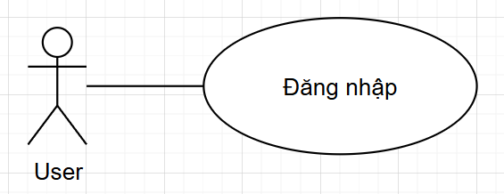{width="5.886111111111111in"
height="2.2708333333333335in"}

+--------------+-------------------------------------------------------+
| **Use Case   | Đăng nhập                                             |
| Name**       |                                                       |
+==============+=======================================================+
| **Mô tả**    | User có thể đăng nhập tài khoản vào hệ thống và sử    |
|              | dụng các chức năng trong đó.                          |
+--------------+-------------------------------------------------------+
| **Điều       | User chưa đăng nhập vào hệ thống                      |
| kiện**       |                                                       |
+--------------+-------------------------------------------------------+
| **Luồng      | 1\. User truy cập vào trang web quản lý. Nhấn vào mục |
| chính**      | "Login\"                                              |
|              |                                                       |
|              | 2\. Hệ thống hiển thị Form Login.                     |
|              |                                                       |
|              | 3\. User nhập vào các thông tin đăng nhập.            |
|              |                                                       |
|              | 4\. Nếu thông tin đăng nhập đúng, dẫn vào hệ thống.   |
+--------------+-------------------------------------------------------+
| **Luồng      | Ở bước 4, nếu thông tin đăng nhập sai sẽ hiển thị     |
| phụ**        | thông báo cho người dùng.                             |
+--------------+-------------------------------------------------------+

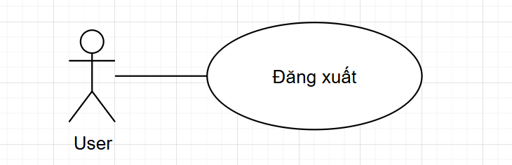{width="6.727777777777778in"
height="2.1743055555555557in"}

+--------------+-------------------------------------------------------+
| **Use Case   | Đăng xuất                                             |
| Name**       |                                                       |
+==============+=======================================================+
| **Mô tả**    | User có thể đăng xuất tài khoản thoát khỏi hệ thống   |
|              | sau khi sử dụng.                                      |
+--------------+-------------------------------------------------------+
| **Điều       | User đã đăng nhập vào hệ thống                        |
| kiện**       |                                                       |
+--------------+-------------------------------------------------------+
| **Luồng      | 1\. User truy cập vào trang web quản lý. Nhấn vào mục |
| chính**      | "Logout\"                                             |
|              |                                                       |
|              | 2\. Hệ thống hiển thị xác nhận đăng xuất.             |
|              |                                                       |
|              | 3\. User nhập xác nhận đăng xuất.                     |
|              |                                                       |
|              | 4\. Thoát khỏi hệ thống                               |
+--------------+-------------------------------------------------------+
| **Luồng      | Ở bước 3, nếu user bấm ra ngoài hoặc cancel, thì      |
| phụ**        | không đăng xuất, tiếp tục sử dụng chương trình.       |
+--------------+-------------------------------------------------------+

### Usecase của Translator

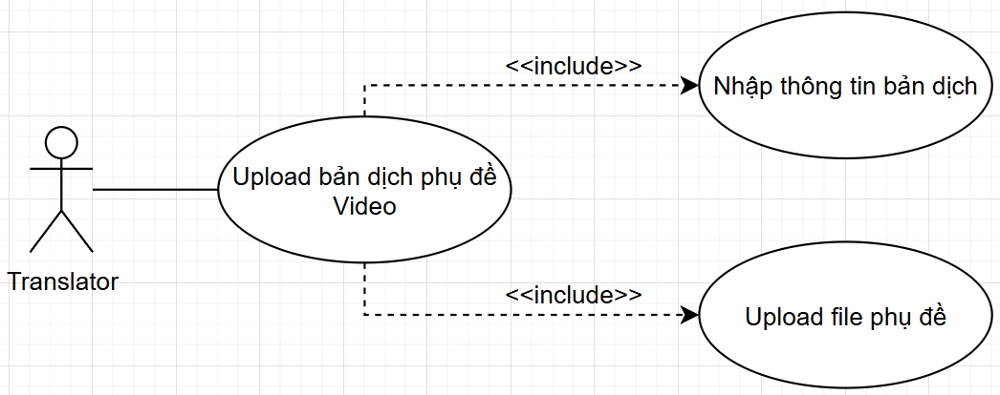{width="6.727777777777778in"
height="2.6625in"}

+--------------+-------------------------------------------------------+
| **Use Case   | Upload bản dịch phụ đề Video                          |
| Name**       |                                                       |
+==============+=======================================================+
| **Mô tả**    | Translator có thể upload bản dịch phụ đề Video, lưu   |
|              | vào cơ sở dữ liệu                                     |
+--------------+-------------------------------------------------------+
| **Điều       | Chưa có bản dịch phụ đề của Video                     |
| kiện**       |                                                       |
+--------------+-------------------------------------------------------+
| **Luồng      | 1\. Translator truy cập màn hình upload               |
| chính**      |                                                       |
|              | 2\. Translator nhập các thông tin về: Tên Video, URL  |
|              | Video, Course ID, Video ID.                           |
|              |                                                       |
|              | 3\. Translator đính kèm file phụ đề đã được dịch      |
|              |                                                       |
|              | 4\. Nhấn submit, hệ thống lưu dữ liệu vào database    |
+--------------+-------------------------------------------------------+
| **Luồng      | Ở bước 4: các thông tin như ID, Translator,           |
| phụ**        | UploadedDate phải được tự động tạo cho mỗi metadata   |
|              | khi thực hiện lưu vào database                        |
+--------------+-------------------------------------------------------+

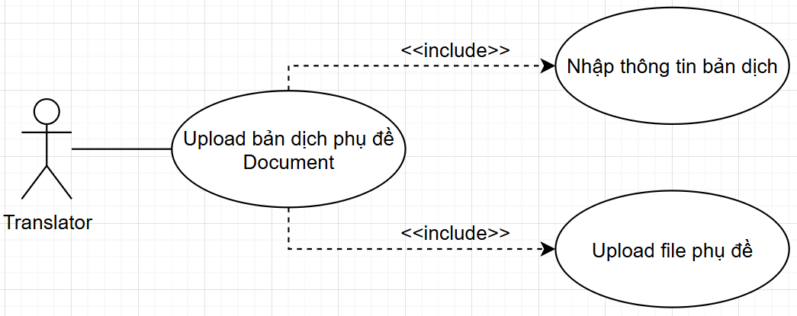{width="6.727777777777778in"
height="2.6708333333333334in"}

+--------------+-------------------------------------------------------+
| **Use Case   | Upload bản dịch phụ đề Document                       |
| Name**       |                                                       |
+==============+=======================================================+
| **Mô tả**    | Translator có thể upload bản dịch Document, lưu vào   |
|              | cơ sở dữ liệu                                         |
+--------------+-------------------------------------------------------+
| **Điều       | Chưa có bản dịch phụ đề của Document                  |
| kiện**       |                                                       |
+--------------+-------------------------------------------------------+
| **Luồng      | 1\. Translator truy cập màn hình upload               |
| chính**      |                                                       |
|              | 2\. Translator nhập các thông tin về: Tên bản dịch và |
|              | URL Document.                                         |
|              |                                                       |
|              | 3\. Translator đính kèm file Document đã được dịch    |
|              |                                                       |
|              | 4\. Nhấn submit, hệ thống lưu dữ liệu vào database    |
+--------------+-------------------------------------------------------+
| **Luồng      | Ở bước 4: các thông tin như ID, Translator,           |
| phụ**        | UploadedDate phải được tự động tạo cho mỗi metadata   |
|              | khi thực hiện lưu vào database                        |
+--------------+-------------------------------------------------------+

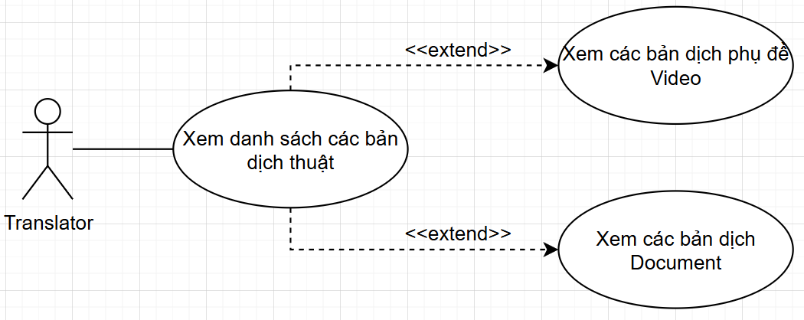{width="6.727777777777778in"
height="2.6777777777777776in"}

+--------------+-------------------------------------------------------+
| **Use Case   | Xem danh sách các file dịch thuật đã upload           |
| Name**       |                                                       |
+==============+=======================================================+
| **Mô tả**    | Translator có thể xem các bản dịch trong 2 Dashboard: |
|              | phụ đề và Document                                    |
+--------------+-------------------------------------------------------+
| **Điều       | Không có                                              |
| kiện**       |                                                       |
+--------------+-------------------------------------------------------+
| **Luồng      | 1\. Translator truy cập màn hình có 2 Dashboard       |
| chính**      |                                                       |
|              | 2\. Nếu bấm vào Dashboard phụ đề: Hiển thị các bản    |
|              | dịch phụ đề                                           |
|              |                                                       |
|              | 3\. Nếu bấm vào Dashboard Document: Hiển thị các bản  |
|              | dịch Document                                         |
+--------------+-------------------------------------------------------+

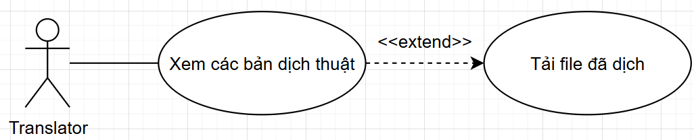{width="6.727777777777778in"
height="1.3631944444444444in"}

+--------------+-------------------------------------------------------+
| **Use Case   | Tải file phụ đề hoặc Document đã được dịch            |
| Name**       |                                                       |
+==============+=======================================================+
| **Mô tả**    | Translator có thể tải các bản dịch phụ đề Video hoặc  |
|              | Document                                              |
+--------------+-------------------------------------------------------+
| **Điều       | Không có                                              |
| kiện**       |                                                       |
+--------------+-------------------------------------------------------+
| **Luồng      | 1\. Translator truy cập màn hình có 2 Dashboard       |
| chính**      |                                                       |
|              | 2\. Translator truy cập 1 trong 2 Dashboard           |
|              |                                                       |
|              | 3\. Click vào link của file dịch thuật trên Dashboard |
|              | thì sẽ tải file đó xuống                              |
+--------------+-------------------------------------------------------+

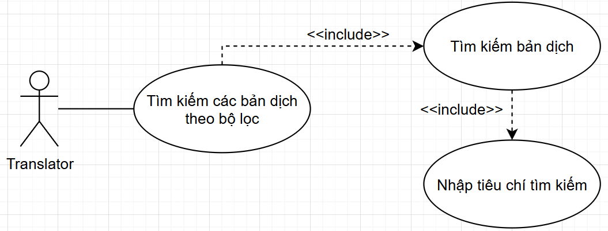{width="6.727777777777778in"
height="2.5694444444444446in"}

+--------------+-------------------------------------------------------+
| **Use Case   | Tìm kiếm các bản dịch theo bộ lọc                     |
| Name**       |                                                       |
+==============+=======================================================+
| **Mô tả**    | Translator có thể tìm bản dịch thuật theo tiêu chí    |
|              | tìm kiếm                                              |
+--------------+-------------------------------------------------------+
| **Điều       | Không có                                              |
| kiện**       |                                                       |
+--------------+-------------------------------------------------------+
| **Luồng      | 1\. Translator truy cập màn hình có 2 Dashboard       |
| chính**      |                                                       |
|              | 2\. Translator truy cập 1 trong 2 Dashboard           |
|              |                                                       |
|              | 3\. Chọn bộ lọc theo tiêu chí: Tên bản dịch, Url,     |
|              | Người dịch, Course ID, Video ID.                      |
+--------------+-------------------------------------------------------+

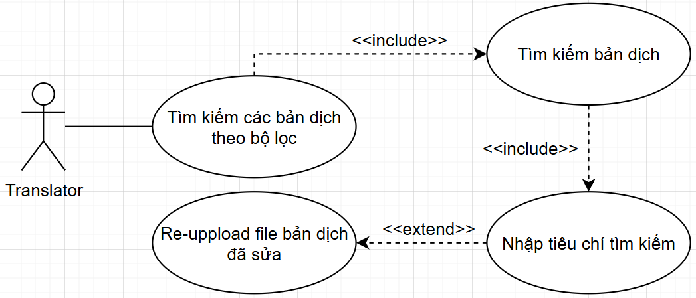{width="6.727777777777778in"
height="2.8847222222222224in"}

+--------------+-------------------------------------------------------+
| **Use Case   | Chỉnh sửa bản dịch                                    |
| Name**       |                                                       |
+==============+=======================================================+
| **Mô tả**    | Translator có thể chỉnh sửa bản dịch                  |
+--------------+-------------------------------------------------------+
| **Điều       | Bản dịch phải có sẵn trên nền tảng                    |
| kiện**       |                                                       |
+--------------+-------------------------------------------------------+
| **Luồng      | 1\. Translator truy cập màn hình có 2 Dashboard       |
| chính**      |                                                       |
|              | 2\. Translator truy cập 1 trong 2 Dashboard           |
|              |                                                       |
|              | 3\. Chọn file bản dịch cần sửa                        |
|              |                                                       |
|              | 4\. Viết lại metadata hoặc reupload file dịch mới lên |
|              | thay thế                                              |
+--------------+-------------------------------------------------------+
| **Luồng      | Ở bước 4: Metadata luôn phải được update lại ngay cả  |
| phụ**        | khi không chỉnh sửa, update lại UploadedDate          |
+--------------+-------------------------------------------------------+

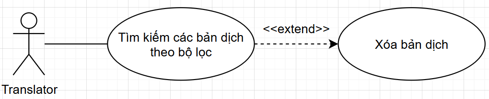{width="6.727777777777778in"
height="1.3777777777777778in"}

+--------------+-------------------------------------------------------+
| **Use Case   | Xóa bản dịch                                          |
| Name**       |                                                       |
+==============+=======================================================+
| **Mô tả**    | Translator có thể chọn xóa bản dịch sau khi tìm kiếm  |
+--------------+-------------------------------------------------------+
| **Điều       | Bản dịch phải có trên nền tảng                        |
| kiện**       |                                                       |
+--------------+-------------------------------------------------------+
| **Luồng      | 1\. Translator truy cập màn hình có 2 Dashboard       |
| chính**      |                                                       |
|              | 2\. Translator truy cập 1 trong 2 Dashboard           |
|              |                                                       |
|              | 3\. Chọn file bản dịch muốn xóa                       |
|              |                                                       |
|              | 4\. Xác nhận xóa                                      |
+--------------+-------------------------------------------------------+

### Usecase của Admin

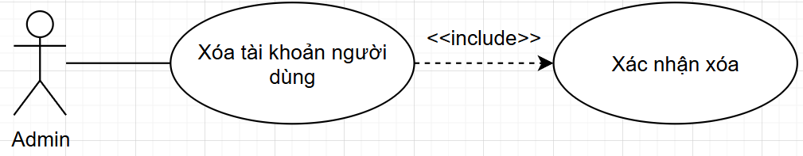{width="6.727777777777778in"
height="1.3131944444444446in"}

+--------------+-------------------------------------------------------+
| **Use Case   | Xóa tài khoản người dùng                              |
| Name**       |                                                       |
+==============+=======================================================+
| **Mô tả**    | Admin có thể xóa tài khoản của người dùng             |
+--------------+-------------------------------------------------------+
| **Điều       | Tài khoản phải có (tài khoản không phải là NULL)      |
| kiện**       |                                                       |
+--------------+-------------------------------------------------------+
| **Luồng      | 1\. Admin truy cập vào màn hình chứa các tài khoản    |
| chính**      |                                                       |
|              | 2\. Admin chọn tài khoản muốn xóa                     |
|              |                                                       |
|              | 3\. Admin xác nhận xóa                                |
+--------------+-------------------------------------------------------+

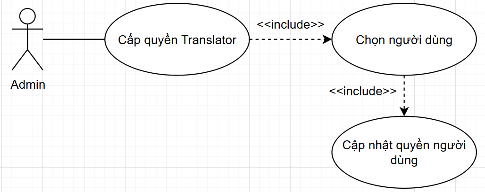{width="6.727777777777778in"
height="2.6756944444444444in"}

+--------------+-------------------------------------------------------+
| **Use Case   | Cấp quyền Translator                                  |
| Name**       |                                                       |
+==============+=======================================================+
| **Mô tả**    | Admin có thể cấp quyền Translator cho User            |
+--------------+-------------------------------------------------------+
| **Điều       | Tài khoản phải có và không là Translator (tài khoản   |
| kiện**       | không phải là NULL)                                   |
+--------------+-------------------------------------------------------+
| **Luồng      | 1\. Admin truy cập vào màn hình chứa các tài khoản    |
| chính**      |                                                       |
|              | 2\. Admin chọn tài khoản User để cập nhật thành       |
|              | Translator                                            |
|              |                                                       |
|              | 3\. Admin cập nhật tài khoản User                     |
+--------------+-------------------------------------------------------+

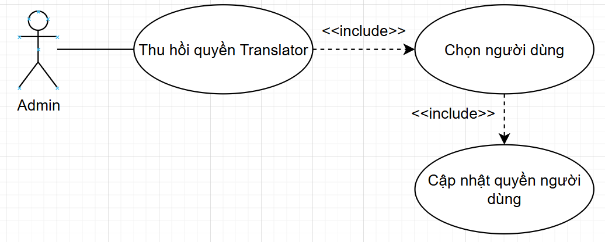{width="6.727777777777778in"
height="2.701388888888889in"}

+--------------+-------------------------------------------------------+
| **Use Case   | Xóa quyền Translator                                  |
| Name**       |                                                       |
+==============+=======================================================+
| **Mô tả**    | Admin có thể hủy bỏ quyền Translator                  |
+--------------+-------------------------------------------------------+
| **Điều       | Tài khoản phải có và đang là Translator (tài khoản    |
| kiện**       | không phải là NULL)                                   |
+--------------+-------------------------------------------------------+
| **Luồng      | 1\. Admin truy cập vào màn hình chứa các tài khoản    |
| chính**      |                                                       |
|              | 2\. Admin chọn tài khoản Translator để thu hồi quyền. |
|              |                                                       |
|              | 3\. Admin cập nhật tài khoản đã bị thu hồi quyền      |
|              | Translator.                                           |
+--------------+-------------------------------------------------------+

### Usecase của Student

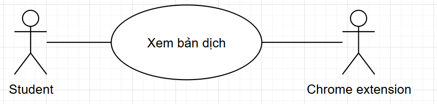{width="6.727777777777778in"
height="1.6118055555555555in"}

+--------------+-------------------------------------------------------+
| **Use Case   | Xem bản dịch                                          |
| Name**       |                                                       |
+==============+=======================================================+
| **Mô tả**    | Student có thể xem các bản dịch phụ đề Video hoặc bản |
|              | dịch Document                                         |
+--------------+-------------------------------------------------------+
| **Điều       | Bản dịch phải có trong Database ở Backend.            |
| kiện**       |                                                       |
+--------------+-------------------------------------------------------+
| **Luồng      | 1\. Student truy cập trang web                        |
| chính**      |                                                       |
|              | 2\. Extension truy url của trang web để tìm bản dịch, |
|              | hiển thị pop up cho người dùng lựa chọn muốn xem bản  |
|              | dịch hay không                                        |
|              |                                                       |
|              | 3\. Người dùng xác nhận xem bản dịch                  |
+--------------+-------------------------------------------------------+
| **Luồng      | Ở bước 2, nếu không tìm thấy url của trang web thì    |
| phụ**        | không hiện pop up                                     |
+--------------+-------------------------------------------------------+

3.  ## Sơ đồ use case tổng quát của hệ thống

    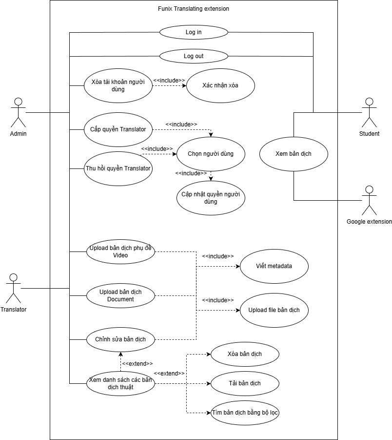{width="6.4215277777777775in"
    height="6.745138888888889in"}

4.  ## Class Diagram

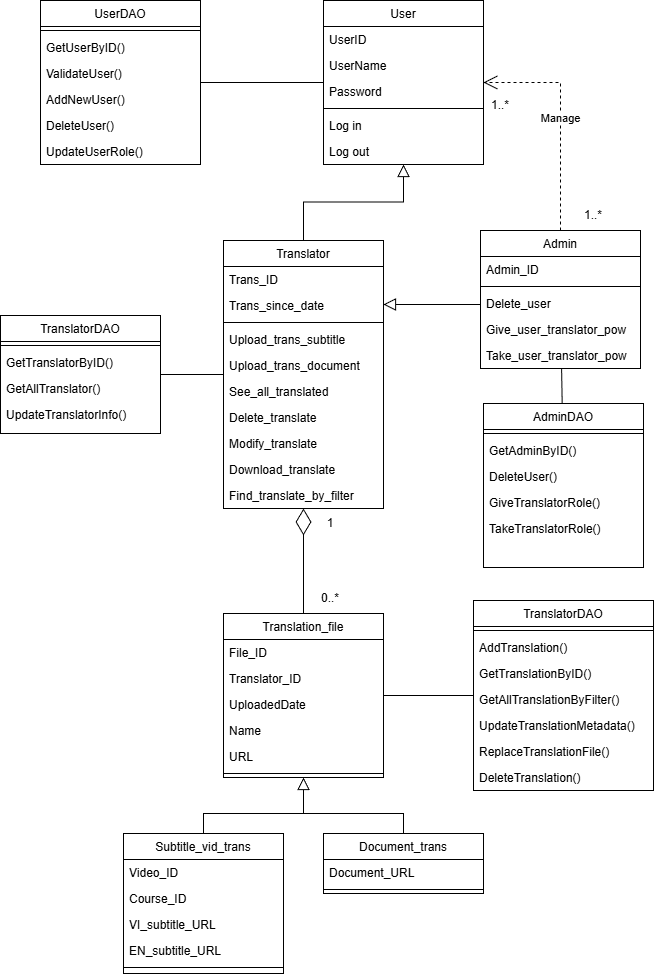{width="5.45in"
height="8.116666666666667in"}

## Sequence Diagram

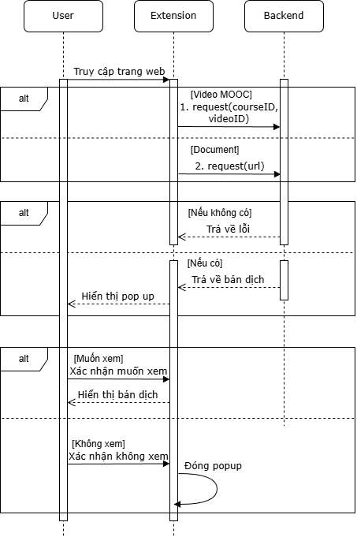{width="3.775in"
height="5.675in"}

## Activity Diagram

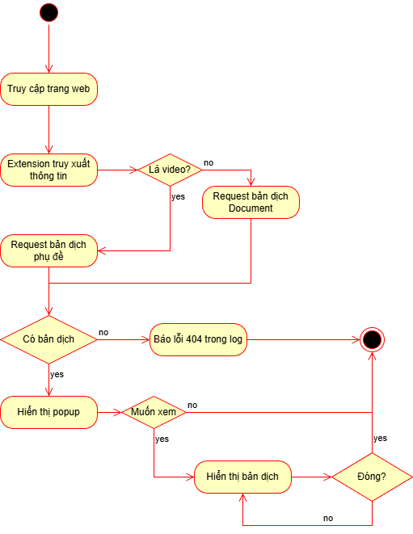{width="4.258333333333334in"
height="5.508333333333334in"}
