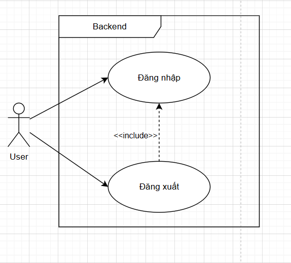
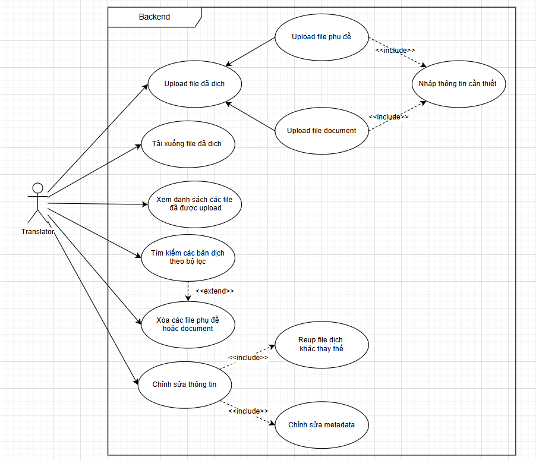
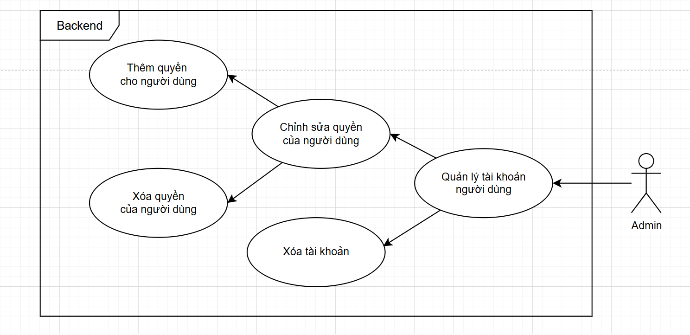
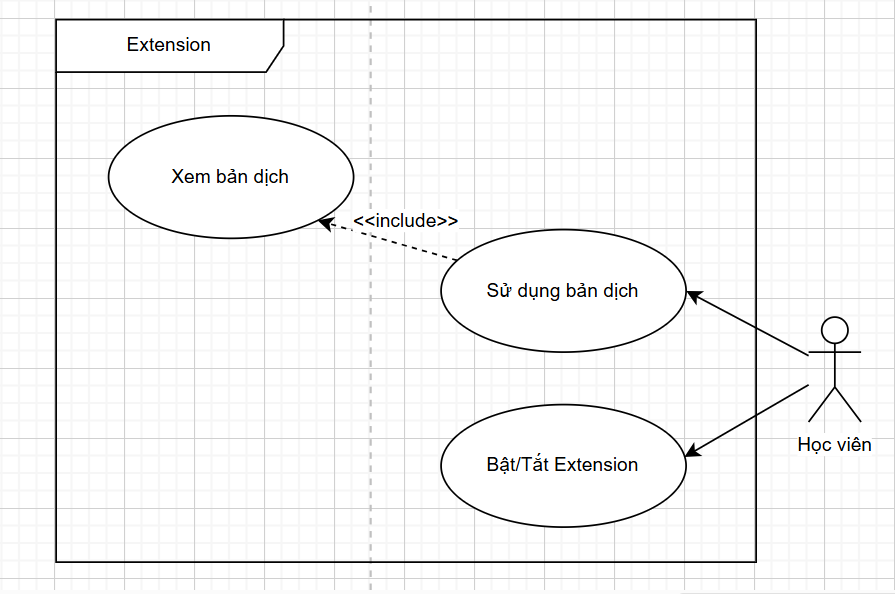
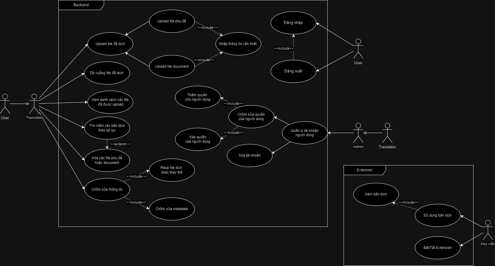
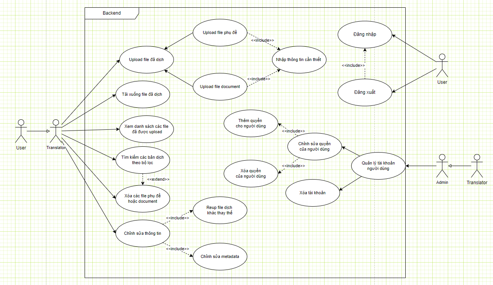
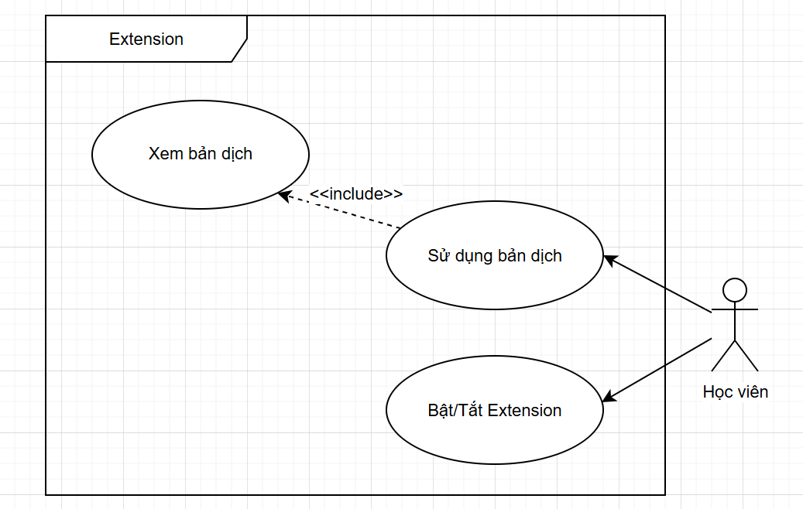
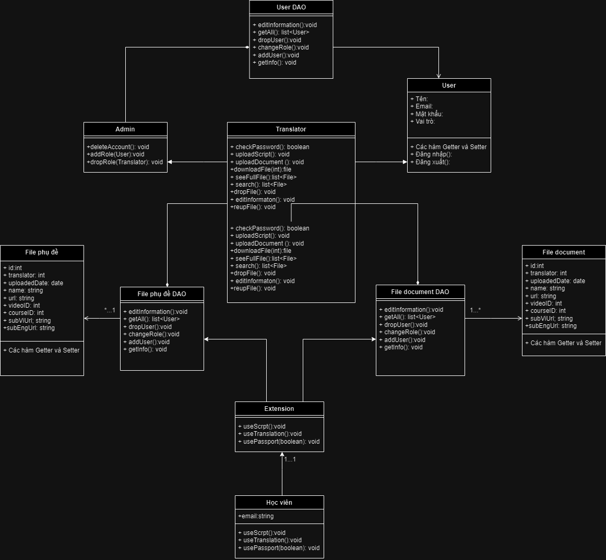

# FUNiX

## SWE102x_03-A: Nhập môn kỹ thuật phần mềm

### Assignment 1: Thiết kế FUNiX Passport

#### Nguyễn Đặng Kim Ngân - FX10631

---

### Revision History

| Date       | Version | Description | Author   |
|------------|---------|-------------|----------|
| <04/13/07> | <1.0>   | SRS 1.0     | Group-1  |
| <04/15/07> | <2.0>   | SRS 2.0     | Group-1  |
| <04/15/07> | <3.0>   | SRS 3.0     | Group-1  |

---

### Bảng thuật ngữ

| Thuật ngữ  | Định nghĩa                                                                 |
|------------|----------------------------------------------------------------------------|
| Cấu hình   | Nó có nghĩa là một sản phẩm có sẵn / Được chọn từ một danh mục có thể được tùy chỉnh. |
| FAQ        | Frequently Asked Questions                                                 |
| CRM        | Customer Relationship Management                                           |
| RAID 5     | Redundant Array of Inexpensive Disk/Drives                                 |
| CSDL       | Cơ sở dữ liệu                                                              |

### Table of Contents

1. [Giới thiệu tổng quan về dự án](#giới-thiệu-tổng-quan-về-dự-án)
   - [1.1 Tóm tắt dự án FUNiX Passport](#11-tóm-tắt-dự-án-funix-passport)
   - [1.2 Phạm vi của dự án](#12-phạm-vi-của-dự-án)
2. [Yêu cầu và đặc tả dự án](#yêu-cầu-và-đặc-tả-dự-án)
   - [2.1 Định nghĩa yêu cầu dự án](#21-định-nghĩa-yêu-cầu-dự-án)
   - [2.2 Yêu cầu chức năng](#22-yêu-cầu-chức-năng)
   - [2.3 Yêu cầu phi chức năng](#23-yêu-cầu-phi-chức-năng)
     - [2.2.1 Tính bảo mật](#221-tính-bảo-mật)
     - [2.2.2 Tính sẵn sàng và khả năng đáp ứng](#222-tính-sẵn-sàng-và-khả-năng-đáp-ứng)
     - [2.2.3 Hiệu suất](#223-hiệu-suất)
   - [2.4 Đặc tả phần mềm](#24-đặc-tả-phần-mềm)
3. [Kiến trúc và thiết kế phần mềm](#kiến-trúc-và-thiết-kế-phần-mềm)
   - [3.1 Kiến trúc phần mềm](#31-kiến-trúc-phần-mềm)
   - [3.2 Usecase](#32-usecase)
     - [3.2.1 Usecase của User](#321-usecase-của-user)
     - [3.2.2 Usecase của Translator](#322-usecase-của-translator)
     - [3.2.3 Usecase của Admin](#323-usecase-của-admin)
     - [3.2.4 Usecase của Student](#324-usecase-của-student)
   - [3.3 Sơ đồ use case tổng quát của hệ thống](#33-sơ-đồ-use-case-tổng-quát-của-hệ-thống)
   - [3.4 Class Diagram](#34-class-diagram)
---

### 1. Giới thiệu tổng quan về dự án

#### 1.1 Tóm tắt dự án FUNiX Passport

Tóm tắt lại các thông tin cơ bản về dự án:

- **Hệ thống sẽ xây dựng là gì?**

  Chúng ta sẽ xây dựng hệ thống tên FUNiX Passport để hỗ trợ dịch tài liệu chữ hoặc video từ tiếng Anh sang tiếng Việt của FUNiX dành riêng riêng học viên theo học.

- **Mục đích xây dựng hệ thống là gì? Hệ thống giúp giải quyết cho bài toán gì?**

  Hệ thống được xây dựng với các mục đích sau:
  
  - Hỗ trợ học viên tiếp cận học liệu dễ hiểu hơn, chuẩn xác hơn.
  - Vì đa số các trang web đều sử dụng ứng dụng dịch ngôn ngữ theo dạng bề mặt, việc dịch tay và chỉnh sửa để phù hợp với chủ đề công nghệ thông tin sẽ giúp tính chính xác của học liệu đối với chuyên ngành.

- **Các mục tiêu để xây dựng dự án là gì?**

  Để xây dựng dự án, ta cần hoàn thành những mục tiêu:
  
  - Xây dựng mô hình dự án gồm 2 phần là phần Backend và Extension:
    - **Backend**: là nơi thực hiện các thao tác với CSDL, với nhiệm vụ là quản lý về các file dịch thuật. Ngoài ra, Backend phải được thiết kế để các dịch thuật viên đăng tải phụ đề tương ứng với học liệu đó. Backend cần giúp các dịch thuật viên và quản trị viên quản lý file dịch thuật, đồng thời, cần lưu trữ đầy đủ thông tin môn - url học liệu - file dịch thuật.
    - **Extension**: Là một tiện ích mở rộng, giao tiếp với Backend, thực hiện nạp những thông tin cần thiết để hiển thị bản dịch tương ứng cho phía học viên sử dụng.
  - Xây dựng giao diện sử dụng thân thiện, dễ hiểu với người dùng. Cung cấp các bản dịch chính xác trong thời gian nhanh chóng.

#### 1.2 Phạm vi của dự án

Giải thích phạm vi của dự án: định nghĩa: là một phần kế hoạch dự án liên quan. Chúng ta sẽ xác định các mục tiêu dự án cụ thể, các công việc, nhiệm vụ, chi phí và thời hạn. Tài liệu phạm vi của dự án tuyên bố phạm vi hoặc các điều khoản tham chiếu, giải thích các ranh giới của dự án thiết lập trách nhiệm cho từng thành viên trong nhóm và các quy trình xác minh cũng như phê duyệt công việc đã hoàn thành.

- **Phạm vi về dịch vụ**
  - Cung cấp một nền tảng lưu trữ Metadata các file phụ đề của các học liệu tiếng Anh.
  - Thao tác, tìm kiếm, chỉnh sửa, quản lí thông tin các file dịch phụ đề.
- **Phạm vi về khách hàng:**
  - Học viên FUNiX.
  - Các dịch thuật viên.
  - Các quản trị viên.
- **Phạm vi về nền tảng/hệ thống:**
  - Các trang công nghệ thông tin trên internet, những video, học liệu MOOC.
  - Hoạt động như một tiện ích mở rộng trên các phần mềm internet: Bing, Chrome, …

---

### 2. Yêu cầu và đặc tả dự án

#### 2.1 Định nghĩa yêu cầu dự án

- Là những vấn đề cần xử lý trong bài. Chỉ nói về vấn đề, không đề cập tới tới giải pháp.
- Những vai trò của đặc tả yêu cầu dự án:
  - Giúp người làm hình dung rõ ràng được mục đích dự án, từ đó xây dựng hệ thống chuẩn xác, đầy đủ các chức năng.
  - Tránh gặp phải trường hợp hiểu sai ý nhau.
  - Giúp cho việc bảo trì và nâng cao các chức năng trong hệ thống 1 cách dễ dàng và nhanh chóng.
  - Giúp các tester hiểu được hệ thống rõ ràng -> xây dựng những kịch bản xác thực, chi tiết, thực tế hơn.

#### 2.2 Yêu cầu chức năng

Dựa vào các yêu cầu ở phần "Yêu cầu dự án", bạn sẽ lọc xem khi xây dựng thì hệ thống sẽ gồm có những chức năng nào, những chức năng đó sẽ hoạt động như thế nào và đưa vào tài liệu theo Template đã có.

- Hỗ trợ đăng tải và lưu trữ các file dịch thuật + thông tin của file (phụ thuộc vào dạng bài gốc là videoMOOC hay bài viết) như link bài gốc, tên người dịch, ngày đăng tải, tên bản dịch, v.v
- Cho phép quản trị viên quản lý file dịch thuật, chỉnh sửa, xóa, thay đổi thông tin.
- Cho phép quản trị viên quản lý danh sách người dùng: thêm quyền, xóa quyền, xóa tài khoản.
- Hỗ trợ người dùng cung cấp file dịch tương ứng khi họ truy cập vào học liệu nước ngoài.

### 2.3 Yêu cầu phi chức năng (tiếp theo)

##### 2.2.1 Tính bảo mật

Xác định các yêu cầu liên quan đến vấn đề bảo mật hoặc quyền riêng tư dẫn đến hạn chế quyền truy cập hoặc sử dụng sản phẩm. Có thể là bảo mật vật lý, dữ liệu hoặc phần mềm. Các yêu cầu bảo mật thường bắt nguồn từ các quy định hoặc tiêu chuẩn liên quan đến ngành.

##### 2.2.2 Tính sẵn sàng và khả năng đáp ứng

- Hệ thống phải luôn sẵn sàng để sử dụng bất cứ lúc nào, đặc biệt vào thời điểm học viên cần học.
- Phải đảm bảo khả năng đáp ứng tốt trong mọi tình huống, dù có nhiều người dùng cùng lúc.

##### 2.2.3 Hiệu suất

- Hệ thống phải có khả năng xử lý nhanh các thao tác của người dùng, đặc biệt là việc tìm kiếm và tải lên các file dịch thuật.
- Đảm bảo hệ thống không bị treo hoặc chậm khi có nhiều người dùng truy cập cùng lúc.

#### 2.4 Đặc tả phần mềm

Cần mô tả chi tiết từng chức năng của phần mềm và cách mà chúng sẽ hoạt động.

---

### 3. Kiến trúc và thiết kế phần mềm

3.1.1. Định nghĩa kiến trúc phần mềm:
- Là cấp bậc cao nhất của giai đoạn thiết kế
- Từ những ý tưởng rời rạc, kiến trúc phần mềm sẽ giúp ta tổ chức và sắp xếp logic để chuẩn bị
bắt tay thực hiện.
- Một khi đã quyết định kiến trúc thì không thể thay đổi trong bất kì trường hợp nào.
- Kiến trúc phần mềm chia nhỏ hệ thống và ý tưởng lớn hơn thành các hệ thống tập trung nhỏ
hơn.
- Lợi ích của việc xây dựng 1 kiến trúc tốt: Tiết kiệm thời gian hoàn thành sản phẩm, chi phí
bảo trì dự án.
- Buy & Build: Phân tách dự án ra thành các phần riêng biệt, từ đó xem xét đã có bản
sản phẩm hoàn chỉnh được rao bán trên thị trường hay chưa. Nếu có thì ta bỏ phí để
mua bản có sẵn đó, vừa tiết kiệm được nhân lực cũng như thời gian, tiền bạc xây dựng
dự án.
- Các mẫu kiến trúc phần mềm thông dụng:
- Pipe and Filter: -Dựa vào các nội dung của yêu cầu dự án phía trên, bạn hãy chọn lựa kiến trúc phần mềm phù
hợp với dự án này. Sau đó, bạn cần viết ra lý do hợp lý để bạn chọn kiến trúc này thay vì các kiến
trúc khác

Mô tả cấu trúc tổng thể của hệ thống, cách các thành phần phần mềm tương tác với nhau. Bao gồm cả phần Backend và Extension.

#### 3.2 Usecase

Các Usecase mô tả cách mà người dùng tương tác với hệ thống để đạt được mục tiêu cụ thể.

##### 3.2.1 Usecase của User

| Use Case Name | Đăng nhập |
|---------------|-----------|
| **Mô tả**     | User có thể đăng nhập tài khoản vào hệ thống và sử dụng các chức năng trong đó. |
| **Điều kiện** | User chưa đăng nhập vào hệ thống |
| **Luồng chính** | 1. User truy cập vào trang web quản lý. Nhấn vào mục “Login” 2. Hệ thống hiển thị Form Login. 3. User nhập vào các thông tin đăng nhập. 4. Nếu thông tin đăng nhập đúng, cập nhật thông tin vào hệ thống. |
| **Luồng phụ** | Ở bước 4, nếu thông tin đăng nhập sai sẽ hiển thị thông báo cho người
dùng |

| Use Case Name | Đăng xuất |
|---------------|-----------|
| **Mô tả**     | User sau khi sử dụng hệ thống xong có thể đăng xuất tài khoản để tránh bị kẻ lợi dụng |
| **Điều kiện** | User đã đăng nhập vào hệ thống |
| **Luồng chính** | 1. User tìm kiếm mục “Log out” trên hệ thống. 2. User nhấp vào Logout và confirm đăng xuất. |
| **Luồng phụ** | Ở bước 2, hệ thống sẽ hiển thị pop-up form để xác định đăng xuất. |

##### 3.2.2 Usecase của Translator

| Use Case Name | Upload file phụ đề |
|---------------|-----------|
| **Mô tả**     | Sau khi thực hiện dịch xong tài liệu (video MOOC hoặc trang web), Translator tiến hành đăng tải file dịch thuật lên hệ thống. |
| **Điều kiện** | User chưa đăng nhập vào hệ thống |
| **Luồng chính** | 1. Translator truy cập vào trang web quản lý, nhập password để truy cập vào dashboard lưu file. 2. Nhấn vào mục “Đăng tải file”. 3. Translator tải file phụ đề/document lên. 4. Translator hoàn thành các thông tin cần thiết của file. 5. Translator nhấn “Submit”. Thao tác hoàn thành |
| **Luồng phụ** | Ở bước thứ 3, hệ thống thực hiện kiểm tra định dạng, kích cỡ file. Ở bước thứ 5, hệ thống kiểm tra các thông tin đã đúng định dạng, cú pháp |

| Use Case Name | Tải file phụ đề |
|---------------|-----------|
| **Mô tả**     | Sau khi tìm thấy file cần tải, translator nhấp nút tải. |
| **Điều kiện** | - Translator đã đăng nhập tài khoản được cấp quyền. - File dịch đã tồn tại |
| **Luồng chính** | 1. Translator truy cập vào trang web quản lý, nhập password để truy cập vào dashboard lưu file. 2. Translator mở bảng dashboard, và chọn file muốn tải. 3. Nhấp vào nút tải để tiến hành tải file|
| **Luồng phụ** | |

| Use Case Name | Tải xuống file đã dịch |
|---------------|-----------|
| **Mô tả**     | Sau khi thực hiện dịch xong tài liệu (video MOOC hoặc trang web), Translator tiến hành đăng tải file dịch thuật lên hệ thống. |
| **Điều kiện** | - Translator đã đăng nhập tài khoản được cấp quyền. - Học liệu gốc chưa có file dịch |
| **Luồng chính** | 1. Translator truy cập vào trang web quản lý, nhập password để truy cập vào dashboard lưu file. 2. Nhấn vào mục “Đăng tải file”. 3. Translator tải file phụ đề/document lên 4. Translator hoàn thành các thông tin cần thiết của file. 5. Translator nhấn “Submit”. Thao tác hoàn thành|
| **Luồng phụ** |Ở bước thứ 3, hệ thống thực hiện kiểm tra định dạng, kích cỡ file. Ở bước thứ 5, hệ thống kiểm tra các thông tin đã đúng định dạng, cú pháp. |

| Use Case Name | Xem danh sách các file đã được upload |
|---------------|-----------|
| **Mô tả**     | Backend sẽ cung cấp 2 Dashboard, 1 bảng hiển thị các bản dịch phụ đề và 1 bảng hiển thị bản dịch Document. |
| **Điều kiện** | - Translator đã đăng nhập tài khoản được cấp quyền. |
| **Luồng chính** | 1. Translator truy cập vào trang web quản lý, nhập password để truy cập vào dashboard lưu file. 2. Translator xem 2 dashboard, 1 bảng lưu trữ file phụ đề, 1 bảng lưu
trữ file document.|
| **Luồng phụ** | |

| Use Case Name | Tìm kiếm các bản dịch theo bộ lọc |
|---------------|-----------|
| **Mô tả**     | Translator có thể tìm kiếm các bản dịch theo những bộ lọc sau: Tên bản dịch, Url, Người dịch, Course ID, Video ID. |
| **Điều kiện** | - Translator đã đăng nhập tài khoản được cấp quyền |
| **Luồng chính** | 1. Translator truy cập vào trang web quản lý, nhập password để truy cập vào dashboard lưu file. 2. Nhấn vào mục Tìm kiếm 3. Translator tìm nhập thẳng vào thanh tìm kiếm hoặc chọn theo bộ lọc có sẵn. 4. Translator xem những kết quả tìm kiếm trả về|
| **Luồng phụ** |Máy chủ thực hiện tìm kiếm theo thông tin đã được cung cấp và trả lại những kết quả tìm kiếm trùng khớp |

| Use Case Name | Xóa các file dịch thuật |
|---------------|-----------|
| **Mô tả**     | Sau khi tới file cần xóa, translator thực hiện xóa file. |
| **Điều kiện** | - Translator đã đăng nhập tài khoản được cấp quyền. - Học liệu gốc đã có file dịch |
| **Luồng chính** | 1. Translator truy cập vào trang web quản lý, nhập password để truy cập vào dashboard lưu file. 1.5. Translator thực hiện tìm kiếm file cần xóa. 2. Translator nhấp vào dòng file cần xóa trong dashboard hoặc trong mục tìm kiếm. 3. Translator nhấn Xác nhận xóa file.|
| **Luồng phụ** |Ở bước thứ 2, hệ thống hiện 1 pop-up form xác nhận xóa file. |

| Use Case Name |  Chỉnh sửa thông tin file |
|---------------|-----------|
| **Mô tả**     | Translator mở file cần chỉnh sửa và tiến hành cập nhật thông tin/file dịch thuật theo ý muốn. |
| **Điều kiện** | - Translator đã đăng nhập tài khoản được cấp quyền. - File học liệu đã tồn tại, đã có file phụ đề đính kèm. |
| **Luồng chính** | 1. Translator truy cập vào trang web quản lý, nhập password để truy cập vào dashboard lưu file. 2. Translator nhấn vào mục để xem các bảng file hoặc thực hiện tìm kiếm file mong muốn. 3. Translator nhấp vào ô Edit và tiến hành cập nhật thông tin file. 4. Sau khi hoàn thành, translator thực hiện, xác nhận cập nhật thông tin. 4.5. Translator nhập lại những thông tin cập nhật sai định dạng, cú pháp. (nếu có) 5. Translator kiểm tra lại thông tin sau khi đã cập nhật.|
| **Luồng phụ** |Ở bước thứ 2, hệ thống thực hiện kiểm tra định dạng, kích cỡ file. Ở bước thứ 4, hệ thống kiểm tra định dạng, cú pháp và gửi cảnh báo về form chỉnh sửa. Ở bước 5, hệ thống thực hiện cập nhật thông tin và trả về thông tin đã cập nhật cho người dùng. |

##### 3.2.3 Usecase của Admin

| Use Case Name | Chỉnh sửa quyền của người dùng |
|---------------|-----------|
| **Mô tả**     | Admin vào Dashboard lưu trữ danh sách người dùng và thực hiện chỉnh sửa quyền. Có thể thêm hoặc xóa quyền. |
| **Điều kiện** | - Admin đã được cấp quyền chỉnh sửa. - Những người dùng bị quản lý là translator và user |
| **Luồng chính** | 1. Admin truy cập vào trang web quản lý, nhập password để truy cập vào dashboard lưu thông tin người dùng. 2. Admin chọn Translator để xóa quyền xuống User. HOẶC, chọn User để thêm quyền Translator. 3. Admin xác nhận và quay trở lại màn hình chính|
| **Luồng phụ** |Ở bước 1, dashboard hiện danh sách tất cả người dùng nhưng chỉ hiện thị nút cập nhật ở các người dùng có vai trò là Translator hoặc User. Ở bước 3, hệ thống thực hiện cập nhật thông tin và trả về thông tin đã cập nhật cho người dùng. |

| Use Case Name | Xóa tài khoản người dùng. |
|---------------|-----------|
| **Mô tả**     | Admin thực hiện xóa vĩnh viễn tài khoản của người dùng |
| **Điều kiện** | - Admin đã được cấp quyền chỉnh sửa. - Những người dùng bị quản lý là translator và user |
| **Luồng chính** | 1. Admin mở danh sách lưu trữ người dùng. 2. Admin chọn Translator để xóa quyền xuống User. HOẶC, chọn User để thêm quyền Translator. 3. Admin xác nhận và quay trở lại màn hình chính.|
| **Luồng phụ** |Ở bước 1, dashboard hiện danh sách tất cả người dùng nhưng chỉ hiện thị nút cập nhật ở các người dùng có vai trò là Translator hoặc User. Ở bước 3, hệ thống thực hiện cập nhật thông tin và trả về thông tin đã cập nhật cho người dùng. |

##### 3.2.4 Usecase của Student

| Use Case Name | Sử dụng bản dịch. |
|---------------|-----------|
| **Mô tả**     | Khi học viên vừa mở vào học liệu, extension lấy thông tin cần thiết, gửi tới Backend và hiển thị lại kết quả dịch thuật Backend trả về. |
| **Điều kiện** | - Học viên đã cài đặt Extension FUNiX Passport. - Học liệu viết/nói tiếng Anh. - Học liệu thuộc quản lý, giáo trình môn học FUNiX. |
| **Luồng chính** | 1. Học viên truy cập tới học liệu tiếng anh bất kì thuộc hệ thống FUNiX. 2. Học viên chọn xác nhận muốn xem bản dịch video/document này. 3. Học viên xem học liệu bằng phụ đề/bản dịch tiếng Việt. Extension lấy course_id và video_id (đối với MOOC) hoặc url (đối với document) và gửi về backend. 4. Backend thực hiện tìm kiếm trong kho tài liệu. 5. Backend lấy file dịch thuật ứng với thông tin file được extension cung cấp.|
| **Luồng phụ** |Sau bước 2, Extension lấy course_id và video_id (đối với MOOC) hoặc url (đối với document) và gửi về backend. Backend thực hiện tìm kiếm trong kho tài liệu. Backend lấy file dịch thuật ứng với thông tin file được extension cung cấp và gửi lại Extension. Extension hiển thay đổi giao diện trang web và hiển thị cho người dùng. |

| Use Case Name | Bật/Tắt Extension |
|---------------|-----------|
| **Mô tả**     | Học viên có thể bật hoặc tắt extension này bằng cách truy cập vào Extension store hoặc tắt trực tiếp bằng Develop tool. |
| **Điều kiện** | Học viên đã cài đặt Extension FUNiX Passport. |
| **Luồng chính** | Có 2 cách triển khai: Cách 1: Học viên tắt extension bằng extension store. Cách 2: Học viên sử dụng Developer tools để vô hiệu hóa extension trên 1 trang web nhất định.|
| **Luồng phụ** ||

#### 3.3 Sơ đồ use case tổng quát của hệ thống

Hình ảnh sơ đồ use case tổng quát mô tả các tương tác giữa các tác nhân (user, translator, admin, student) và hệ thống.

3.3.1. Phần Backend

3.3.2. Phần Extension

#### 3.4 Class Diagram

Hình ảnh sơ đồ class diagram mô tả các lớp trong hệ thống và mối quan hệ giữa chúng.

# THE END