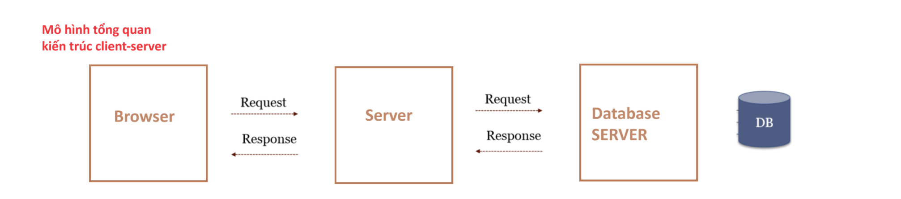
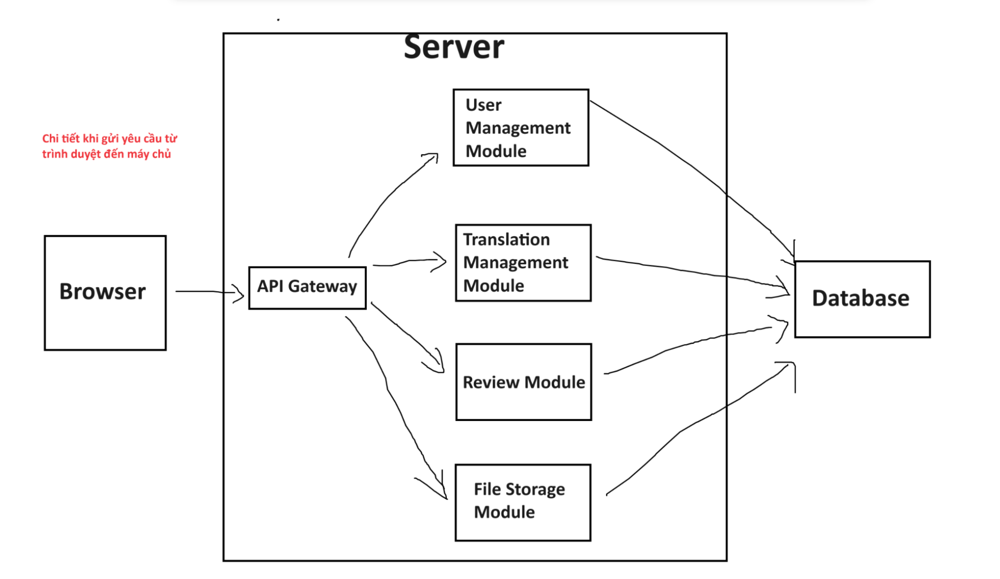
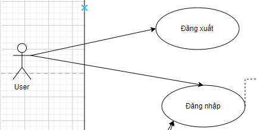
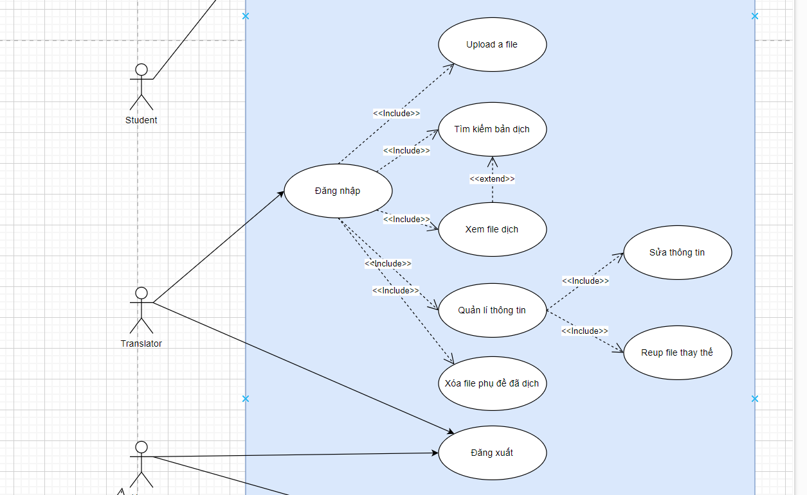
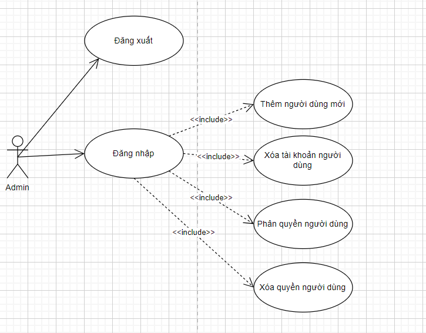
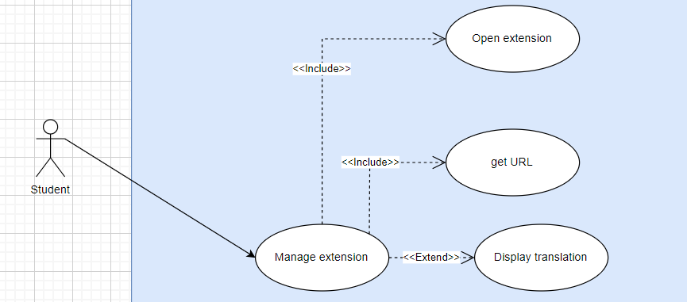
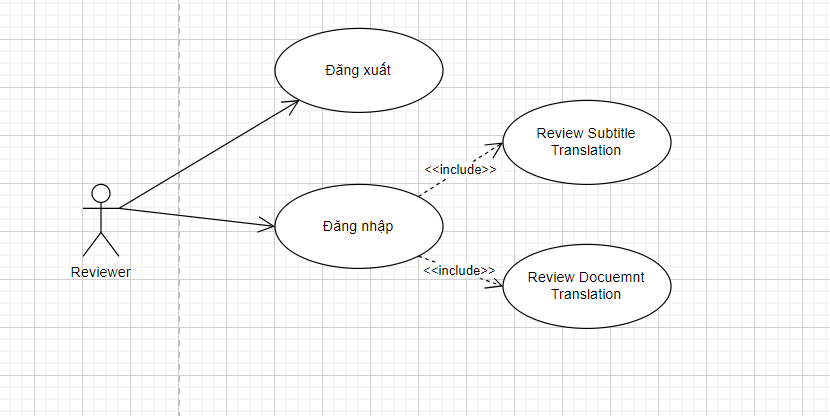
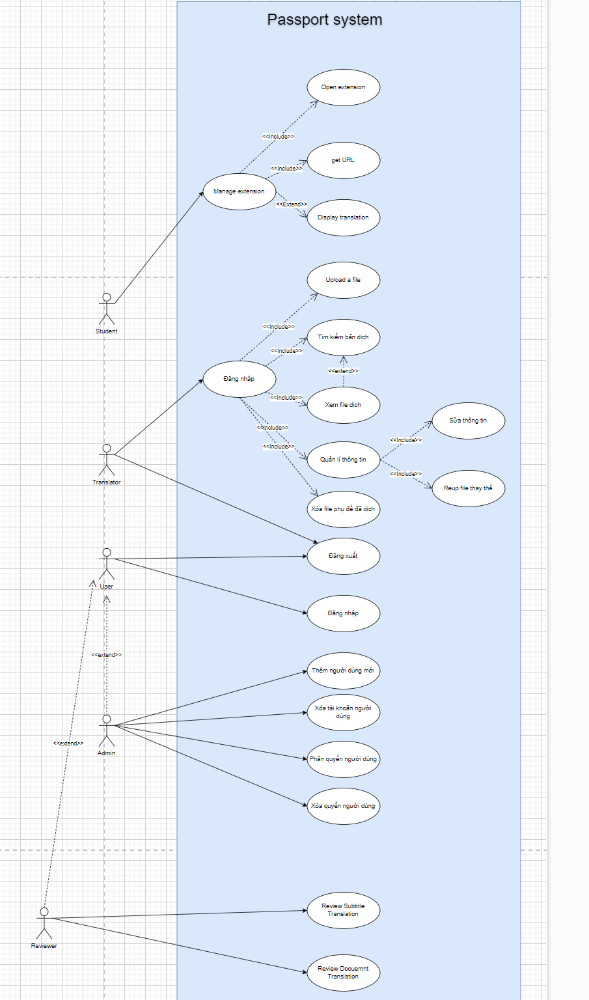
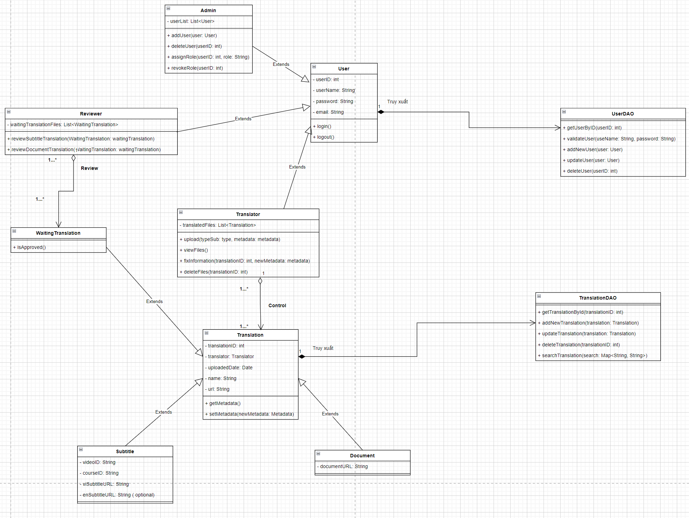
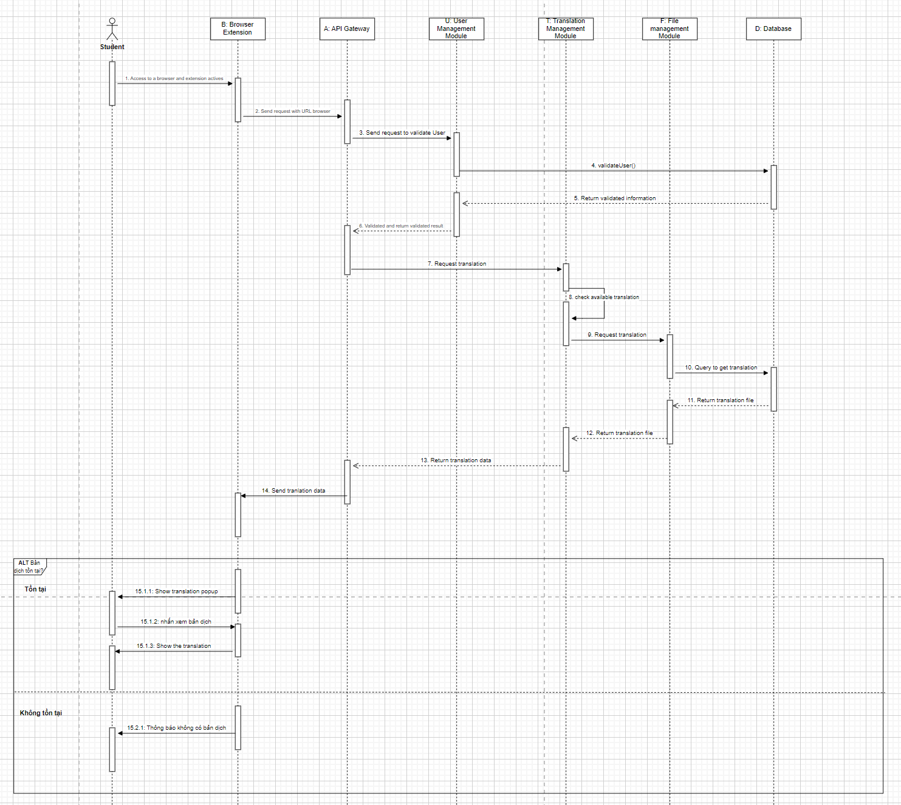

Tài liệu đặc tả yêu cầu

> ***FUNiX Passport***

Revision History

  -----------------------------------------------------------------------------
  **Date**          **Version**   **Description**             **Author**
  ----------------- ------------- --------------------------- -----------------
  \<04/13/07\>      \<1.0\>       SRS 1.0                     Group-1

  \<04/15/07\>      \<2.0\>       SRS 2.0                     Group-1

  \<04/15/07\>      \<3.0\>       SRS 3.0                     Group-1

  \<04/16/07\>      \<4.0\>       SRS 4.0                     Group-1
  -----------------------------------------------------------------------------

Bảng thuật ngữ

Cung cấp tổng quan về bất kỳ định nghĩa nào mà người đọc nên hiểu trước
khi đọc tiếp.

  -----------------------------------------------------------------------
  Cấu hình    Nó có nghĩa là một sản phẩm có sẵn / Được chọn từ một danh
              mục có thể được tùy chỉnh.
  ----------- -----------------------------------------------------------
  FAQ         Frequently Asked Questions

  CRM         Customer Relationship Management

  RAID 5      Redundant Array of Inexpensive Disk/Drives
  -----------------------------------------------------------------------

Table of Contents

**[Giới thiệu tổng quan về dự án](#giới-thiệu-tổng-quan-về-dự-án) 4**

> [Tóm tắt dự án](#tóm-tắt-dự-án) 4
>
> [Phạm vi của dự án](#phạm-vi-của-dự-án) 4

**[Yêu cầu và đặc tả dự án](#yêu-cầu-và-đặc-tả-dự-án) 4**

> [Yêu cầu chức năng](#yêu-cầu-chức-năng) 4
>
> [Yêu cầu phi chức năng](#yêu-cầu-phi-chức-năng) 4
>
> [Tính bảo mật](#tính-bảo-mật) 5
>
> [Tính sẵn sàng và khả năng đáp ứng](#tương-tác-extension-với-backend)
> 5
>
> [Hiệu suất](#hiệu-suất) 5
>
> [Đặc tả phần mềm](#đặc-tả-phần-mềm) 5

**[Kiến trúc và thiết kế phần mềm](#section) 5**

> [Kiến trúc phần mềm](#kiến-trúc-phần-mềm) 5
>
> [Usecase](#use-case) 6
>
> [Usecase của User](#usecase-của-user) 7
>
> [Usecase của Translator](#usecase-của-translator) 8
>
> [Usecase của Admin](#usecase-của-admin) 8
>
> [Usecase của Student](#_heading=h.zz4c0rx7pwn) 8
>
> [Sơ đồ use case tổng quát của hệ
> thống](#sơ-đồ-use-case-tổng-quát-của-hệ-thống) 8
>
> [Class Diagram](#class-diagram) 9
>
> [Senquence Diagram](#_heading=h.s5lpyvciae7u) 10
>
> [Activity Diagram](#activity-diagram) 10

Tài liệu đặc tả

1.  # Giới thiệu tổng quan về dự án

    1.  ## Tóm tắt dự án

-Hệ thống sẽ xây dựng là Funix passport

-Mục đích xây dựng hệ thống là giúp cho sinh viên xem được các tài liệu
ở tiếng việt ( phụ đề cho video hoặc là trang dữ liệu)

+Hệ thống giải quyết bài toán: giúp các học viên dễ dàng nắm bắt được
các kiến thức từ video hơn thay vì phải xem phụ đề tiếng anh có sẵn

-Các mục tiêu để xây dựng dự án là:

+Cải thiện trải nghiệm học tập của sinh viên

+Tăng tính linh hoạt và tiện ích: Sinh viên có khả năng truy cập tài
liệu tiếng việt ngay trên các trang MOOC hoặc các trang tài liệu thông
qua Extension

+Quản lí dữ liệu hiệu quả: Cung cấp giao diện quản lí cho dịch thuật
viên và admin để dễ dàng quản lí các file dịch thuật

+Tối ưu hóa quy trình dịch thuật: Dịch thuật viên có thể dễ dàng load
các file video hoặc tài liệu đã dịch lên hệ thống , xem, chỉnh sửa và
xóa các file đã upload lên hệ thông một cách dễ dàng

+Quản lí người dùng ( quyền của admin)

+Cung cấp dữ liệu dịch thuật phong phú

## Phạm vi của dự án

-Phạm vi về dịch vụ:

+Tập trung vào việc cung cấp một dịch vụ hỗ trợ học tập trực tuyến bằng
cách cung cấp các tài liệu được dịch thuật sang tiếng việt cho sinh viên
đặc biệt là phụ đề cho video và các trang tài liệu

+Giúp sinh viên tiếp cận kiến thức từ các nguồn học trực tuyến một cách
dễ dàng

-Phạm vi về khách hàng:

Khách hàng của dự án sẽ bao gồm:

+Sinh viên sử dụng để tiếp cận các tài liệu học tập ở tiếng việt.

+Dịch thuật viên là người dịch và upload các tài liệu.

+Và admin quản lý nội dung hệ thống và người dùng

+Reviewer là người xem xét các file dịch của Translator trước khi cho
sinh viên xem

-Phạm vi về nền tảng/hệ thống:

\*Hệ thống sẽ được chia thành 2 phần backend và extension:

+Backend sẽ thực hiện các thao tác với cơ sở dữ liệu quản lý về các file
dịch thuật. Cho phép dịch thuật viên upload các file có phụ đề hoặc bản
dịch của tài liệu. Quản lý về các bản dịch và các tài liệu liên quan như
tên video, URL, ID môn học, ID video,\... Và cung cấp giao diện người
dùng với 3 vai trò: user, dịch thuật viên (translator), admin ( người
quản lý hệ thống và người dùng)

+Extension là một tiện ích có khả năng giao tiếp với backend để lấy dữ
liệu các bản dịch và hiển thị cho người dùng xem. Khi người dùng truy
cập vào trang web, extension sẽ trích xuất URL của trang và gửi yêu cầu
lên backend. Backend sẽ trả về bản dịch tương ứng với URL đã gửi ( nếu
có) . Sau đó sẽ hiển thị bản dịch cho người dùng ( nếu có).

2.  # Yêu cầu và đặc tả dự án

    1.  ## Yêu cầu chức năng

-Quản lý người dùng: Chức năng được áp dụng cho admin với khả năng xóa
tài khoản một người

-   Phân quyền người dùng

-   Xóa quyền người dùng

-   Thêm người dùng mới

-   xóa tài khoản người dùng

-Quản lý tài liệu: Cho phép dịch thuật viên upload các file phụ đề đã
dịch tiếng việt cho video hoặc là tài liệu. Và cũng như cho phép
translator xem và tìm kiếm thông tin bản dịch

\+ Tìm kiếm các bản dịch theo bộ lọc

\+ Xóa các file phụ đề document.

\+ xem danh sách các file dịch thuật đã upload

\+ Quản lý thông tin (chỉnh sửa thông tin của file dịch và Reup file
dịch thay thế )

-Đăng nhập: Cung cấp chức năng đăng nhập để người dùng có thể truy cập
vào hệ thống với 1 trong 4 tư cách: user, translator, admin, reviewer

-Đăng xuất: người dùng thoát ra tài khoản đăng đăng nhập trên hệ thống

\- Xem xét các bản dịch chờ phê duyệt: Reviewer xem xét các bản dịch mà
Translator đăng tải và kiểm duyệt ( đồng ý / không đồng ý \[đi kèm lý
do\] ) .

1.  ## Yêu cầu phi chức năng

    -   ### 2.2.1 Tính bảo mật

-Yêu cầu hệ thống cần bảo vệ các thông tin các nhân của người dùng. Dữ
liệu được lưu trữ ở database phải được an toàn

-Đồng thời, cần phải có API key hay token mới có thể truy cập và chỉnh
sửa dữ liệu ở database

-   ### 2.2.2 Tương tác extension với backend

-Dùng extension để giao tiếp với backend: extension có chức năng giao
tiếp với backend để lấy dữ liệu các bản dịch và hiển thị cho người dùng

-   ### 2.2.3 Hiệu suất

-Hệ thống cần đảm bảo hiệu suất cao, đáp ứng được nhu cầu tìm kiếm và
xem tài liệu của người dùng một cách nhanh chóng ( thời gian để hiển thị
bản dịch tính từ khi học viên vào Website không được quá **1s**.)

-   Cho phép lượng người truy cập lớn ( 2000 người trong 1 thời điểm xác
    > định)

    -   **2.2.4 Giao diện quản lý cần đầy đủ thông tin**

+Giao diện upload file cần đầy đủ các thông tin về môn học, URL, Course
video, ID video. Và hệ thống lưu trữ cùng cần lưu trữ các trường thông
tin đó

## Đặc tả phần mềm

-Giao diện đăng nhập: cung cấp các tùy chọn đăng nhập cho user,
translator, admin

-Giao diện quản lý tài liệu: Cần có các chức năng upload phụ đề, upload
tài liệu, tìm kiếm và xem danh sách các bản dịch đã upload, xóa phụ đề,
tải xuống file dữ liệu

-Giao diện quản lý người dùng: Cung cấp chức năng xóa người dùng, sửa
đổi quyền người dùng, thêm mới người dùng

-Bảo mật: Hệ thống cần cung cấp cơ chế bảo mật để đảm bảo chỉ có những
người có quyền mới có thể truy cập vào các chức năng quản lý và xem tài
liệu

-   # 

3.  # Kiến trúc và thiết kế phần mềm

    1.  ## Kiến trúc phần mềm

*Mô hình kiến trúc Client-Server:*

{width="6.727777777777778in"
height="1.5in"}

{width="6.727777777777778in"
height="3.9027777777777777in"}

-   Lý do chọn mô hình kiến trúc client-server:

```{=html}
<!-- -->
```
-   Phân tách rõ giữa client và server: Mỗi bên được triển khai và phát
    > triển độc lập, các thay đổi ở phía client sẽ không ảnh hưởng đến
    > server và ngược lại.

-   Dễ mở rộng: ở cả hai phía khi nhu cầu người dùng tăng lên, server từ
    > đó có thể được nâng cấp để tối ưu hóa xử lý nhiều yêu cầu từ
    > client hơn

-   Quản lý và bảo mật: Dữ liệu và các logic nghiệp vụ được thực hiện ở
    > server, giúp bảo mật thông tin và quản lý tốt hơn.

-   Khả năng tái sử dụng: Dữ liệu và dịch vụ từ Server có thể được tái
    > sử dụng bởi nhiều loại client khác nhau ( web, desktop, mobile)

-   Hiệu suất: Hoạt động với hiệu suất cao có thể được tối ưu hóa để xử
    > lý nhiều yêu cầu đồng thời

    1.  ## Use Case

Các actor chính:

-   User: người dùng bình thường, chỉ có thể đăng nhập, đăng xuất khỏi
    > ứng dụng

-   Translator: dịch thuật viên, có thể thực hiện các thao tác quản lí
    > file dịch thuật

-   Admin: Quản trị viên, có quyền quản lý người dùng và phân quyền

-   Reviewer: Người xem xét các bản dịch của Translator trước khi cho
    > học viên xem

    1.  ### Usecase của User

{width="4.5in"
height="2.2708333333333335in"}

+--------------+-------------------------------------------------------+
| **Use Case   | Đăng nhập                                             |
| Name**       |                                                       |
+==============+=======================================================+
| **Mô tả**    | User có thể đăng nhập tài khoản vào hệ thống và sử    |
|              | dụng các chức năng trong đó.                          |
+--------------+-------------------------------------------------------+
| **Điều       | -   User chưa đăng nhập vào hệ thống.                 |
| kiện**       |                                                       |
|              | ```{=html}                                            |
|              | <!-- -->                                              |
|              | ```                                                   |
|              | -   User đã có tài khoản trong hệ thống               |
+--------------+-------------------------------------------------------+
| **Luồng      | 1\. User truy cập vào trang web quản lý. Nhấn vào mục |
| chính**      | "Login\"                                              |
|              |                                                       |
|              | 2\. Hệ thống hiển thị Form Login.                     |
|              |                                                       |
|              | 3\. User nhập vào các thông tin đăng nhập.            |
|              |                                                       |
|              | 4\. Nếu thông tin đăng nhập đúng, hệ thống cấp quyền  |
|              | truy cập và chuyển đến trang chính                    |
+--------------+-------------------------------------------------------+
| **Luồng      | Ở bước 4, nếu thông tin đăng nhập sai sẽ hiển thị     |
| phụ**        | thông báo lỗi cho người dùng.                         |
+--------------+-------------------------------------------------------+

+--------------+-------------------------------------------------------+
| **Use Case   | Đăng xuất                                             |
| Name**       |                                                       |
+==============+=======================================================+
| **Mô tả**    | User có thể đăng xuất ra khỏi hệ thống                |
+--------------+-------------------------------------------------------+
| **Điều       | -   User đã đăng nhập                                 |
| kiện**       |                                                       |
+--------------+-------------------------------------------------------+
| **Luồng      | 1\. User nhấn vào tài khoản                           |
| chính**      |                                                       |
|              | 2\. User nhấn "Đăng xuất"                             |
|              |                                                       |
|              | 3\. Hệ thống hiển thị thông tin confirm đăng xuất     |
|              |                                                       |
|              | 4\. User nhấn "Đồng ý" để thực hiện đăng xuất         |
+--------------+-------------------------------------------------------+
| **Luồng      |                                                       |
| phụ**        |                                                       |
+--------------+-------------------------------------------------------+

### Usecase của Translator

### {width="6.727777777777778in" height="4.138888888888889in"}

+--------------+-------------------------------------------------------+
| **Use Case   | Upload file phụ đề đã dịch tiếng việt                 |
| Name**       |                                                       |
+==============+=======================================================+
| **Mô tả**    | Cho phép dịch thuật viên upload file phụ đề           |
+--------------+-------------------------------------------------------+
| **Điều       | Translator đã đăng nhập vào hệ thống                  |
| kiện**       |                                                       |
+--------------+-------------------------------------------------------+
| **Luồng      | 1\. Translator chọn chức năng upload phụ đề           |
| chính**      |                                                       |
|              | 2\. Translator nhập các thông tin: tên video, URL     |
|              | video, Course ID, Video ID                            |
|              |                                                       |
|              | 3\. Translator đính kèm file phụ đề đã dịch ( video / |
|              | document)                                             |
|              |                                                       |
|              | 4\. translator nhấn "submit"                          |
|              |                                                       |
|              | 5\. Hệ thống kiểm tra thông tin và file phụ đề        |
|              |                                                       |
|              | 6\. Hệ thống lưu file phụ đề và thông tin vào cơ sở   |
|              | dữ liệu                                               |
+--------------+-------------------------------------------------------+
| **Luồng      | sau bước 6, nếu thành công hay thất bại, hệ thống sẽ  |
| phụ**        | hiển thị thông báo cho translator                     |
+--------------+-------------------------------------------------------+

+--------------+-------------------------------------------------------+
| **Use Case   | Chỉnh sửa thông tin                                   |
| Name**       |                                                       |
+==============+=======================================================+
| **Mô tả**    | Cho phép dịch thuật viên chỉnh sửa thông tin của      |
|              | video dịch thuật đã upload                            |
+--------------+-------------------------------------------------------+
| **Điều       | Translator đã đăng nhập vào hệ thống                  |
| kiện**       |                                                       |
+--------------+-------------------------------------------------------+
| **Luồng      | 1\. Translator chọn chức năng chỉnh sửa thông tin     |
| chính**      |                                                       |
|              | 2\. Translator tìm kiếm file dịch thuật muốn chỉnh    |
|              | sửa                                                   |
|              |                                                       |
|              | 3\. Translator chỉnh sửa metadate của file dịch thuật |
|              | / reup 1 file thay thế                                |
|              |                                                       |
|              | 4\. Translator nhấn "xác nhận"                        |
|              |                                                       |
|              | 5\. Hệ thống hiển thị thông báo confirm               |
|              |                                                       |
|              | 6\. Translator nhấn "Đồng ý" để thực hiện chỉnh sửa   |
|              | file                                                  |
|              |                                                       |
|              | 7\. Cập nhật dữ liệu vào database                     |
+--------------+-------------------------------------------------------+
|              |                                                       |
+--------------+-------------------------------------------------------+

+--------------+-------------------------------------------------------+
| **Use Case   | Xem file dịch đã upload                               |
| Name**       |                                                       |
+==============+=======================================================+
| **Mô tả**    | Cho phép dịch thuật viên xem lại các file đã upload   |
|              | lên hệ thống                                          |
+--------------+-------------------------------------------------------+
| **Điều       | Translator đã đăng nhập vào hệ thống                  |
| kiện**       |                                                       |
+--------------+-------------------------------------------------------+
| **Luồng      | 1\. Translator chọn vào phần "các file đã upload"     |
| chính**      |                                                       |
|              | 2\. Hiện ra danh sách các file đã upload ( gồm tên,   |
|              | course ID, thời gian đã đăng/ cập nhật gần đây)       |
|              |                                                       |
|              | 3.Translator click vào file cần xem                   |
|              |                                                       |
|              | 4.File sẽ hiện ra bản phiên dịch cho translator       |
+--------------+-------------------------------------------------------+
| **Luồng      |                                                       |
| phụ**        |                                                       |
+--------------+-------------------------------------------------------+

+--------------+-------------------------------------------------------+
| **Use Case   | Xóa file phụ đề đã dịch                               |
| Name**       |                                                       |
+==============+=======================================================+
| **Mô tả**    | Cho phép dịch thuật viên xóa file đã upload           |
+--------------+-------------------------------------------------------+
| **Điều       | Translator đã đăng nhập vào hệ thống                  |
| kiện**       |                                                       |
+--------------+-------------------------------------------------------+
| **Luồng      | 1\. Translator chọn file muốn xóa( có thể tìm kiếm    |
| chính**      | qua bộ lọc)                                           |
|              |                                                       |
|              | 2\. Translator chọn vào phần "xóa" file( xuất hiện    |
|              | khi bấm nút 3 chấm của video)                         |
|              |                                                       |
|              | 3\. Hệ thống sẽ cho thông báo "Xác nhận xóa"          |
|              |                                                       |
|              | 4\. translator nhấn "Đồng ý"                          |
|              |                                                       |
|              | 5\. Hệ thống kiểm tra thông tin file và xóa file      |
|              |                                                       |
|              | 6\. Hệ thống sẽ cập nhật xóa file trong cơ sở dữ liệu |
+--------------+-------------------------------------------------------+
| **Luồng      | sau bước 6, nếu thành công hay thất bại, hệ thống sẽ  |
| phụ**        | hiển thị thông báo cho translator                     |
+--------------+-------------------------------------------------------+

### Usecase của Admin 

{width="6.727777777777778in"
height="5.263888888888889in"}

+--------------+-------------------------------------------------------+
| **Use Case   | Thêm người dùng mới                                   |
| Name**       |                                                       |
+==============+=======================================================+
| **Mô tả**    | Cho phép quản trị viên thêm người dùng mới vào hệ     |
|              | thống                                                 |
+--------------+-------------------------------------------------------+
| **Điều       | Admin đã đăng nhập vào hệ thống                       |
| kiện**       |                                                       |
+--------------+-------------------------------------------------------+
| **Luồng      | 1\. Admin chọn chức năng thêm người                   |
| chính**      |                                                       |
|              | 2\. Admin nhập các thông tin: Tên người dùng, email,  |
|              | mật khẩu, quyền truy cập                              |
|              |                                                       |
|              | 3\. Admin nhấn "submit"                               |
|              |                                                       |
|              | 4\. Hệ thống kiểm tra thông tin                       |
|              |                                                       |
|              | 5\. Hệ thống lưu thông tin người dùng mới vào cơ sở   |
|              | dữ liệu                                               |
+--------------+-------------------------------------------------------+
| **Luồng      | sau bước 5, nếu thành công hay thất bại, hệ thống sẽ  |
| phụ**        | hiển thị thông báo cho Admin                          |
+--------------+-------------------------------------------------------+

+--------------+-------------------------------------------------------+
| **Use Case   | xóa tài khoản người dùng                              |
| Name**       |                                                       |
+==============+=======================================================+
| **Mô tả**    | Cho phép quản trị viên xóa người dùng khỏi hệ thống   |
+--------------+-------------------------------------------------------+
| **Điều       | Admin đã đăng nhập vào hệ thống                       |
| kiện**       |                                                       |
+--------------+-------------------------------------------------------+
| **Luồng      | 1\. Admin chọn chức năng xóa người                    |
| chính**      |                                                       |
|              | 2\. Admin chọn người muốn xóa                         |
|              |                                                       |
|              | 3\. Admin nhấn "Xóa"                                  |
|              |                                                       |
|              | 4\. Hệ thống hiển thị xác nhận "MUỐN XÓA"             |
|              |                                                       |
|              | 5\. Admin nhấn "Đồng ý"                               |
|              |                                                       |
|              | 6\. Hệ thống xóa người dùng và cập nhật thông tin vào |
|              | cơ sở dữ liệu                                         |
+--------------+-------------------------------------------------------+
| **Luồng      | sau bước 6, nếu thành công hay thất bại, hệ thống sẽ  |
| phụ**        | hiển thị thông báo cho Admin                          |
+--------------+-------------------------------------------------------+

+--------------+-------------------------------------------------------+
| **Use Case   | Phân quyền người dùng                                 |
| Name**       |                                                       |
+==============+=======================================================+
| **Mô tả**    | Cho phép quản trị phân quyền người dùng tronghệ thống |
+--------------+-------------------------------------------------------+
| **Điều       | Admin đã đăng nhập vào hệ thống                       |
| kiện**       |                                                       |
+--------------+-------------------------------------------------------+
| **Luồng      | 1\. Admin chọn chức năng phân quyền                   |
| chính**      |                                                       |
|              | 2\. Admin chọn người muốn phân quyền                  |
|              |                                                       |
|              | 3\. Admin chọn quyền của người dùng                   |
|              |                                                       |
|              | 4\. Admin nhấn "Update"                               |
|              |                                                       |
|              | 5\. Hệ thống kiểm tra thông tin                       |
|              |                                                       |
|              | 6\. Hệ thống lưu thông tin quyền người dùng mới được  |
|              | update vào cơ sở dữ liệu                              |
+--------------+-------------------------------------------------------+
| **Luồng      | sau bước 6, nếu thành công hay thất bại, hệ thống sẽ  |
| phụ**        | hiển thị thông báo cho Admin                          |
+--------------+-------------------------------------------------------+

+--------------+-------------------------------------------------------+
| **Use Case   | Xóa quyền người dùng                                  |
| Name**       |                                                       |
+==============+=======================================================+
| **Mô tả**    | Cho phép quản trị viên xoá quyền người dùng trong hệ  |
|              | thống                                                 |
+--------------+-------------------------------------------------------+
| **Điều       | Admin đã đăng nhập vào hệ thống                       |
| kiện**       |                                                       |
+--------------+-------------------------------------------------------+
| **Luồng      | 1\. Admin chọn chức năng xóa quyền                    |
| chính**      |                                                       |
|              | 2\. Admin chọn người muốn xóa quyền                   |
|              |                                                       |
|              | 3\. Admin nhấn "xóa quyền"                            |
|              |                                                       |
|              | 4\. Hệ thống kiểm tra thông tin                       |
|              |                                                       |
|              | 5\. Hệ thống lưu thông tin người dùng đã bị xóa quyền |
|              | (trở lại thành user) vào cơ sở dữ liệu                |
+--------------+-------------------------------------------------------+
| **Luồng      | sau bước 5, nếu thành công hay thất bại, hệ thống sẽ  |
| phụ**        | hiển thị thông báo cho Admin                          |
+--------------+-------------------------------------------------------+

3.  ***Usecase của Student***

{width="6.0322922134733155in"
height="2.6519674103237096in"}

+--------------+-------------------------------------------------------+
| **Use Case   | Manage extension                                      |
| Name**       |                                                       |
+==============+=======================================================+
| **Mô tả**    | Cho phép học viên quản lý extension                   |
+--------------+-------------------------------------------------------+
| **Điều       | Student đã đăng nhập vào hệ thống                     |
| kiện**       |                                                       |
+--------------+-------------------------------------------------------+
| **Luồng      | 1\. Student vào tài liệu muốn được xem dịch thuật     |
| chính**      |                                                       |
|              | 2\. Student điều khiển extension bằng cách mở         |
|              | extension                                             |
|              |                                                       |
|              | 3\. extension sẽ lấy địa chỉ URL của tài liệu         |
|              |                                                       |
|              | 4\. Hệ thống sẽ truy xuất bản dịch trong cơ sở dữ     |
|              | liệu theo URL                                         |
|              |                                                       |
|              | 5\. Hệ thống hiển thị thông báo: muốn xem bản dịch ?  |
|              | ( nếu có bản dịch)                                    |
+--------------+-------------------------------------------------------+
| **Luồng      | sau bước 5, nếu có bản dịch, người dùng nhấn đồng ý/  |
| phụ**        | không tùy theo mong muốn                              |
+--------------+-------------------------------------------------------+

4.  ***Usecase của Reviewer***

-Actor mới: Reviewer

-Mô tả: có nhiệm vụ kiểm tra các bản dịch do Translator upload lên để
đảm bảo chất lượng cũng như tính chính xác của bản dịch, Sau khi xem xét
bản dịch, Reviewer sẽ phê duyệt hoặc từ chối bản dịch. Nếu bản dịch được
phê duyệt thì sẽ được hiển thị cho User.

\- Usecase của Reviewer:

+--------------+-------------------------------------------------------+
| **Use Case   | Review Subtitle Translation                           |
| Name**       |                                                       |
+==============+=======================================================+
| **Mô tả**    | Reviewer kiểm tra bản dịch phụ đề được Translator     |
|              | upload lên                                            |
+--------------+-------------------------------------------------------+
| **Điều       | Reviewer đã đăng nhập vào hệ thống                    |
| kiện**       |                                                       |
+--------------+-------------------------------------------------------+
| **Luồng      | 1\. Reviewer vào Dashboard xem danh sách các bản dịch |
| chính**      | phụ đề chờ phê duyệt                                  |
|              |                                                       |
|              | 2\. Reviewer chọn 1 bản dịch để kiểm tra              |
|              |                                                       |
|              | 3\. Reviewer đọc và kiểm tra nội dung bản dịch        |
|              |                                                       |
|              | 4\. Reviewer chọn phê duyệt hoặc từ chối              |
|              |                                                       |
|              | 5\. Hệ thống cập nhật trạng thái bản dịch và thông    |
|              | báo cho Translator                                    |
+--------------+-------------------------------------------------------+
| **Luồng      | sau bước 4, nếu Reviewer từ chối thì Reviewer có thể  |
| phụ**        | thêm nhận xét và lý do từ chối                        |
+--------------+-------------------------------------------------------+

+--------------+-------------------------------------------------------+
| **Use Case   | Review Document Translation                           |
| Name**       |                                                       |
+==============+=======================================================+
| **Mô tả**    | Reviewer kiểm tra bản dịch tài liệu được Translator   |
|              | upload lên                                            |
+--------------+-------------------------------------------------------+
| **Điều       | Reviewer đã đăng nhập vào hệ thống                    |
| kiện**       |                                                       |
+--------------+-------------------------------------------------------+
| **Luồng      | 1\. Reviewer vào Dashboard xem danh sách các bản dịch |
| chính**      | tài liệu chờ phê duyệt                                |
|              |                                                       |
|              | 2\. Reviewer chọn 1 bản dịch để kiểm tra              |
|              |                                                       |
|              | 3\. Reviewer đọc và kiểm tra nội dung bản dịch        |
|              |                                                       |
|              | 4\. Reviewer chọn phê duyệt hoặc từ chối              |
|              |                                                       |
|              | 5\. Hệ thống cập nhật trạng thái bản dịch và thông    |
|              | báo cho Translator                                    |
+--------------+-------------------------------------------------------+
| **Luồng      | sau bước 4, nếu Reviewer từ chối thì Reviewer có thể  |
| phụ**        | thêm nhận xét và lý do từ chối                        |
+--------------+-------------------------------------------------------+

{width="6.727777777777778in"
height="3.375in"}

## Sơ đồ use case tổng quát của hệ thống

{width="5.292708880139982in"
height="8.979220253718285in"}

**Hình 2 Sơ đồ use case tổng quát**

## Class Diagram

{width="6.727777777777778in"
height="5.069444444444445in"}

[]{#_heading=h.s5lpyvciae7u .anchor}**Hình 3: Class Diagram**

## Sequence Diagram

{width="6.727777777777778in"
height="6.013888888888889in"}

## Activity Diagram

{width="5.495497594050744in"
height="6.471899606299212in"}
