**SWE102x_03-A_VN Nhập môn kỹ thuật phần mềm**

Tài liệu đặc tả yêu cầu

**_FUNiX Passport_**

+-----------------------+----------------------------------------------+
| Tên học viên: | Nguyễn Trường Thu Ngân |
| | |
| Mã học viên: | FX54457 |
| | |
| Ngày báo cáo: | 14/10/2025 |
+-----------------------+----------------------------------------------+

Bảng thuật ngữ

Cung cấp tổng quan về bất kỳ định nghĩa nào mà người đọc nên hiểu trước
khi đọc tiếp.

---

**Cấu hình Một sản phẩm hoặc thành phần có sẵn, được lựa chọn
(Configuration)** từ danh mục và có thể được tùy chỉnh theo nhu cầu.

**FAQ (Frequently Danh sách các câu hỏi thường gặp và câu trả lời
Asked Questions)** tương ứng nhằm hỗ trợ người dùng.

**CRM (Customer Hệ thống quản lý mối quan hệ khách hàng, giúp theo
Relationship dõi và cải thiện tương tác với người dùng.
Management)**

**RAID 5 (Redundant Cấu hình lưu trữ dữ liệu phân tán, giúp đảm bảo an
Array of toàn dữ liệu bằng cơ chế dự phòng.
Inexpensive  
 Disk/Drives)**

**Backend** Phần hệ thống phía máy chủ, xử lý logic nghiệp vụ,
quản lý dữ liệu và giao tiếp với Extension.

**Extension** Tiện ích mở rộng trình duyệt (Chrome) giúp hiển thị
phụ đề hoặc bản dịch trực tiếp trên trang học tập.

**API (Application Giao diện lập trình ứng dụng, cho phép các thành
Programming phần như Extension và Backend giao tiếp với nhau.
Interface)**

**RESTful API** Kiến trúc API tuân thủ chuẩn REST, cho phép giao
tiếp qua HTTP bằng các phương thức như GET, POST,
PUT, DELETE.

**Translator (Dịch Người có quyền upload, chỉnh sửa và quản lý các file
thuật viên)** dịch (phụ đề hoặc tài liệu).

**Reviewer** Người kiểm tra, đánh giá và phê duyệt chất lượng bản
dịch trước khi hiển thị cho học viên.

**User (Người Học viên FUNiX sử dụng Extension để xem phụ đề hoặc
dùng)** tài liệu dịch trên nền tảng học tập.

**Admin (Quản trị Người quản lý hệ thống, có quyền cấp/thu hồi quyền,
viên)** giám sát hoạt động và đảm bảo chất lượng dữ liệu.

**Subtitle Bản dịch của file phụ đề video (.srt, .vtt) sang
Translation** tiếng Việt.

**Document Bản dịch của tài liệu học tập (PDF, DOCX, v.v.) sang
Translation** tiếng Việt.

**Metadata** Thông tin mô tả về bản dịch như tên, URL, ID video,
người dịch, ngày tải lên, loại file,...

**Database** Hệ thống lưu trữ dữ liệu của người dùng, bản dịch và
thông tin metadata.

**JWT (JSON Web Phương thức xác thực người dùng thông qua mã token
Token)** bảo mật được mã hóa.

**HTTPS** Giao thức truyền dữ liệu an toàn, mã hóa thông tin
giữa máy khách và máy chủ.

**MOOC (Massive Khóa học trực tuyến mở, thường được cung cấp bởi các
Open Online nền tảng như Coursera, Udemy, ...
Course)**

**Chrome Tiện ích mở rộng hoạt động trên trình duyệt Google
Extension** Chrome, hỗ trợ hiển thị phụ đề hoặc bản dịch.

**Upload** Quá trình tải file (phụ đề hoặc tài liệu) từ máy cá
nhân lên hệ thống Backend.

**Reupload** Thao tác thay thế bản dịch cũ bằng file dịch mới.

**Feedback** Phản hồi hoặc nhận xét của Reviewer hoặc Student về
chất lượng bản dịch.

**Versioning** Cơ chế lưu trữ và theo dõi các phiên bản khác nhau
của một bản dịch.

---

Danh mục Diagram

[Hình 1:Mô tả tổng quan kiến trúc [13](#\_Toc211165813)](#_Toc211165813)

[Hình 2 Sơ đồ use case tổng quát [28](#\_Toc211165814)](#_Toc211165814)

[Hình 3 Class Diagram [29](#\_Toc211165815)](#_Toc211165815)

[Hình 4 Sequence Diagram [30](#\_Toc211165816)](#_Toc211165816)

[Hình 5Activity Diagram [30](#\_Toc211165817)](#_Toc211165817)

Table of Contents

[1. Giới thiệu tổng quan về dự án
[6](#giới-thiệu-tổng-quan-về-dự-án)](#giới-thiệu-tổng-quan-về-dự-án)

[1.1 Tóm tắt dự án [6](#tóm-tắt-dự-án)](#tóm-tắt-dự-án)

[1.2 Phạm vi của dự án [6](#phạm-vi-của-dự-án)](#phạm-vi-của-dự-án)

[2. Yêu cầu và đặc tả dự án
[7](#yêu-cầu-và-đặc-tả-dự-án)](#yêu-cầu-và-đặc-tả-dự-án)

[2.1 Yêu cầu chức năng [7](#yêu-cầu-chức-năng)](#yêu-cầu-chức-năng)

[2.2 Yêu cầu phi chức năng
[9](#yêu-cầu-phi-chức-năng)](#yêu-cầu-phi-chức-năng)

[2.3 Đặc tả phần mềm [10](#đặc-tả-phần-mềm)](#đặc-tả-phần-mềm)

[3. Kiến trúc và thiết kế phần mềm
[12](#kiến-trúc-và-thiết-kế-phần-mềm)](#kiến-trúc-và-thiết-kế-phần-mềm)

[3.1 Kiến trúc phần mềm [12](#kiến-trúc-phần-mềm)](#kiến-trúc-phần-mềm)

[3.2 Usecase [14](#usecase)](#usecase)

[3.2.1 Usecase của User [14](#usecase-của-user)](#usecase-của-user)

[3.2.2 Usecase của Translator
[16](#usecase-của-translator)](#usecase-của-translator)

[3.2.3 Usecase của Admin [20](#usecase-của-admin)](#usecase-của-admin)

[3.2.4 Usecase của Student
[21](#usecase-của-student)](#usecase-của-student)

[3.3 Sơ đồ use case tổng quát của hệ thống
[28](#sơ-đồ-use-case-tổng-quát-của-hệ-thống)](#sơ-đồ-use-case-tổng-quát-của-hệ-thống)

[3.4 Class Diagram [29](#class-diagram)](#class-diagram)

[3.5 Sequence Diagram [29](#sequence-diagram)](#sequence-diagram)

[3.6 Activity Diagram [30](#activity-diagram)](#activity-diagram)

Tài liệu đặc tả

1.  # Giới thiệu tổng quan về dự án

    1.  ## Tóm tắt dự án

> Hệ thống được xây dựng là nền tảng hỗ trợ học viên FUNiX xem tài liệu
> hoặc video có phụ đề tiếng Việt thông qua một ứng dụng web kết hợp với
> tiện ích mở rộng (Chrome Extension).
>
> Hệ thống gồm hai phần chính:

- Backend -- quản lý dữ liệu dịch thuật (file phụ đề và tài liệu),
  người dùng, phân quyền, và giao tiếp với Extension.

- Extension -- hoạt động trực tiếp trên trình duyệt, tự động phát hiện
  nội dung học (video hoặc tài liệu), tìm và hiển thị bản dịch tương
  ứng từ Backend cho người học.

> Mục đích của hệ thống là hỗ trợ sinh viên FUNiX dễ dàng tiếp cận nội
> dung học tập bằng tiếng Việt, đặc biệt là với các khóa học trực tuyến
> quốc tế (MOOC) thường có phụ đề hoặc tài liệu bằng tiếng Anh. Hệ thống
> giải quyết các vấn đề:

- Học viên gặp khó khăn trong việc hiểu nội dung tiếng Anh khi học
  MOOC.

- Thiếu công cụ tập trung để quản lý, cập nhật và phân phối các bản
  dịch (phụ đề hoặc tài liệu học tập).

- Dịch thuật viên và quản trị viên chưa có nền tảng thống nhất để
  upload, chỉnh sửa và duy trì dữ liệu dịch thuật.

> Hệ thống hướng tới các mục tiêu cụ thể sau:

- Cung cấp nền tảng dịch và quản lý bản dịch tập trung: Cho phép dịch
  thuật viên upload, cập nhật, tìm kiếm và quản lý các file phụ đề/tài
  liệu đã dịch.

- Tích hợp trải nghiệm học tập trực tiếp trên website học: Extension
  tự động phát hiện và hiển thị bản dịch phù hợp mà không cần học viên
  tải về thủ công.

- Tăng hiệu quả học tập của sinh viên FUNiX: Giúp học viên dễ hiểu nội
  dung, rút ngắn thời gian tiếp thu kiến thức, đặc biệt với các môn
  học có video hoặc tài liệu tiếng Anh.

- Đảm bảo tính bảo mật và tốc độ xử lý cao: Dữ liệu được lưu trữ an
  toàn, có phân quyền truy cập rõ ràng, tốc độ phản hồi nhanh (hiển
  thị bản dịch trong ≤1 giây).

- Dễ dàng mở rộng và bảo trì: Hệ thống được thiết kế linh hoạt để có
  thể mở rộng sang các nền tảng học trực tuyến khác hoặc thêm vai trò
  mới như Reviewer trong tương lai.

  1.  ## Phạm vi của dự án

> Dự án cung cấp một hệ thống hỗ trợ dịch thuật và hiển thị bản dịch cho
> tài liệu học tập trực tuyến, bao gồm:

- Dịch vụ quản lý bản dịch: cho phép dịch thuật viên tải lên, chỉnh
  sửa, thay thế, và xóa các file phụ đề (Subtitle) hoặc tài liệu
  (Document) đã dịch sang tiếng Việt.

- Dịch vụ phân phối bản dịch: thông qua tiện ích mở rộng (Extension)
  để hiển thị phụ đề hoặc bản dịch tiếng Việt cho sinh viên ngay trên
  trang web học tập.

- Dịch vụ quản lý người dùng và phân quyền: hỗ trợ tạo, xóa tài khoản
  và gán quyền (User, Translator, Admin).

- Dịch vụ lưu trữ và truy xuất dữ liệu: lưu metadata bản dịch (tên,
  URL, người dịch, thời gian upload, ID video, khóa học, v.v.), đảm
  bảo truy cập nhanh, bảo mật cao.

> Hệ thống được thiết kế phục vụ cho 4 nhóm người dùng chính:

- Học viên (User):

  - Sử dụng Extension để xem phụ đề hoặc tài liệu đã được dịch sang
    tiếng Việt.

  - Có thể bật/tắt tính năng dịch theo nhu cầu học tập.

- Dịch thuật viên (Translator):

  - Quản lý và cập nhật kho bản dịch.

  - Upload phụ đề hoặc tài liệu tiếng Việt, chỉnh sửa thông tin bản
    dịch, hoặc thay thế file mới.

  - Tìm kiếm, lọc, và tải về các bản dịch đã có.

- Người kiểm duyệt (Reviewer):

  - Kiểm tra và đánh giá chất lượng bản dịch do Translator gửi lên.

  - Có thể phê duyệt bản dịch đạt yêu cầu hoặc gửi phản hồi yêu cầu
    chỉnh sửa nếu phát hiện lỗi.

  - Đảm bảo chỉ những bản dịch chính xác và đạt chuẩn mới được hiển
    thị cho học viên.

- Quản trị viên (Admin):

  - Quản lý người dùng trong hệ thống: thêm, xóa tài khoản, gán hoặc
    thu hồi quyền Translator.

  - Giám sát và đảm bảo tính toàn vẹn của dữ liệu trong hệ thống.

> (Phạm vi mở rộng trong tương lai: có thể bổ sung vai trò Reviewer để
> kiểm duyệt chất lượng bản dịch trước khi hiển thị công khai.)

Hệ thống bao gồm hai thành phần chính:

- Backend (Máy chủ quản lý dữ liệu):

  - Được triển khai dưới dạng web service RESTful API, xử lý yêu cầu
    từ Extension và từ giao diện quản trị.

  - Tích hợp cơ sở dữ liệu để lưu trữ thông tin bản dịch, người
    dùng, quyền hạn, và nhật ký truy cập.

  - Hỗ trợ bảo mật qua API Key hoặc Token (JWT/OAuth2).

- Extension (Tiện ích mở rộng trên Chrome):

  - Hoạt động trực tiếp trên trình duyệt Google Chrome.

  - Có khả năng tự động nhận diện URL hoặc ID video trên các nền
    tảng học MOOC như Udemy, Coursera, v.v.

  - Gửi yêu cầu đến Backend để tìm bản dịch phù hợp và hiển thị bản
    dịch đó cho người học.

  - Cho phép người dùng bật/tắt dịch vụ, lựa chọn giữa bản gốc và
    bản dịch, và thay đổi cài đặt trong phần cấu hình Extension.

2.  # Yêu cầu và đặc tả dự án

    1.  ## Yêu cầu chức năng

**_Chức năng dành cho User (Người dùng -- Học viên)_**

---

**STT** **Tên chức năng** **Mô tả chi tiết**

---

1 **Đăng nhập / Đăng Người dùng có thể đăng nhập vào hệ thống bằng
xuất hệ thống** tài khoản đã đăng ký để sử dụng Extension và
truy cập tài liệu. Sau khi hoàn thành, có thể
đăng xuất khỏi hệ thống.

2 **Xem bản dịch Khi người dùng mở một trang học MOOC (ví dụ:
thông qua Udemy, Coursera, v.v.), Extension tự động
Extension** quét URL, trích xuất thông tin _course_id_,
_video_id_ hoặc _URL Document_, sau đó gửi
yêu cầu lên Backend để tìm bản dịch tương
ứng.

3 **Lựa chọn hiển thị Khi tìm thấy bản dịch, Extension hiển thị
bản dịch** popup với hai lựa chọn: **"Phụ đề" (dịch sang
tiếng Việt)** hoặc **"Keep Original" (giữ
nguyên bản gốc)**. Khi chọn "Phụ đề", hệ
thống hiển thị bản dịch tiếng Việt trên trang
học.

4 **Bật/Tắt Người dùng có thể bật hoặc tắt tiện ích trong
Extension** phần cài đặt của Extension. Khi tắt,
Extension sẽ không tự động hiển thị phụ đề
hoặc tài liệu dịch.

5 **Tải tài liệu hoặc Khi có bản dịch tương ứng, người dùng có thể
phụ đề về máy (nếu nhấn vào liên kết để tải về file phụ đề hoặc
cho phép)** tài liệu tiếng Việt.

---

**_Chức năng cho Transaltor_**

+----+-------------------+--------------------------------------------+
| * | **Tên chức năng** | **Mô tả chi tiết** |
| *S | | |
| TT | | |
| ** | | |
+====+===================+============================================+
| 1 | **Upload file phụ | Dịch thuật viên truy cập vào giao diện |
| | đề đã dịch (Video | Upload, nhập thông tin: _Tên video_, _URL |
| | Subtitle)\*\* | video_, _Course ID_, _Video ID_, sau đó |
| | | tải lên file phụ đề tiếng Việt (.vtt hoặc |
| | | .srt). Hệ thống lưu trữ dữ liệu và ghi lại |
| | | thời gian upload. |
+----+-------------------+--------------------------------------------+
| 2 | **Upload file tài | Dịch thuật viên nhập thông tin: _Tên tài |
| | liệu đã dịch | liệu_, _URL gốc của Document_, và tải lên |
| | (Document | file đã dịch (.pdf, .docx, v.v.). |
| | Translation)** | |
+----+-------------------+--------------------------------------------+
| 3 | **Xem danh sách | Có hai bảng hiển thị: ① danh sách các bản |
| | các bản dịch đã | dịch phụ đề, ② danh sách các tài liệu |
| | tải lên** | dịch. Dịch thuật viên có thể xem chi tiết, |
| | | lọc hoặc tìm kiếm các bản dịch của mình. |
+----+-------------------+--------------------------------------------+
| 4 | **Tìm kiếm bản | Có thể tìm kiếm bản dịch theo các tiêu |
| | dịch theo bộ | chí: _Tên bản dịch_, _URL_, _Người dịch_, |
| | lọc** | _Course ID_, _Video ID_, _Ngày upload_. |
+----+-------------------+--------------------------------------------+
| 5 | **Chỉnh sửa thông | --------------------------------------- |
| | tin bản dịch | Dịch thuật viên có thể chỉnh sửa lại |
| | (metadata)** | các thông tin đã nhập trước đó (ví dụ: |
| | | tên bản dịch, URL, ID video, Course ID, |
| | | ghi chú, v.v.). |
| | | --------------------------------------- |
| | | |
| | | --------------------------------------- |
| | | |
| | | --------------------------------------- |
| | | |
| | | --------------------------------------- |
+----+-------------------+--------------------------------------------+
| 6 | **Re-upload bản | Cho phép thay thế file phụ đề hoặc tài |
| | dịch (thay thế | liệu cũ bằng một phiên bản mới mà không |
| | file cũ)** | cần tạo bản ghi mới. Hệ thống tự động cập |
| | | nhật ngày upload và version của bản dịch. |
+----+-------------------+--------------------------------------------+
| 7 | **Xóa bản dịch** | Sau khi tìm kiếm bản dịch, dịch thuật viên |
| | | có thể xóa file không còn hợp lệ. |
+----+-------------------+--------------------------------------------+
| 8 | **Tải xuống bản | Dịch thuật viên có thể tải về các bản dịch |
| | dịch** | đã upload trước đó từ danh sách quản lý. |
+----+-------------------+--------------------------------------------+

**_Chức năng dành cho Admin_**

---

**STT** **Tên chức năng** **Mô tả chi tiết**

---

1 **Quản lý tài khoản Admin có thể xem danh sách tài khoản trong hệ
người dùng** thống, thông tin người dùng, trạng thái hoạt
động.

2 **Thêm quyền Admin có thể cấp quyền Translator cho người
Translator cho dùng đủ điều kiện (tức là chuyển vai trò từ
User** "User" thành "Translator").

3 **Thu hồi quyền Admin có thể thu hồi quyền dịch thuật, đưa
Translator** người dùng về vai trò mặc định là "User".

4 **Xóa tài khoản Xóa vĩnh viễn tài khoản người dùng khỏi hệ
người dùng** thống.

5 **Giám sát hoạt Admin có thể xem lịch sử upload, sửa đổi,
động upload/dịch** hoặc xóa bản dịch để đảm bảo chất lượng dữ
_(tùy chọn nâng liệu.
cao)_

---

**_Chức năng dành cho Reviewer_**

---

**STT** **Tên chức năng** **Mô tả chi tiết**

---

1 **Duyệt bản dịch** Reviewer kiểm tra các bản dịch mới do
Translator upload và đánh dấu là "Đã duyệt"
hoặc "Cần chỉnh sửa" trước khi hiển thị cho
người dùng cuối.

2 **Nhận xét bản Reviewer có thể để lại nhận xét hoặc góp ý
dịch** cho Translator để cải thiện bản dịch trước
khi xuất bản.

---

## Yêu cầu phi chức năng

- **_Tính bảo mật_**: Hệ thống phải đảm bảo an toàn dữ liệu và quyền
  truy cập phù hợp cho từng loại người dùng. Các yêu cầu bảo mật cụ
  thể:

  - Phân quyền truy cập rõ ràng

    - Mỗi vai trò (User, Translator, Admin, Reviewer) chỉ được
      phép thao tác trong phạm vi chức năng được cấp.

    - Các hành động như xóa tài khoản, chỉnh sửa bản dịch, cấp
      quyền người dùng chỉ được thực hiện bởi Admin.

  - Xác thực người dùng

    - Mọi tài khoản phải đăng nhập thông qua hệ thống xác thực an
      toàn (có thể sử dụng JWT hoặc OAuth2).

    - Các phiên đăng nhập phải có thời gian hết hạn (session
      timeout) để tránh truy cập trái phép.

  - Bảo mật dữ liệu truyền và lưu trữ

    - Toàn bộ dữ liệu trao đổi giữa Extension và Backend phải được
      mã hóa bằng HTTPS.

    - Cơ sở dữ liệu được lưu trữ tại máy chủ an toàn, có sao lưu
      định kỳ và chính sách phân quyền truy cập nội bộ.

    - File dịch (phụ đề hoặc document) được lưu trong thư mục bảo
      mật, chỉ người có quyền hợp lệ mới có thể tải hoặc chỉnh
      sửa.

  - API Key / Token

    - Extension chỉ có thể giao tiếp với Backend thông qua API key
      hoặc token hợp lệ. Nếu API key hoặc token hết hạn hoặc bị
      sai, hệ thống phải từ chối truy cập ngay lập tức.

- **_Tính sẵn sàng và khả năng đáp ứng_**: Hệ thống cần đảm bảo hoạt
  động ổn định 24/7, sẵn sàng phục vụ cho học viên và dịch thuật viên
  ở mọi thời điểm. Các yêu cầu cụ thể:

  - Tính sẵn sàng của hệ thống

    - Backend và cơ sở dữ liệu được triển khai trên máy chủ có khả
      năng chịu tải cao, dự phòng khi có sự cố.

    - Hệ thống phải tự động khởi động lại khi gặp lỗi (auto
      recovery).

    - Thời gian downtime (ngưng hoạt động) tối đa cho phép: \<
      0.5% mỗi tháng (\~3,6 giờ).

  - Khả năng truy cập đa nền tảng: Extension hoạt động tốt trên
    trình duyệt Google Chrome, đồng thời có khả năng mở rộng sang
    các trình duyệt tương thích như Edge hoặc Firefox trong tương
    lai.

  - Khả năng đáp ứng nhanh

    - Thời gian phản hồi khi người dùng bật Extension và hệ thống
      hiển thị bản dịch không vượt quá 1 giây.

    - Thời gian xử lý các thao tác của Translator (upload, chỉnh
      sửa, tìm kiếm, xóa file) không vượt quá 0.5 giây mỗi yêu
      cầu.

- **_Hiệu suất_**: Hệ thống cần duy trì hiệu suất cao để đảm bảo trải
  nghiệm mượt mà cho cả học viên và dịch thuật viên. Các yêu cầu cụ
  thể:

  - Hiệu suất xử lý Backend

    - Hệ thống có khả năng xử lý đồng thời tối thiểu 100
      request/giây mà không bị gián đoạn.

    - Các truy vấn tìm kiếm bản dịch phải trả kết quả trong ≤ 1
      giây.

  - Hiệu suất Extension

    - Extension không được làm chậm tốc độ tải trang gốc quá 0.3
      giây.

    - Bộ nhớ sử dụng bởi Extension không vượt quá 50MB RAM trên
      Chrome.

  - Quản lý tải lên và truy xuất file

    - Hệ thống cho phép mỗi dịch thuật viên upload tối đa 50
      file/ngày, mỗi file có dung lượng tối đa 100MB.

    - Khi tải file, băng thông phải được điều phối hợp lý để tránh
      nghẽn mạng (thông qua cơ chế hàng đợi -- Queue).

  - Khả năng mở rộng (Scalability)

    - Hệ thống có thể mở rộng bằng cách bổ sung thêm máy chủ
      Backend hoặc Storage khi lượng người dùng tăng.

    - Cấu trúc dữ liệu và API được thiết kế để hỗ trợ tích hợp
      thêm vai trò mới như Reviewer mà không ảnh hưởng đến hệ
      thống hiện tại.

  1.  ## Đặc tả phần mềm

Mô tả tổng quan:

Hệ thống FUNiX Translation & Subtitle System là nền tảng hỗ trợ quản lý,
phân phối và hiển thị các bản dịch (phụ đề và tài liệu) dành cho học
viên FUNiX. Phần mềm bao gồm hai thành phần chính:

- **Backend**: hệ thống quản lý dữ liệu, xử lý yêu cầu từ người dùng,
  dịch thuật viên, kiểm duyệt viên và Extension.

- **Extension** (Chrome): tiện ích mở rộng cho trình duyệt, dùng để
  hiển thị bản dịch trực tiếp trên trang học tập.

Mục tiêu của phần mềm là giúp học viên tiếp cận nội dung học nhanh hơn,
dễ hiểu hơn, đồng thời giúp đội ngũ dịch thuật và kiểm duyệt quản lý,
phê duyệt và phân phối các bản dịch tiếng Việt một cách hiệu quả.

Đặc tả chi tiết hệ thống:

- **_Thành phần Backend_**

  - **Ngôn ngữ & Framework đề xuất:** Node.js (Express) hoặc Python
    (Django/FastAPI).

  - **Cơ sở dữ liệu:** MySQL / PostgreSQL (quan hệ) hoặc MongoDB
    (phi quan hệ).

  - **API giao tiếp:** RESTful API với các endpoint hỗ trợ CRUD cho
    bản dịch, người dùng và quyền truy cập và phê duyệt bản dịch.

  - **Chức năng chính:**

    - Xử lý các yêu cầu từ Extension (tìm kiếm, trả về bản dịch).

    - Xử lý các thao tác của Translator (upload, chỉnh sửa, xóa,
      tải file).

    - Xử lý các thao tác của Reviewer (xem, duyệt hoặc phản hồi
      bản dịch).

    - Quản lý tài khoản người dùng, xác thực và phân quyền (User /
      Translator / Reviewer / Admin).

    - Lưu trữ metadata của bản dịch (ID, Translator, Reviewer,
      trạng thái phê duyệt, thời gian upload, ...).

  - **Công nghệ bảo mật:**

    - Mã hóa dữ liệu qua HTTPS.

    - Xác thực người dùng bằng JWT / OAuth2.

    - Phân quyền truy cập cho từng nhóm người dùng.

- **_Thành phần Extension (Chrome Extension)_**

  - **Ngôn ngữ phát triển:** JavaScript / TypeScript + HTML + CSS.

  - **Cấu trúc chính:**

    - **Content Script:** thu thập URL hiện tại, phân tích thông
      tin _course_id_ hoặc _video_id_.

    - **Background Script:** gửi request đến Backend API để lấy
      bản dịch.

    - **Popup UI:** hiển thị lựa chọn "Phụ đề" hoặc "Keep
      Original".

    - **Options Page:** cho phép bật/tắt Extension hoặc cấu hình
      ngôn ngữ hiển thị.

  - **Chức năng chính:**

    - Tự động nhận diện trang MOOC đang mở.

    - Gửi yêu cầu đến Backend để lấy bản dịch tương ứng.

    - Hiển thị phụ đề hoặc tài liệu tiếng Việt nếu tồn tại trong
      hệ thống.

    - Cho phép người dùng bật/tắt hoặc thay đổi chế độ hiển thị.

    - **Kết nối:** thông qua HTTPS + API key xác thực.

Cấu trúc dữ liệu (Database schema -- tóm tắt)

Bảng user

---

Trường Kiểu dữ liệu Mô tả

---

user_id INT (PK) Mã định danh người dùng

username VARCHAR Tên đăng nhập

password VARCHAR Mật khẩu (được mã hoá)

role ENUM(User, Vai trò người dùng
Translator, Admin)

created_at DATETIME Ngày tạo tài khoản

---

Bảng translator

---

Trường Kiểu dữ liệu Mô tả

---

id INT (PK) Mã bản dịch

translator VARCHAR Người upload bản dịch

uploaded_date DATETIME Thời điểm tải lên

name VARCHAR Tên bản dịch

url VARCHAR Liên kết video/tài liệu
gốc

course_id VARCHAR ID khoá học (nếu là
video)

video_id VARCHAR ID Video (nếu là video)

vi_file_url VARCHAR Đường dẫn file dịch tiếng
Việt

en_file_url VARCHAR (optional) Đường dẫn file tiếng Ạnh

type ENUM('subtitle', Phân loại bản dịch
'dokument')

---

Giao tiếp giữa các thành phần:

- Frontend (Extension) gửi yêu cầu HTTP đến Backend API theo dạng:

> **GET /api/translation?course_id=xxx&video_id=yyy**
>
> → Backend trả về metadata và URL bản dịch.

- Translator Dashboard (qua giao diện web) tương tác với Backend bằng
  REST API:

  - **POST /api/translation/upload**

  - **PUT /api/translation/edit/{id}**

  - **DELETE /api/translation/{id}**

- Admin Panel gọi các endpoint quản lý người dùng:

  - **POST /api/user/addRole**

  - **DELETE /api/user/removeRole**

  - **DELETE /api/user/{id}**

- Reviewer Dashboard (Web Interface) tương tác với Backend để duyệt
  hoặc phản hồi bản dịch:

  - **GET /api/review/pending**

  - **PUT /api/review/approve/{id}**

  - **PUT /api/review/reject/{id}**

3.  # Kiến trúc và thiết kế phần mềm

    1.  ## Kiến trúc phần mềm

- **_Kiến trúc phần mềm:_**

  - _Mô tả kiến trúc được lựa chọn:_

> Dự án FUNiX Translation & Subtitle System được xây dựng dựa trên mô
> hình kiến trúc Client--Server kết hợp RESTful API. Trong đó:

- Client Layer: là Chrome Extension (tiện ích mở rộng trên trình
  duyệt) -- nơi học viên và người dùng tương tác trực tiếp.

- Server Layer (Backend): là hệ thống máy chủ chịu trách nhiệm xử lý
  yêu cầu, xác thực người dùng, quản lý cơ sở dữ liệu và cung cấp API
  cho Extension.

- Database Layer: lưu trữ toàn bộ dữ liệu về người dùng, bản dịch,
  metadata và lịch sử thao tác.

```{=html}
<!-- -->
```

- _Mô tả tổng quan kiến trúc:_

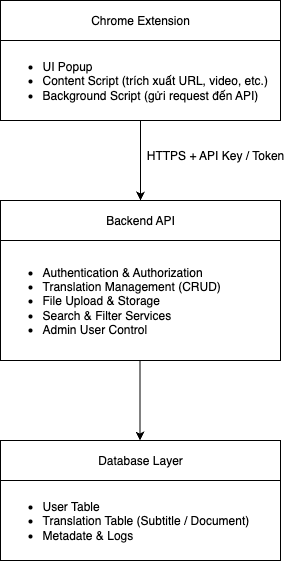{width="2.5942136920384953in"
height="2.8089884076990375in"}

[]{#\_Toc211165813 .anchor}Hình 1:Mô tả tổng quan kiến trúc

- _Cách hoạt động:_

  - Khi người dùng mở một video hoặc tài liệu học tập, Extension sẽ
    tự động lấy URL, phân tích các thông tin như video_id và
    course_id.

  - Extension gửi yêu cầu GET request đến Backend API kèm các dữ
    liệu trên.

  - Backend tìm kiếm trong Database bản dịch phù hợp và trả kết quả
    (metadata + file URL) về cho Extension.

  - Extension hiển thị popup lựa chọn dịch hoặc giữ nguyên. Nếu
    người dùng chọn "Phụ đề", bản dịch tiếng Việt sẽ được hiển thị
    ngay trên trang web.

  - Song song, Translator có thể truy cập vào Web Dashboard để
    upload, sửa, xóa, hoặc re-upload các file dịch.

  - Admin thực hiện các thao tác quản trị như cấp quyền, thu hồi
    quyền, hoặc xóa tài khoản.

- _Lý do chọn mô hình kiến trúc này:_

---

Tiêu chí Mô hình Client-Server + Các mô hình khác
RESTful API

---

Khả năng mở rộng Có thể mở rộng dễ dàng Mô hình Monolithic sẽ gặp
(Scalability) bằng cách thêm server hoặc khó khăn khi mở rộng
database mới

Tính bảo mật REST API sử dụng HTTPS + P2P hoặc Local Storage
Token giúp bảo vệ dữ liệu không có lớp bảo vệ kết
truyền tải nối

Tính tương thích Extension có thể giao tiếp Kiến trúc microservice
với Backend qua JSON, dễ phức tạp, tốn tài nguyên
tích hợp trên Chrome, triển khai
Edge, Firefox

Tính linh hoạt Dễ dàng tách biệt phần Mô hình MVC hoặc 3-tier
khi phát triển Backend và Client để phát yêu cầu nhiều phụ thuộc
triển song song hơn

Dễ bảo trì và Backend độc lập với Các mô hình kết hợp
nâng cấp Extension, chỉ cần cập Frontend--Backend trong
nhật API cùng ứng dụng sẽ khó tách
sửa

---

- _Hướng mở rộng kiến trúc trong tương lai_

  - Có thể bổ sung Microservice Architecture khi số lượng người dùng
    và dữ liệu tăng cao.

  - Tích hợp thêm Caching Layer (Redis) để tăng tốc độ phản hồi khi
    tìm kiếm bản dịch.

  - Kết nối thêm AI Translation Service (ví dụ Google Translate API
    hoặc mô hình nội bộ) để tự động gợi ý bản dịch.

  - Hỗ trợ Load Balancer và Cloud Storage (AWS S3) để cải thiện khả
    năng chịu tải.

1.  ## Usecase

    1.  ### Usecase của User

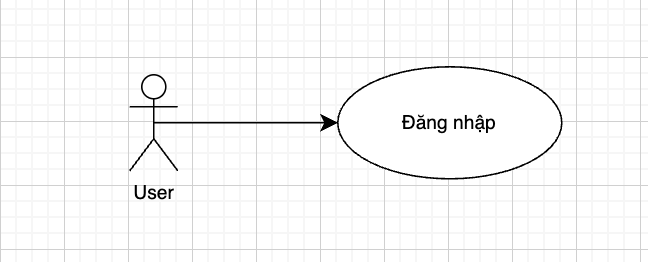{width="4.5in"
height="1.8194444444444444in"}

+--------------+-------------------------------------------------------+
| **Use Case | Đăng nhập |
| Name** | |
+--------------+-------------------------------------------------------+
| **Mô tả** | User có thể đăng nhập tài khoản vào hệ thống và sử |
| | dụng các chức năng trong đó. |
+--------------+-------------------------------------------------------+
| **Điều | User chưa đăng nhập vào hệ thống |
| kiện** | |
+--------------+-------------------------------------------------------+
| **Luồng | 1\. User truy cập vào trang web quản lý. Nhấn vào mục |
| chính** | "Login\" |
| | |
| | 2\. Hệ thống hiển thị Form Login. |
| | |
| | 3\. User nhập vào các thông tin đăng nhập. |
| | |
| | 4\. Nếu thông tin đăng nhập đúng, cập nhật thông tin |
| | vào hệ thống. |
+--------------+-------------------------------------------------------+
| **Luồng | Ở bước 4, nếu thông tin đăng nhập sai sẽ hiển thị |
| phụ** | thông báo cho người dùng. |
+--------------+-------------------------------------------------------+

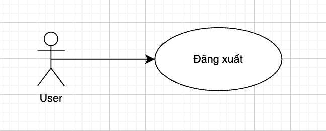{width="4.5in"
height="1.8194444444444444in"}

+--------------+-------------------------------------------------------+
| **Use Case | Đăng xuất |
| Name** | |
+--------------+-------------------------------------------------------+
| **Mô tả** | User có thể đăng xuất khỏi hệ thống để đảm bảo an |
| | toàn thông tin. |
+--------------+-------------------------------------------------------+
| **Điều | User đang trong trạng thái đăng nhập. |
| kiện** | |
+--------------+-------------------------------------------------------+
| **Luồng | 1\. User chọn mục "Đăng xuất". |
| chính** | |
| | 2\. Hệ thống xoá session người dùng |
| | |
| | 3\. Hệ thống quay lại trang đăng nhập |
+--------------+-------------------------------------------------------+
| **Luồng | Nếu lỗi kết nối hoặc timeout, hiển thị thông báo |
| phụ** | "Không thể đăng xuất, vui lòng thử lại sau". |
+--------------+-------------------------------------------------------+

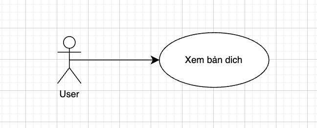{width="4.5in"
height="1.8194444444444444in"}

+--------------+-------------------------------------------------------+
| **Use Case | Xem bản dịch |
| Name** | |
+--------------+-------------------------------------------------------+
| **Mô tả** | User có thể xem bản dịch tiếng Việt của video hoặc |
| | tài liệu khi truy cập trang học tập. |
+--------------+-------------------------------------------------------+
| **Điều | User đã bật Extension |
| kiện** | |
| | Backend có bản dịch tương ứng với url hiện tại |
+--------------+-------------------------------------------------------+
| **Luồng | 1\. User mở trang học có video hoặc tài liệu. |
| chính** | |
| | 2\. Extension tự động trích xuất URL và gửi request |
| | đến Backend. |
| | |
| | 3\. Backend tìm bản dịch phù hợp và gửi về. |
| | |
| | 4\. Extension hiển thị popup hỏi người dùng có muốn |
| | xem bản dịch không. |
| | |
| | 5\. Nếu người dùng chọn "Có", phụ đề hoặc tài liệu |
| | tiếng Việt được hiển thị. |
+--------------+-------------------------------------------------------+
| **Luồng | Nếu không tìm thấy bản dịch, hiển thị thông báo "Chưa |
| phụ** | có bản dịch cho nội dung này". |
+--------------+-------------------------------------------------------+

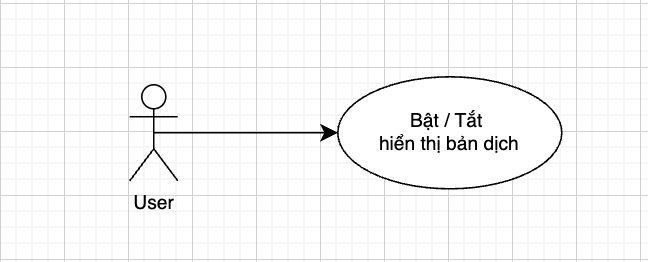{width="4.5in"
height="1.8194444444444444in"}

+--------------+-------------------------------------------------------+
| **Use Case | User có thể bật hoặc tắt chức năng dịch trên trình |
| Name** | duyệt. |
+--------------+-------------------------------------------------------+
| **Mô tả** | Extension đã được cài đặt. |
+--------------+-------------------------------------------------------+
| **Điều | User đang trong trạng thái đăng nhập. |
| kiện** | |
+--------------+-------------------------------------------------------+
| **Luồng | 1\. User mở giao diện Extension. |
| chính** | |
| | 2\. Chọn bật hoặc tắt chế độ dịch. |
| | |
| | 3\. Hệ thống lưu trạng thái lựa chọn. |
+--------------+-------------------------------------------------------+
| **Luồng | Nếu không thể lưu cài đặt, hiển thị "Lỗi lưu trạng |
| phụ** | thái, vui lòng thử lại". |
+--------------+-------------------------------------------------------+

### Usecase của Translator

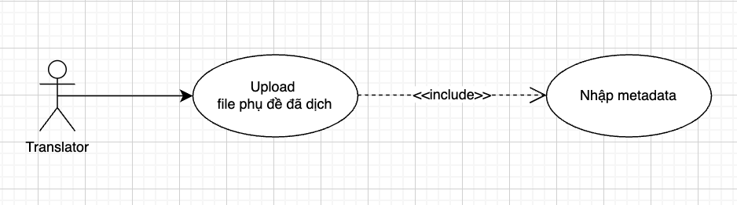{width="6.513888888888889in"
height="1.8194444444444444in"}

+--------------+-------------------------------------------------------+
| **Use Case | Upload file phụ đề đã dịch |
| Name** | |
+--------------+-------------------------------------------------------+
| **Mô tả** | Translator tải file phụ đề tiếng Việt (.srt, .vtt) |
| | lên hệ thống cho video tương ứng. |
+--------------+-------------------------------------------------------+
| **Điều | Translator đã đăng nhập và có quyền upload. |
| kiện** | |
+--------------+-------------------------------------------------------+
| **Luồng | 1\. Translator chọn "Upload phụ đề". |
| chính** | |
| | 2\. Hệ thống hiển thị form nhập metadata (Tên Video, |
| | URL, Course ID, Video ID). |
| | |
| | 3\. Translator nhập thông tin và chọn file phụ đề. |
| | |
| | 4\. Nhấn "Submit". |
| | |
| | 5\. Hệ thống lưu dữ liệu vào Database. |
+--------------+-------------------------------------------------------+
| **Luồng | Nếu file sai định dạng, hiển thị lỗi "File không hợp |
| phụ** | lệ". |
| | |
| | Nếu metadata thiếu, yêu cầu nhập lại. |
+--------------+-------------------------------------------------------+

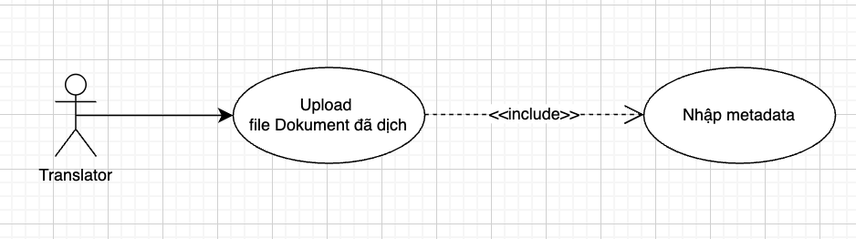{width="6.513888888888889in"
height="1.8194444444444444in"}

+--------------+-------------------------------------------------------+
| **Use Case | Upload file Document đã dịch |
| Name** | |
+--------------+-------------------------------------------------------+
| **Mô tả** | Translator tải file tài liệu tiếng Việt (PDF, DOCX, |
| | ...) lên hệ thống. |
+--------------+-------------------------------------------------------+
| **Điều | Translator đã đăng nhập vào Dashboard. |
| kiện** | |
+--------------+-------------------------------------------------------+
| **Luồng | 1\. Chọn mục "Upload Document". |
| chính** | |
| | 2\. Nhập metadata (Tên Document, URL, Người |
| | dịch,...). |
| | |
| | 3\. Chọn file Document cần tải lên. |
| | |
| | 4\. Nhấn "Submit". |
| | |
| | 5\. Hệ thống xác nhận upload thành công. |
+--------------+-------------------------------------------------------+
| **Luồng | File sai định dạng hoặc dung lượng vượt giới hạn → |
| phụ** | hiển thị lỗi. |
+--------------+-------------------------------------------------------+

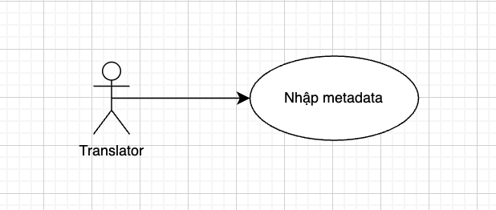{width="4.291666666666667in"
height="1.8194444444444444in"}

+--------------+-------------------------------------------------------+
| **Use Case | Nhập Metadata |
| Name** | |
+--------------+-------------------------------------------------------+
| **Mô tả** | Translator nhập thông tin của bản dịch như tên, URL, |
| | Course ID, Video ID. |
+--------------+-------------------------------------------------------+
| **Điều | Translator đang thực hiện thao tác upload hoặc chỉnh |
| kiện** | sửa. |
+--------------+-------------------------------------------------------+
| **Luồng | 1\. Hệ thống hiển thị form nhập dữ liệu. |
| chính** | |
| | 2\. Translator nhập các thông tin cần thiết. |
| | |
| | 3\. Hệ thống kiểm tra định dạng dữ liệu. |
| | |
| | 4\. Lưu metadata vào cơ sở dữ liệu. |
+--------------+-------------------------------------------------------+
| **Luồng | Nếu thiếu thông tin, hiển thị cảnh báo "Vui lòng nhập |
| phụ** | đủ các trường bắt buộc". |
+--------------+-------------------------------------------------------+

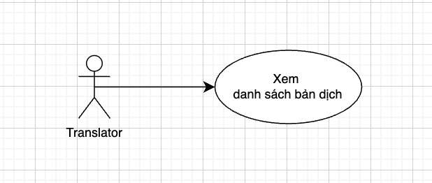{width="4.291666666666667in"
height="1.8194444444444444in"}

+--------------+-------------------------------------------------------+
| **Use Case | Xem danh sách bản dịch |
| Name** | |
+--------------+-------------------------------------------------------+
| **Mô tả** | Hiển thị danh sách toàn bộ bản dịch mà Translator đã |
| | tải lên. |
+--------------+-------------------------------------------------------+
| **Điều | Translator đã đăng nhập vào Dashboard. |
| kiện** | |
+--------------+-------------------------------------------------------+
| **Luồng | 1\. Translator truy cập phần "Danh sách bản dịch". |
| chính** | |
| | 2\. Hệ thống truy xuất dữ liệu từ Database. |
| | |
| | 3\. Hiển thị danh sách bản dịch, gồm tên, URL, ngày |
| | upload, người dịch. |
+--------------+-------------------------------------------------------+
| **Luồng | Nếu không có bản dịch nào, hiển thị "Chưa có dữ |
| phụ** | liệu". |
+--------------+-------------------------------------------------------+

{width="6.25in"
height="1.8194444444444444in"}

+--------------+-------------------------------------------------------+
| **Use Case | Tìm kiếm bản dịch |
| Name** | |
+--------------+-------------------------------------------------------+
| **Mô tả** | Tìm kiếm bản dịch dựa theo bộ lọc: tên, URL, người |
| | dịch, Course ID, Video ID. |
+--------------+-------------------------------------------------------+
| **Điều | Translator đã đăng nhập. |
| kiện** | |
+--------------+-------------------------------------------------------+
| **Luồng | 1\. Translator nhập từ khóa tìm kiếm. |
| chính** | |
| | 2\. Hệ thống lọc dữ liệu theo điều kiện. |
| | |
| | 3\. Hiển thị kết quả tương ứng. |
+--------------+-------------------------------------------------------+
| **Luồng | Không có kết quả phù hợp → hiển thị "Không tìm thấy |
| phụ** | bản dịch nào". |
+--------------+-------------------------------------------------------+

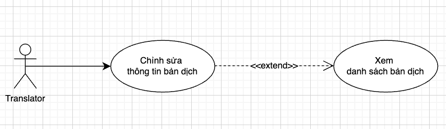{width="6.25in"
height="1.8194444444444444in"}

+--------------+-------------------------------------------------------+
| **Use Case | Chỉnh sửa thông tin bản dịch |
| Name** | |
+--------------+-------------------------------------------------------+
| **Mô tả** | Cập nhật lại metadata của bản dịch (ví dụ: tên, URL, |
| | ID). |
+--------------+-------------------------------------------------------+
| **Điều | Translator có quyền chỉnh sửa và bản dịch đó thuộc sở |
| kiện** | hữu của họ. |
+--------------+-------------------------------------------------------+
| **Luồng | \<Các bước Usecasse được thực hiện\> |
| chính** | |
| | 1\. Translator chọn bản dịch cần chỉnh sửa. |
| | |
| | 2\. Cập nhật thông tin. |
| | |
| | 3\. Nhấn "Lưu thay đổi". |
| | |
| | 4\. Hệ thống ghi nhận thay đổi vào Database. |
+--------------+-------------------------------------------------------+
| **Luồng | Nếu bản dịch không tồn tại → hiển thị lỗi "Không tìm |
| phụ** | thấy bản dịch". |
+--------------+-------------------------------------------------------+

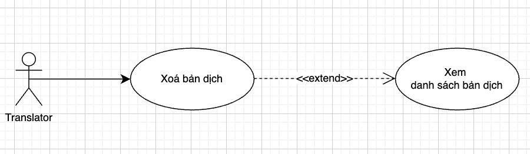{width="6.25in"
height="1.8194444444444444in"}

+--------------+-------------------------------------------------------+
| **Use Case | Xóa bản dịch |
| Name** | |
+--------------+-------------------------------------------------------+
| **Mô tả** | Translator có thể xóa file dịch khỏi hệ thống. |
+--------------+-------------------------------------------------------+
| **Điều | Translator là người đã upload bản dịch đó. |
| kiện** | |
+--------------+-------------------------------------------------------+
| **Luồng | 1\. Translator chọn bản dịch cần xóa. |
| chính** | |
| | 2\. Hệ thống hiển thị cảnh báo xác nhận. |
| | |
| | 3\. Translator xác nhận "Đồng ý xóa". |
| | |
| | 4\. Hệ thống xóa bản ghi trong Database. |
+--------------+-------------------------------------------------------+
| **Luồng | Nếu hủy thao tác, quay lại danh sách bản dịch. |
| phụ** | |
+--------------+-------------------------------------------------------+

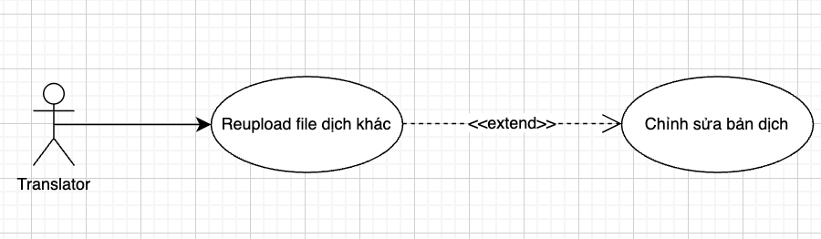{width="6.25in"
height="1.8194444444444444in"}

+--------------+-------------------------------------------------------+
| **Use Case | Reupload file dịch khác |
| Name** | |
+--------------+-------------------------------------------------------+
| **Mô tả** | Thay thế file dịch hiện tại bằng file mới. |
+--------------+-------------------------------------------------------+
| **Điều | Translator là chủ sở hữu bản dịch. |
| kiện** | |
+--------------+-------------------------------------------------------+
| **Luồng | \<Các bước Usecasse được thực hiện\> |
| chính** | |
| | 1\. Translator chọn bản dịch cần thay thế. |
| | |
| | 2\. Nhấn "Reupload". |
| | |
| | 3\. Chọn file mới để tải lên. |
| | |
| | 4\. Hệ thống ghi đè file cũ bằng file mới. |
+--------------+-------------------------------------------------------+
| **Luồng | Nếu định dạng không hợp lệ → hiển thị cảnh báo. |
| phụ** | |
+--------------+-------------------------------------------------------+

### Usecase của Admin

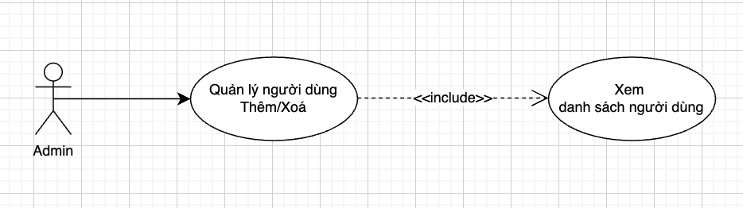{width="6.486111111111111in"
height="1.8194444444444444in"}

+--------------+-------------------------------------------------------+
| **Use Case | Quản lý người dùng |
| Name** | |
+--------------+-------------------------------------------------------+
| **Mô tả** | Admin xem danh sách, thêm quyền, xóa quyền hoặc xóa |
| | tài khoản người dùng. |
+--------------+-------------------------------------------------------+
| **Điều | Admin đã đăng nhập vào hệ thống. |
| kiện** | |
+--------------+-------------------------------------------------------+
| **Luồng | 1\. Admin truy cập trang quản trị. |
| chính** | |
| | 2\. Chọn "Danh sách người dùng". |
| | |
| | 3\. Thực hiện thao tác (Thêm quyền / Xóa quyền / Xóa |
| | tài khoản). |
| | |
| | 4\. Hệ thống cập nhật thay đổi. |
+--------------+-------------------------------------------------------+
| **Luồng | Nếu người dùng không tồn tại → thông báo lỗi. |
| phụ** | |
| | Nếu lỗi hệ thống → hiển thị "Không thể cập nhật, thử |
| | lại sau". |
+--------------+-------------------------------------------------------+

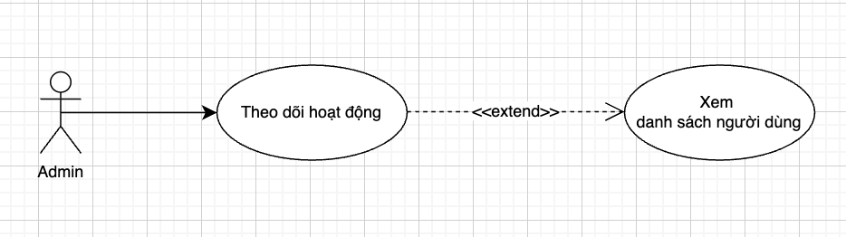{width="6.486111111111111in"
height="1.8194444444444444in"}

+--------------+-------------------------------------------------------+
| **Use Case | Theo dõi hoạt động của Translator |
| Name** | |
+--------------+-------------------------------------------------------+
| **Mô tả** | Admin xem thống kê hoạt động dịch của các Translator. |
+--------------+-------------------------------------------------------+
| **Điều | Admin đã đăng nhập và có quyền xem báo cáo. |
| kiện** | |
+--------------+-------------------------------------------------------+
| **Luồng | 1\. Admin chọn "Báo cáo hoạt động". |
| chính** | |
| | 2\. Hệ thống hiển thị số lượng bản dịch, thời gian |
| | upload, tần suất làm việc |
+--------------+-------------------------------------------------------+
| **Luồng | Nếu không có dữ liệu, hiển thị "Chưa có bản ghi nào". |
| phụ** | |
+--------------+-------------------------------------------------------+

### Usecase của Student

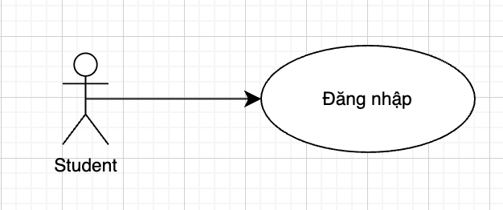{width="4.347222222222222in"
height="1.8194444444444444in"}

+--------------+-------------------------------------------------------+
| **Use Case | Đăng nhập |
| Name** | |
+--------------+-------------------------------------------------------+
| **Mô tả** | Student có thể đăng nhập tài khoản học viên để truy |
| | cập hệ thống học tập, xem video hoặc tài liệu có bản |
| | dịch. |
+--------------+-------------------------------------------------------+
| **Điều | Student đã có tài khoản hợp lệ. |
| kiện** | |
| | Chưa đăng nhập. |
+--------------+-------------------------------------------------------+
| **Luồng | 1\. Student truy cập vào trang web học tập hoặc mở |
| chính** | Extension. |
| | |
| | 2\. Nhấn "Đăng nhập". |
| | |
| | 3\. Hệ thống hiển thị form đăng nhập. |
| | |
| | 4\. Student nhập tài khoản và mật khẩu. |
| | |
| | 5\. Hệ thống xác thực và đưa Student vào giao diện |
| | học tập. |
+--------------+-------------------------------------------------------+
| **Luồng | Nếu thông tin sai → hiển thị "Tên đăng nhập hoặc mật |
| phụ** | khẩu không đúng". |
+--------------+-------------------------------------------------------+

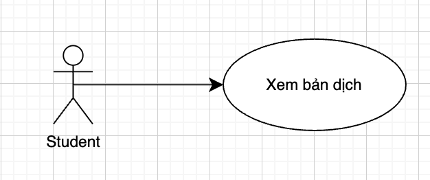{width="4.347222222222222in"
height="1.8194444444444444in"}

+--------------+-------------------------------------------------------+
| **Use Case | Xem bản dịch |
| Name** | |
+--------------+-------------------------------------------------------+
| **Mô tả** | Student có thể xem phụ đề hoặc tài liệu đã được dịch |
| | sang tiếng Việt. |
+--------------+-------------------------------------------------------+
| **Điều | Student đã đăng nhập. |
| kiện** | |
| | Bản dịch tương ứng tồn tại trên hệ thống. |
+--------------+-------------------------------------------------------+
| **Luồng | 1\. Student mở video hoặc tài liệu. |
| chính** | |
| | 2\. Hệ thống tự động truy xuất bản dịch tương ứng từ |
| | Database. |
| | |
| | 3\. Phụ đề hoặc nội dung dịch hiển thị song song với |
| | nội dung gốc. |
+--------------+-------------------------------------------------------+
| **Luồng | Nếu không có bản dịch, hiển thị "Hiện chưa có bản |
| phụ** | dịch cho nội dung này." |
+--------------+-------------------------------------------------------+

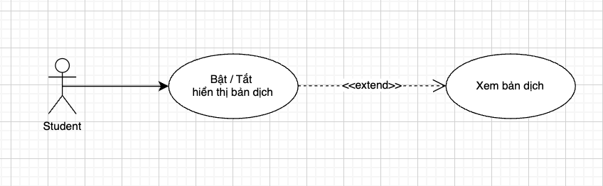{width="5.888888888888889in"
height="1.8194444444444444in"}

+--------------+-------------------------------------------------------+
| **Use Case | Bật / Tắt hiển thị bản dịch |
| Name** | |
+--------------+-------------------------------------------------------+
| **Mô tả** | Student có thể bật hoặc tắt hiển thị bản dịch trong |
| | quá trình học. |
+--------------+-------------------------------------------------------+
| **Điều | Student đang xem nội dung có bản dịch. |
| kiện** | |
+--------------+-------------------------------------------------------+
| **Luồng | 1\. Student nhấn vào nút "Hiển thị bản dịch". |
| chính** | |
| | 2\. Nếu đang tắt → hệ thống bật phụ đề. |
| | |
| | 3\. Nếu đang bật → hệ thống tắt phụ đề. |
+--------------+-------------------------------------------------------+
| **Luồng | Nếu thao tác lỗi, hiển thị "Không thể thay đổi trạng |
| phụ** | thái hiển thị". |
+--------------+-------------------------------------------------------+

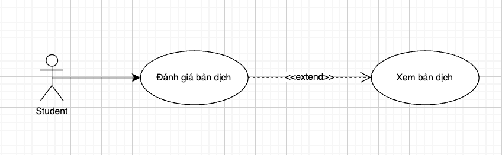{width="5.888888888888889in"
height="1.8194444444444444in"}

+--------------+-------------------------------------------------------+
| **Use Case | Đánh giá bản dịch (Feedback) |
| Name** | |
+--------------+-------------------------------------------------------+
| **Mô tả** | Student có thể gửi phản hồi về chất lượng bản dịch |
| | cho đội ngũ quản trị. |
+--------------+-------------------------------------------------------+
| **Điều | Student đã đăng nhập và đang xem bản dịch. |
| kiện** | |
+--------------+-------------------------------------------------------+
| **Luồng | 1\. Student chọn nút "Gửi phản hồi". |
| chính** | |
| | 2\. Nhập nội dung đánh giá (ví dụ: "dịch chưa chuẩn", |
| | "thiếu dòng", "rất tốt"). |
| | |
| | 3\. Nhấn "Gửi". |
| | |
| | 4\. Hệ thống lưu phản hồi và hiển thị thông báo thành |
| | công. |
+--------------+-------------------------------------------------------+
| **Luồng | Nếu không nhập nội dung, hiển thị cảnh báo "Vui lòng |
| phụ** | nhập phản hồi". |
+--------------+-------------------------------------------------------+

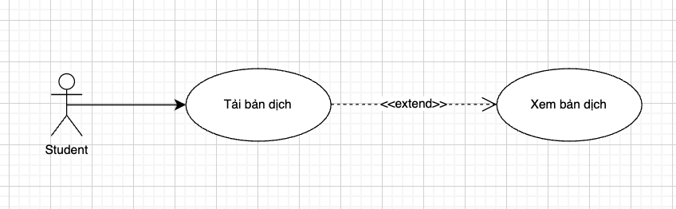{width="5.888888888888889in"
height="1.8194444444444444in"}

+--------------+-------------------------------------------------------+
| **Use Case | Tải bản dịch (Download) |
| Name** | |
+--------------+-------------------------------------------------------+
| **Mô tả** | Student có thể tải file dịch về máy để sử dụng |
| | offline. |
+--------------+-------------------------------------------------------+
| **Điều | Student đã đăng nhập và file dịch đó cho phép tải. |
| kiện** | |
+--------------+-------------------------------------------------------+
| **Luồng | 1\. Student chọn nút "Tải bản dịch". |
| chính** | |
| | 2\. Hệ thống kiểm tra quyền tải. |
| | |
| | 3\. Nếu được phép, tải file về máy. |
+--------------+-------------------------------------------------------+
| **Luồng | Nếu file bị giới hạn tải, hiển thị "Bản dịch này |
| phụ** | không cho phép tải xuống." |
+--------------+-------------------------------------------------------+

5.  **Use case của Reviewer**

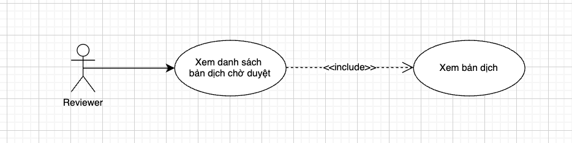{width="6.486111111111111in"
height="1.625in"}

+--------------+-------------------------------------------------------+
| **Use Case | Xem danh sách bản dịch chờ duyệt |
| Name** | |
+--------------+-------------------------------------------------------+
| **Mô tả** | Reviewer truy cập hệ thống để xem tất cả các bản dịch |
| | đang chờ phê duyệt. |
+--------------+-------------------------------------------------------+
| **Điều | Reviewer đã đăng nhập vào hệ thống. |
| kiện** | |
+--------------+-------------------------------------------------------+
| **Luồng | 1\. Reviewer chọn chức năng "Danh sách bản dịch chờ |
| chính** | duyệt". |
| | |
| | 2\. Hệ thống truy vấn cơ sở dữ liệu và hiển thị danh |
| | sách các bản dịch chưa được duyệt. |
| | |
| | 3\. Reviewer có thể chọn bản dịch để xem chi tiết. |
+--------------+-------------------------------------------------------+
| **Luồng | Nếu không có bản dịch chờ duyệt → hiển thị thông báo |
| phụ** | "Không có bản dịch nào đang chờ duyệt". |
+--------------+-------------------------------------------------------+

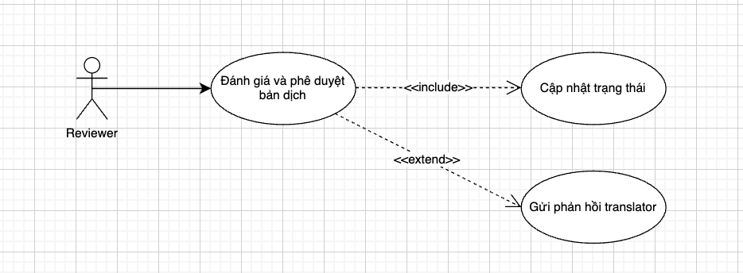{width="6.486111111111111in"
height="2.388888888888889in"}

+--------------+-------------------------------------------------------+
| **Use Case | Đánh giá và phê duyệt bản dịch |
| Name** | |
+--------------+-------------------------------------------------------+
| **Mô tả** | Reviewer xem chi tiết bản dịch, sau đó chọn phê duyệt |
| | hoặc từ chối. |
+--------------+-------------------------------------------------------+
| **Điều | Reviewer đã mở một bản dịch cụ thể. |
| kiện** | |
+--------------+-------------------------------------------------------+
| **Luồng | 1\. Reviewer chọn nút "Phê duyệt" hoặc "Từ chối". |
| chính** | |
| | 2\. Nếu chọn "Từ chối", hệ thống yêu cầu nhập lý do |
| | hoặc nhận xét. |
| | |
| | 3\. Hệ thống cập nhật trạng thái bản dịch (Approved / |
| | Rejected) trong cơ sở dữ liệu. |
| | |
| | 4\. Thông báo được gửi tới Translator tương ứng. |
+--------------+-------------------------------------------------------+
| **Luồng | Nếu có lỗi hệ thống khi cập nhật → hiển thị thông báo |
| phụ** | lỗi. |
+--------------+-------------------------------------------------------+

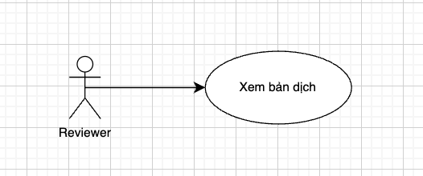{width="3.6527777777777777in"
height="1.5277777777777777in"}

+--------------+-------------------------------------------------------+
| **Use Case | Xem chi tiết bản dịch |
| Name** | |
+--------------+-------------------------------------------------------+
| **Mô tả** | Reviewer xem nội dung chi tiết của một bản dịch cụ |
| | thể để đánh giá chất lượng. |
+--------------+-------------------------------------------------------+
| **Điều | Reviewer đã mở danh sách bản dịch chờ duyệt. |
| kiện** | |
+--------------+-------------------------------------------------------+
| **Luồng | 1\. Reviewer chọn bản dịch cần xem chi tiết. |
| chính** | |
| | 2\. Hệ thống truy vấn Database để lấy đầy đủ thông |
| | tin và nội dung bản dịch (file phụ đề hoặc document). |
| | |
| | 3\. Hệ thống hiển thị nội dung bản dịch và các |
| | metadata liên quan. |
| | |
| | 4\. Reviewer có thể cuộn, tìm kiếm, so sánh hoặc xem |
| | phần phụ đề gốc (nếu có). |
+--------------+-------------------------------------------------------+
| **Luồng | Nếu file bản dịch bị lỗi hoặc không tải được → Hệ |
| phụ** | thống hiển thị thông báo lỗi "Không thể tải nội dung |
| | bản dịch, vui lòng thử lại sau." |
+--------------+-------------------------------------------------------+

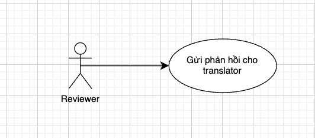{width="3.6944444444444446in"
height="1.625in"}

+--------------+-------------------------------------------------------+
| **Use Case | Gửi phản hồi cho Translator |
| Name** | |
+--------------+-------------------------------------------------------+
| **Mô tả** | Reviewer có thể gửi nhận xét hoặc góp ý trực tiếp cho |
| | Translator để họ chỉnh sửa bản dịch. |
+--------------+-------------------------------------------------------+
| **Điều | Bản dịch đang ở trạng thái "Rejected" hoặc "Needs |
| kiện** | Edit". |
+--------------+-------------------------------------------------------+
| **Luồng | 1\. Reviewer chọn bản dịch muốn gửi phản hồi. |
| chính** | |
| | 2\. Reviewer nhập nhận xét vào form phản hồi. |
| | |
| | 3\. Hệ thống gửi thông báo đến Translator kèm theo |
| | nội dung phản hồi. |
| | |
| | 4\. Translator nhận được thông báo và có thể thực |
| | hiện chỉnh sửa theo yêu cầu. |
+--------------+-------------------------------------------------------+
| **Luồng | Nếu gửi phản hồi không thành công (do lỗi mạng hoặc |
| phụ** | hệ thống) → hiển thị thông báo "Không thể gửi phản |
| | hồi, vui lòng thử lại sau." |
+--------------+-------------------------------------------------------+

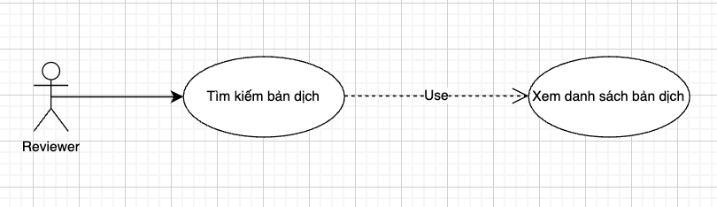{width="5.625in"
height="1.625in"}

+--------------+-------------------------------------------------------+
| **Use Case | Tìm kiếm bản dịch theo tiêu chí |
| Name** | |
+--------------+-------------------------------------------------------+
| **Mô tả** | Reviewer có thể tìm kiếm nhanh các bản dịch trong |
| | danh sách theo tiêu chí mong muốn. |
+--------------+-------------------------------------------------------+
| **Điều | Reviewer đã đăng nhập và mở giao diện quản lý bản |
| kiện** | dịch. |
+--------------+-------------------------------------------------------+
| **Luồng | 1\. Reviewer nhập từ khóa hoặc chọn bộ lọc (Tên bản |
| chính** | dịch, Translator, Course ID, Video ID, Trạng thái). |
| | |
| | 2\. Hệ thống gửi truy vấn tìm kiếm đến Database. |
| | |
| | 3\. Hệ thống hiển thị danh sách kết quả tương ứng. |
| | |
| | 4\. Reviewer có thể chọn một bản dịch cụ thể để xem |
| | chi tiết. |
+--------------+-------------------------------------------------------+
| **Luồng | Nếu không có kết quả phù hợp → hiển thị "Không tìm |
| phụ** | thấy bản dịch nào khớp với tiêu chí tìm kiếm." |
+--------------+-------------------------------------------------------+

## Sơ đồ use case tổng quát của hệ thống

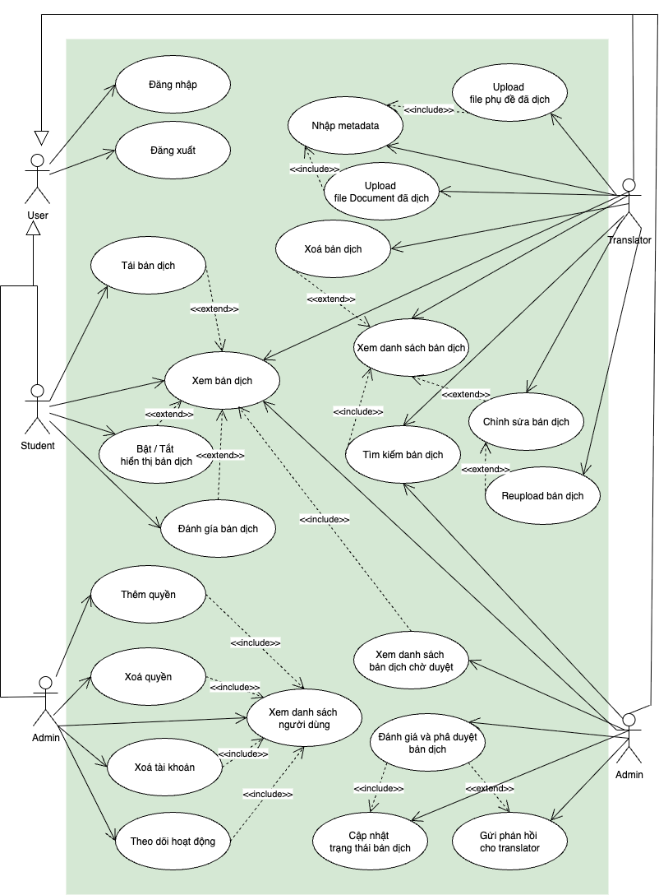{width="5.518254593175853in"
height="7.486111111111111in"}

[]{#\_Toc211165814 .anchor}Hình 2 Sơ đồ use case tổng quát

## Class Diagram

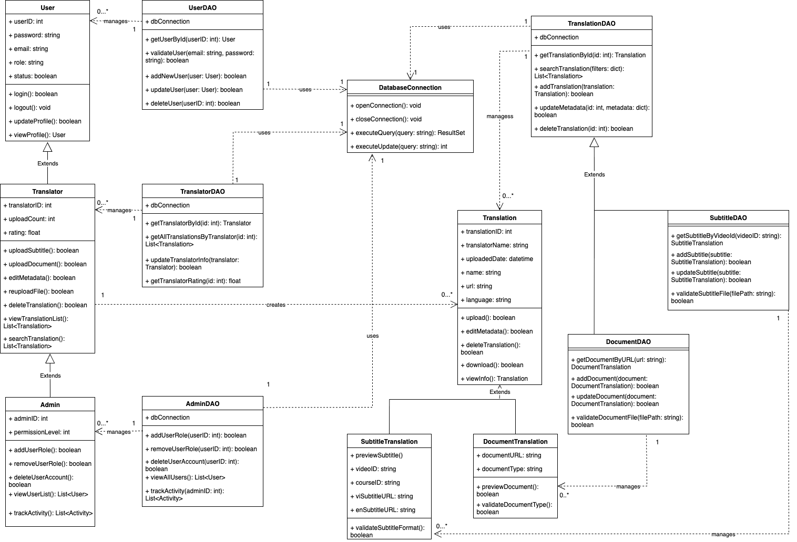{width="6.3953488626421695in"
height="4.353564085739283in"}

[]{#\_Toc211165815 .anchor}Hình 3 Class Diagram

## Sequence Diagram

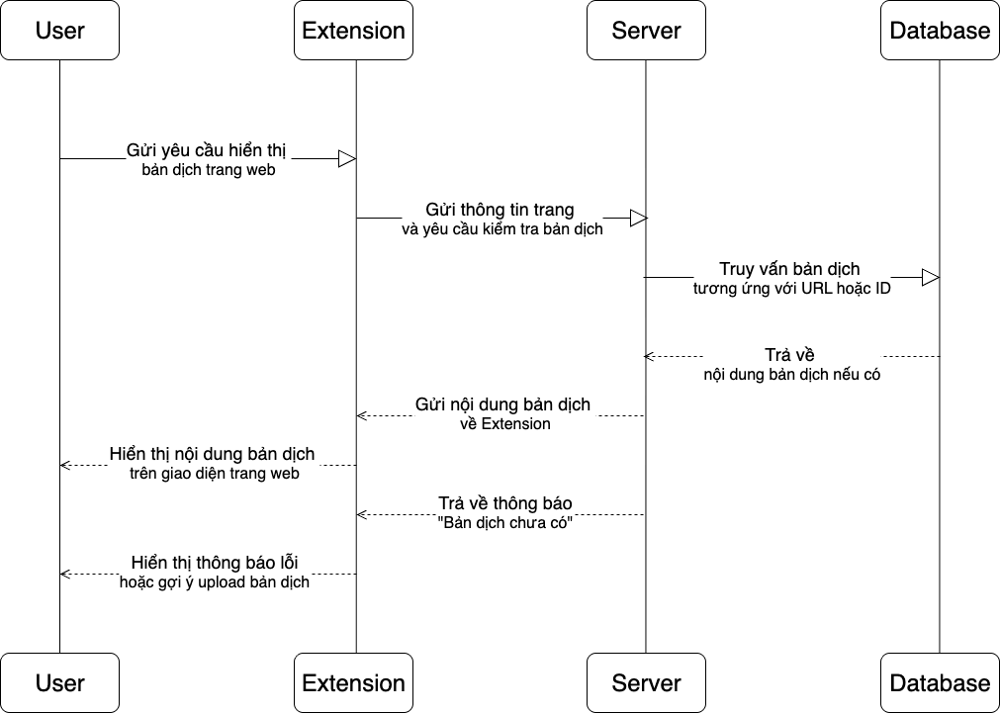{width="5.049161198600175in"
height="3.609400699912511in"}

[]{#\_Toc211165816 .anchor}Hình 4 Sequence Diagram

## Activity Diagram

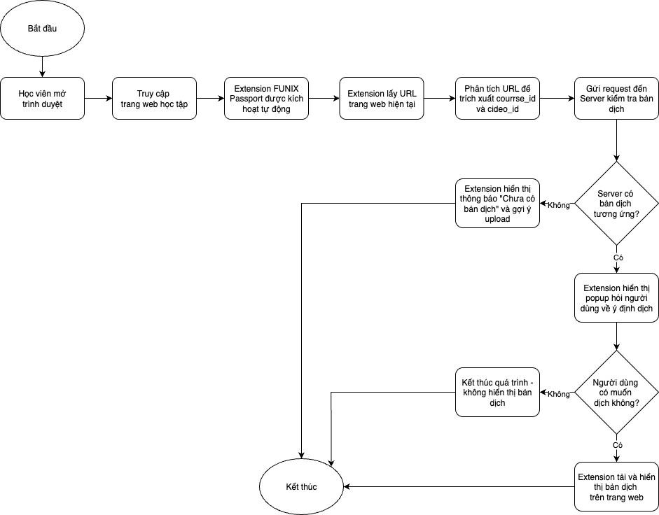{width="5.89423009623797in"
height="4.615056867891513in"}

[]{#\_Toc211165817 .anchor}Hình 5Activity Diagram
